## 1. 函数

- 函数是封装的一段可以被重复调用的代码块

1.怎么声明函数呢？

```js
// 1. 声明函数
function 函数名(){
  // 函数体
}
// function 是声明函数的关键词，小写
function sayHi(){
  
}
// 声明的函数要经过调用，才会运行函数内部的代码块
// 2. 调用函数
函数名()  // 如果不调用函数，函数不会执行

// ====== 声明函数的两种方式======
// 1. 利用function关键字声明函数
function fn(){
  //...
}
// 2. 函数表达式方式
// 声明一个变量，让一个匿名函数 赋值给这个变量
var fn = function(){
  //...
  console.log('我是函数表达式')
}
fn()
```

2. 函数的形参，实参

```js
// 形参：声明函数时，小括号里的参数（形式上的参数）我们用来接收传递过来的实参的变量
function 函数名(形参1,形参2, ...){
  
}
// 实参，调用时传递进去的真实参数
函数名(实参1，实参2, ...)
    
// 形参：形式上的参数，用来接收我们真实传递过来的实参
function sayHi(msg) {  // msg = '大家好，很高兴认识大家！' , 
  console.log(msg)     // 形参类似于一个变量，这里隐式执行了一个赋值语句  
}
sayHi('大家好，很高兴认识大家！')
sayHi('Hello World, Hello JavaScript!')
```

3. 形参和实参个数匹配的问题

```js
function getSum(num1, num2){
  console.log(num1 + num2)
}
// 1. 如果实参个数和形参个数一致，则正常传递输出
getSum(1, 2) // 函数调用
// 2. 如果实参个数和形参个数不一致，则会取到形参的个数
getSum(1, 2, 3)
// 3. 如果实参个数比形参个数少，多余的形参相当于声明后未赋值，为undefined
getSum(1)  // NaN

function sayHi(msg1,msg2){
  console.log(msg1 + msg2)
}
sayHi('你好呀 ','今天努力学习了吗')
sayHi('Hello ')

```

4. 函数的返回值return
   1. return 返回需要的结果
   2. 函数内部，return之后的代码不再执行（下一行）

```js
function 函数名(){
  return 需要返回的结果
}
// 当我们需要函数的返回值时，用return语句
function getSum(num1, num2){
  return num1 + num2
}
getSum(1, 2) // getSum(1,2) = 1 + 2; 赋值操作；
// 当我们函数又返回值的时候，可以用一个变量接收函数的返回值
var result = getSum(1, 2)
console.log(result)
```

## 2. 浏览器相关

### 1. 打开Chrome开发者工具的一些快捷键

1. 打开最近关闭的状态 : 
   - mac : Command + option + i
   - windows : ctrl + shift + i
2.  快速查看DOM或样式  (落在Elements那个模块)
   - mac :  cmd+option+ C
   - windows:  ctrl + shift + C
3.  快速进入console查看log运行
   - mac : cmd + opt + J
   - windwos : ctrl + shift + J
4. F12 打开
5. 切换面板位置
   1. windows: Ctrl + Shift + D
   2. Mac  : Cmd + Shift + D

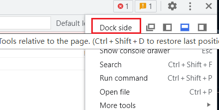

### 2.  在console中访问节点

1. 使用document.querySelectorAll()等获取节点  ( tab)

```js
document.querySelectorAll('div')
```

2. 使用$0快速访问

```js
// 选中要获取的元素 
// 浏览器提供了 $0 代表我们选中的元素
```

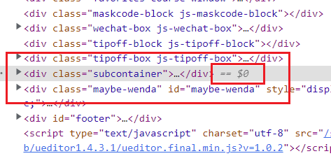


3. 右键拷贝 --> JS Path

```js
// document.querySelector("body > script:nth-child(17)")
document.querySelector("#i_cecream > div.bili-header.large-header > div.bili-header__channel")
```

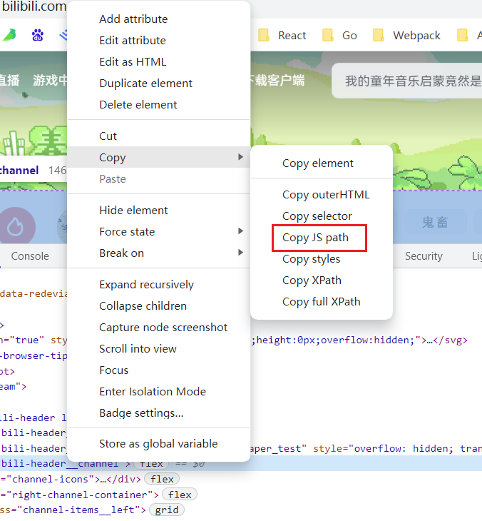

##### PS. 调出Console 面板 的几种方式

- ctrl + shift + J   或者 cmd + option + J
- Elements 面板下 , 按下 ESC , 最底部也会调出console面板


### 3.  在DOM中断点调试

在elements面板下, 点击鼠标右键

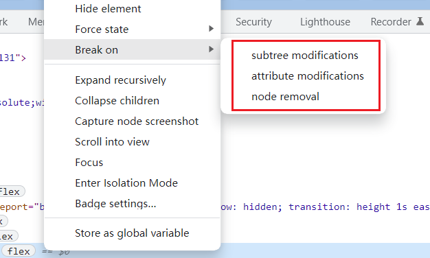

三种方式

1. 子树修改时
2. 属性修改时
3. 节点删除时


#### 1. 属性修改

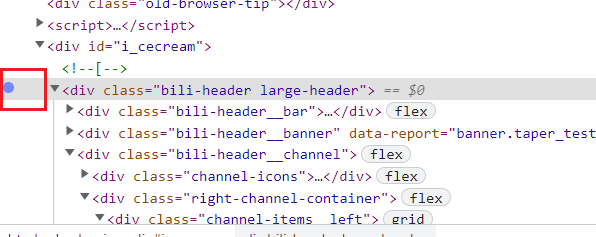

当我们修改了属性的时候, 会进入这个断点.  (注意需要是JS执行代码,修改, 不是直接在页面上修改)

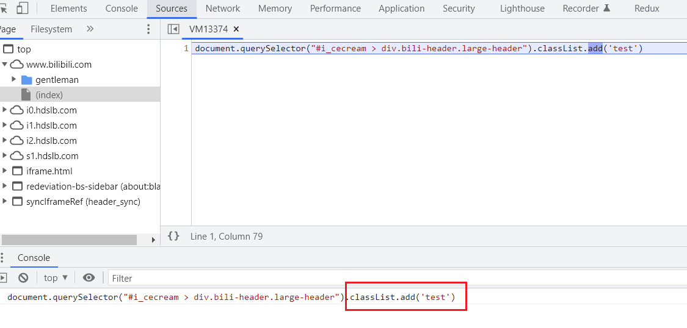

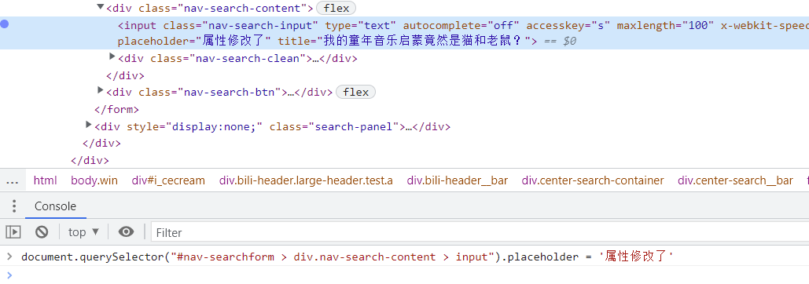

#### 2. 节点删除时

```js
document.querySelector("#i_cecream > div.bili-header.large-header > div.bili-header__bar > div > div").remove()
```

#### 3. 给父元素打一个子节点修改的断点

- 可以监听内部dom树修改了

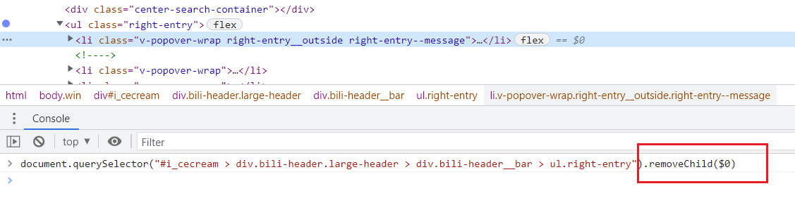

```js
document.querySelector("#i_cecream > div.bili-header.large-header > div.bili-header__bar > ul.right-entry").removeChild($0)
```


#### 4. 了解 MutationObserver

- [MDN - mutationObserver](https://developer.mozilla.org/zh-CN/docs/Web/API/MutationObserver)

```js
// 选择需要观察变动的节点
const targetNode = document.querySelector('.test')

// 观察器的配置（需要观察什么变动）
const config = { attributes: true, childList: true, subtree: true };

// 当观察到变动时执行的回调函数
const callback = function(mutationsList, observer) {
    console.log(mutationsList)
    // Use traditional 'for loops' for IE 11
    for(let mutation of mutationsList) {
        if (mutation.type === 'childList') {
            console.log('A child node has been added or removed.');
        }
        else if (mutation.type === 'attributes') {
            console.log('The ' + mutation.attributeName + ' attribute was modified.');
        }
    }
};

// 创建一个观察器实例并传入回调函数
const observer = new MutationObserver(callback);

// 以上述配置开始观察目标节点
observer.observe(targetNode, config);

// 之后，可停止观察
// observer.disconnect();
```


### 2. 浏览器内的断点调试🔥

- [Google Developer-JS BreakPoints ](https://developer.chrome.com/docs/devtools/javascript/breakpoints/) 感兴趣的同学可以看看英文官方文档。

当一段代码执行结果和我们的期望不一致，我们凭肉眼又找不到问题的时候，最好的方式就是断点调试，看我们的代码每一步是如何执行的。

怎么看呢，这就要用到断点调试了。

因为现阶段大家的JS代码基本都运行在浏览器中，我们先讲一下在浏览器中怎么调试，以后会讲怎么在vscode中使用node.js调试JS代码。

#### 2.1 几个区域划分

1. 资源（Sources）面板的三个部分

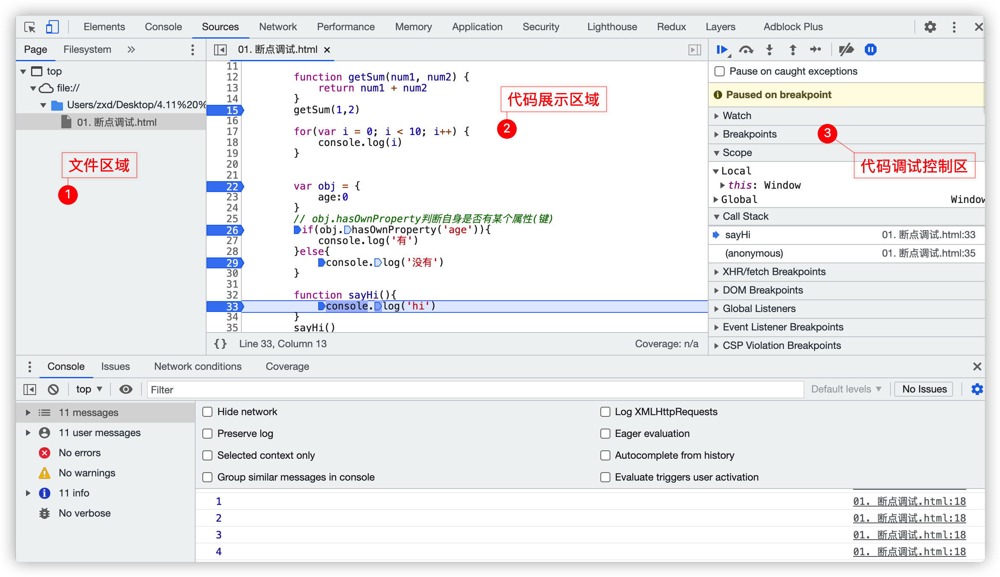

1. The **File Navigator** pane ：文件导航区域，页面请求的每个文件都列在这里
2. The **Code Editor** pane ：代码展示区域,  在文件导航窗格中选择一个文件后，该文件的内容将显示在这里。
3. The **JavaScript Debugging** pane ：调试区域.  调试窗格，检查页面 JavaScript 的各种工具。如果“ DevTools”窗口较宽，则此窗格将显示在“代码编辑器”窗格的右侧。

#### 2.2 如何打断点

什么叫断点? breakpoint

我们在某一行做上标记，mark一下，程序运行到我们标记的位置，暂停运行。

1. 在代码展示区中`行数位置`单击鼠标左键，选择第x行代码来进行打断点进行调试。
1. 也可以直接在代码中输入`debugger`，来选择打断点位置进行调试


#### 2.3 断点设置好后，刷新页面

1. 刷新页面
   1. window：`F5 `
   2. mac :  `cmd + r` 
2. 此时会直接进入调试，代码会在设置的第一个断点上停下来（从上到下）

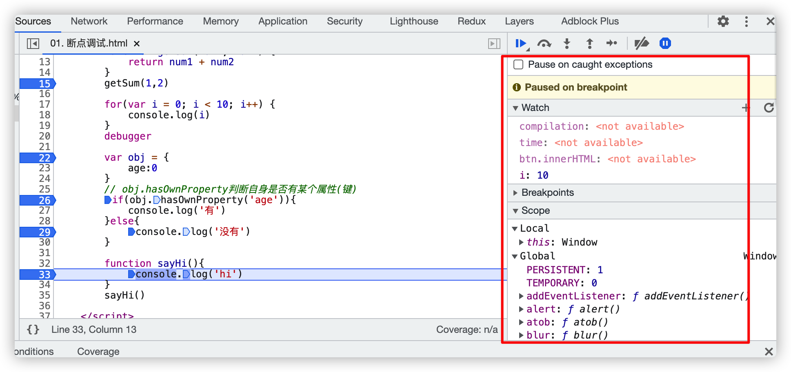

**单词解释：**

1. Watch： 观察，监听。可以设置我们想监听的变量
2. Breakpoints: 断点，显示我们打了哪些断点，（左侧行那里标记了几个就是几个）
3. Scope：作用域， 显示当前的变量
   1. Local ， 显示当前函数中的变量（局部作用域，函数作用域）； 
      1. 当前函数指：背景色变灰色那行
   2. Global，显示全局变量(不再函数中)
4. Call Stack 调用栈 （大家暂时不用了解这块内容，但是它很重要，以后要深入学习）（堆：heap）
5. 其他的暂时不用了解


#### 2.4 跟踪执行的按钮

##### 1. Resume script  继续 

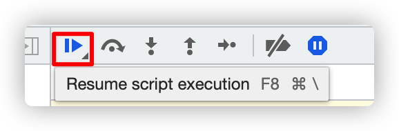

- Resume script execution  [ˌeksɪˈkjuːʃn] ；  恢复脚本执行（在下一个断点出暂停） 
- 每点击一下，恢复js的执行，**走向下一个断点的位置处暂停**
- 即：按断点位置执行

##### 2.  Step over 单步跳过

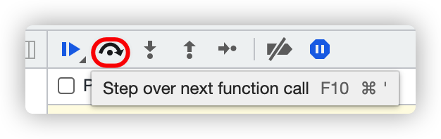

- Step over next function call  单步跳过
- 每点击一次，就会按照代码执行顺序，向下执行一句代码
- 但不会进入到函数体中，（如果函数体内有标记的断点，会进入）
- 跳过下一个函数执行, 并在执行完后暂停执行脚本

##### 3. Step into 单步进入

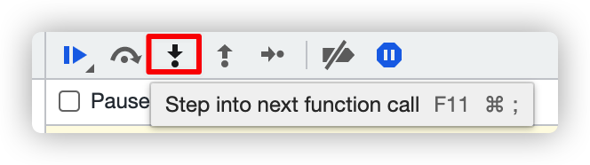

- Step into next function call  单步进入
- 会进入函数内部调试
- 执行至函数内部首行暂停执行代码

##### 4. Step out 单步跳出

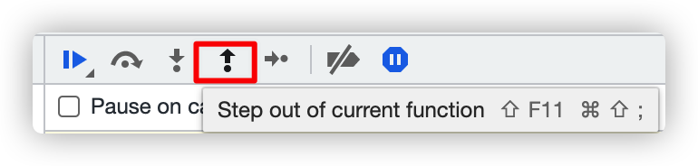

- Step out of current function  单步跳出
- 会跳出当前这个断点的函数
- 执行完当前函数剩余部分, 并在函数执行完后的下一步暂停执行代码

##### 5. Step 下一步

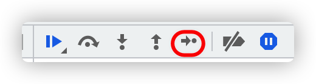

- 一次接一次的点击这个按钮，整个程序的所有语句都会执行
- step (与 step over/into 的区别就是，step 会优先尝试 step into，当没有可步入的代码时，就会执行 step over)

##### 6. Deactivate breakpoints

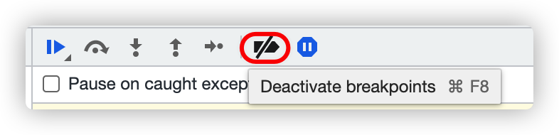

- 使所有的断点临时失效，点击后生效，该按钮背景色变为蓝色。
- breakpoints那里变灰色，左侧行数那里也变浅蓝色，表示标记的断点暂时不生效。
  - 也就是说这个状态下，我们点击第一个按钮，会直接执行完所有语句。
- 此时，再点击一下这个按钮 Activate breakpoints， 再次激活刚才的断点。

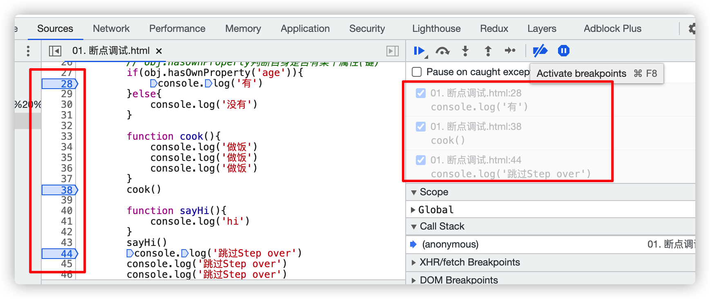

##### 7. Pause on exception

- [pɔːz] ；暂停的意思，设置捕获异常时自动暂停js。

  -  背景为深蓝色表示现在是激活状态的，如果代码中有错误，会自动进入调试模式，暂停在异常的位置

- Pause On Caught Exceptions， 如果勾上，那么会在抛出异常的情况下暂停。

  

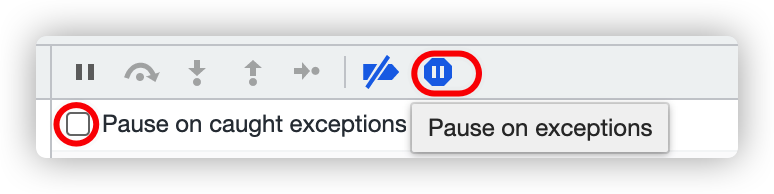

1. 不选中，未激活状态 （灰色）
   - 如果JS代码有异常，不会进入断点调试模式，浏览器会在控制台抛出错误

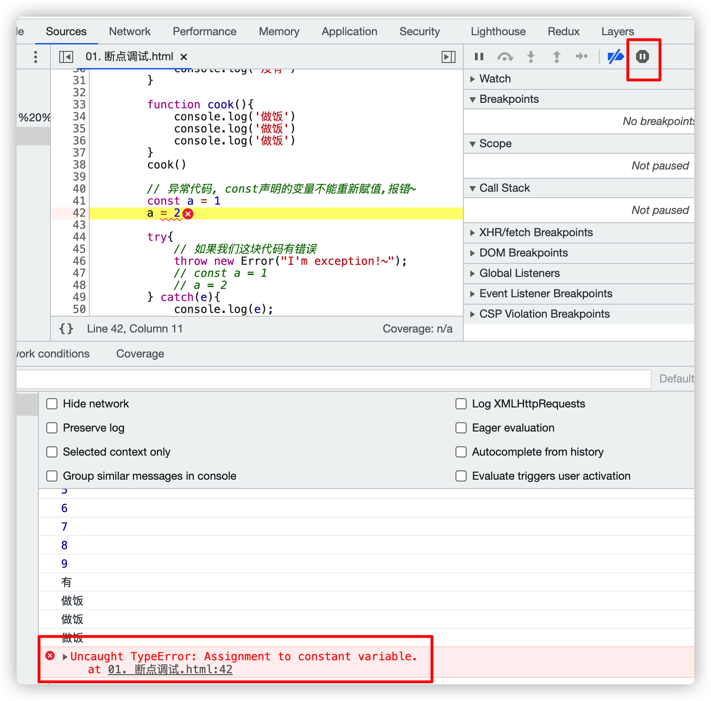

此时浏览器会抛出一个错误

2. 选中，激活状态时，刷新页面
   1. 如果代码中有异常，会自动进入断点调试模式，暂停在异常的位置

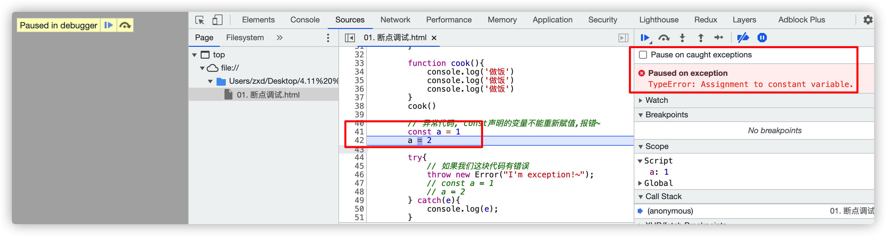

## ES6

### 1. 模板字符串🔥

```js

// 来我们先复习一个知识点
// 同学们告诉我，咱们之前所学的字符串是怎么书写的呀？’‘单引号， 双引号""
// 1. 基本用法
var str1 = '我是 string'
var str2 = "我也是 string"
// ES6 反引号
var msg = `Hello World`
console.log(msg)
// ---

// 2. 变量和字符串拼接
var sayHi = '你好! '+ msg +', 我在学前端。'
var sayHi_ES6 = `你好！${msg}, 哇咔咔`

// 3. 可换行
// 所有模板字符串的空格和换行，都是被保留的，
// 比如<ul>标签前面会有一个换行。不想要这个换行，可以使用trim方法消除它
var html_ES6 = `
		<ul>
      <li>1</li>
      <li>2</li>
		</ul>
`
console.log(html_ES6)

var html2_ES6 = `
		<ul>
      <li>1</li>
      <li>2</li>
		</ul>
`.trim()
console.log(html2_ES6)
// 4. 可以在${}中放入JS表达式，可以进行运算，以及引用对象属性
var x = 1;
var y = 2;

var z = `${x + y}`
// 5. ${}还可以执行函数
function fn() {
  return "Hello World";
}

var sayHello = ` ${fn()} ,  Hello JavaScript`
console.log(sayHello)
```


### 2. var let const🔥

#### 2.1 作用域

**就是变量与函数的可访问范围，即作用域控制着变量和函数的可见性和生命周期。**

ES6之前，ES作用域只有：

 - **全局作用域** (Global Scope): 中的对象在代码中的任何地方都能访问，其生命周期伴随着页面的生命周期。
 - **函数作用域** (Local Scope) :  JS的作用域是通过函数来定义的,  在一个函数中定义的变量只对这个函数内部可见, 称为函数(局部)作用域

ES6新增

 - **块级作用域：块级作用域内声明的变量不影响外面的变量**

---

**eg.1 变量名提升**

```js
// js从上到下执行，为什么不报错呢
function fn(){
  console.log(age) // var声明的变量具有变量名提升， 预解析
  var age = 18
}
fn()  // undefined 
console.log(age)  // error age在函数作用域中

// ------------
// 上述代码等效于
function fn(){
  var age
  console.log(age)
  age = 18
}
fn()
```

**eg.2**

- if，for语句在它们内部用var声明的变量会提升到外部

```js
function fn() {
  console.log(tmp);  // undefined, 因为预解析 undefined；
  if (false) {
    var tmp = 'hello world'; // 这里声明的作用域为整个函数
  }
}
fn() // undefined

//----
// 上述代码等效于
function fn() {
  var tmp
  console.log(tmp) 
  if (false) {      
    tmp = 'hello world'
  }
}

```

**eg3. 全局作用域**

- 全局作用域声明的变量会挂载在window对象上

```js
// 1.全局作用域
var person = '小王'
function fn(){
  console.log(age)
  // 2.函数作用域
  var age = '18'
  console.log(person)
}
fn()
console.log(person)
console.log(age) // Uncaught ReferenceError: age is not defined
// 
```

**思考：只有这两种作用域带来的问题？**

1. 内层变量可能会覆盖外层变量

```js
var tmp = new Date();
function f() {
  console.log(tmp); // 原本想想打印外层的时间，结果为undefined
  if (false) {
    var tmp = 'hello world'; // 这里声明的作用域为f函数
    // let tmp = 'hello world'
  }
}
f(); // undefined
```

2. 用来计数的循环变量泄露为全局变量

```js
for (var i = 0; i < 5; i++) {
  console.log(i);
}

console.log(i); // 5 
// -------
// 上述代码等效于
var i // 这个var变量声明提升在外层全局变量中，导致我们在外部也能使用
for (i = 0; i < 5; i++) {
  console.log(i)
}
console.log(i) // 
```


#### 2.2 let

ES6 新增了`let`命令，用来声明变量。它的用法类似于`var`，但是所声明的变量，只在`let`命令所在的代码块内有效。

代码块 : {} 中叫代码块

##### 1. let 声明的变量只在代码块中有效

```js
{
  let a = 10;
  var b = 1;
}

a // ReferenceError: a is not defined.
b // 1
for(let i = 0; i < 5; i++) {
  console.log(i)
}
```

##### 2. 不存在变量提升

```js
// var 的情况
console.log(foo); // 输出undefined
var foo = 2;

// let 的情况
console.log(bar); // 报错ReferenceError
let bar = 2;

// let 
if (false) {
    let value = 1;
}
console.log(value); // Uncaught ReferenceError: value is not defined

```

##### 3. let 不允许重复声明

```js
let a = 1
let a = 2 // dentifier 'a' has already been declared
```

##### 4. 暂时性死区（temporal dead zone） TDZ

在代码块内，使用`let`命令声明变量之前，该变量都是不可用的, 在语法上这就叫暂时性死区。

```js
if (true) {
  tmp = 'abc'; // ReferenceError
  let tmp;
}
```

ES6 明确规定，如果区块中存在`let`和`const`命令，这个区块对这些命令声明的变量，从一开始就形成了封闭作用域。凡是在声明之前就使用这些变量，就会报错。

##### 5.不绑定全局作用域

```js
// 用var 在全局作用域中声明的变量
var value = 1
window.value = 1;  // 我们声明的value变量，变成了window的一个属性

// let const 不会造成这个问题
let value = 1;
console.log(window.value); // undefined
```


##### 6. for循环的特殊性

for循环中，设置循环变量的那部分是一个父作用域，而循环体内部是一个单独的子作用域。

```js
for (let i = 0; i < 3; i++) {
  let i = 'abc';
  console.log(i);
}
// abc
// abc
// abc
```


#### 2.3 const

##### 1.`const`一旦声明变量，就必须立即初始化，不能留到以后赋值

```js
const foo;
// SyntaxError: Missing initializer in const declaration
// 对于const来说，只声明不赋值，就会报错
```

##### 3. const 声明

- 声明简单类型（原始类型）的数据，一旦声明就不能修改
- 复杂类型（引用类型），指针指向的地址不能更改，内部数据可以更改。

```js
const bool = true 
bool = false // Uncaught TypeError: Assignment to constant variable.


const b = 'string'
b = 'lalala' // Error

// 声明一个只读的常量
const PI = 3.1415;
PI // 3.1415
PI = 3; // TypeError: Assignment to constant variable.

```

```js
// 复杂类型
const obj = {
  name:'小王',
  age:'18'
}
obj = { name: '小张', age:'19'} // Error

// 但是 我们可以修改引用类型的内部属性值；
obj.name = '小张'
obj.age = '19' // 这么写是不会报错的
```

```js
// 数组也是引用类型吧
const arr = [1, 2, 3, 4]
arr.push(5) // ok的
arr = [2, 3, 4] // error
```


#### 2.4  最佳实践

在我们开发的时候，可能认为应该默认使用 let 而不是 var ，这种情况下，对于需要写保护的变量要使用 const。

但是，更佳的实践是：

`默认使用 const 声明变量，只有当确实需要改变变量的值的时候才使用 let。`

这是因为大部分的变量的值在初始化后不应再改变，而预料之外的变量的改变是很多 bug 的源头。

### 3. Array.includes()

该方法返回一个布尔值，表示某个数组是否包含给定的值

```js
// 联想之前大家写过的exist，判断某个num是否在一个数组中存在
				function exist(num, arr) {
            for (var i = 0; i < arr.length; i++) {
                if (arr[i] == num) {
                    return true;
                };
            };
            return false;
        };
        console.log(exist(3, [1, 2, 3, 4, 54]));

// eg.1 
var arr = [1, 2, 3, 6]
var res = arr.includes(6) 
console.log(res) 
if(arr.includes(6)) {
  console.log(`数组里面存在6`)
}
// eg.2
var arr2 = [true, true, false, true]
if (arr2.includes(false)){
  console.log('数组里边有false')
}
```


### 4. 箭头函数 () => {} 🔥

#### 4.1 rest参数

rest： 表示剩下的部分

```js
function foo(a, b){
  // arguments 伪数组
  console.log(arguments)
}
foo('你好', 'Hello', 'JavaScript', 'Go')

function fn(a, b, ...rest){
  console.log(rest)
} 
fn('你好', 'Hello', 'JavaScript', 'Go')

// rest 是一个货真价实的数组, 用来接收我们传递过来的实参
function bar(...rest){
  console.log(rest)
}
```

#### 4.2 () => {} 

先不拓展这块了. 等webApi阶段看看大家每天的吸收情况再考虑提前扩展这块内容。以后JS高级也会讲到的，大家不用担心。

---

ES5 声明变量的方法：

 	1. `var` 命令 声明变量
 	2. `function`命令 声明函数

ES6  新增

 - `let`
 - `const`
 - `import` （暂时不用了解）
 - `class`   （暂时不用了解）

ES6 一共有 6 种声明变量的方法。