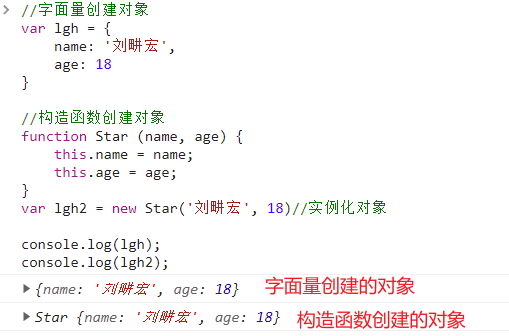
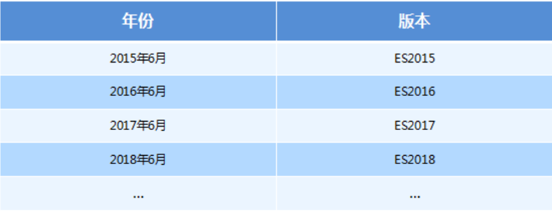
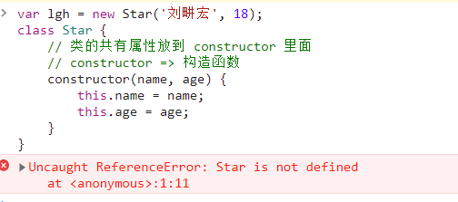
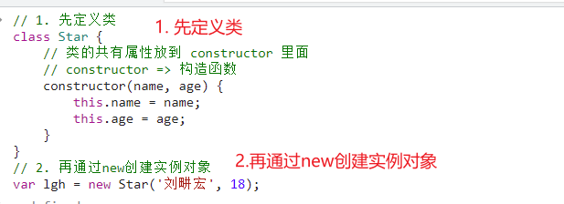

### Target

1. 能够说出new的执行过程
2. 能够说出类和对象的区别 ?
3. 能够说出什么是静态成员和实例成员
4. 能够说出什么事原型(prototype)以及原型的主要作用
5. 能够画出构造函数,实例,原型对象三者之前的关系图
6. 能够根据原型链说出JavaScript的对象成员的查找机制
7. 能够使用forEach, filter遍历数组
8. 能够说出类的本质 ? 

💡🚀🤟👉👇☀️🍉🍍🍇🍓🥕🍭🎖️🎁☘️🍀💯🔆❗🔥

💕😊✌️💪🎓

## 1. 面向过程和面向对象

### 1.1 面向过程编程(POP)

Process-oriented Programming ,  以**过程**为核心，强调**事件的流程、顺序，**如：C语言。


### 1.2 面向对象编程(OOP)

Object-oriented Programming ,  以**对象**为核心，强调**事件的角色、主体，**如：C++、Java。


### 1.3 如何把大象装进冰箱?

#### 1.3.1 面向过程

```js
为了把大象装进冰箱，需要3个过程。

1) 把冰箱门打开（得到打开门的冰箱）

2) 把大象装进去（得到打开着门的, 装着大象的冰箱）

3) 把冰箱门关上（打开门、装好大象后，获得关好门的冰箱）

每个过程有一个阶段性的目标，依次完成这些过程，就能把大象装进冰箱。

面向过程像是我们站在上帝视角, 为万物指定命运的轨迹……
```

#### 1.3.2 面向对象

每个动作有一个执行者，它就是对象。

也就是谁(对象), 要做什么

```js
为了把大象装进冰箱，对于冰箱这个对象来说, 需要做三个动作（或者叫行为）。

1) 冰箱，你给我把门打开

2) 冰箱，你给我把大象装进去（或者说，大象，你给我钻到冰箱里去） (大象, 滚进去~~~)

3) 冰箱，你给我把门关上  (大象,你帮我把冰箱门带上)

依次做这些动作，就能把大象装进冰箱。

冰箱.开门()
冰箱.装进(大象)
冰箱.关门()

===> 冰箱.开门().装进(大象).关门()

大象:吹个空调我容易么?

 // 求大象的心理阴影面积? 用面向对象的方式怎么写?
 大象.阴影面积()
```

**面向对象和面向过程不是互斥的, 也就是说, 面向对象的编程中, 也可以有面向过程的思想.**  

比如求大象的心理阴影这个方法中, 是不是要计算长宽, 这样类似的步骤~~. 先计算长, 再计算宽, 再求和. 这是面向过程编程.


### 1.4 类

面向对象更贴近我们的实际生活, 可以使用面向对象来描述现实世界事物, 但是事物又分为具体的事物和抽象的事物.

比如,  手机, 就是一个大类 ,  抽象的 泛指的.    汽车, 也是一个类. 

比如, 小米手机, 苹果手机. 算是类还是对象?  宝马, 奔驰 算是类还是对象? 

具体的 ,比如小米某个型号的手机, 是对象了吧?  但是, 这个型号的手机生产了100w台.

再具体点, 我手上的这台小米手机. 具体的一个对象.  


什么是类?

>  <font style="color:red">**类是用于创建对象的模板。**它描述一类对象的行为和状态。(方法和属性)</font>


再比如, 中秋吃月饼, 月饼上都有一些图案花纹,  具有相同花纹的月饼,  都是 同一个月饼模具压出来的.. 那这个模具, 就相当是月饼的一个类. 用它压出来的月饼, 都具有相同的花纹.


什么是对象?

> 一句话, <font color='red'>**对象是属性和方法的集合**</font>


面向对象的思维特点:

1. 抽取(抽象) 对象共有的属性和方法封装成一个模板 (类).
2. 用类实例化一个对象  (用这个类作为模板创建一个具有它的属性和方法的对象, 可以创建很多个对象)


### 1.5 面向对象的三大特征

1. **封装**  : 封装是指隐藏对象的属性和实现细节，仅对外提供公共访问方式。(抽取公共的属性方法)
2. **继承**  : 继承可以使得子类具有父类的属性和方法. 或者重新定义、追加属性和方法等。💡💡💡
3. **多态**  :  属于同一个父类的实例对象，调用同一个方法，出来不同的效果，就是多态


**封装:**

我们程序设计追求“高内聚，低耦合”

高内聚：类的内部数据操作细节自己完成，不允许外部干涉

低耦合：仅对外暴露少量的方法用于使用。

隐藏对象内部的复杂性，只对外公开简单的接口。便于外界调用，从而提高系统的可扩展性、可维护性。通俗的说，把该隐藏的隐藏起来，该暴露的暴露岀来。这就是封装性的设计思想。

```js
// 可以简单的类比一下, 函数的封装.
// 数组的去重, 封装 一个 unique方法 
var arr = [1,2,3,3,55,6,7,7,9]
function unique(arr){
    var res = []
    for(var i = 0; i < arr.length; i++){
        if (!res.includes(arr[i])){
            res.push(arr[i])
        }
    }
    return res
}
// 调用这个方法 , 就能实现数组去重, 不需要知道内部原理
unique(arr)

// 构造函数 封装了人的姓名, 年龄, 打招呼等.
function Person(name, age){
    this.name = name
    this.age = age
    this.sayHi = function(){
        console.log('你好哇~ nice to meet u')
    }
}
var p1 = new Person('小张', 18)
```


**继承**  : 继承可以使得子类具有父类的属性和方法. 或者重新定义、追加属性和方法等。💡💡💡

```js
// 后面补充~~, 重点
```


**多态:**

> 属于同一个父类的实例对象，调用同一个方法，出来不同的效果，就是多态


1. n个子类均继承自父类，其中父类中含有xxx方法、yyy方法、zzz方法...等。
2. n个子类中，若干子类重写了xxx方法，剩下的子类没有重写xxx方法
3. 对各个子类创建的实例对象，分别依次调用xxx方法。若该子类重写了父类的方法，就会调佣子类重写后的方法；若该子类没有重写父类的方法，就会调用父类原来的方法。
4. 从而实现：对属于同一个父类的不同实例对象调用同一个方法，可以实现不同的效果。
5. 这就是多态。


比如, 手机都有开机这个行为(行为), 小米手机的开机动画是小米logo, 苹果手机开机动画是苹果logo.

**CODE 01** 🚩

```js
// 伪代码~~ 意思到位就行~~
// 父类, 手机大类
class Phone {
    open(){
        console.log('开机动画')
    }
}
// 小米手机
class Mi extends Phone{
    // 重写父类的方法
    open(){
        console.log('Mi logo')
    }
}

// Apple手机这个类, 继承自手机大类, 有手机大类的属性和方法.
class Apple extends Phone{
    open() {
        console.log('Apple logo')
    }
}
var mi6 = new Mi()
var iphone = new Apple()
mi6.open()
iphone.open()
```


这样的特性有一个好处，即可以实现**“对扩展开放，对修改封闭”**。

通过“多态”这一特性，我们可以100%确保：新加的功能不会影响原来程序的运行。同时，使得新加的功能是通过新的子类来实现的，原来的一套代码不需要进行修改。


## 2. 类和对象

### 2.1 对象

`在JavaScript中, 对象是一组无序的相关属性和方法的集合, 所有的事物都是对象, `

对象是由 `属性`和 `方法` 组成的 :

- 属性: 事物的`特征`, 在对象中用`属性`来表示  (常用名词)
- 方法: 事物的`行为`, 在对象中用`方法`来表示  (常用动词)


>  一句话, <font color='red'>对象是属性和方法的集合</font>


### 2.2 创建对象

**CODE 02** 🚩

```js
//1.字面量创建对象
var lgh = {
    name: '刘畊宏',
    age: 18
}
// var lgh = new Object({name:'刘畊宏', age:18}) mdn

//2.构造函数创建对象
function Star (name, age) {
    this.name = name;
    this.age = age;
}
var lgh2 = new Star('刘畊宏', 18)//实例化对象

console.log(lgh);
console.log(lgh2);	
```


:


### 2.3 类 class🔥

在 ES6 中 引入了Class(类)的概念,  可以使用`class` 关键字定义类, 之后以这个类作为模板,  来实例化 ( 创建 )对象.

**类** : 类是用于创建对象的模板。它描述一类对象的行为和状态。(方法和属性)

**对象** : 特指某一个, 通过类实例化出来的,  一个具体的对象 , 是属性和方法的集合.

**实例** :  实际的, 具体的 , 存在的 , 例子(对象) . 

**实例化** :  用类创建对象的过程称为*实例*化


#### 2.3.1 JS中类的由来

JS语言中, 生成实例对象(创建对象) 的传统方式 是 通过 构造函数.

```js
function Star(name, age) {
    this.name = uname;
    this.age = age;
}
var ldh = new Star('刘德华', 18)
```

这和一些传统的JAVA , C++创建对象的方式差异很大,  所以在2015年, ES6 ( JavaScript的扩展)中, 新增了类的概念

其实就是弥补JS设计缺陷,   通过引入class,  让类的创建和继承更加容易.


#### 3.3.2 PS. ES6的概念

ES 的全称是 `ECMAScript` , 它是由 ECMA 国际标准化组织,制定的一项**脚本语言的标准化规范**。


从2015年开始, 每年的6月份, 更新一版JavaScript. 

- 2015年大更新, 之后每一年都是小更新.



ES5 是泛指 6.0这个大版本更新之前的JavaScript版本.

ES6 是2015年更新的JavaScript版本, 也可以泛指2015年后的版本. 当然后来又有了一种说法 叫`ESNext`.

**ECMAScript 是 JavaScript 的标准规范，JavaScript 是 ECMAScript 的具体实现。**

注意 : 

- ES7 --> 2016年的那边版本  ES2016;  

			- ES8  --> ES2017;  
			- ES9 --> ES2018;


**面试题?** 

1. 说一说 ES2015 到 ES2021 的有哪些重大更新呢?  (阿里腾讯字节美团百度,  必须准备的一道面试题)


### 2.4 类的基本使用

#### 2.4.1 基本语法

在 ES6 中 引入了Class(类)的概念,  可以使用`class` 关键字定义类, 之后以这个类作为模板,  来实例化 ( 创建 )对象.

```js
//1. 使用class关键字
class ClassName {
    //2. 将公共属性放到constructor方法里面
   constructor(x,y){
       this.x = x
       this.y = y
   }
    
}     
//步骤3.使用定义的类创建实例  注意new关键字
//直接对类使用new命令，跟构造函数的用法完全一致。
var xx = new ClassName(x, y);    
```

可以看到里面有一个`constructor()`方法，这就是构造方法，也可以叫做类的构造函数. 而`this`关键字则代表实例对象。


#### 2.4.1 constructor方法🚀

1. `constructor()`方法是类的默认方法，**只要通过`new`命令生成实例时，就会自动调用该方法。**
2. 一个类必须有`constructor()`方法，如果没有显式定义，一个空的`constructor()`方法会被默认添加。

```js
class Point {
}

// 等同于
class Point {
  constructor() {}
}
// 定义了一个空的类Point，JavaScript 引擎会自动为它添加一个空的constructor()方法。
```

3. `constructor()`方法可以接收传递过来的参数,  **默认返回实例对象（即`this`）**
4. **类必须使用`new`调用，否则会报错。**

```js
class Star {
    constructor(name, age) {
        this.name = name;
        this.age = age;
    }
}
var lgh = new Star('刘畊宏', 18) // ok

var lgh = Star() // Uncaught TypeError: Class constructor Star cannot be invoked without 'new'

```

**CODE 03** 🚩

```js
// 1. 创建类 class  创建一个 明星类
class Star {
    // 类的共有属性放到 constructor 里面
    // constructor => 构造函数
    constructor(name, age) {
        this.name = name;
        this.age = age;
    }
}
// 2. 利用类创建对象 new
var lgh = new Star('刘畊宏', 18);
console.log(lgh);
```

:

- **通过结果我们可以看出,运行结果和使用构造函数方式基本一样**

  

#### 2.4.3 创建类/添加公共方法

**CODE 04** 🚩

```js
// 1. 创建类 class  创建一个 明星类
class Star {
  // 类的共有属性放到 constructor 里面
  constructor(name, age) {
    this.name = name;
    this.age = age;
  }
  //  我们类里面所有的函数不需要写function 
  //  多个方法之间不需要添加逗号分隔
  sing(song) {
    // console.log('我唱歌');
    console.log(this.name + song);
  }
  dance() {
      console.log(`${this.name}---dance`)
  }
}

// 2. 利用类创建对象 new
var ldh = new Star('刘德华', 18);
var zxy = new Star('张学友', 20);
console.log(ldh);
console.log(zxy);

ldh.sing('冰雨');
zxy.sing('李香兰');
```

 **注意语法**

1. 创建类 class小写, 类名大写, 类名后面紧跟花括号{}
2. 生成实例 类名后面需要加小括号, 并可以传入参数
3. <font color='red'>构造函数`constructor`不需要加`function`</font>
4. <font color='red'>在`class`中多个方法之间不需要加逗号分隔</font>

#### 2.4.4 类的注意点

##### 1. 类不存在变量提升

类不存在变量提升(hoist),  所以必须先定义类, 才能通过new实例化对象.

**错误示范**:

```js
var lgh = new Star('刘畊宏', 18); // Uncaught ReferenceError: Star is not defined
class Star {
    // 类的共有属性放到 constructor 里面
    // constructor => 构造函数
    constructor(name, age) {
        this.name = name;
        this.age = age;
    }
}
```



**正确写法**

```js
// 1. 先定义类
class Star {
    // 类的共有属性放到 constructor 里面
    // constructor => 构造函数
    constructor(name, age) {
        this.name = name;
        this.age = age;
    }
}
// 2. 再通过new创建实例对象
var lgh = new Star('刘畊宏', 18); 
```



##### 2. 类里面this

1. 类里面的共有属性和方法一定要加this使用
2. constructor中的this指向的是new出来的实例对象
3. 类的方法内部如果含有`this`，它默认指向类的实例. 

**CODE 05** 🚩

```js
class Star {
  constructor(name, age){
    this.name = name
    this.age = age
    
    // 2.我想要实例化这个类的时候就调用这个sing()方法
    // sing()  error
    // 因为sing方法属于这个类里面,也就是我们实例化后,sing属于实例对象
    // 是实例化的对象调用这个sing()方法.
    // 实例调用内部的方法.
    this.sing()
    // 3. 为实例添加一个btn属性.
    this.btn = document.querySelector('button')
    // this.btn.onclick = sing
    this.btn.onclick = this.sing // 输出undefined
  }
  sing(){

    //1. name在sing()方法里面, sing方法没有传入这个参数,没有name参数
    // 有同学说constructor有呀, 两个并列的函数,不是嵌套的
    console.log(name) // error
    // 想要打印刘德华, 需要 
    console.log(this.name)
  }
}
var ldh = new Star('刘德华', 18)
console.log(ldh)
```


**CODE 06** 🚩

```js
var that 
class Star {
  constructor(name, age){
    // that = this
    this.name = name
    this.age = age
    //1. constructor 里面的this 指向的是 创建(new)的实例对象
    console.log(this)
    // 给新创建的实例新加一个btn属性, 存的是dom的按钮
    this.btn = document.querySelector('button')
    this.btn.onclick = this.showName // 这里不需要加(), 不调用, 点击的时候才调用
  }
  sing(){
    //2. 类的方法内部如果含有this，它默认指向类的实例 (new出来的实例对象)
    // 因为一般是实例.sing() 实例调用内部的方法.
    console.log(this.name)
  }
  showName(){
    // 3. 这个btnShow方法是btn按钮触发的, 这里的this指向的是 btn这个按钮
    // 绑定了onclick事件后, 这个方法内部的this指向的是绑定事件的事件源
    console.log(this)
    // 4. 如果我们要打印刘德华这个名字,怎么打印呢?
    console.log(that)
    // 
    console.log(that.name)
  }
}
var ldh = new Star('刘德华', 18)
console.log(ldh)
// 1.1. 声明that判断
console.log(that === ldh)
```


### 2.5 类的继承 / extends 

现实中的继承:  子承父业, 比如我们都继承了父亲的姓.

程序中的继承: 子类可以继承父类的一些属性和方法.  JS中怎么写呢?

**语法:**

```js
// 父类
class Father{   
} 

// 子类继承父类
class  Son  extends Father {  
}    
```

**CODE 05**  🚩

```js
class Animal {
  constructor() {
  }
  
  run() {
    console.log('跑~~');

  }
}
// extends实现继承, 子类继承了父类的方法
class Dog extends Animal {

}
var dog = new Dog();
dog.run();
```

#### 2.5.1 super关键字 🚀

##### 2.5.1.1 必须在constructor中调用super()

>  ES6 规定，子类必须在`constructor()`方法中调用`super()`，否则就会报错。


这是因为子类自己的`this`对象，必须先通过父类的构造函数完成塑造，得到与父类同样的实例属性和方法，然后再对其进行加工，添加子类自己的实例属性和方法。如果不调用`super()`方法，子类就得不到自己的`this`对象。

**简单理解:**

**因为子类继承自父类, 只有先拥有了父类的一些共有属性和方法, 才能衍生扩展自己的属性和方法.** 

先有父亲, 才有儿子. 继承在前，实例在后. 

**没有调用super()方法, 就没法继承父类.**

**CODE 06** 🚩

```js
class Father {

}
class Son extends Father{
    constructor(){} // 子类中写了constructor,就一定要写super()
}

var p = new Son() // 报错
// Uncaught ReferenceError: Must call super constructor in derived class before accessing 'this' or returning from derived constructor

// 如果子类没有定义constructor(), 这个方法会默认添加,并且里面还会调用super()
class Son extends Father{
    
}
// 等同于
class Son extends Father{
    constructor(){
        super()
    }
}
```

> **super关键**字用于访问和调用父类上的函数. **可以调用父类的构造函数**, 也**可以调用父类的普通函数.**


##### 2.5.1.2 super必须在this之前调用

必须先完成父类的继承，只有`super()`方法才能让子类实例继承父类。之后, 再完成子类实例的构建.

**CODE 07** 🚩

```js
// 定义了父类
class Father {
    constructor(x, y) {
        this.x = x;
        this.y = y;
    }
    // 求和
    sum() {
        console.log(this.x + this.y);
    }
}
// 子类继承父类加法方法 同时 扩展减法方法
class Son extends Father {
    constructor(x, y) {
        // 利用super 调用父类的构造函数 constructor(x,y)
        // super 必须在子类this之前调用
        super(x, y);
        // this.x = x+1 // 扩展
        // this.y = y+2 // 在父类上扩展
    }
    // 减法
    minus() {
        console.log(this)
        console.log(this.x - this.y);

    }
}
var son = new Son(5, 3);
son.minus();
son.sum();
```

##### 2.5.1.3 super 关键字

`super`这个关键字，既可以当作函数使用，也可以当作对象使用。

>  **super()**

第一种情况，**`super`作为函数调用时，代表父类的构造函数。**

**CODE 08** 🚩

```js
// 父类有加法方法
class Father {
    constructor(x, y) {
        //1. new.target 指向当前正在执行的函数
        console.log(new.target)
        console.log(this)
        this.x = x;
        this.y = y;
    }
    // 求和
    sum() {
        // console.log(this.x + this.y);
    }
}
// 子类继承父类加法方法 同时 扩展减法方法
class Son extends Father {
    constructor(x, y) {
        // 利用super 调用父类的构造函数 
        super(x, y); // constructor(x,y)
        // 此时,super()内部的this指向的是Son
    }
}
var father = new Father(1,2)
var son = new Son(5, 3);
son.sum();
```


>  **`super.fn()`**

第二种情况，**`super`作为对象时，可以调用父类的普通函数** 

- `super`作为对象时，在普通方法中，指向父类的原型对象；在静态方法中，指向父类。该知识点暂时不掌握.

在子类中利用super调用父类的方法

- 语法 `super.fn() `

**CODE 09** 🚩

```js
class Father {
    say () {
        return '我是父亲'
    }
}

class Son extends Father {
    say () {
        // super.say() 就是调用父类中的普通函数say()
        console.log(super.say() + '的儿子');
    }
}

var son = new Son();
son.say(); // 输出: 我是父亲的儿子
```


#### 2.5.2 继承的特点

1. 就近原则
   1. 继承中, 如果实例化子类调用一个方法,先看子类有没有这个方法,如果有就先执行子类的
   2. 如果子类里面没有,就去查找父类有没有这个方法,如果有,就执行父类的这个方法

**CODE 10** 🚩

```js
class Father {
    say () {
        console.log('我是父亲');
    }
}


class Son extends Father {
    say () {
        console.log('我是儿子');
    }
}

var son = new Son();
son.say(); // 输出: 我是儿子
```


