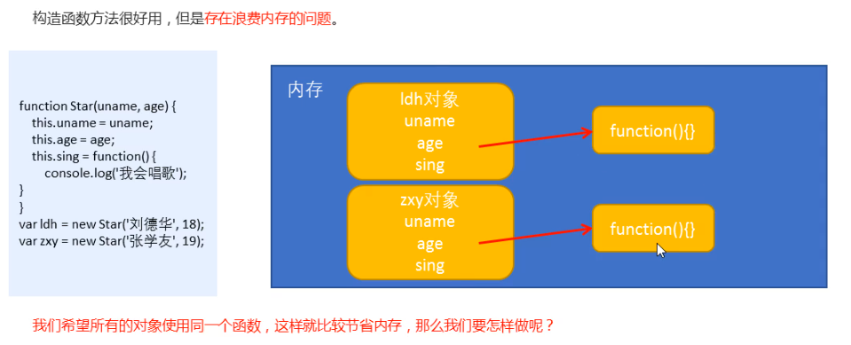
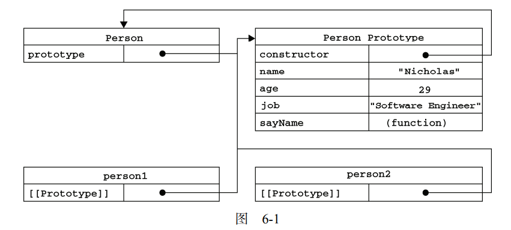
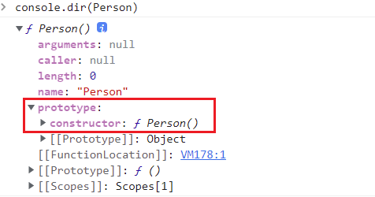
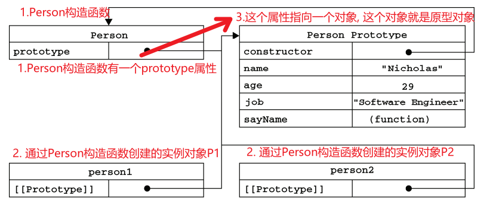
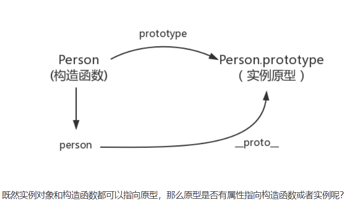
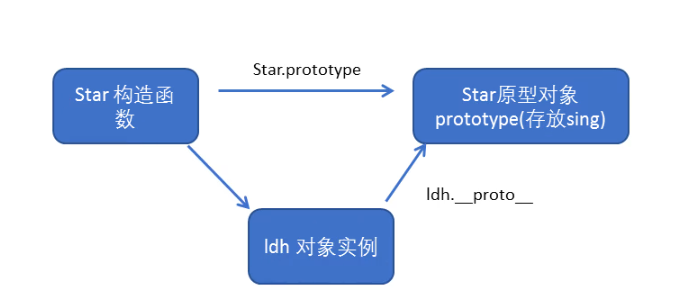
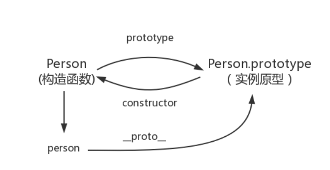
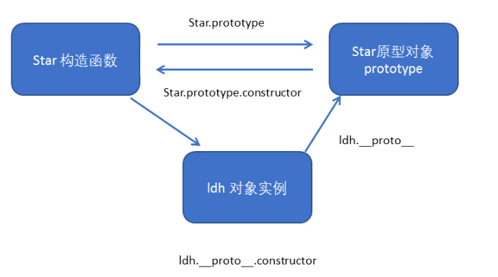
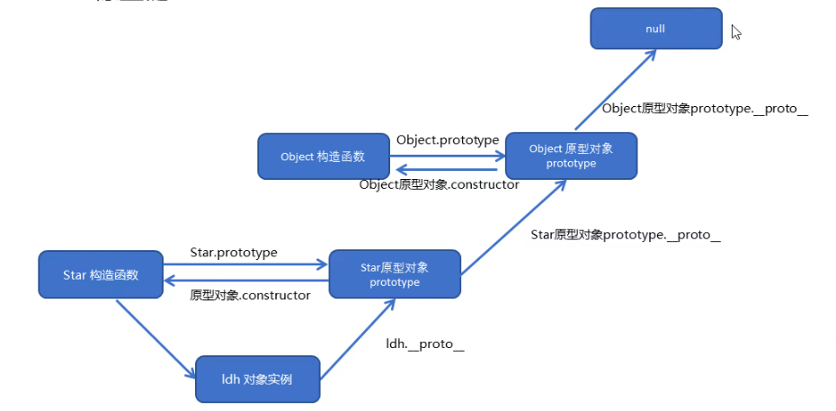

### Target:

1. 能够说出new的执行过程
2. 能够说出类和对象的区别 ?
3. 能够说出什么是静态成员和实例成员
4. 能够说出什么事原型(prototype)以及原型的主要作用
5. 能够画出构造函数,实例,原型对象三者之前的关系图
6. 能够根据原型链说出JavaScript的对象成员的查找机制

💡🚀🤟👉👇☀️🍉🍍🍇🍓🥕🍭🎖️🎁☘️🍀💯🔆❗🔥🚩

🔥: 背下来~

## 1. 创建对象

### 1.1. 创建对象的三种方式 🔥

**CODE 01 🚩**

```js
// 有一些问题哈, 
// 1. 对象字面量
var obj1 = {}

// 2. 利用 new Object() 创建
var obj2 = new Object()

// 3. 利用构造函数创建对象
function Star(name, age){
    this.name = name 
    this.age = age 
    this.sing = function(){
        console.log('会唱歌')
    }
}
// 创建了ldh这个对象， 也叫作实例化了一个对象
var ldh = new Star('刘德华', 18)
// 又创建了一个对象 ， 张学友
var zxy = new Star('张学友', 20)
```

### 1.2. new的执行过程 🔥

```js
// 1. 在内存中创建一个空对象
// 2. 让this指向这个空对象
// 3. 执行构造函数里的代码，给这个空对象添加属性和方法
// 4. 返回这个对象  （所以构造函数里面不需要写return）
```

### 1.3 静态成员和实例成员

1. 实例成员, 就是通过构造函数内部this添加的成员; 
   1. **实例成员，只能通过实例化的对象来访问**
2. 静态成员, 在构造函数本身添加的成员
   1. **静态成员， 只能通过构造函数来访问**

**CODE 02 🚩**

```js
//! 构造函数中的属性和方法我们称为成员, 成员可以添加
function Star(uname, age) {
    this.uname = uname;
    this.age = age;
    this.sing = function() {
        console.log('我会唱歌');

    }
}
var ldh = new Star('刘德华', 18);

//! 1 实例成员, 就是通过构造函数内部this添加的成员， name, age, sing 就是实例成员
// 实例成员，只能通过实例化的对象来访问
console.log(ldh.name)
console.log(ldh.age)
console.log(ldh.sing)
ldh.sing() // 调用函数
// console.log(Star.uname); // 不可以通过构造函数来访问实例成员

//! 2 静态成员, 在构造函数本身添加的成员， sex这个属性，就是静态成员
// 静态成员， 只能通过构造函数来访问
Star.sex = 'male'
console.log(Star.sex)
```

### 1.4 构造函数的问题

构造函数创建对象很方便，但是存在浪费内存的问题。



每次执行new创建实例的时候, 都会在实例上创建一个function(), 如果方法相同, 就没必要重复创建.

怎么做呢？ 

我们可以把那些不变的方法，直接定义在prototype对象上，这样所有对象的实例就可以共享这些方法。

## 2. 原型prototype🔥🔥🔥

### 2.1 **什么是原型** : 

字面意思就是 原始的模型, 原始祖先.

JS里: **原型就是一个对象, 特指prototype, 也叫原型对象 / 显示原型**



### 2.2 **原型对象:**  

**所有的函数，都有一个prototype属性，这个属性是一个指针, 指向原型对象.** 

- 函数.prototype的属性值是一个对象（属性的集合），默认只有一个叫做constructor的属性,  指向这个函数本身

```js
function Person(){ /*code*/}
// 查看
console.dir(Person)

Person.prototype ==> {cosntructor:f Person()}   // 函数.prototype 是一个对象
```




而这个prototype 就是 通过构造函数创建出来的实例的原型(对象). 

- 也就是说, 原型对象, 可以看做是新创建的实例的模板, 每个实例都可以通过一定方式访问到这个对象的属性和方法.
- 我们可以往这个原型对象中添加属性和方法.



**原型对象的意义?**

- **共享属性和方法**

可以让所有通过构造函数创建的实例, 共享它所包含的属性和方法.

**CODE 03 🚩**

```js
// 1. 构造函数的问题. 
function Star(uname, age) {
    this.uname = uname;
    this.age = age;
    // this.sing = function() {
    //     console.log('我会唱歌');

    // }
}
Star.prototype.sing = function() {
    console.log('我会唱歌');
}
var ldh = new Star('刘德华', 18);
var zxy = new Star('张学友', 19);
console.log(ldh.sing === zxy.sing);
// console.dir(Star);
ldh.sing();
zxy.sing();
// 1. 将公共属性定义到构造函数中
// 2. 将公共方法放到它的原型对象上
// 2. 一般情况下,我们的公共属性定义到构造函数里面, 公共的方法我们放到原型对象身上
```

1. 参考[深入理解JS原型](https://www.cnblogs.com/wangfupeng1988/p/3978131.html)
2. JavaScript高级程序设计 第四版 P225


## 3. `__proto__`🔥🔥🔥

>  `隐式原型__proto__`

在 JavaScript 中，每个实例对象都有一个私有属性 [[Prototype]]，该属性指向了这个实例对象的原型对象，可以通过 ES5 的 `Object.getPrototypeOf()` 来访问该属性，许多浏览器也对 [[Prototype]] 进行了实现，也就是我们经常见到的` __proto__`，`__proto__ `指向了实例对象的原型( 原型对象/显示原型)

**每一个JS对象都具有的一个属性，叫`__proto__`，这个属性会指向该对象的原型。**

- 属性指向该对象的原型,  也可以换句话表述 :  
  - 所有对象的隐式原型（`__proto__`）, 指向它的构造函数的显示原型（`prototype`）

- `Object.getPrototypeOf()` 方法返回指定对象的原型（内部`[[Prototype]]`属性的值）。

**CODE 04 🚩**

```js
function Animal() {
    this.color = 'orange'
}

var cat = new Animal()
console.log(cat)
console.log(cat.__proto__)  // {constructor: f Animal()}
console.log(cat.__proto__ === Animal.prototype)  // true
console.log(Object.getPrototypeOf(cat) === cat.__proto__)  // true

// 视频中
function Star(name, age) {
    this.name = name
    this.age = age
}
Star.prototype.sing = function() {
    console.log('我会唱歌')
}
var ldh = new Star('刘德华', 18)
console.log(ldh) // 对象身上系统自动添加一个__proto__属性，指向构造函数的原型对象
console.log(ldh.__proto__ === Star.prototype)
//1. 先看实例化对象（ldh）上是否有目标方法（sing），如果有，则执行该方法
//2. 如果实例化对象（ldh）上没有该方法，因为有`__proto__`，就可以去构造函数原型对象`prototype`上去查找
```



### 3.1 注意点

1. `实例对象.__proto__`  === `构造函数.prototype`

```js
person.__proto__ === Person.prototye   // 他们都指向原型对象.
// 原型对象默认有个constructor属性, 又指回实例的构造函数.
```

2. 实例方法的查找规则 ldh.sing()
   1. 先看实例化对象（ldh）上是否有目标方法（sing），如果有，则执行该方法
   2. 如果实例化对象（ldh）上没有该方法，因为有`__proto__`，就可以去构造函数原型对象`prototype`上去查找

2. `__proto__` 表示实例与原型之间的一个关系, 也就是person 和 Person.prototype 之间的关系, ldh与Star.prototype之间的关系




## 4. constructor属性🔥🔥

**每个原型对象都有一个constructor属性，指向相关联的构造函数。**

- constructor我们也可以成为构造函数， 因为它指回构造函数本身。

同时，每个构造函数声明之后，都有与之关联的原型对象。

```js
function Person() {} 
/** 
 * 声明之后，构造函数就有了一个 
 * 与之关联的原型对象：
 */                                                                                    13 
console.log(typeof Person.prototype); // Object
Person.prototype.constructor === Person // true
```

所以，构造函数和构造函数的prototype原型对象是相互指向的。



```js
function Person() {

}

var person = new Person();

console.log(person.__proto__ == Person.prototype) // true
console.log(Person.prototype.constructor == Person) // true
// 顺便学习一个ES5的方法,可以获得对象的原型
console.log(Object.getPrototypeOf(person) === Person.prototype) // true
```

### 4.1 注意点

​		**描述：**一般情况下，对象的方法都在构造函数的原型对象`prototype`中设置。如果有多个对象的方法，我们可以给原型对象`prototype`采取对象形式赋值，但是这样就会覆盖构造函数原型对象原来的内容，这样修改后的原型对象 `constructor`  就不再指向当前构造函数了。此时，我们可以在修改后的原型对象中，添加一个 `constructor` 指向原来的构造函数。

​		**处理方案：**如果我们修改了原来的原型对象,给原型对象赋值的是一个对象,则必须手动的利用`constructor`指回原来的构造函数。**换句话来说，不要这么赋值能解决100%的问题**

**CODE 05 🚩**

```js
// 1. 点语法添加原型方法
function Star (uname, age) {
    this.uname = uname;
    this.age = age;
}
Star.prototype.sing = function() {
    console.log('我会唱歌');
}
Star.prototype.movie = function() {
    console.log('我会唱歌');
}

// 2. 以对象赋值的方式添加对象方法
function Star (uname, age) {
    this.uname = uname;
    this.age = age;
}
Star.prototype = {
    // 如果我们修改了原来的原型对象,给原型对象赋值的是一个对象
    // 则必须手动的利用constructor指回原来的构造函数
    // 如果不加这个constructor则不会指挥Star原型
    constructor: Star, 
    sing: function() {
        console.log('我会唱歌');
    },
    movie: function() {
        console.log('我会演电影');
    }
}
var ldh = new Star('刘德华', 18)
var zxy = new Star('张学友', 19)
console.log(Star.prototype.constructor);
console.log(ldh.__proto__.constructor);
```

## 5. 构造函数，实例对象，原型对象关系



1. 构造函数.prototype ==> 指向了原型对象
2. 原型对象.constructor ==> 指回了构造函数
3. 实例.`__proto__` ==> 指向了原型对象

构造函数和原型对象是相互指向的， 实例通过`__proto__` 可以访问原型对象。

（原型对象没有对实例的指向，因为构造函数可以通过原型对象创建好多个实例，不需要每创建一个就建议一条连接）


## 6. 原型链



```js
function Star(uname, age) {
    this.uname = uname;
    this.age = age;
}
Star.prototype.sing = function() {
    console.log('我会唱歌');
}
var ldh = new Star('刘德华', 18);
// 1. 只要是对象就有__proto__ 原型, 指向原型对象
console.log(Star.prototype);
console.log(Star.prototype.__proto__ === Object.prototype);
// 2.我们Star原型对象里面的__proto__原型指向的是 Object.prototype
console.log(Object.prototype.__proto__);
// 3. 我们Object.prototype原型对象里面的__proto__原型  指向为 null
```

**原型链：**🔥🔥🔥

**当访问一个对象的属性时，先在基本属性中查找(本身)， 如果没有，就会沿着`__proto__`这条链向上查找，一直找到最顶层为止，返回null。**

- 可以答出 
- 每个对象的都有`__proto__`, 指向它的构造函数的显示原型prototype, 也就是原型对象。
- 原型对象prototype也是一个对象，也有`__proto__`属性
- 实例与原型对象通过`__proto__` 链接，

```js
console.log(Star.prototype.__proto__ === Object.prototype) // ture
console.log(Object.prototype.__proto__) // null
```


**JS成员的查找机制** （原型链）🔥🔥🔥

1. 当访问一个对象的属性（包括方法）时，首先查找这个对象自身有没有该属性。
2. 如果没有就查找它的原型（也就是 `__proto__`指向的 prototype 原型对象）。
3. 如果还没有就查找原型对象的原型。
4. 依此类推一直找到 Object.prototype 为止（null）。
5. `__proto__`对象原型的意义就在于为对象成员查找机制提供一个方向，或者说一条路线。

```js
function Star(uname, age) {
    this.uname = uname;
    this.age = age;
}
Star.prototype.sing = function() {
    console.log('我会唱歌');

}
Star.prototype.sex = '女';
// Object.prototype.sex = '男';
var ldh = new Star('刘德华', 18);
ldh.sex = '男';

console.log(ldh.sex);

// 实例化对象上有Object的默认方法吗？ 如toString
console.log(Object.prototype);
console.log(ldh);
console.log(Star.prototype);

console.log(ldh.toString());
```

#### 原型对象this指向

> **构造函数**中的this和**原型对象**的this，**都**指向我们new出来的实例对象

```js
function Star(uname, age) {
    this.uname = uname;
    this.age = age;
}
var that;
Star.prototype.sing = function() {
    console.log('我会唱歌');
    that = this;
}
var ldh = new Star('刘德华', 18);
// 1. 在构造函数中,里面this指向的是对象实例 ldh
console.log(that === ldh);//true
// 2.原型对象函数里面的this 指向的是 实例对象 ldh
```

#### 通过原型为数组扩展内置方法（禁止使用！）

略~~~ 

- 可以通过原型对象，对原来的内置对象进行扩展自定义的方法
- 不可以这么做!  可能会造成其他不知道的同学出现莫名其妙的问题~ 千万不要扩展一些内置对象

```js
Array.prototype.sum = function() {
    var sum = 0;
    for (var i = 0; i < this.length; i++) {
        sum += this[i];
    }
    return sum;
};
//此时数组对象中已经存在sum()方法了  可以使用 数组.sum()进行数据的求和
[1,2,3,4].sum()
```

## 7. 继承 🔥

**视频 start

> es6之前可没有extends类的继承， 但可以通过构造函数+原型对象实现继承 - 组合继承

目标：

1. call、apply的使用
2. 属性继承写法
3. 方法继承写法

### 1 call()和apply() 🔥

#### 1.1 call()

1. **概念：**调用目标函数，并修改函数运行时的this指向

2. **语法：**

   ```js
   function.call(thisArg, arg1, arg2, ...)
   ```

3. **参数：**

   `thisArg`:

   ​		可选的。在 *`function`* 函数运行时使用的 `this` 值（指向对象）。请注意，`this`可能不是该方法看到的实际值：如果这个函数处于[非严格模式](https://developer.mozilla.org/zh-CN/docs/Web/JavaScript/Reference/Strict_mode)下，则指定为 `null` 或 `undefined` 时会自动替换为指向全局对象，原始值会被包装。

   `arg1,arg2,arg3...`:

   ​		指定的参数列表（传递的其他参数）。

4. **返回值：**

   ​		使用调用者提供的 `this` 值和参数调用该函数的返回值。若该方法没有返回值，则返回 `undefined`。

**CODE09**

```JS
function fn(x, y) {
    console.log(this)
    return x + y
}
var o = {
    name: 'andy'
};
fn(1, 2)
fn.call(o, 1, 2) // 调用了函数此时的this指向了对象o
```


#### 1.2 apply()

1. **概念：**`apply()` 方法调用一个具有给定`this`值的函数，以及以一个数组（或[类数组对象](https://developer.mozilla.org/zh-CN/docs/Web/JavaScript/Guide/Indexed_collections#working_with_array-like_objects)）的形式提供的参数。

2. **语法：**

   ```js
   func.apply(thisArg, [argsArray])
   ```

3. **参数：**

   `thisArg`:

   ​		可选的。在 *`function`* 函数运行时使用的 `this` 值（指向对象）。请注意，`this`可能不是该方法看到的实际值：如果这个函数处于[非严格模式](https://developer.mozilla.org/zh-CN/docs/Web/JavaScript/Reference/Strict_mode)下，则指定为 `null` 或 `undefined` 时会自动替换为指向全局对象，原始值会被包装。

   `argsArray`:

   ​		可选的。一个数组或者类数组对象，其中的数组元素将作为单独的参数传给 `func` 函数。如果该参数的值为 [`null`](https://developer.mozilla.org/zh-CN/docs/Web/JavaScript/Reference/Global_Objects/null) 或 [`undefined`](https://developer.mozilla.org/zh-CN/docs/Web/JavaScript/Reference/Global_Objects/undefined)，则表示不需要传入任何参数。

4. **返回值：**

   ​		使用调用者提供的 `this` 值和参数调用该函数的返回值。若该方法没有返回值，则返回 `undefined`。

**CODE09**

```js
function fn(x, y) {
    console.log(this)
    return x + y
}
var o = {
    name: 'andy'
};
fn(1, 2)
fn.apply(o, [1, 2]) // 调用了函数此时的this指向了对象o
```

#### 1.3 call()和apply()的区别

​		call()方法的作用和 apply() 方法类似，区别就是`call()`方法接受的是**参数列表**，而`apply()`方法接受的是**一个参数数组**。

### 2 子构造函数继承父构造函数中的属性

>  **核心原理：**通过call()把父类型的this指向子类型的this，这样就可以实现子类型继承父类型的属性。

步骤：

1. 先定义一个父构造函数
2. 再定义一个子构造函数
3. 子构造函数继承父构造函数的属性(使用call方法)

**CODE10**

```JS
 // 1. 父构造函数
 function Father (uName, age) {
   // this 指向父构造函数的对象实例
   this.uName = uName
   this.age = age
 }
  // 2 .子构造函数 
function Son (uName, age, score) {
  // this 指向子构造函数的对象实例
  // 3.使用call方式实现子继承父的属性
  Father.call(this, uName, age)
  this.score = score // 子构造函数的独有属性
}
var son = new Son('刘德华', 18, 100)
console.log(son)
```


### 3 借用原型对象继承方法

步骤：

1. 先定义一个父构造函数
2. 再定义一个子构造函数
3. 子构造函数继承父构造函数的属性(使用call方法)

**CODE11**

```js
// 1. 父构造函数
function Father (uname, age) {
    // this 指向父构造函数的对象实例
    this.uname = uname
    this.age = age
}

// 这是父构造函数原型链上的方法
Father.prototype.money = function () {
    console.log(100000)
}

// 2.子构造函数 
function Son (uname, age, score) {
    // this 指向子构造函数的对象实例
    Father.call(this, uname, age)
    this.score = score
}

// 这是子构造函数原型链上的方法
Son.prototype.exam = function () {
    console.log('孩子要考试')
}
```

**方案一:（不可行）将子构造函数的原型等于父构造函数**

```js
Son.prototype = Father.prototype
```

问题: 这样直接赋值会有问题,如果修改了子原型对象`prototype`,父原型对象`prototype`也会跟着一起变化(父元素上也有子元素的原型方法)


**方案二: (推荐使用) 将子构造函数的原型指向父构造函数**

```js
Son.prototype = new Father()
console.log(Son.prototype.constructor) // 指向的是Father
```

问题: 如果利用对象的形式修改了原型对象,别忘了利用constructor 指回原来的构造函数
修改: 

```js
Son.prototype = new Father()
Son.prototype.constructor = Son
```

**<font color='red'>以上，牢记！</font>**

 **CODE12: 完整代码块**

```js
// 1. 父构造函数
function Father (uname, age) {
    // this 指向父构造函数的对象实例
    this.uname = uname
    this.age = age
}

// 这是父构造函数原型链上的方法
Father.prototype.money = function () {
    console.log(100000)
}

// 2.子构造函数 
function Son (uname, age, score) {
    // this 指向子构造函数的对象实例
    Father.call(this, uname, age)
    this.score = score
}

Son.prototype = new Father()
Son.prototype.constructor = Son

// 这是子构造函数原型链上的方法
Son.prototype.exam = function () {
    console.log('孩子要考试')
}
var son = new Son('刘德华', 18, 100)
console.log(son)
```


### 4 类的本质

> 本质上就是构造函数的另一种写法

**CODE13**

```js
// ES6 之前通过 构造函数 + 原型实现面向对象 编程
// (1) 构造函数有原型对象prototype 
// (2) 构造函数原型对象prototype 里面有constructor 指向构造函数本身
// (3) 构造函数可以通过原型对象添加方法
// (4) 构造函数创建的实例对象有__proto__ 原型指向 构造函数的原型对象

// ES6 通过 类 实现面向对象编程 
class Star {}
console.log(typeof Star)
console.log(Object.prototype.toString.call(Star))
// 1. 类的本质其实还是一个函数 我们也可以简单的认为 类就是 构造函数的另外一种写法
// (1) 类有原型对象prototype 
console.log(Star.prototype)
// (2) 类原型对象prototype 里面有constructor 指向类本身
console.log(Star.prototype.constructor)
// (3)类可以通过原型对象添加方法
Star.prototype.sing = function() {
console.log('冰雨')

}
var ldh = new Star()
console.dir(ldh)
// (4) 类创建的实例对象有__proto__ 原型指向 类的原型对象
console.log(ldh.__proto__ === Star.prototype)
```

> ES6的类其实就是语法糖
>
> 语法糖： 就是一直便捷的写法 （如果有两种方法可以实现相同的功能，那么写法更简单的哪一种就称为语法糖）

end 

---

- 以下， 快毕业了可以考虑再看看

**真的是继承吗**

我们常常提到“每一个对象都会从原型‘继承’属性”，实际上，继承是一个十分具有迷惑性的说法，引用《你不知道的JavaScript》中的话，就是：

**继承意味着复制操作，然而 JavaScript 默认并不会复制对象的属性**，相反，**JavaScript 只是在两个对象之间创建一个关联，这样，一个对象就可以通过委托访问另一个对象的属性和函数，所以与其叫继承，委托的说法反而更准确些**。

### JS实现继承的几种方式

继承可以使得子类具有父类的各种方法和属性

#### 1. 原型链继承

构造函数、原型和实例的关系：每个构造函数都有一个原型对象，原型对象都包含一个属性指回构造函数，而实例都包含一个原型对象的指针。

```js
function Parent () {
    this.name = 'kevin';
  	this.play = [1, 2, 3];
}

Parent.prototype.getName = function () {
    console.log(this.name);
}

function Child () {
	this.type = 'child'
}
// Child通过创建Parent的实例，并将其复制给自己的原型Child.prototype 实现了对Parent的继承
// child.prototype现在是Parent的一个实例
// Child.prototype.__proto__ === Parent.prototype  : true
// 继承Parent
Child.prototype = new Parent();

var child1 = new Child();

console.log(child1.getName()) // kevin
// 注意，Child.prototype.constructor === Child    : false 
// Child.prototype.constructor === Parent   : true
// Child.prototype的constructor属性被重写为指向Parent, 所以instance.constructor也指向 Parent
```


- `SubType.prototype.constructor === SuperType`    // true
- `SubType.prototype.constructor === SubType`   // false
- `SubType.prototype.__proto__ === SuperType.prototype`   // true

##### 缺点

1. **原型中包含的引用值会在所有实例间共享**
1. 子类型在实例化的时候，不能给父类型的构造函数传参

```js
function Parent () {
    this.name = 'kevin';
  	this.lists = [1, 2, 3];
}

Parent.prototype.getName = function () {
    console.log(this.name);
}
function Child () {
	this.type = 'child'
}
// 继承Parent
Child.prototype = new Parent();

let ch1 = new Child()
let ch2 = new Child()

ch1.lists.push(4)
console.log(ch1.lists)  // ch1改变的lists,
console.log(ch2.lists)   // ch2也改变了

console.log(ch1.name)
console.log(ch2.name)
```

#### 2. 构造函数继承(经典继承)

**使用父类的构造函数来增强子类实例，等同于复制父类的实例给子类（不使用原型）**

```js
function SuperType() {  
  this.colors = ["red", "blue", "green"]; 
} 
function SubType() { 
// 继承SuperType                                                                     4
SuperType.call(this); 
} 
let instance1 = new SubType();                                                         5 
instance1.colors.push("black"); 
console.log(instance1.colors); // "red,blue,green,black" 
let instance2 = new SubType(); 
console.log(instance2.colors); // "red,blue,green"

```

核心代码是`SuperType.call(this)`, 创建子类实例时调用`SuperType`构造函数，于是`SubType`的每个实例都会将SuperType中的属性复制一份.

##### 优点

1. 避免了引用类型的属性被所有实例共享 (避免了父类的引用属性被共享)
2. 可以在子类构造函数中向父类构造函数传参

```js
function Parent (name) {
    this.name = name;
}
Parent.prototype.sayHi = function(){console.log('Hello World')} 
function Child (name) {
    Parent.call(this, name) 	
}
// Child.prototype.getName = function(){console.log(123123)}

var child1 = new Child('kevin');

console.log(child1.name); // kevin

var child2 = new Child('daisy');

console.log(child2.name); // daisy
// console.log(child2.getName()) 
console.log(child2.sayHi()) // 1. TypeError: child2.sayHi is not a function
```

##### 缺点

1. 父类原型对象(parent)中一旦存在父类之前自己定义的方法，那么子类将无法继承这些方法。即：**只能继承父类的实例属性和方法，不能继承原型属性和方法**。

#### 3. 组合继承

组合继承（有时候也叫伪经典继承）综合了原型链和盗用构造函数两种方式的继承。

用**原型链**实现对**原型**属性和方法的继承，通过借用**构造函数**实现**实例**属性的继承

```js
function SuperType(name){  
  this.name = name; 
  this.colors = ["red", "blue", "green"]; 
} 
SuperType.prototype.sayName = function() { 
  console.log(this.name); 
}; 
function SubType(name, age){ 
  // 继承属性  // 第二次调用SuperType, 
  SuperType.call(this, name); 
  this.age = age; 
} 
// 继承方法  第一次调用SuperType， 
SubType.prototype = new SuperType(); 
SubType.prototype.sayAge = function() { 
  console.log(this.age); 
}; 

let ch1 = new SubType("Nicholas", 29); 
ch1.colors.push("black"); 
console.log(ch1.colors);  // "red,blue,green,black" 
ch1.sayName();            // "Nicholas"; 
ch1.sayAge();             // 29 

let ch2 = new SubType("Greg", 27); 
console.log(ch2.colors);  // "red,blue,green" 
ch2.sayName();            // "Greg"; 
ch2.sayAge();             // 27 
```

##### 缺点：

1. **组合继承最大的缺点是会调用两次父构造函数**, SuperType被调用执行了两次，多了一次性能开销

   

#### 4. 原型式继承

上面的都是围绕着构造函数的继承方式(new) , 对于JS普通对象，怎么实现继承呢

##### Object.create()模拟

```js
function create(o) {
    function F(){};
    F.prototype = o;
    return new F();
}
// ES5 Object.create的模拟实现，将传入的对象作为创建对象的原型
// 这个 object()函数会创建一个临时构造函数，将传入的对象赋值给这个构造函数的原型，然后返 
// 回这个临时类型的一个实例。本质上，object()是对传入的对象执行了一次浅复制。

// Object.create()这个方法接收两个参数：
// 1. 作为新对象原型的对象，
// 2. 以及给新对象定义额外属性的对象（第二个可选）
let b = {name:'b', age:18}
let a = Object.create(b) // a {}    a.__proto__  -->指向：  {name:'b', age:18}
a.__proto__ === b.prototype // false
a.__proto__ === b   // true
```

```js
let person = {  
  name: "Nicholas", 
  friends: ["Shelby", "Court", "Van"],
  getName: function() {
    return this.name
  }
}; 
let p1 = create(person); 
p1.name = "Greg";                                                           6 
p1.friends.push("Rob"); 

let p2 = create(person); 
p2.name = "Linda";                                                       7 
p2.friends.push("Barbie"); 
console.log(person.friends);  // "Shelby,Court,Van,Rob,Barbie"
console.log(p1)   // F {name: 'Greg'}
console.log(p2.getName())  // Linda
console.log(p1.friends)  //  ['Shelby', 'Court', 'Van', 'Rob', 'Barbie']
console.log(p2.friends) //  ['Shelby', 'Court', 'Van', 'Rob', 'Barbie']
```

##### 缺点

1. 包含引用类型的属性被多个实例所共享，跟原型链继承一样
2. 无法传递参数

#### 5. 寄生式继承

寄生式继承背后的思路类似于寄生构造函数和工厂模式：创建一个实现继承的函数，以某种方式增强对象，然后返回这个对象。

```js
function createAnother(original){  
  let clone = Object.create(original);  // 通过调用函数创建一个新对象 
  clone.sayHi = function() {     // 以某种方式增强这个对象 
    console.log("hi"); 
  }; 
  return clone;           // 返回这个对象 
}
```

```js
let person = {
  name: "Nicholas",
  friends: ["p1", "p2", "p3"],
  getName: function() {
    return this.name;
  }
};

function createAnother(original) {
  let clone = Object.create(original);
  clone.getFriends = function() {
    return this.friends;
  };
  return clone;
}

let p2 = createAnother(person);

console.log(p2.getName());
console.log(p2.getFriends());

```


##### 缺点：

- 跟借用构造函数模式一样，每次创建对象都会创建一遍方法。

#### 6. 寄生组合式继承 完美🔥🔥

基本思路是不通过调用父类构造函数给子类原型赋值，而是取得父类原型的一个副本。说到底就是使用寄生式继承来继承父 
类原型，然后将返回的新对象赋值给子类原型

```js
function inheritPrototype(subType, superType) { 
  let prototype = Object.create(superType.prototype);  // 创建对象 
  prototype.constructor = subType;              // 增强对象 
  subType.prototype = prototype;                // 赋值对象 
} 

// 简单写法 
function inherit(Child, Parent) {
  Child.prototype = Object.create(Parent.prototype)
  Child.prototype.constructor = Child
}
```

这个 inheritPrototype()函数实现了寄生式组合继承的核心逻辑。这个函数接收两个参数：子类构造函数和父类构造函数。在这个函数内部，第一步是创建父类原型的一个副本。然后，给返回的prototype 对象设置 constructor属性，解决由于重写原型导致默认 constructor丢失的问题。最后将新创建的对象赋值给子类型的原型

```js
function SuperType(name) { 
  this.name = name;  
  this.colors = ["red", "blue", "green"]; 
} 
SuperType.prototype.sayName = function() { 
  console.log(this.name); 
}; 
function SubType(name, age) { 
  SuperType.call(this, name); 
    this.age = age; 
} 
// 调用  Child / Parent
inheritPrototype(SubType, SuperType); 
SubType.prototype.sayAge = function() {                                                2 
  console.log(this.age); 
};


```

```js
  function clone (parent, child) {
    // 这里改用 Object.create 就可以减少组合继承中多进行一次构造的过程
    child.prototype = Object.create(parent.prototype);
    child.prototype.constructor = child;
  }

  function Parent6() {
    this.name = 'parent6';
    this.play = [1, 2, 3];
  }
   Parent6.prototype.getName = function () {
    return this.name;
  }
  function Child6() {
    Parent6.call(this);
    this.friends = 'child5';
  }

  clone(Parent6, Child6);

  Child6.prototype.getFriends = function () {
    return this.friends;
  }

  let person6 = new Child6();
  console.log(person6);
  console.log(person6.getName());
  console.log(person6.getFriends());
```

- `Child.prototype = Object.create(Parent.prototype);`和 `Child.prototype = new Parent()`;
- new Parent()会带来副作用，原型包含的属性值会在所有实例中共享

#### 7. ES6 extends

```js
class Person {
  constructor(name) {
    this.name = name
  }
  // 原型方法
  // 即 Person.prototype.getName = function() { }
  // 下面可以简写为 getName() {...}
  getName = function () {
    console.log('Person:', this.name)
  }
}
class Gamer extends Person {
  constructor(name, age) {
    // 子类中存在构造函数，则需要在使用“this”之前首先调用 super()。
    super(name)
    this.age = age
  }
}
const asuna = new Gamer('Asuna', 20)
asuna.getName() // 成功访问到父类的方法
```

##### Babel编译extends

```js
function _possibleConstructorReturn (self, call) { 
		// ...
		return call && (typeof call === 'object' || typeof call === 'function') ? call : self; 
}
function _inherits (subClass, superClass) { 
    // 这里可以看到
	subClass.prototype = Object.create(superClass && superClass.prototype, { 
		constructor: { 
			value: subClass, 
			enumerable: false, 
			writable: true, 
			configurable: true 
		} 
	}); 
	if (superClass) Object.setPrototypeOf ? Object.setPrototypeOf(subClass, superClass) : subClass.__proto__ = superClass; 
}

var Parent = function Parent () {
	// 验证是否是 Parent 构造出来的 this
	_classCallCheck(this, Parent);
};
var Child = (function (_Parent) {
	_inherits(Child, _Parent);
	function Child () {
		_classCallCheck(this, Child);
		return _possibleConstructorReturn(this, (Child.__proto__ || Object.getPrototypeOf(Child)).apply(this, arguments));
}
	return Child;
}(Parent));
```


#### 8.参考

1. [JavaScript深入之从原型到原型链](https://github.com/mqyqingfeng/Blog/issues/2#)
2. JavaScript高级程序设计 第四版 chapter 8.3 继承
3. [JavaScript深入之继承的多种方式和优缺点]( https://juejin.cn/post/6844903477819211784)
4. 拉勾教育 JS核心原理精讲
5. [JavaScript常用八种继承方案](https://juejin.cn/post/6844903696111763470)

## 8. ES6新增

### 1 数组的使用方法

#### 1.1 forEach - 遍历数组

**语法：**

```js
 arr.forEach(function (value, index, array) {})
```

**参数：**

`value`:  数组元素

`index(可选)`: 数组元素当前的索引

`array(可选)`: 当前的数组(一般不用)

**示例：**

**CODE14**

```js
// forEach 迭代(遍历) 数组
var arr = [1, 2, 3]
var sum = 0
arr.forEach(function (value, index, array) {
    console.log('当前数组元素', value)
    console.log('当前数组元素的索引号', index)
    console.log('数组本身', array)
    sum += value
})
console.log(sum)
```

> 思考：
>
> 1. 与for循环做对比
> 2. forEach有无break和continue？
> 3. return可以终止forEach循环吗？

#### 1.2 map - 基于原数组构建新数组

> `map()` 方法创建一个新数组，这个新数组由原数组中的每个元素都调用一次提供的函数后的返回值组成。

```js
var new_array = arr.map(function (value,index,array) {
    // Return element for new_array
    // 为新数组添加一个新元素
}
```

**参数：**

`value`:  数组元素

`index(可选)`: 数组元素当前的索引

`array(可选)`: 当前的数组(一般不用)

**返回值：**

​		一个由原数组每个元素执行回调函数的结果组成的新数组。

**示例：**

**CODE16**

```JS
var arr = [
    {name: '张三'},
    {name: '李四'}
];
var newArr = arr.map(function (value, index) {
    value.age = index
    return value
});
console.log(newArr);
```

#### 1.3 filter - 过滤数组

> `filter()` 方法创建一个新数组, 其包含通过所提供函数实现的测试的所有元素。 

**语法：**

```js
 var filterArr = arr.filter(function (value,index,array) {
     // Return Boolean to filter Array
     // 返回一个布尔值确定是否过滤当前元素
 });
```

**参数：**

`value`:  数组元素

`index(可选)`: 数组元素当前的索引

`array(可选)`: 当前的数组(一般不用)

**返回值：**

​		一个新的、由通过测试的元素组成的数组，如果没有任何数组元素通过测试，则返回空数组。

**示例：**

**CODE15**

```js
// filter 筛选数组
var arr = [12, 66, 4, 88, 3, 7]
var newArr = arr.filter(function (value, index) {
    return value >= 20
});
console.log(newArr)
```

#### 1.4 some - 确定数组是否满足条件

> `some()` 方法测试数组中是不是至少有1个元素通过了被提供的函数测试。它返回的是一个Boolean类型的值。

```js
var new_array = arr.some(function (value,index,array) {
    // Return true or false
    // 返回真或假
}
```

**参数：**

`value`:  数组元素

`index(可选)`: 数组元素当前的索引

`array(可选)`: 当前的数组(一般不用)

**返回值：**

​		数组中有至少一个元素通过回调函数的测试就会返回**`true`**；

​		所有元素都没有通过回调函数的测试返回值才会为false。

**注意：**

**示例：**

**CODE16**

```js
var arr1 = ['red', 'pink', 'blue']
var flag1 = arr1.some(function (value) {
    return value == 'pink'
});
console.log(flag1)
```

> 思考： some 和filter 都是判断数组元素是否满足条件，那么他们的区别是什么
>
> 
>
> 答：
>
> 1.  filter 也是查找满足条件的元素 返回的是一个数组 而且是把所有满足条件的元素返回回来
>
> 2.  some 也是查找满足条件的元素是否存在  返回的是一个布尔值 如果查找到第一个满足条件的元素就终止循环

#### 1.5 every - 确定数组是否全部满足条件

> `every()` 方法测试一个数组内的所有元素是否都能通过某个指定函数的测试。它返回一个布尔值。

```js
var new_array = arr.every(function (value,index,array) {
    // Return true or false
    // 返回真或假
}
```

**参数：**

`value`:  数组元素

`index(可选)`: 数组元素当前的索引

`array(可选)`: 当前的数组(一般不用)

**返回值：**

​		如果回调函数的每一次返回都为 [truthy](https://developer.mozilla.org/zh-CN/docs/Glossary/Truthy) 值，返回 `true` ，否则返回 `false`。

**注意：**

​		`every()` 方法只要查找到一个不满足条件的元素就立马终止循环

**示例：**

**CODE17**

```js
var arr1 = [18, 20, 15]
var flag1 = arr1.every(function (value) {
    return value >= 18
});
console.log(flag1)
```

#### 1.6 案例


**要求：**

1. id、产品名称、价格不应该写死，应该通过数据渲染出来
2. 通过查询价格区间显示下面列表中符合条件的商品
3. 通过商品名称来显示下面列表中符合条件的商品


#### 1.6.1 步骤一：实时渲染数据

1. 定义数组对象数据

   **CODE18**

   ```js
   var data = [{
       id: 1,
       pname: '小米',
       price: 3999
   }, {
       id: 2,
       pname: 'oppo',
       price: 999
   }, {
       id: 3,
       pname: '荣耀',
       price: 1299
   }, {
       id: 4,
       pname: '华为',
       price: 1999
   }, ];
   ```

2. 获取相应的元素

   ```js
   var tbody = document.querySelector('tbody') // 获取tbody
   ```

3. 把数据渲染到页面中

   ```js
   function setData(mydata) {
       // 先清空原来tbody 里面的数据
       tbody.innerHTML = ''
       mydata.forEach(function(value) {
           // console.log(value)
           var tr = document.createElement('tr')
           tr.innerHTML = `<tr><td>${value.id}</td><td>${value.pname}</td><td>${value.price}</td></tr>`
           // 添加到tbody标签中
           tbody.appendChild(tr)
       });
   }
   
   setData(data)
   ```

#### 1.6.2 步骤二：根据价格查询商品

1. 获取价格区间查询按钮元素，金额开始和结束区间元素

   ```js
   var search_price = document.querySelector('.search-price') // 获取价格区间查询按钮元素
   var start = document.querySelector('.start') // 金额开始元素
   var end = document.querySelector('.end') // 金额结束元素
   ```

2. 绑定点击事件，根据商品价格去筛选数组里面的对象，把筛选完成之后的对象更新渲染到页面上去

   ```js
   search_price.addEventListener('click', function() {
       // 筛选列表数组中符合start和end区间中的元素
       var newDate = data.filter(function(item) {
           return item.price >= start.value && item.price <= end.value
       })
       // 把筛选完之后的对象渲染到页面中
       setDate(newDate)
   })
   ```

#### 1.6.3 根据商品名称查找商品

1. 获取名称查询按钮元素，名称输入框元素

   ```js
   var product = document.querySelector('.product'); // 获取名称查询按钮元素
   var search_pro = document.querySelector('.search-pro'); // 获取名称输入框元素
   ```

2. 绑定点击事件，根据商品查询名称进行筛选，把筛选完成之后的对象更新渲染到页面上去

   ```js
   // 如果查询数组中唯一的元素, 用some方法更合适,因为它找到这个元素,就不在进行循环,效率更高
   search_pro.addEventListener('click', function () {
       var arr = []
       data.some(function(item) {
           if (item.pname === product.value) {
               // console.log(value)
               arr.push(item)
               return true // return 后面必须写 true  
           }
           return false
       })
       // 把拿到的数据渲染到页面中
       setData(arr)
   })
   ```

### 2 字符串方法

#### 2.1 trim() - 去除两侧空格

> `trimStart()` 方法从字符串的开头删除空格。`trimLeft()` 是此方法的别名。

**语法：**

```js
str.trim()
```

**返回值：**

​		一个代表调用字符串两端去掉空白的新字符串。

**注意：**

​		`trim()` 方法返回一个从两头去掉空白字符的字符串，并不影响原字符串本身。

**示例：**

**CODE19**

```js
var str = '   an  dy   ';
console.log(str);
var str1 = str.trim();
console.log(str);
console.log(str1);
```

**实际使用场景：输入框前后有空格**

```html
<body>
    <input type="text"> <button>点击</button>
    <div></div>
    <script>
        // trim 方法去除字符串两侧空格
        var input = document.querySelector('input'); // 获取输入框内容
        var btn = document.querySelector('button'); // 获取点击按钮元素
        var div = document.querySelector('div'); // 获取后续需要展示内容的div
        btn.onclick = function () {
            var str = input.value.trim();
            if (str === '') {
                alert('请输入内容');
            } else {
                console.log(str);
                console.log(str.length);
                div.innerHTML = str;
            }
        }
    </script>
</body>
```

### 3 对象方法

#### 3.1 Object.keys(obj) - 获取对象的所有属性名

> `Object.keys()` 方法会返回一个由一个给定对象的自身可枚举属性组成的数组，数组中属性名的排列顺序和正常循环遍历该对象时返回的顺序一致 。

**语法：**

```js
Object.keys(obj)
```

**参数：**

`obj`:  要返回其枚举自身属性的对象。

**返回值：**

​		一个表示给定对象的所有可枚举属性的字符串数组。

**描述：**

​		`Object.keys` 返回一个所有元素为字符串的数组，其元素来自于从给定的`object`上面可直接枚举的属性。这些属性的顺序与手动遍历该对象属性时的一致。

**示例：**

**CODE20**

```js
var obj = {
    id: 1,
    pname: '小米',
    price: 1999,
    num: 2000
};
var arr = Object.keys(obj);
console.log(arr);
arr.forEach(function (value) {
    console.log(value);
})

// 简写
Object.keys(obj).forEach(function (value) {
    console.log(value);
})
```

> 思考： 和之前js基础时学到的哪个方法很相似


#### 3.2 Object.defineProperty - 重新定义对象属性(看个过场，了解即可)

> `Object.defineProperty()` 方法会直接在一个对象上定义一个新属性，或者修改一个对象的现有属性，并返回此对象。
>
> <font color='red'>注意： 应当直接在 [`Object`](https://developer.mozilla.org/zh-CN/docs/Web/JavaScript/Reference/Global_Objects/Object) 构造器对象上调用此方法，而不是在任意一个 `Object` 类型的实例上调用。</font>

**语法：**

```js
Object.defineProperty(obj, prop, descriptor)
```

**参数：**

`obj`:  要定义属性的对象。

`prop`:  要定义或修改的属性的名称。

`descriptor`:  要定义或修改的属性描述符，以对象的形式书写。

- `configurable`

  当且仅当该属性的 `configurable` 键值为 `true` 时，该属性的描述符才能够被改变，同时该属性也能从对应的对象上被删除。
  **默认为** **`false`**。

- `enumerable`

  当且仅当该属性的 `enumerable` 键值为 `true` 时，该属性才会出现在对象的枚举属性中。
  **默认为 `false`**。

- `value`

  该属性对应的值。可以是任何有效的 JavaScript 值（数值，对象，函数等）。
  **默认为 [`undefined`](https://developer.mozilla.org/zh-CN/docs/Web/JavaScript/Reference/Global_Objects/undefined)**。

- `writable`

  当且仅当该属性的 `writable` 键值为 `true` 时，属性的值，也就是上面的 `value`，才能被[`赋值运算符` (en-US)](https://developer.mozilla.org/en-US/docs/Web/JavaScript/Reference/Operators#assignment_operators)改变。
  **默认为 `false`。**

**返回值：**

​		被传递给函数的对象。

**示例：**

**CODE21**

```JS
// Object.defineProperty() 定义新属性或修改原有的属性
var obj = {
    id: 1,
    pname: '小米',
    price: 1999
};
// 1. 以前的对象添加和修改属性的方式
// obj.num = 1000;
// obj.price = 99;
// console.log(obj);

// 2. Object.defineProperty() 定义新属性或修改原有的属性
Object.defineProperty(obj, 'num', {
    value: 100
});

// 3. Object.defineProperty() 让新增的或修改的属性可以被枚举（遍历）
Object.defineProperty(obj, 'num', {
    value: 100,
    enumerable: true
});

// 4. Object.defineProperty() 不允许修改目标属性
Object.defineProperty(obj, 'id', {
	writable: false
});

// 5. Object.defineProperty() 不允许删除这个属性 不允许在修改第三个参数里面的特性
Object.defineProperty(obj, 'id', {
	writable: false,
    configurable: false
});
delete obj.id; // 不能删除
// 再次改变 configurable 状态
Object.defineProperty(obj, 'id', {
    configurable: true,
    writable: true
}); // 不允许在修改第三个参数descriptor的特性
```


