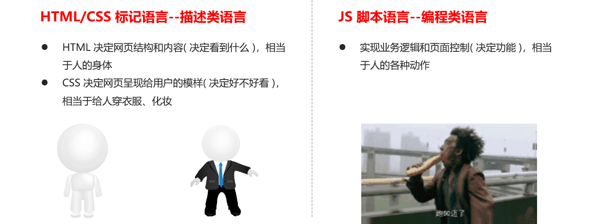

## 1. 编程语言

1. 能够说出编程语言和标记语言的区别
2. 能够说出JavaScript三部分组成
3. 能够使用变量来存储数据
4. 能够说出变量的命名规范
5. 能够写出交换两个变量的值
6. 能够说出JavaScript中的基本数据类型
7. 能够把其他转换成Number/String类型


### 1.1 编程语言

**编程** ： 就是让计算机为解决某个问题而使用某种程序设计语言编写程序代码，并最终得到结果的过程。

**计算机程序：**就是计算机所执行的一系列的**指令集合**，而程序全部都是用我们所掌握的语言来编写的， 所以人们要控制计算机一定要通过计算机语言向计算机发出命令。

从事编程的人员，就是**程序员**，但是一般程序员都比较幽默？为了形容自己的辛苦工作，也称为”码农“，或者 ”程序猿“ 、”程序媛“

**注意**：上面所定义的计算机指的是 **任何能过执行代码的设备**，可能是只能手机、ATM机，服务器等。


### 1.2 计算机语言

**计算机语言**指用于人与计算机之间通讯的语言，它是人与计算机之间传递信息的媒介。

计算机语言的种类非常的多，总的来说可以分成**机器语言**、**汇编语言**和**高级语言**三大类。

实际上计算机最终所执行的都是机器语言，它是由**0和1**组成的二进制数，二进制是计算机语言的基础。


### 1.3 编程语言

可以通过类似于人类语言的 ”语言”来控制计算机，让计算机为我们做事情，这样的语言就叫做编程语言（Programming Language）。编程语言是用来控制计算机的一系列指令，它有固定的格式和词汇（不同编程语言的格式和词汇不一样），必须遵守。 

如今通用的编程语言有两种形式：**汇编语言**和**高级语言**。


| 语言类型     | 说明                                                         |
| ------------ | :----------------------------------------------------------- |
| **汇编语言** | **汇编语言和机器语言实质是相同的**，都是直接对硬件操作，<br>只不过指令采用了英文缩写的标识符，容易识别和记忆。 |
| **高级语言** | 高级语言主要是相对于低级语言而言，它并不是特指某一种具体的语言，<br/>而是包括了很多编程语言，常用的有C语言、C++、Java、C#、Python、PHP、<br/>JavaScript、Go语言、Objective-C、Swift等。 |


### 1.4 编译器

**高级语言所编写的程序不能直接被计算机识别**，必须经过转换才能被执行，为此，我们需要一个**编译器**。 
编译器可以将我们所编写的代码转换为计算机能识别的二级制形式，这个过程称为**编译**(Compile)。 


编译（compile 、compilation）就是把高级语言变成计算机可以识别的2进制语言，计算机只认识1和0


### 1.5 编程语言和标记语言区别

| 语言     | 说明                                                         |
| -------- | ------------------------------------------------------------ |
| 编程语言 | 编程语言有<span style="color:red;">**很强的逻辑和行为能力**</span>。在编程语言里, 你会看到很多<br> if else 、for 、while等具有逻辑性和行为能力的指令，这是主动的。 |
| 标记语言 | 标记语言（html）不用于向计算机发出指令，常用于格式化和链接。<br/>标记语言的存在是用来被读取的, 他是被动的。 |


### 1.6 总结

1.  计算机可以帮助人类解决某些问题
2.  程序员利用编程语言编写程序发出指令控制计算机来实现这些任务 
3.  编程语言有机器语言、汇编语言、高级语言
4.  高级语言需要一个翻译器转换为计算机识别的机器语言 
5.  编程语言是主动的有很强的逻辑性


## 2. 计算机基础

### 2.1 计算机组成


### 2.2 数据存储

1.  计算机内部使用**二进制 0 和 1**来表示数据。
2.  所有数据，包括文件、图片等最终都是以二进制数据（0 和 1）的形式存放在硬盘中的。
3.  所有程序，包括操作系统，**本质都是各种数据，也以二进制数据的形式存放在硬盘中**。平时我们所说的安 
装软件，其实就是把程序文件复制到硬盘中。
4.  硬盘、内存都是保存的**二进制数据**。


### 2.3 数据存储单位

```bash
大小关系： bit < byte < kb < GB < TB<.....
```

1. 位(bit)： 1bit 可以保存一个 0 或者 1 （最小的存储单位）
2. 字节(Byte)：1B = 8b
3.  千字节(KB)：1KB = 1024B
4. 兆字节(MB)：1MB = 1024KB
5. 吉字节(GB):  1GB = 1024MB
6. 太字节(TB):  1TB = 1024GB

### 2.4 程序运行


1.  **计算机运行软件的过程：**
    1. 打开某个程序时，先从<span style="color:red;">**硬盘中把程序的代码**</span>加载到<span style="color:red;">**内存**</span>中

    2. CPU执行内存中的代码


注意：之所以要内存的一个重要原因，是因为 cpu 运行太快了，如果只从硬盘中读数据，会浪费cpu性能，所 
以，才使用存取速度更快的内存来保存运行时的数据。（内存是电，硬盘是机械）


## 3. 初识JavaScript

### 3.1 JavaScript 历史

- 布兰登·艾奇（[Brendan Eich](https://baike.baidu.com/item/%E5%B8%83%E5%85%B0%E7%99%BB%C2%B7%E8%89%BE%E5%A5%87/58101949?fromtitle=Brendan%20Eich&fromid=561441&fr=aladdin)，1961年～）。
- 神奇的大哥用10天完成  JavaScript 设计。
- 最初命名为 LiveScript，后来在与 Sun 合作之后将其改名为 JavaScript。

<table>
    <tr>
    	<td  width="600px">          布兰登·艾奇（Brendan Eich，1961年～）。神奇的大哥用10天完成 JavaScript 设计。最初命名为 LiveScript，后来在与 Sun 合作之后将其改名为 JavaScript。</td><td height="100px"></td>
    </tr>
</table>


### 3.2 JavaScript 是什么

- JavaScript 是世界上最流行的语言之一，是一种<span style="color:red">**运行在客户端的脚本语言** </span> （Script 是脚本的意思）
- 脚本语言：不需要编译，运行过程中由  **js 解释器( js 引擎）逐行来进行解释并执行**
-  现在也可以基于  Node.js 技术进行服务器端编程


### 3.3 JavaScript的作用

- 表单动态校验（密码强度检测） （ JS 产生最初的目的 ）

- 网页特效

- 服务端开发(Node.js)

- 桌面程序(Electron)

- 小程序

- App(Cordova)

- 控制硬件-物联网(Ruff)

- 游戏开发(cocos2d-js)

  

### 3.4 HTML / CSS  / JS 的关系



---


一个网页可以看作是由 HTML / CSS / JS 一起构成的结合体

- **结构层：**表述一个页面中有哪些信息，以及信息之间的关系，由HTML实现。
- **表现层：**决定了页面中的信息会以怎样的外观呈现出来，由CSS实现。
- **行为层：**控制了页面如何与用户进行交互，由JS实现。


### 3.5 浏览器执行JS过程 

浏览器有 渲染引擎和  JS引擎

- **渲染引擎**：用来解析HTML与CSS，俗称内核，比如  chrome 浏览器是blink ，chrome老版本使用 webkit引擎.

- **JS 引擎**：也称为  JS 解释器。  用来读取网页中的JavaScript代码，对其处理后运行，比如  chrome  浏览器的  V8引擎.


我们经常会说：不同的浏览器有不同的内核组成, 事实上, 我们说的浏览器内核指的就是浏览器的渲染引擎.


**引擎分类**

浏览器的内核引擎，基本上是四分天下：

1. Trident: IE 以Trident 作为内核引擎;

2. Gecko: Firefox 是基于 Gecko 开发;  [ˈɡekəʊ]

3. WebKit: Safari, Google Chrome,傲游3,猎豹浏览器,百度浏览器 opera浏览器 基于 Webkit 开发。

4. Presto [ˈprestəʊ]: Opera的内核，但由于市场选择问题，主要应用在手机平台--Opera mini   (之后转为Blink)  


**JS执行过程**

浏览器本身并不会执行JS代码，而是通过 <b style="color:red">内置 JavaScript 引擎(解释器) 来执行 JS 代码</b> 。JS 引擎执行代码时<b style="color:red">逐行解释每一句源码</b>（转换为机器语言），然后由计算机去执行，所以 JavaScript 语言归为脚本语言，会逐行解释执行<b style="color:red">(解释型语言)</b>。


也就是说 **JS 从上到下, 逐行解释执行.**  但不全是这样, 有特殊情况. 比如 **变量提升, 函数提升**等, 目前大家有一点印象就好


### 3.6 JS的组成


JavaScript

- ECMAScript  				[‘ekma:]
- DOM 				            文档对象模型
- BOM                             浏览器对象模型


#### 3.6.1 ECMAScript

JavaScript的核心，描述了语言的基本语法(var、for、if、array等)和数据类型(数字、字符串、布尔、函数、对象(obj、[]、{}、null)、未定义)，**ECMAScript是一套标准，定义了一种语言（比如JS）是什么样子**。是语言的约束条件.


ECMAScript：规定了<span style="color:red">**JS的编程语法和基础核心知识**</span>，是所有浏览器厂商共同遵守的一套<span style="color:red">**JS语法工业标准**</span>。

- 是一个标准，而这个标准需要由各个厂商去实现。
- 不同的浏览器厂商对该标准会有不同的实现。


#### 3.6.2 DOM --  文档对象模型

**文档对象模型**（Document Object Model，简称DOM），是W3C组织推荐的处理可扩展标记语言的标准编程接口。 通过  DOM 提供的接口可以对页面上的各种元素进行操作（大小、位置、颜色等）

文档: 一个页面就是一个文档, 把一个页面看做一个对象.


#### 3.6.3 BOM -- 浏览器对象模型

**浏览器对象模型** BOM (Browser Object Model，简称BOM) ，它提供了独立于内容的、可以与浏览器窗口进行互动的对象结构。通过BOM可以操作浏览器窗口，比如弹出框、控制浏览器跳转、获取分辨率等。


### 3.7 JS 初体验 

#### 1. CSS 3种写法 (复习)

- 内联(行内) 
- 内部样式
- 外部样式

```html
<!-- 1. 内联样式(行内样式) -->
<p style="color:orange; margin-left:20px">这是一个段落。</p>
```

```html
<head>
    <style>
        /* 2.内部样式 */
        /* 使用style标签, 在head位置定义样式 */
        div {
            width:200px;
            height:200px;
            background:pink;
        }
    </style>
</head>
```

```html
<head>
    <!-- 3.外部样式 -->
    <!-- 在head中引入link标签, 注意href写上需要引入的css链接-->
	<link rel="stylesheet" type="text/css" href="mystyle.css">
</head>
```


#### 2.**JS  3种写法**

1. 行内式   
2. 内嵌式  
3. 外链式

```html

<!-- 1. 行内式的js 直接写到元素的内部 -->
<input type="button" value="唐伯虎" onclick="alert('秋香姐')"/>

<!-- 2.内嵌式的js -->
<script>
  // alert('沙漠骆驼');
</script>

<!-- 3. 外链式js script 双标签 -->
<script src="my.js"></script>
```

> 注意！**script最好写在底部，</body>结束标签之前。**

**外链的script属性为src，不是href，不是href，不是href…**


## 4. JavaScript 注释

为了提高代码的可读性，JS与CSS一样，也提供了注释功能。JS中的注释主要有两种，分别是<span style="color:red"> **单行注释**</span> 和 <span style="color:red;">**多行注释**</span>。

注释:  解释, 增强代码可读性, 

### 4.1 单行注释

Window :  ` ctrl + /`

Mac :  `cmd + /`

```js
// 用来注释单行文字  
```

### 4.2 多行注释

Windows : `alt + shift + a`

Mac : `option + shift + a`

```js
/* 多行注释 
		默认的快捷键 shift +  alt  + a
        vscode 中修改多行注释的快捷键：  ctrl + shift + /
*/
```

- 修改快捷键
  - vscode → 首选项按钮 → 键盘快捷方式 → 查找 原来的快捷键 → 修改为新的快捷键 → 回车确认


### 4.3 扩展 - vscode注释插件

- Better Comments

```html
    <!-- ! 测试一下better comments -->
    <!-- ? 咦 -->
    <!-- * 哟哈哈哈 -->
    <!-- todo 代办? -->
```

```js
// ! 红色的高亮注释
// ? 蓝色的高亮注释
// * 绿色的高亮注释
// todo 橙色的高亮注释
// // 灰色带删除线的注释
// 普通的注释
```

- Code Spell Checker 单词拼写检查


## 5. JavaScript 输入输出语句

为了方便信息的输入输出，JS中提供了一些输入输出语句，其常用的语句如下：

| 方法             | 说明                           | 归属   |
| ---------------- | ------------------------------ | ------ |
| alert(msg)       | 浏览器弹出警示框               | 浏览器 |
| console.log(msg) | 浏览器控制台打印输出信息       | 浏览器 |
| prompt(info)     | 浏览器弹出输入框，用户可以输入 | 浏览器 |

注意：alert() 主要用来显示消息给用户，console.log() 用来给程序员自己看运行时的消息。

PS: 实际开发不会alert给用户的 , prompt也几乎不会用到。 


表格：Typora: Mac快捷键 `option + cmd + t`   Windows `Ctrl + T`


## 6. 变量

- 能够说出变量的主要作用
- 能够写出变量的初始化
- 能够说出变量的命名规范
- 能够画出变量是如何在内存中存储的
- 能够写出交换变量案例

### 6.1 什么是变量

白话：变量就是一个装东西的盒子。

通俗：**变量是用于存放数据的容器**。 我们通过 变量名 获取数据，甚至修改数据。


```js
var number = 1
```

### 6.2 变量在内存中的存储

> 本质：变量是程序在**内存中**申请的一块用来**存放数据的空间**。 

类似我们酒店的房间，一个房间就可以看做是一个变量。


### 6.3 变量的使用

变量在使用时分两步 ： 

1. 声明变量 （var 关键字）  2. 赋值

#### 6.3.1 声明变量

```js
//  声明变量  
var age; //  声明一个 名称为age 的变量  
```

- **var 是一个 JS关键字**，用来声明变量( variable 变量的意思 )。使用该关键字声明变量后，计算机会自动为变量分配内存空间，不需要程序员管
- age 是程序员定义的变量名，我们要通过变量名来访问内存中分配的空间， 从而找到内存空间的内容。

#### 6.3.2 赋值

```js
age = 10; // 给 age  这个变量赋值为 10   
```

- `=`用来把**右边的值**赋给**左边的变量空间中**   此处代表赋值的意思
- **变量值**是程序员保存到变量空间里的值

```js
// 1. 声明了一个age 的变量 
var age;
// 2. 赋值  把值存入这个变量中
age = 18;
// 3. 输出结果 
console.log(age);
```

> 声明的变量未赋值的时候，默认值为undefined, 表示未定义，指变量没有定义任何值
>
> undefined，一个特殊值，通常用于指示变量尚未[赋值](https://baike.baidu.com/item/赋值/8383007)。 百度一下

#### 6.3.3 变量的初始化

**声明一个变量并赋值， 我们称之为变量的初始化**

```js
var age  = 18;  // 声明变量同时赋值为 18
```

#### 6.3.4 变量案例

**eg.1**

```js
// 需求：有个叫卡卡西的人在旅店登记的时候前台让他填一张表，这张表里的内容要存到电脑上，表中的内容有：姓名、年龄、
// 邮箱、家庭住址和工资，存储之后需要把这些信息显示出来，所显示的内容如下：

// 我叫旗木卡卡西，我住在火影村，我今年30岁了，我的邮箱是 kakaxi@itcast.cn，我的工资2000

var myName = '卡卡西'
var address = '火影村'
var age = 18
var email = 'kaka@itcast.cn'
var salary = 2000 
console.log(myName)
console.log(address)
console.log(age)
console.log(email)
console.log(salary)
```

**eg.2**

```js
// 需求：1.弹出一个输入框，提示用户输入姓名。2.弹出一个对话框，输出用户刚才输入的姓名。

// 1. 用户输入姓名  存储到一个 myname的变量里面
var myName = prompt('请输入您的名字');
// 2. 输出这个用户名
alert(myName);
```

#### 6.3.5 变量语法扩展

- 更新变量

  ​	一个变量被重新复赋值后，它原有的值就会被覆盖，变量值将以最后一次赋的值为准。

```js
var age = 18;

age = 81;   // 最后的结果就是81因为18 被覆盖掉了
```

- 同时声明多个变量

​	同时声明多个变量时，只需要写一个 var， 多个变量名之间使用英文逗号`,`隔开。

```js
var age = 10, name = 'zs', sex = 2;    
```

- 声明变量特殊情况

| 情况                          | 说明                     | 结果      |
| ----------------------------- | ------------------------ | --------- |
| var  age ; console.log (age); | 只声明  不赋值           | undefined |
| console.log(age)              | 不声明  不赋值  直接使用 | 报错      |
| age  = 10; console.log (age); | 不声明  只赋值           | 10        |

#### 6.3.6 变量命名规范

- 由字母(A-Za-z)、数字(0-9)、**下划线(_)、美元符号( $ )**组成，如：usrAge, num01, _name

- 严格区分大小写。var app; 和 var App; 是两个变量

- 不能 以数字开头。  18age   是错误的

- 不能 是关键字、保留字。例如：var、for、while

- 变量名必须有意义。 MMD   BBD        nl   →     age  

- 遵守驼峰命名法。首字母小写，后面单词的首字母需要大写。myFirstName

- 默认情况下 不要以name作为变量名， 浏览器本身有name这个变量了。

  

- 推荐翻译： 有道


以下哪些是合法的变量名


&不能作为变量


#### 6.3.7 交换两个变量的值

要求：交换两个变量的值 ( 实现思路：使用一个 **临时变量** 用来做中间存储 )

```js
// js 是编程语言有很强的逻辑性在里面： 实现这个要求的思路 先怎么做后怎么做 

// 1. 我们需要一个临时变量帮我们 （腾出一个空间来）
// 2. 把apple1 给我们的临时变量 temp 
// 3. 把apple2 里面的苹果给 apple1 
// 4. 把临时变量里面的值 给 apple2 
var temp; // 声明了一个临时变量为空
var apple1 = '青苹果';
var apple2 = '红苹果';
temp = apple1; // 把右边给左边
apple1 = apple2;
apple2 = temp;
console.log(apple1);
console.log(apple2);
```

### 6.4 小结

- 为什么需要变量？
  - 因为我们一些数据需要保存，所以需要变量
- 变量是什么？
  - 变量就是一个容器，用来存放数据的。方便我们以后使用里面的数据

- 变量的本质是什么?
  - 变量是内存里的一块空间，用来存储数据。
- 变量怎么使用的？
  - 我们使用变量的时候，一定要先声明变量，然后赋值
  - 声明变量本质是去内存申请空间。
- 什么是变量的初始化？
  - 声明变量并赋值我们称之为变量的初始化
- 变量命名规范有哪些？
  - 变量名尽量要规范，见名知意——驼峰命名法
  - 区分哪些变量名不合法
- 交换2个变量值的思路？
  - 声明一个临时变量再做交换


## 7. 数据类型

### 7.1 数据类型简介

#### 7.1.1为什么需要数据类型

在计算机中，**不同的数据**所需占用的**存储空间**是不同的，为了**便于把数据分成所需内存大小不同的数据，充分利用存储空间**，于是定义了不同的数据类型。

简单来说，数据类型就是数据的类别型号。比如姓名“张三”，年龄18，这些数据的类型是不一样的。


#### 7.1.2 变量的数据类型

变量是用来存储值的所在处，它们有名字和数据类型。变量的数据类型决定了如何将代表这些值的位存储到计算机的内存中。

JavaScript 是一种<span style="color:red;">**弱类型或者说动态语言**</span>。这意味着<span style="color:red;">**不用提前声明变量的类型，在程序运行过程中，类型会被自动确定**</span>。

```js
var age = 10;        // age一个数字型
var areYouOk = '是的';   // areYouOk这是一个字符串     
```

在代码运行时，变量的数据类型是由 JS引擎 **根据 = 右边变量值的数据类型来判断 的**，运行完毕之后， 变量就确定了数据类型。

JavaScript 是弱类型的语言，意味着相同的变量可用作不同的类型：

```js
var x = 6;           // x 为数字
var x = "Bill";      // x 为字符串   
```


心里有个概念就好。

**强类型：** 变量不会从一种数据类型转换为另一种类型  `int a = 10, a = "number" Error`

**弱类型：** 可以从一种数据类型转为另一种  `var temp = 10; temp = 'hello world'`

**静态类型**:   意味着编译器会在编译时找出每个变量的类型。

**动态类型**：只能在运行时确定变量的类型。


```go
// go语言
var s string   //  在变量后面 标注 数据类型
```

```java
// java
int a = 3  //  声明变量，前面写数据类型  int 整型， 代表a里面只能存整数
```

#### 7.1.3 数据类型的分类

- [MDN - 数据类型](https://developer.mozilla.org/zh-CN/docs/Web/JavaScript/Data_structures)

  点击查看， MDN以后会经常用到，大家先收藏。

JS 把数据类型分为两类

- 简单数据类型 (基本数据类型)  7 种 ， 原始类型 （primitive）/ 基本数据类型

| 基本数据类型 | 说明                                                         |
| ------------ | ------------------------------------------------------------ |
| Number       | 数字类型，包含 整数型和浮点型  如21 、 0.21                  |
| Boolean      | 布尔类型，如 true, false,   等价于 1 和 0；                  |
| String       | 字符串类型， 如”张三“， 注意咱们JS里面，字符串都带引号 '' ,  "" ,单引号双引号都可，成对 |
| undefined    | var a; 声明了变量a ，但是没有给值，  此时  a 默认值为 undefined |
| null         | var a = null ;  声明了变量 a 为空值                          |
| BigInt       | BigInt 类型是JS中一个基础的数值类型，可表示任意精度的整数。  |
| Symbol       | 符号（Symbols）类型是**唯一**且**不可修改**的原始值，并且可以用来作为对象的键(key) |

- 复杂数据类型  （complex）
  - object
    - Array
    - RegExp
    - Date
    - Math
    - Function
    
    

PS.扩展： [undefined 和 null 的区别？](https://www.ruanyifeng.com/blog/2014/03/undefined-vs-null.html)

- undefined 表示一个变量自然的、最原始的状态值
- 而 null 则表示一个变量被人为的设置为空对象，而不是原始状态。
- [可参考](https://www.cnblogs.com/onepixel/p/7337248.html) 暂时可能看不懂，没关系，回头看

### 7.2 简单数据类型

 也叫基本数据类型，原始类型。


#### 7.2.1数字型 Number

JavaScript 数字类型既可以用来保存整数值，也可以保存小数(浮点数）。  

```js
var age = 21;       // 整数
var Age = 21.3747;  // 小数    
typeof 1; number
```

##### - 1 **数字型进制**

最常见的进制有二进制、八进制、十进制、十六进制。

```js
// 数字型Number
var num = 10; // num 数字型 
var PI = 3.14 // PI 数字型
// 1. 八进制  0 ~ 7  我们程序里面数字前面加0 表示八进制
var num1 = 010;
console.log(num1); //  010  八进制 转换为 10进制 就是  8 
var num2 = 012;
console.log(num2);
// 2. 十六进制  0 ~ 9  a ~ f    #ffffff  数字的前面加 0x 表示十六进制
var num3 = 0x9;
console.log(num3);
var num4 = 0xa;
console.log(num4);
// 3. 数字型的最大值 MAX_VALUE
console.log(Number.MAX_VALUE);
// 4. 数字型的最小值 MIN_VALUE
console.log(Number.MIN_VALUE);
// 5. 无穷大 Infinity
console.log(Number.MAX_VALUE * 2); // Infinity 无穷大  
// 6. 无穷小 -Infinity
console.log(-Number.MAX_VALUE * 2); // -Infinity 无穷大
// 7. 非数字 NaN
console.log('pink老师' - 100); // NaN 
```

> 现阶段我们只需要记住，<span style="color:red;">在JS中八进制前面加0，十六进制前面加 0x </span> 

##### - 2 **数字型范围**

**1.  JavaScript中数值的最大和最小值**

```js
alert(Number.MAX_VALUE); // 1.7976931348623157e+308
alert(Number.MIN_VALUE); // 5e-324
```

- 最大值：Number.MAX_VALUE，这个值为： 1.7976931348623157e+308

- 最小值：Number.MIN_VALUE，这个值为：5e-32

**2. 数字型三个特殊值**

```js
alert(Infinity);  // Infinity
alert(-Infinity); // -Infinity
alert(NaN);       // NaN
```

- Infinity ，代表无穷大，大于任何数值

- -Infinity ，代表无穷小，小于任何数值

- NaN ，Not a number，代表一个非数值

**3. isNaN()**

用来判断一个变量是否为非数字的类型，返回 true 或者 false


```js
var usrAge = 21;
var isOk = isNaN(userAge);
console.log(isOk);            // false ，21 不是一个非数字
var usrName = "andy";
console.log(isNaN(userName));  // true ，"andy"是一个非数字
```

#### 

#### 7.2.2  字符串型 String

字符串型可以是引号中的任意文本，其语法为 双引号 "" 和 单引号'

```js
var strMsg = "我爱北京天安门~";  // 使用双引号表示字符串
var strMsg2 = '我爱吃猪蹄~';    // 使用单引号表示字符串
// 常见错误
var strMsg3 = 我爱大肘子;       // 报错，没使用引号，会被认为是js代码，但js没有这些语法
```

> 因为 HTML 标签里面的属性使用的是双引号，<span style="color: red;">JS 这里我们更推荐使用单引号</span>。

##### **- 1. 字符串引号嵌套**

JS 可以<span style='color: red;'>单引号嵌套双引号</span> ，或者用<span style="color: red;">双引号嵌套单引号</span> (**外双内单，外单内双**)

```js
var strMsg = '我是"高帅富"程序猿';   // 可以用''包含""
var strMsg2 = "我是'高帅富'程序猿";  // 也可以用"" 包含''
//  常见错误
var badQuotes = 'What on earth?"; // 报错，不能 单双引号搭配
```

##### **- 2. 字符串转义符**

类似HTML里面的特殊字符，字符串中也有特殊字符，我们称之为转义符。

转义符都是 \ 开头的，常用的转义符及其说明如下：

| 转义符 | 解释说明                          |
| ------ | --------------------------------- |
| \n     | 换行符，n   是   newline   的意思 |
| \ \    | 斜杠   \                          |
| \'     | '   单引号                        |
| \"     | ”双引号                           |
| \t     | tab  缩进                         |
| \b     | 空白 退格                         |

**eg1. **弹出网页警示框

```javascript
// 需求：酷热难耐，火辣的太阳底下，我挺拔的身姿，成为了最为独特的风景。我审视四周，这里，是我的舞台，我就
// 是天地间的王者。这一刻，我豪气冲天，终于大喊一声："收破烂啦～"

// 弹框展示相关的内容。
// 注意点：1.换行  2. 单引，双引问题

 <script>
  alert('酷热难耐，火辣的太阳底下，我挺拔的身姿，成为了最为独特的风景。\n我审视四周，这里，是我的舞台，我就是天地间的王者。\n这一刻，我豪气冲天，终于大喊一声："收破烂啦～"')
</script>
```


##### - 3. 字符串长度

字符串是由若干字符组成的，这些字符的数量就是字符串的长度。通过字符串的<span style="color:red;"> length</span> 属性可以<span style="color:red;">获取整个字符串的长度</span>。

```js
var strMsg = "我是帅气多金的程序猿！";
alert(strMsg.length); // 显示 11
```

##### - 4. 字符串拼接

- 多个字符串之间可以使用 + 进行拼接，其拼接方式为 <span style="color:red;">字符串 + 任何类型 = 拼接之后的新字符串</span>

- 拼接前会把与字符串相加的任何类型转成字符串，再拼接成一个新的字符串

  ```js
  //1.1 字符串 "相加"
  alert('hello' + ' ' + 'world'); // hello world
  //1.2 数值字符串 "相加"
  alert('100' + '100'); // 100100
  //1.3 数值字符串 + 数值
  alert('11' + 12);     // 1112 
  ```

  <span style="color: red;">***+ 号总结口诀：数值相加 ，字符相连***</span>

**字符串拼接加强**

```js
console.log('pink老师' + 18);           // 只要有字符就会相连 
var age = 18;
// console.log('pink老师age岁啦');       // 这样不行哦
console.log('pink老师' + age);          // pink老师18
console.log('pink老师' + age + '岁啦');  // pink老师18岁啦
```

- 经常会将字符串和变量来拼接，变量可以很方便地修改里面的值
- 变量是不能添加引号的，因为加引号的变量会变成字符串
- 如果变量两侧都有字符串拼接，<span style="color:red;">口诀“引引加加 ”</span>，删掉数字，变量写加中间

**eg2. 显示年龄**

```javascript
// 需求：弹出一个输入框，需要用户输入年龄，之后弹出一个警示框显示“您今年 xx 岁啦”（xx 表示刚才输入的年龄）
```

这是利用 JS 编写的一个非常简单的交互效果程序。

**q1: 理解什么是交互？？？**


**交互编程的三个基本要素：**

1. 你喜欢我吗？→ 这是 用户输入
2. 女孩想了想 → 这是 程序内部处理
3. 最后给了你一巴掌 → 这是 输出结果

**那么在程序中要如何实现呢？**

1.  弹出一个输入框（prompt)，让用户输入年龄（用户输入） 
2.  把用户输入的值用变量保存起来,把刚才输入的年龄与所要输出的字符串拼接 （程序内部处理） 
3.  使用alert语句弹出警示框（输出结果）

```javascript
// 需求：弹出一个输入框，需要用户输入年龄，之后弹出一个警示框显示“您今年 xx 岁啦”（xx 表示刚才输入的年龄）
// 弹出一个输入框（prompt)，让用户输入年龄（用户输入）
// 把用户输入的值用变量保存起来,把刚才输入的年龄与所要输出的字符串拼接 （程序内部处理）
// 使用alert语句弹出警示框（输出结果）
var age = prompt('请输入您的年龄');
var str = '您今年已经' + age + '岁了';
alert(str);
```


#### 7.2.3. 布尔型Boolean

布尔类型有两个值：true 和 false ，其中 true 表示真（对），而 false 表示假（错）。

布尔型和数字型相加的时候， true 的值为 1 ，false 的值为 0。

```js
console.log(true + 1);  // 2
console.log(false + 1); // 1
```

#### 7.2.4. undefined / Null

一个声明后没有被赋值的变量会有一个默认值undefined ( 如果进行相连或者相加时，注意结果）

```js
var variable;
console.log(variable);           // undefined
console.log('你好' + variable);  // 你好undefined
console.log(11 + variable);     // NaN
console.log(true + variable);   //  NaN
```

一个声明变量给 null 值，里面存的值为空（学习对象时，我们继续研究null)

```js
var vari = null;
console.log('你好' + vari);  // 你好null
console.log(11 + vari);     // 11
console.log(true + vari);   //  1
```


#### 7.2.5 Symbol / BigInt

**Symbol**：表示独一无二的值，最大的用法是用来定义对象的唯一属性名。（ES6引入的）

**BigInt**: 是一种新的数据类型，它提供了一种方法来表示大于 `2^53 - 1` 的整数。这原本是 Javascript 中可以用 [`Number`](https://developer.mozilla.org/zh-CN/docs/Web/JavaScript/Reference/Global_Objects/Number) 表示的最大数字。**`BigInt`** 可以表示任意大的整数。

- 可以用在一个整数字面量后面加 `n` 的方式定义一个 `BigInt` ，如：`10n`，


### 7.3 获取变量数据类型

#### 7.3.1 **获取检测变量的数据类型**

<span style="color:red;">typeof </span>可用来获取检测变量的数据类型

```js
var num = 18;
console.log(typeof num) // 结果 number      
```

不同类型的返回值


```js
var s = Symbol()
typeof s // 'symbol'

var big = 9007199254740991n
typeof big  // 'bigint'
```


#### 7.3.2 **字面量**

字面量是<span style="color:red;">**在源代码中一个固定值的表示法**</span>，通俗来说，就是字面量表示如何表达这个值。

- 数字字面量：8, 9, 10
- 字符串字面量：'黑马程序员', "大前端"
- 布尔字面量：true，false


### 7.4 数据类型转换

#### 7.4.1 什么是数据类型转换

使用表单、prompt 获取过来的数据默认是字符串类型的，此时就不能直接简单的进行加法运算，而需要转换变量的数据类型。通俗来说，就是把<span style="color:red;">一种数据类型的变量转换成另外一种数据类型</span>。

#### 7.4.2.字符串类型的转换

  通常会实现3种方式的转换：1.转换为字符串类型  2.转换为数字型 3.转换为布尔型

##### - 1 转换为字符串

##### 

- toString() 和 String()  使用方式不一样。
- 三种转换方式，更多第三种加号拼接字符串转换方式， 这一种方式也称之为隐式转换。

##### - 2.转换为数字型（重点）


- 注意 <span style="color: red;">parseInt 和 parseFloat 单词的大小写</span>，这2个是重点
- 隐式转换是我们在进行算数运算的时候，JS 自动转换了数据类型

##### - 3. 案例之计算年龄

```js
// 此案例要求在页面中弹出一个输入框，我们输入出生年份后， 能计算出我们的年龄。

// 弹出一个输入框（prompt)，让用户输入出生年份 （用户输入）
// 把用户输入的值用变量保存起来，然后用今年的年份减去变量值，结果就是现在的年龄  （程序内部处理）
// 弹出警示框（alert) ， 把计算的结果输出 （输出结果）
var year = prompt('请您输入您的出生年份');
var age = 2018 - year; // year 取过来的是字符串型  但是这里用的减法 有隐式转换
alert('您今年已经' + age + '岁了');
```

##### - 4 转换为布尔型


- 代表空、否定的值会被转换为 **false  ，如 ''、0、NaN、null、undefined**  

- 其余值都会被转换为 true

  ```js
  console.log(Boolean('')); // false
  console.log(Boolean(0)); // false
  console.log(Boolean(NaN)); // false
  console.log(Boolean(null)); // false
  console.log(Boolean(undefined)); // false
  console.log(Boolean('小白')); // true
  console.log(Boolean(12)); // true
  ```


##### - 5. 案例之**简单加法器**

```javascript
// 计算两个数的值， 用户输入第一个值后，继续弹出第二个输入框并输入第二个值，最后通过弹出窗口显示出两
// 次输入值相加的结果。

// 1.先弹出第一个输入框，提示用户输入第一个值 保存起来
// 2.再弹出第二个框，提示用户输入第二个值 保存起来
// 3.把这两个值相加，并将结果赋给新的变量（注意数据类型转换）
// 4.弹出警示框（alert) ， 把计算的结果输出 （输出结果）

var num1 = prompt('请您输入第一个值：');
var num2 = prompt('请您输入第二个值：');
var result = parseFloat(num1) + parseFloat(num2);
alert('您的结果是:' + result);
```


## 8  解释型语言和编译型语言

### 8.1 概述

计算机不能直接理解任何除机器语言以外的语言，所以必须要把程序员所写的<span style="color:red;">**程序语言翻译成机器语言**</span>才能执行程序。程序语言翻译成机器语言的工具，被称为翻译器。


-  翻译器翻译的方式有两种：<span style="color:red;">**一个是编译，另外一个是解释。**</span>两种方式之间的区别在于翻译的时间点不同
-  编译器是在代**码执行之前进行编译，生成中间代码文件**
-  解释器是在**运行时进行及时解释，并立即执行**(当编译器以解释方式运行的时候，也称之为解释器)

### 8.2 执行过程


类似于请客吃饭：

编译语言：首先把所有菜做好，才能上桌吃饭

解释语言：好比吃火锅，边吃边涮，同时进行


## 9 关键字和保留字

### 9.1 标识符

	标识(zhi)符：就是指开发人员为变量、属性、函数、参数取的名字。
	标识符不能是关键字或保留字。

### 9.2 关键字

	关键字：是指 JS本身已经使用了的字，不能再用它们充当变量名、方法名。
	
	包括：var、break、case、catch、continue、default、delete、do、else、finally、for、function、if、in、instanceof、new、return、switch、this、throw、try、typeof、var、void、while、with 等。

### 9.3 保留字

	保留字：实际上就是预留的“关键字”，意思是现在虽然还不是关键字，但是未来可能会成为关键字，同样不能使用它们当变量名或方法名。
	
	包括：boolean、byte、char、class、const、debugger、double、enum、export、extends、fimal、float、goto、implements、import、int、interface、long、mative、package、private、protected、public、short、static、super、synchronized、throws、transient、volatile 等。
	
	注意：如果将保留字用作变量名或函数名，那么除非将来的浏览器实现了该保留字，否则很可能收不到任何错误消息。当浏览器将其实现后，该单词将被看做关键字，如此将出现关键字错误。

