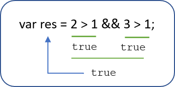
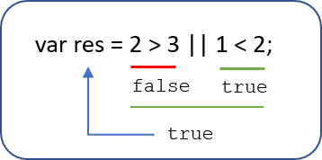
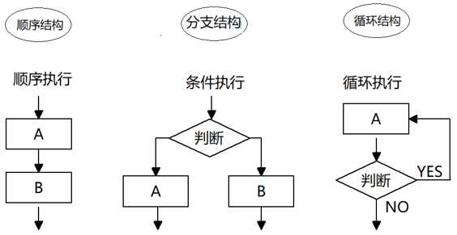
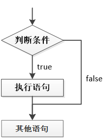
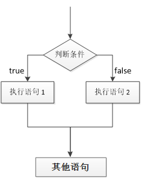
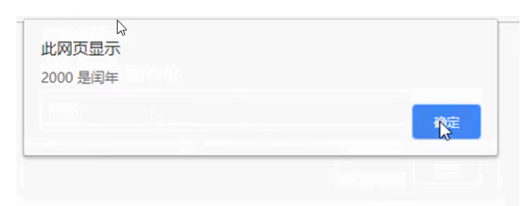
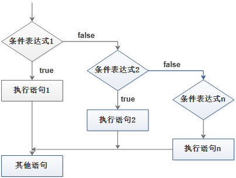

### Target

1. 能够说出逻辑运算符的运算规则
2. 能够使用一元运算符实现自身加1操作
3. 能说出前置自增 和 后置自增运算符的区别
4. 能够使用if语句实现求两个数最大值
5. 能够写出数字补0案例
6. 能够使用switch完成查询水果案例
7. 能够说出switch 和 if else if 的区别

## 1 - 运算符（操作符）

目标：

1. **<font color='red'>算数运算符</font>**
2. **<font color='red'>递增和递减运算符</font>**
3. **<font color='red'>比较运算符</font>**
4. **<font color='red'>逻辑运算符</font>**
5. 赋值运算符
6. 运算符的优先级

### 1.1 运算符的分类

**运算符**（operator）也被称为**操作符**，是用于实现赋值、比较和执行算数运算等功能的符号。

JavaScript中常用的运算符有：

- 算数运算符
- 递增和递减运算符
- 比较运算符
- 逻辑运算符
- 赋值运算符

### 1.2 算数运算符

- 算术运算符概述

  概念：算术运算使用的符号，用于执行两个变量或值的算术运算。

  

- 浮点数的精度问题

  浮点数值的最高精度是 17 位小数，但在进行算术计算时其精确度远远不如整数。

  ```js
  var result = 0.1 + 0.2;    // 结果不是 0.3，而是：0.30000000000000004
  console.log(0.07 * 100);   // 结果不是 7，  而是：7.000000000000001
  ```

  所以：不要直接判断两个浮点数是否相等 ! 

  **扩展：如何完美的解决浮点数呢？**

  **<font color='red'>加一个toFixed</font>**

  ```js
  // 方法1 将所有小数转化为整数相加，然后再缩小
  var result = (0.1 * 10 + 0.2 * 10) / 10
  
  // 方法2 使用toFixed() 方法
  // toFixed括号设置的数字是你要保留的几位小数
  var result = (0.1 + 0.2).toFixed(1)
  ```

  **CODE01 - 算数运算符**

  ```js
          console.log(1 + 1); // 2
          console.log(1 - 1); // 0
          console.log(1 * 1); // 1
          console.log(1 / 1); // 1
          // 1. % 取余 （取模）  
          console.log(4 % 2); // 0
          console.log(5 % 3); // 2
          console.log(3 % 5); // 3
          // 2. 浮点数 算数运算里面会有问题
          console.log(0.1 + 0.2); // 0.30000000000000004
          console.log(0.07 * 100); // 7.000000000000001
          // 3. 我们不能直接拿着浮点数来进行相比较 是否相等
          var num = 0.1 + 0.2;
          console.log(num == 0.3); // false
  ```

- 表达式和返回值

  表达式：是由数字、运算符、变量等以能求得数值的有意义排列方法所得的组合

  简单理解：是由数字、运算符、变量等组成的式子

  表达式最终都会有一个结果，返回给开发者，称为返回值

**CODE 02**

```js
        //  是由数字、运算符、变量等组成的式子 我们成为表达式   1 + 1 
        console.log(1 + 1); // 2 就是返回值
        // 1 + 1 = 2
        // 在我们程序里面  2 = 1 + 1   把我们的右边表达式计算完毕把返回值给左边
        var num = 1 + 1;
```

### 1.3 递增和递减运算符(🔥🔥🔥)

#### 1.3.1 递增和递减运算符概述

如果需要反复给数字变量添加或减去1，可以使用递增（++）和递减（ -- ）运算符来完成。


在 JavaScript 中，递增（++）和递减（ -- ）既可以放在变量前面，也可以放在变量后面。

++num; // num = num + 1

num++;// num = num + 1

<span style="color:red;">放在变量前面</span>时，我们可以称为<span style="color:red;">前置递增（递减）运算符</span>，

<span style="color:red;">放在变量后面</span>时，我们可以称为<span style="color:red;">后置递增（递减）运算符</span>。


<span style="color:red;">**注意**：递增和递减运算符必须和变量配合使用</span>

#### 1.3.2 递增运算符

- 前置递增（递减）运算符

  ++num 前置递增，就是自加1，类似于 num =  num + 1，但是 ++num 写起来更简单。

  **<font color='red'>使用口诀：先自加，后返回值</font>**

​       **CODE03**

```js
// 1. 想要一个变量自己加1   num = num + 1 比较麻烦
var num = 1;
num = num + 1; // ++num
num = num + 1;
console.log(num); // 3
// 2. 前置递增运算符  ++ 写在变量的前面
var age = 10;
++age; // 类似于 age = age + 1
console.log(age);
// 3. 先加1  后返回值
var p = 10;
console.log(++p + 10);
console.log(p) // 这是多少？
```

- 后置递增（递减）运算符

  num++ 后置递增，就是自加1，类似于 num =  num + 1 ，但是 num++ 写起来更简单。

  **<font color='red'>使用口诀：先返回原值，后自加</font>**

  **CODE04**

  ****

```js
var num = 10;
num++; // num = num + 1    ++num;
console.log(num);
// 1. 前置自增和后置自增如果单独使用 效果是一样的
// 2. 后置自增 口诀：先返回原值 后自加1 
var age = 10;
console.log(age++ + 10);
console.log(age);
```

**练习：CODE**

```js
var a = 10;
++a;
var b = ++a + 2;
console.log(b); // ？

var c = 10;
c++;
var d = c++ + 2;
console.log(d); // ？

var e = 10;
var f = e++ + ++e;
console.log(f); // ？
```

#### 1.3.3 **小结：**

- 前置递增和后置递增运算符可以简化代码的缩写，让变量值 `+1/-1`比以前的写法更简单
- 单独使用时，运算结果相同
- 与其他代码连用时，执行结果前后置会有差异
- **<font color='red'>后置：先原值参与运算，后自加</font>**（减）（先人后己）
- **<font color='red'>前置：先自加（减），后参与运算</font>**（先己后人）
- 开发时，更常用后置递增（减），并且独立使用，很少参与运算

### 1.4 比较运算符(🔥🔥)

**比较运算符概述**

概念：比较运算符（关系运算符）是<span style="color:red;">**两个数据进行比较时所使用的运算符**</span>，比较运算后，<span style="color:red;">**会返回一个布尔值（true / false）**</span>作为比较运算的结果。


- 等号比较

  

  **单等是赋值，二等是判断，三等是全等**

  **CODE06**

  ```JS
  console.log(3 >= 5); // false
  console.log(2 <= 4); // true
  //1. 程序里面的等于符号 是 ==  
  // 默认转换数据类型 会把字符串型的数据转换为数字型 只要求值相等就可以
  console.log(3 == 5); // false
  console.log('张三' == '李四'); // flase
  console.log(18 == 18); // true
  console.log(18 == '18'); // true
  // 不等于 !=
  console.log(18 != 18); // false
  // 2. 我们程序里面有全等 一模一样  要求 两侧的值 还有 数据类型完全一致才可以 true
  console.log(18 === 18);
  console.log(18 === '18'); // false
  console.log(18 !== '18'); // true
  ```

### 1.5 逻辑运算符(🔥🔥🔥)

- 逻辑运算符概述

概念：逻辑运算符是用来<span style="color:red;">进行布尔值运算</span>的运算符，其返回值也是<span style="color:red;">布尔值</span>。后面开发中经常用于<span style="color:red;">多个条件的判断</span>


#### 1.5.1 逻辑与&&

<span style="color:red;">**两边都是 true才返回 true**</span>，否则返回 false




#### 1.5.2 逻辑或 ||

<span style="color:red;">**两边都是 false才返回 false**</span>，只要任何一侧出现true， 就返回true




#### 1.5.3 逻辑非 ！

逻辑非（<span style="color:red">!</span>）也叫作<span style="color:red">取反符</span>，用来取一个布尔值相反的值，如 true 的相反值是 false

```js
var isOk = !true;
console.log(isOk);  // false
console.log(!!true) // true 双重否定 代表肯定
```


**CODE07 - 逻辑运算符**

```JS
        // 1. 逻辑与 &&  and 两侧都为true  结果才是 true  只要有一侧为false  结果就为false 
        console.log(3 > 5 && 3 > 2); // false
        console.log(3 < 5 && 3 > 2); // true
        // 2. 逻辑或 || or  两侧都为false  结果才是假 false  只要有一侧为true  结果就是true
        console.log(3 > 5 || 3 > 2); // true 
        console.log(3 > 5 || 3 < 2); // false
        // 3. 逻辑非  not  ！ 
        console.log(!true); // false
```

​	**CODE08 - 练习**

```js
var num = 7;
var str = "我爱你~中国~";

console.log(num > 5 && str.length >= num);

console.log(num < 5 && str.length >= num);

console.log(!(num < 10));

console.log(!(num < 10 || str.length == num));
```


#### 1.5.4 短路运算（逻辑中断）

短路运算：当有<span style="color:red;">**多个表达式（值）时,左边的表达式值可以确定整个表达式结果时**</span>,就不再继续运算右边的表达式的值;

##### 1.5.4.1 逻辑与的短路运算

语法： **表达式1 && 表达式2**

```
- 如果第一个表达式的值为真，则返回表达式2

- 如果第一个表达式的值为假，则返回表达式1
```

**CODE09**

```js
console.log( 123 && 456 );        // 456
console.log( 0 && 456 );          // 0
console.log( 123 && 456 && 789 );  // 789
 // 如果有空的或者否定的为假 (0  ''  null undefined  NaN)  其余是真的
```

总结：**只要碰到了假值(false)，就会短路，并返回该假值，**只要短路，不会继续执行后面的表达式


##### 1.5.4.2 逻辑或的短路运算

语法： 表达式1 || 表达式2

```
- 如果第一个表达式的值为真，则返回表达式1

- 如果第一个表达式的值为假，则返回表达式2
```

**CODE09**

```js
 console.log( 123 || 456 );         //  123
 console.log( 0 ||  456 );          //  456
 console.log( 123 || 456 || 789 );  //  123

// 逻辑中断后，后面的代码还执行吗？
var num = 0;
console.log(123 || num++);
console.log(num); // ?
```

总结：**逻辑或  (只要碰到了真值(true)，就会短路，并返回该真值**， 只要短路，不会继续执行后面的表达式

### 1.6 赋值运算符(🔥)

​	概念：用来把数据赋值给变量的运算符。


**CODE10**

```js
var age = 10;
age += 5;  // 相当于 age = age + 5;
age -= 5;  // 相当于 age = age - 5;
age *= 10; // 相当于 age = age * 10;
```

### 1.7 运算符优先级(🔥🔥)


- 一元运算符里面的<span style="color:red;">**逻辑非优先级很高**</span>

- <span style="color: red;">**逻辑与(&&)**</span>  比 <span style="color:red">**逻辑或(||)** </span> 优先级高

  **CODE11**

```js
// 1
console.log(4 >= 6 || '人' != '狗' && !(12 * 2 == 144) && true)

// 2
var num = 10
console.log(5 == num / 2 && (2 + 2 * num).toString() === '22')

// 3
var a = 3 > 5 && 2 < 7 && 3 == 4
console.log(a)

// 4
var b = 3 <= 4 || 3 > 1 || 3 != 2
console.log(b)

// 5
var c = 2 === "2"
console.log(c)

// 6
var d = !c || b && a
console.log(d)
```

## 2 - 流程控制

目标：

1. **<font color='red'>if分支语句</font>**
2. **<font color='red'>switch分支语句</font>**
3. **<font color='red'>三元表达式</font>**

### 2.1 流程控制概念

​		在一个程序执行的过程中，各条代码的执行顺序对程序的结果是有直接影响的。很多时候我们要通过控制代码的执行顺序来实现我们要完成的功能。

简单理解：<span style="color:red;">**流程控制就是来控制代码按照一定结构顺序来执行**</span>。

流程控制主要有三种结构，分别是<span style="color:red;">**顺序结构**、**分支结构**</span>和<span style="color:red">**循环结构**</span>，代表三种代码执行的顺序。



### 2.2 顺序流程控制

​	顺序结构是程序中最简单、最基本的流程控制，它没有特定的语法结构，程序会按照<span style="color:red">代码的先后顺序，依次执行</span>，程序中大多数的代码都是这样执行的。

​		**简单来说，正常写下来的代码都是按顺序执行的**

```js
alert('A');
alert('B');
// 依次顺序执行
```

### 2.3 分支流程控制(🔥🔥🔥)

#### 2.3.1 分支结构

由上到下执行代码的过程中，**根据不同的条件，执行不同的路径代码（执行代码多选一的过程），从而得到不同的结果。**


**JS 语言提供了两种分支结构语句：**

- **if 语句、**
- **switch 语句**

#### 2.3.2 if 语句

- 语法结构


```js
// 条件成立执行代码，否则什么也不做
if (条件表达式) {
    // 条件成立执行的代码语句
}
console.log(11)
```

**<font color='red'>执行思路：</font>**  **如果 if 里面的条件表达式结果为真 true 则执行大括号里面的 执行语句, 如果if 条件表达式结果为假 则不执行大括号里面的语句 则执行if 语句后面的代码**

语句可以理解为一个行为，循环语句和分支语句就是典型的语句。一个程序由很多个语句组成，一般情况下，会分割成一个一个的语句。

**执行流程**



##### 案例练习：进入网吧

**CODE13**

```js
// 需求： 弹出一个输入框，要求用户输入年龄，如果年龄大于等于 18 岁，允许进网吧。

// 弹出 prompt 输入框，用户输入年龄， 程序把这个值取过来保存到变量中
// 使用 if 语句来判断年龄，如果年龄大于18 就执行 if 大括号里面的输出语句
var age = prompt('请输入您的年龄:');
if (age >= 18) {
  alert('我想带你去网吧偷耳机');
}
```


#### 2.3.3 if else语句（双分支语句）

语法结构

```js
// 条件成立  执行 if 里面代码，否则执行else 里面的代码
if (条件表达式) {
    // [如果] 条件成立执行的代码
} else {
    // [否则] 执行的代码
}

// if里面的语句1 和 else 里面的语句2 最终只能有一个语句执行  2选1
// else 后面直接跟大括号
```

**<font color='red'>执行思路:</font>** **如果表达式结果为真 那么执行语句1  否则  执行语句2**

- 执行流程

  


**案例练习：判断闰年**




**CODE15**

```JS
// 1. 能被4整除且不能整除100的为闰年（如2004年就是闰年，1901年不是闰年）或者能够被 400 整除的就是闰年
// 2. 弹出prompt 输入框，让用户输入年份，把这个值取过来保存到变量中
// 3. 使用 if 语句来判断是否是闰年，如果是闰年，就执行 if 大括号里面的输出语句，否则就执行 else里面的输出语句
// 4. 一定要注意里面的且 &&  还有或者 || 的写法，同时注意判断整除的方法是取余为 0
var year = prompt('请您输入年份：');
if (year % 4 == 0 && year % 100 != 0 || year % 400 == 0) {
    alert('您输入的年份是闰年');
} else {
    alert('您输入的年份是平年');
}
```


#### 2.3.4 if else if 语句(多分支语句)

**利用多个条件来选择不同的语句执行 得到不同的结果  多选1 的过程**

- 语法结构

  ```js
  // 适合于检查多重条件。
  if (条件表达式1) {
      语句1；
  } else if (条件表达式2)  {
      语句2；
  } else if (条件表达式3)  {
     语句3；
   ....
  } else {
      // 上述条件都不成立执行此处代码
  }
  ```

  **<font color='red'>执行思路</font>**

  如果条件表达式1 满足就执行 语句1, 执行完毕后，退出整个if 分支语句  

  如果条件表达式1 不满足，则判断条件表达式2 , 满足的话，执行语句2 以此类推

  如果上面的所有条件表达式都不成立，则执行else 里面的语句

  **注意点**

  ​	(1) 多分支语句还是多选1 最后只能有一个语句执行

  ​	(2) else if 里面的条件理论上是可以任意多个的

  ​	(3) else if 中间有个空格了

- 执行逻辑

  


##### **案例练习：判断成绩级别**

```js
// 要求：接收用户输入的分数，根据分数输出对应的等级字母 A、B、C、D、E。
// 其中：
// 1. 90分(含)以上 ，输出：A
// 2. 80分(含)~ 90 分(不含)，输出：B
// 3. 70分(含)~ 80 分(不含)，输出：C
// 4. 60分(含)~ 70 分(不含)，输出：D
// 5. 60分(不含) 以下，输出： E

// 分析
// ① 按照从大到小判断的思路
// ② 弹出prompt输入框，让用户输入分数，把这个值取过来保存到变量中
// ③ 使用多分支 if else if 语句来分别判断输出不同的值
```

**CODE17**

```JS
// 按照从大到小判断的思路
// 弹出prompt输入框，让用户输入分数（score），把这个值取过来保存到变量中
// 使用多分支 if else if 语句来分别判断输出不同的值
var score = prompt('请您输入分数:');
if (score >= 90) {
    alert('宝贝，你是我的骄傲');
} else if (score >= 80) {
    alert('宝贝，你已经很出色了');
} else if (score >= 70) {
    alert('你要继续加油喽');
} else if (score >= 60) {
    alert('孩子，你很危险');
} else {
    alert('熊孩子，我不想和你说话，我只想用鞭子和你说话');
}
```


### 2.4 三元表达式(🔥🔥🔥)

三元表达式也能做一些简单的条件选择。 由<span style="color: red">**三元运算符**</span>组成的式子称为三元表达式

- 语法结构

  ```js
  条件表达式 ? 表达式1 : 表达式2;
  ```

- 执行思路

  - 如果条件表达式为 true ，则返回表达式1的值
  - 如果条件表达式为 false，则返回表达式2的值
  - 简单理解： 就类似于  if  else （双分支） 的简写

**CODE18**

```js
var num = 10;
var result = num > 5 ? '是的' : '不是的'; // 我们知道表达式是有返回值的
console.log(result);
// if (num > 5) {
//     result = '是的';
// } else {
//     result = '不是的';
// }
```

**案例练习：数字补0**

1. 用户输入0~59之间的一个数字

2. 如果数字小于10，则在这个数字前面补0,（加0 拼接） 否则  不做操作

3. 用一个变量接受这个返回值，输出

**CODE19**

```js
var time = prompt('请您输入一个 0 ~ 59 之间的一个数字');
// 三元表达式   表达式 ？ 表达式1 ：表达式2 
var result = time < 10 ? '0' + time : time; //   把返回值赋值给一个变量
alert(result);
```

### 2.5 switch分支流程控制

#### 2.5.1 语法结构

switch 语句也是多分支语句，它用于基于不同的条件来执行不同的代码。当要针对变量设置一系列的**<font color='red'>特定值</font>**的选项时，就可以使用 switch。

```js
switch( 表达式 ){ 
    case value1:
        // 表达式 等于 value1 时要执行的代码
        break;
    case value2:
        // 表达式 等于 value2 时要执行的代码
        break;
    default:
        // 表达式 不等于任何一个 value 时要执行的代码
}
```

**执行思路:**  

利用我们的表达式的值 和 case 后面的选项值相匹配 如果匹配上，就执行该case 里面的语句  如果都没有匹配上，那么执行 default里面的语句


- switch ：开关 转换  ， case ：  选项 小例子的意思

- 关键字 switch 后面括号内可以是**表达式或值**， 通常是一个变量

- 关键字 case , 后跟一个选项的表达式或值，后面跟一个冒号

- switch 表达式的值会与结构中的 case 的值做比较 

- 如果存在匹配全等(===) ，则与该 case 关联的代码块会被执行，并在遇到 break 时停止，整个 switch 语句代码执行结束

- 如果所有的 case 的值都和表达式的值不匹配，则执行 default 里的代码

  **注意：执行case 里面的语句时，如果没有break，则继续执行下一个case里面的语句。且无论是否满足下一个case的条件**

**CODE20**

```JS
let num = prompt('输入一个数字，可以是1,2,3,或者逆反一下')
switch (parseInt(num)) {
    case 1:
        console.log('这是1');
        break;
    case 2:
        console.log('这是2');
        break;
    case 3:
        console.log('这是3');
        break;
    default:
        console.log('没有匹配结果');
}
```

##### **案例练习：查询水果**

```js
// 用户在弹出框里面输入一个水果，如果有就弹出该水果的价格， 如果没有该水果就弹出“没有此水果”。

// 案例分析
// ① 弹出 prompt 输入框，让用户输入水果名称，把这个值取过来保存到变量中。
// ② 将这个变量作为 switch 括号里面的表达式。
// ③ case 后面的值写几个不同的水果名称，注意一定要加引号 ，因为必须是全等匹配。
// ④ 弹出不同价格即可。同样注意每个 case 之后加上 break ，以便退出 switch 语句。
// ⑤ 将 default 设置为没有此水果。
```


**CODE21**

```JS

var fruit = prompt('请您输入查询的水果:');
switch (fruit) {
    case '苹果':
        alert('苹果的价格是 3.5/斤');
        break;
    case '榴莲':
        alert('榴莲的价格是 35/斤');
        break;
    default:
        alert('没有此水果');
}
```


### 2.6 switch 语句和 if else if 语句的区别(🔥)

- 一般情况下，它们两个语句可以相互替换
- switch...case 语句通常处理 case为比较**确定值**的情况， if…else…语句常用于**范围判断**(大于、等于某个范围)
- switch 语句进行条件判断后直接执行到程序的条件语句，效率更高。而if…else 语句有几种条件，就得判断多少次。
- 当分支比较少时，if… else语句的执行效率比 switch语句高。
- 当分支比较多时，switch语句的执行效率比较高，而且结构更清晰。 

