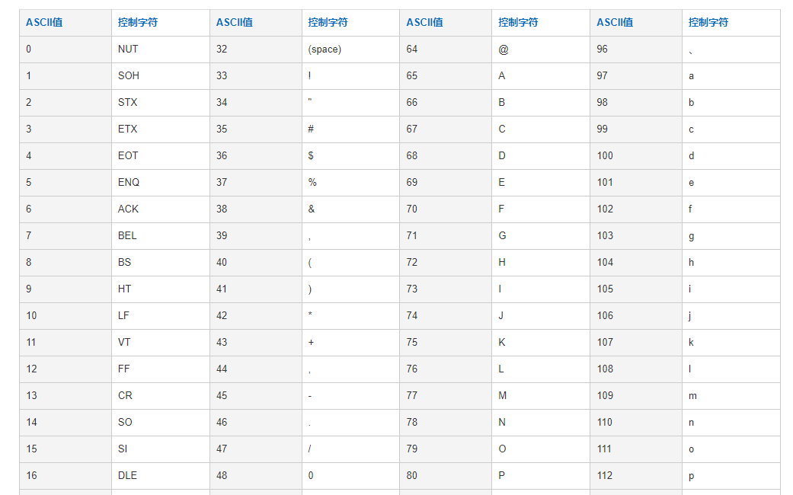
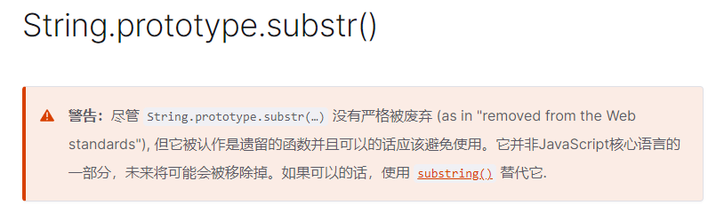
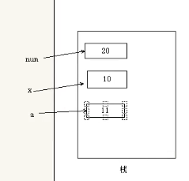

## 1 - 内置对象

目标：

1. 了解什么是内置对象
2. Math对象
3. 日期对象
4. 数组对象
5. 字符串对象

### 1.1 概念

> **内置对象**就是指 JS 语言自带的一些对象
>
> 提供了一些常用的或是**最基本而必要的功能**（属性和方法）
>
> 内置对象最大的优点就是帮助我们快速开发

-  JavaScript 中的对象分为3种：
   -  自定义对象，`var obj = {}`
   -  内置对象, `Math, Date`
   -  浏览器对象 `BOM`
-  前面两种对象是JS 基础 内容，属于 ECMAScript；  
-  第三个浏览器对象BOM Web API 讲解
-  
   JavaScript 提供了多个内置对象：Math、 Date 、Array、String等

### 1.2 查文档

- 查找文档：学习一个内置对象的使用，只要学会其常用成员的使用即可，我们可以通过查文档学习，可以通过MDN/W3C来查询。
- MDN:   https://developer.mozilla.org/zh-CN/
  - 查阅方法和功能
  - 查看参数的意义和类型
  - 查看返回值的意义和类型
  - 通过demo进行测试
  - **回过头去看看其他与之相似的语法举一反三**

> 1. 方法作用， 2 语法格式  3 传参   4 返回值。

- 之后再自己测试验证。

## 2 Math对象🔥🔥

### 2.1 介绍

>  Math 对象**不是构造函数**，它**具有数学常数和函数的属性和方法**。
>
> 不需要new 来调用
>
> **直接使用**里面的属性和方法

| 属性、方法名          | 功能                                         |
| --------------------- | -------------------------------------------- |
| Math.PI               | 圆周率                                       |
| Math.floor()          | 向下取整 （parseInt()）                      |
| Math.ceil()           | 向上取整                                     |
| Math.round()          | 四舍五入版 就近取整   注意 -3.5   结果是  -3 |
| Math.abs()            | 绝对值                                       |
| Math.max()/Math.min() | 求最大和最小值                               |
| Math.random()         | 获取范围在[0,1)内的随机值                    |

*注意：上面的方法有一些是使用时必须带括号的*

### 2.2 最大值最小值(max / min)🔥

案例：看看返回值是什么

**CODE01**

```JS
console.log(Math.PI); // 一个属性 圆周率  
// 方法
console.log(Math.max(-1, -10))
console.log(Math.max(1, 99, 3))
console.log(Math.max(1, 99, '张三'))
console.log(Math.max())
console.log(Math.min(1, 2))
console.log(Math.min())
```

**案例： 封装自己的数学对象** - 里面有PI， 最大值，最小值

**CODE02**

```js
var myMath = {
    PI: 3.141592653,
    max: function () {
        var max = arguments[0];
        for (var i = 1; i < arguments.length; i++) {
            if (arguments[i] > max) {
                max = arguments[i];
            }
        }
        return max;
    },
    min: function () {
        var min = arguments[0];
        for (var i = 1; i < arguments.length; i++) {
            if (arguments[i] < min) {
                min = arguments[i];
            }
        }
        return min;
    }
}

console.log(myMath.PI);
console.log(myMath.max(1, 5, 9));
console.log(myMath.min(1, 5, 9));
```

### 2.3 绝对值/取整(abs / floor / ceil / round)🔥

**CODE03**

```JS
// 1.绝对值方法
console.log(Math.abs(1));
console.log(Math.abs(-1));
console.log(Math.abs('-1'));
console.log(Math.abs('张三'));

// 2.三个取整方法
// (1) Math.floor()   地板 向下取整  往最小了取值
console.log(Math.floor(1.1));
console.log(Math.floor(1.9));

// (2) Math.ceil()   ceil 天花板 向上取整  往最大了取值
console.log(Math.ceil(1.1));
console.log(Math.ceil(1.9));

// (3) Math.round()   四舍五入  其他数字都是四舍五入 
console.log(Math.round(1.1));
console.log(Math.round(1.5));
console.log(Math.round(1.9));
console.log(Math.round(-1.1));
console.log(Math.round(-1.5));
```

### 2.4 随机数(random)🔥🔥🔥

> Math对象随机数方法   random() 返回一个随机的小数  0 =< x < 1    [0,1)

语法：

```js
Math.random();//这个方法里面不跟参数
```

> 思考： 随机数的作用

**CODE04**

```js
// 能否做一个点名系统，60位同学随机点名  获取索引 0 - 59
var random = Math.random()
// 1. 将随机区间变成0~60
var random0_60 = random * 60
// 2. 向下取整 / 向上取整
var random0_60_ceil = Math.floor(random0_60)
console.log(random0_60_ceil)
// ==>
```

**CODE04**

```js
// 1. 从1开始到任意值  
parseInt(Math.random()*上限 + 1)
//     1 到 20
parseInt(Math.random()*20+1);
//     1 到 30
parseInt(Math.random()*30+1);
// 2. 得到一个两数之间的随机整数，包括两个数在内
parseInt(Math.random()*(上限-下限+1)+下限);  // parseInt可以和Math.floor替换
//    5 到 10
parseInt(Math.random()*6+5);
//     10 到 20
parseInt(Math.random()*11+10);
```


**衍生扩展：得到一个两数之间的随机整数**

> 这是个固定写法，大家不需要记忆，知道怎么用即可。

**CODE05**

```js
function getRandom (min, max) {
  return Math.floor(Math.random() * (max - min + 1)) + min; //含最大值，含最小值 
}
  // 传入1，,10，过程如下：
  // Math.floor( 0 =< x < 1 * (max - min + 1) ) + min;
  // Math.floor( 0 =< x < 1 * 10 ) + min;
  // Math.floor( 0 =< x < 10  ) + min; // 这个是带小数的范围
  // 0 =< x <= 9  + 1; // 取过floor之后就是整数
  // 1 =< x <= 10  // [1,10]
```

**案例： 猜数字游戏**

> 1.随机生成一个1~10 的整数  我们需要用到 Math.random() 方法。
> 2.需要一直猜到正确为止，所以需要**一直循环**。
> 3.while 循环更简单
> 4.核心算法：使用 if  else if 多分支语句来判断大于、小于、等于。

**CODE06**

```JS
function getRandom(min, max) {
    return Math.floor(Math.random() * (max - min + 1)) + min;
}
var random = getRandom(1, 10);
while (true) { // 死循环
    var num = prompt('你来猜？ 输入1~10之间的一个数字');
    if (num > random) {
        alert('你猜大了');
    } else if (num < random) {
        alert('你猜小了');
    } else {
        alert('你好帅哦，猜对了');
        break; // 退出整个循环结束程序
    }
}
// 声明一个count次数 count-- while内部判断 < 0
```

**课后作业: 要求用户猜 1~50之间的一个数字 但是只有 10次猜的机会**

## 3 日期对象🔥

### 3.1 日期对象介绍

1. Date 对象和 Math 对象不一样，**Date是一个构造函数**(创建一个新`Date`对象的方法是通过[`new`](https://developer.mozilla.org/zh-CN/docs/Web/JavaScript/Reference/Operators/new) 操作符)
2. 所以使用时需要实例化后才能使用其中具体方法和属性
3. Date 实例用来处理日期和时间

### 3.2 使用Date实例化日期对象

- 获取当前时间必须实例化：

```js
var now = new Date(); // 当前时间对应的日期对象
```

- 获取指定时间的日期对象

```js
var time = new Date('2019/5/1'); // 指定时间对应的日期对象
```

**注意**：如果创建实例时并未传入参数，则得到的日期对象是当前时间对应的日期对象

> 思考： 不写new直接用Date方法可以吗？
>
>  
>
> 答： 若将它作为常规函数调用（即不加 [`new`](https://developer.mozilla.org/zh-CN/docs/Web/JavaScript/Reference/Operators/new) 操作符），将返回一个字符串，而非 `Date` 对象。 

**代码示例：**

**CODE07**

```js
// Date() 日期对象  是一个构造函数 必须使用new 来调用创建我们的日期对象
var arr = new Array(); // 创建一个数组对象
var obj = new Object(); // 创建了一个对象实例
// 1. 使用Date  如果没有参数 返回当前系统的当前时间
var date = new Date();
console.log(date);
// 2. 参数常用的写法  数字型  2019, 10, 01  或者是 字符串型 '2019-10-1 8:8:8'
var date1 = new Date(2019, 10, 1);
console.log(date1); // 返回的是 11月 不是 10月 
var date2 = new Date('2019-10-1 8:8:8');
console.log(date2);

// 不使用new来调用Date()
console.log(Date()); 
```

*注意：如`new Date(2019, 10, 1)`这种数值型的月份产生，是0~11 *

### 3.3 日期对象的方法和属性

Date实例的方法和属性	，如下图：


**注意**：这里有几个特殊的方法

- getFullYear，为啥不是getYear，因为getYear获取的是两位年份比如2019年获取的是19，或者是距离1970的年份差。getFullYear获取的是四位年份，比较常用
- getDay，获取的是周几，而不是那几天

### 3.4 格式化日期

- 日期默认格式是外国人习惯的格式，我们需要给他格式化为中国特有的格式

- 获取日期指定部分，然后按照要求格式，进行拼接即可

- 代码--格式年月日：

  **CODE08**

  ```js
  // 格式化日期 年月日 
  var date = new Date();
  console.log(date.getFullYear()); // 返回当前日期的年  2019
  console.log(date.getMonth() + 1); // 月份 返回的月份小1个月   记得月份+1 呦
  console.log(date.getDate()); // 返回的是 几号
  console.log(date.getDay()); // 3  周一返回的是 1 周六返回的是 6 但是 周日返回的是 0
  
  // 写一个 2022年 5月 1日 星期日
  var year = date.getFullYear();
  var month = date.getMonth() + 1;
  var dates = date.getDate();
  var arr = ['星期日', '星期一', '星期二', '星期三', '星期四', '星期五', '星期六'];
  var day = date.getDay();
  console.log('今天是：' + year + '年' + month + '月' + dates + '日 ' + arr[day]);
  ```

- 代码--格式化时分秒

  **CODE09**

  ```js
  // 格式化日期 时分秒
  var date = new Date();
  console.log(date.getHours()); // 时
  console.log(date.getMinutes()); // 分
  console.log(date.getSeconds()); // 秒
  
  
  // 要求封装一个函数返回当前的时分秒 格式 08:08:08
  function getTimer() {
      var time = new Date();
      var h = time.getHours();
      var m = time.getMinutes();
      var s = time.getSeconds();
  
      h = h < 10 ? '0' + h : h;
      m = m < 10 ? '0' + m : m;
      s = s < 10 ? '0' + s : s;
  
      return h + ':' + m + ':' + s;
  }
  console.log(getTimer());
  ```

### 3.5 时间戳（通过Date实例获取总毫秒数）

> 建议使用方法： new Date().valueof()

- 总毫秒数的含义

  - 基于1970年1月1日（世界标准时间）起的毫秒数（不是从公元0年开始数的毫秒数）

  - 总的毫秒数，又叫做时间戳， **不是当前时间的毫秒数 而是距离1970年1月1号过了多少毫秒数** 

- 获取总毫秒数

  **CODE10**

  ```js
  // 实例化Date对象
  var date = new Date();
  // 1. 用于获取对象的原始值
  console.log(date.valueOf())	// 标准写法
  console.log(date.getTime())	
  // 2. 通过 +new Date()
  var date = +new Date();			
  // 3. Other 
  var date = Date.now();
  ```

**注意：**

- **时间戳**，戳代表唯一，因为这个总的毫秒数是唯一的
- 戳就可以理解为公章，一个公司的公章只会有一个，是唯一的。

### 3.6 案例 - 倒计时


```js
1.核心算法：输入的时间减去现在的时间就是剩余的时间，即倒计时 ，但是不能拿着时分秒相减，比如 05 分减去25分，结果会是负数的。
2.用时间戳来做。用户输入时间总的毫秒数减去现在时间的总的毫秒数，得到的就是剩余时间的毫秒数。
3.把剩余时间总的毫秒数转换为天、时、分、秒 （时间戳转换为时分秒）
转换公式如下：
days = parseInt(总秒数/ 60/60 /24);         //  计算天数
hours = parseInt(总秒数/ 60/60 %24)      //   计算小时
minutes = parseInt(总秒数 /60 %60 );     //   计算分数
seconds = parseInt(总秒数%60);              //   计算当前秒数
```

**CODE11**

```JS
function countDown(time) {
    var nowTime = new Date().valueof(); // 返回的是当前时间总的毫秒数
    var inputTime = new Date(time).getTime(); // 返回的是用户输入时间总的毫秒数
    var times = (inputTime - nowTime) / 1000; // times是剩余时间总的秒数 
    /* ---------------------------------------------------------------- */
    var d = parseInt(times / 60 / 60 / 24); // 天
    var h = parseInt(times / 60 / 60 % 24); //时
    var m = parseInt(times / 60 % 60); // 分
    var s = parseInt(times % 60); // 当前的秒

    d = d < 10 ? '0' + d : d;
    h = h < 10 ? '0' + h : h;
    m = m < 10 ? '0' + m : m; 
    s = s < 10 ? '0' + s : s;
    return d + '天' + h + '时' + m + '分' + s + '秒';
}

console.log(countDown('2019-5-1 18:00:00'));
var date = new Date();
console.log(date);
```

**注意**：秒数转换为天，时分秒的公示不需要记忆。

## 4 数组对象

### 4.1 创建数组的两种方式

- 字面量方式 ：

  - 示例代码如下

    ```js
    var arr = [1,"test",true];
    ```

- new Array() 方式 ：（少用构造数组的方式创建数组！）

  - 示例代码如下

    ```
    var arr = new Array();
    ```

  *注意：上面代码中arr创建出的是一个空数组，如果需要使用构造函数Array创建非空数组，可以在创建数组时传入参数*

  **参数传递规则如下：**

  - 如果只传入一个参数，则参数规定了数组的长度
  - 如果传入了多个参数，则参数称为数组的元素

  **CODE12**

  ```js
  // 利用new Array()
  var arr1 = new Array();  // 创建了一个空的数组
  var arr2 = new Array(2);  // 这个2 表示 数组的长度为 2  里面有2个空的数组元素 
  var arr3 = new Array(2, 3); // 等价于 [2,3]  这样写表示 里面有2个数组元素 是 2和3
  console.log(arr1, arr2, arr3);
  ```

### 4.2 检测是否为数组🔥🔥🔥

#### 4.2.1 instanceof 运算符

> instanceof 可以判断一个对象是否是某个构造函数的实例

**语法：**

```js
A instanceof B : 判断A是否是B的一个实例（对象）
```

**例子：**

**CODE13**

```JS
var arr = [1, 23];
var obj = {};
console.log(arr instanceof Array); // true，arr是不是Array的实例？是的
console.log(obj instanceof Array); // false，obj是不是Array的实例？不是
```

#### 4.2.2 Array.isArray()

> Array.isArray()用于判断一个对象是否为数组

```js
var arr = [1, 23];
var obj = {};
console.log(Array.isArray(arr));   // true
console.log(Array.isArray(obj));   // false
```

#### 4.2.3 instanceof 与 typeof区别

- typeof用于检查数据是否为简单数据类型和object (**没有办法检测object的具体分类)**
- instanceof用于某个对象是否为某个类的实例（某个构造函数创建出来的）  ， **用于检测具体是哪一类对象 ：Object，Array**

**CODE14**

```js
//比如现在有如下构造函数，如下对应的对象：
function Hero(name, blood, attack) { // 构造函数的参数，就是对象的属性
    this.name = name
    this.blood = blood
    this.attack = attack
    this.attackType = function(att) {
        alert('攻击方式：' + att)
    };
}
var raye = new Hero('零依', '1500', '1500')

//判断如下：
raye instanceof Hero    true
raye instanceof Array     false

typeof raye  ---- object //只能知道raye是对象，但是不知道是Hero类对象

//但是：要与Object进行对比，都为true，万物即为对象
console.log(arr instanceof Object);  // true :  Array也是Object，是其中的一种分类，Array属于Object
console.log(obj instanceof Object);// true 
console.log(zs instanceof Object);// true 
```

#### 4.2.4 检查数据类型终极版本 🔥🔥🔥

```js
// data 就是我们需要检查数据类型的数据
Object.prototype.toString.call(data)

var arr = [1,2,3]
var obj = {}
var fn = function(){}
var str = '123'
var num = 123
var bool = true
var a = undefined
var b = null 
console.log(Object.prototype.toString.call(arr))  // [object Array]
console.log(Object.prototype.toString.call(obj))  // [object Object]
console.log(Object.prototype.toString.call(fn))   // [object Function]
console.log(Object.prototype.toString.call(str))  // [object String]
console.log(Object.prototype.toString.call(num)) // [object Number]
console.log(Object.prototype.toString.call(bool)) // [object Boolean]
console.log(Object.prototype.toString.call(a)) // [object Undefined]
console.log(Object.prototype.toString.call(b)) // [object Null]
```

#### 总结：

- typeof  用来检测数据是哪种数据类型：简单：number , string , boolean , undefined , null, symbol, bigint   复杂：object, array
- 比如：typeof  raye ---- object , typeof只能检测出来 raye 是一个对象 object，但是不能检测他的具体类型
- instanceof 用来检测复杂数据object的具体类型(具体分类下的对象)：  
- 比如： raye 是否为Hero的一个实例 ： raye instanceof Hero---- true

### 4.3 添加删除数组元素的方法🔥🔥🔥

数组中有进行增加、删除元素的方法，部分方法如下表


注意：push、unshift为增加元素方法；pop、shift为删除元素的方法

- 理解

  

#### 4.3.1 push - 末尾添加

> push() 在数组的末尾 添加一个或者多个数组元素

**CODE15**

```js
var arr = [1, 2, 3];
arr.push(4, 5);
console.log(arr);
console.log(arr.push(6, 7))
console.log(arr)
```

**特点:**

1. push 是可以给数组末尾追加新的元素
2. push完毕之后，返回的结果是 **新数组的长度**
3. push之后原数组也会发生变化

#### 4.3.2 pop - 末尾删除

> 删除数组的最后一个元素 

**CODE15**

```js
var arr = [1, 2, 3, 4, 5, 6];
arr.pop()
console.log(arr)
console.log(arr.pop())
console.log(arr)
```

**特点:**

1. pop是可以删除数组的最后一个元素 记住一次只能删除一个元素
2. pop() 没有参数
3. pop完毕之后，返回的结果是 **删除的那个元素**
4. pop之后原数组也会发生变化

#### 4.3.3 unshift - 头部添加

> 给数组前面追加新的元素

**CODE15**

```js
var arr = [1, 2, 3];
arr.unshift(4, 5);
console.log(arr);
console.log(arr.unshift(6, 7))
console.log(arr)
```

**特点:**

1. unshift 是可以给数组末尾追加新的元素
2. unshift 完毕之后，返回的结果是 **新数组的长度**
3. unshift 之后原数组也会发生变化

#### 4.3.4 shift - 头部删除

> 删除数组的最后一个元素 

**CODE15**

```js
var arr = [1, 2, 3, 4, 5, 6];
arr.shift ()
console.log(arr)
console.log(arr.shift())
console.log(arr)
```

**特点:**

1. shift 是可以删除数组的最后一个元素 记住一次只能删除一个元素
2. shift() 没有参数
3. shift 完毕之后，返回的结果是 **删除的那个元素**
4. shift 之后原数组也会发生变化

**案例 - 筛选数组**

> 有一个包含工资的数组[1500, 1200, 2000, 2100, 1800]，要求把数组中工资超过2000的删除，剩余的放到新数组里面

**CODE16**

```js
var arr = [1500, 1200, 2000, 2100, 1800];
var newArr = [];
for (var i = 0; i < arr.length; i++) {
    if (arr[i] < 2000) {
        // newArr[newArr.length] = arr[i];
        newArr.push(arr[i]);
    }
}
console.log(newArr);
// 这么做原数组超过2000的真的删除掉了吗？？？
```

### 4.4 数组排序🔥

数组中有对数组本身排序的方法，部分方法如下表


**注意：sort方法需要传入参数来设置升序、降序排序 (sort排序用减号，a前b后是升序，a后b前是降序)** 

- 如果传入“function(a,b){ return a-b;}”，则为升序
- 如果传入“function(a,b){ return b-a;}”，则为降序

**CODE17**

```js
// 数组排序
// 1. 翻转数组
var arr = ['pink', 'red', 'blue'];
arr.reverse();
console.log(arr);

// 2. 数组排序（冒泡排序）
var arr1 = [13, 4, 77, 1, 7];
arr1.sort(function(a, b) {
    //  return a - b; 升序的顺序排列
    return b - a; // 降序的顺序排列
});
```

**CODE16**

```JS
var arr = [1500, 1200, 2000, 2100, 1800];
arr.sort();
var newArr = [];
for (var i = arr.length - 1; i > 0; i--) {
    if (arr[i] < 2000) {
        // newArr[newArr.length] = arr[i];
        newArr.push(arr.pop());
    }
}
console.log(arr);
console.log(newArr);
```


### 4.5 数组索引方法 🔥

- 数组中有获取数组指定元素索引值的方法，部分方法如下表


```js
// var arr = ['red', 'green', 'blue', 'pink', 'blue'];
var arr = ['red', 'green', 'pink'];
console.log(arr.indexOf('blue'));
console.log(arr.indexOf('yellow'));

// 返回数组元素索引号方法  lastIndexOf(数组元素)  作用就是返回该数组元素的索引号 从后面开始查找
var arr = ['red', 'green', 'blue', 'pink', 'blue'];
console.log(arr.lastIndexOf('blue')); // 4
```

**案例： 数组去重**

> 目标: 把旧数组里不重复的元素选取出来放到新数组中, 重复的元素只保留一个到新数组中
>
> arr = [1, 3, 5, 7, 9, 3, 1, 2, 5, 4, 7,  8, 9, 4]

**CODE18**

```js
var arr = [1, 3, 5, 7, 9, 3, 1, 2, 5, 4, 7,  8, 9, 4]
var newArr = []
for (var i = 0; i < arr.length; i++) {
    if (newArr.indexOf(arr[i]) === -1) {
        newArr.push(arr[i])
    }
}
console.log(newArr)
```

### 4.6 数组转换为字符串🔥


**CODE19**

```js
// 数组转换为字符串 
// 1. toString() 将我们的数组转换为字符串
var arr = [1, 2, 3];
console.log(arr.toString()); // 1,2,3

// 2. join(分隔符) 
var arr1 = ['green', 'blue', 'pink'];
console.log(arr1.join()); // green,blue,pink （如果不指定分隔符，那么与toString一致，以逗号分隔）
console.log(arr1.join('-')); // green-blue-pink
console.log(arr1.join('&')); // green&blue&pink
```

注意：join方法如果不传入参数，则按照 “ , ”拼接元素

### 4.7 扩展方法


#### 4.7.1 concat() 合并多个数组🔥

>  `concat()` 方法用于合并两个或多个数组。此方法不会更改现有数组，而是返回一个新数组。

**语法：**

```js
var new_array = old_array.concat(value1[, value2[, ...[, valueN]]])
```

**参数：**

`value`：数组和/或值，将被合并到一个新的数组中。如果省略了所有 `valueN` 参数，则 `concat` 会返回调用此方法的现存数组的一个**浅拷贝**。

```js
var alpha = ['a', 'b', 'c'];
var numeric = [1, 2, 3];

alpha.concat(numeric);
// result in ['a', 'b', 'c', 1, 2, 3]
```

#### 4.7.2 slice() 截取数组🔥

>  `slice()` 方法返回一个新的数组对象，这一对象是一个由 `begin` 和 `end` 决定的原数组的**浅拷贝**（包括 `begin`，不包括`end`）。原始数组不会被改变。

**语法：**

```js
arr.slice([begin[, end]])
```

**参数：**

- `begin` 可选

  提取起始处的索引（从 `0` 开始），从该索引开始提取原数组元素。

  如果该参数为负数，则表示从原数组中的倒数第几个元素开始提取，`slice(-2)` 表示提取原数组中的倒数第二个元素到最后一个元素（包含最后一个元素）。

  如果省略 `begin`，则 `slice` 从索引 `0` 开始。如果 `begin` 超出原数组的索引范围，则会返回空数组。

- `end` 可选

  提取终止处的索引（从 `0` 开始），在该索引处结束提取原数组元素。`slice` 会提取原数组中索引从 `begin` 到 `end` 的所有元素（包含 `begin`，但不包含 `end`）。`slice(1,4)` 会提取原数组中从第二个元素开始一直到第四个元素的所有元素 （索引为 1, 2, 3的元素）。

  如果该参数为负数， 则它表示在原数组中的倒数第几个元素结束抽取。 `slice(-2,-1)` 表示抽取了原数组中的倒数第二个元素到最后一个元素（不包含最后一个元素，也就是只有倒数第二个元素）。

  如果 `end` 被省略，则 `slice` 会一直提取到原数组末尾。如果 `end` 大于数组的长度，`slice` 也会一直提取到原数组末尾。

```js
var fruits = ['Banana', 'Orange', 'Lemon', 'Apple', 'Mango'];
var citrus = fruits.slice(1, 3);
var citrus2 = fruits.slice(-1);
var citrus3 = fruits.slice(-1, -3);
var citrus4 = fruits.slice(-3, -1);
// fruits contains ['Banana', 'Orange', 'Lemon', 'Apple', 'Mango']
// citrus contains ['Orange','Lemon']
// citrus2 contains ['Mango']
// citrus3 contains []
// citrus4 contains ['Lemon', 'Apple']
```

#### 4.7.3 splice() 修改数组🔥🔥

> **`splice()`** 方法通过删除或替换现有元素或者原地添加新的元素来修改数组,并以数组形式返回被修改的内容。此方法会改变原数组。

**语法：**

```js
array.splice(start[, deleteCount[, item1[, item2[, ...]]]])
```

**参数：**

- `start`

  指定修改的开始位置（从0计数）。如果超出了数组的长度，则从数组末尾开始添加内容；

  如果是负值，则表示从数组末位开始的第几位（从-1计数，这意味着-n是倒数第n个元素并且等价于`array.length-n`）；

  如果负数的绝对值大于数组的长度，则表示开始位置为第0位。

- `deleteCount` 可选

  整数，表示要移除的数组元素的个数。如果 `deleteCount` 大于 `start` 之后的元素的总数，则从 `start` 后面的元素都将被删除（含第 `start` 位）。

  如果 `deleteCount` 被省略了，或者它的值大于等于`array.length - start`(也就是说，如果它大于或者等于`start`之后的所有元素的数量)，那么`start`之后数组的所有元素都会被删除。

  如果 `deleteCount` 是 0 或者负数，则不移除元素。这种情况下，至少应添加一个新元素。

- `item1, item2, *...*` 可选

  要添加进数组的元素,从`start` 位置开始。如果不指定，则 `splice()` 将只删除数组元素。

**返回值：**

​		由被删除的元素组成的一个数组。如果只删除了一个元素，则返回只包含一个元素的数组。如果没有删除元素，则返回空数组。

```js
var myFish = ["angel", "clown", "mandarin", "sturgeon"];
var removed = myFish.splice(2, 1, "drum");

// myFish contains ['angel', 'clown', 'drum', 'sturgeon']
// removed contains ['mandarin']
```

## 5 字符串对象

### 5.1 基本包装类型

- 为了方便操作基本数据类型，JavaScript 还提供了三个特殊的引用类型：String、Number和 Boolean。

- 每当读取一个基本类型值的时候，后台就会创建一个对应的基本的包装类型对象，可以使我们调用一些方法操作这些数据。

- **基本包装类型就是把简单数据类型包装为复杂数据类型**，这样**基本数据类型就有了属性和方法**。

- 我们来看一个问题：

  ```js
  // 下面代码有什么问题？
  var str = 'andy';
  console.log(str.length);
  ```

- 按道理基本数据类型是没有属性和方法的，而对象才有属性和方法，但上面代码却可以执行，这是因为js 会把**基本数据类型**包装为**引用数据类型**，其执行过程如下 ：

  ```js
  // 1. 生成临时变量，把简单类型包装为复杂数据类型
  var temp = new String('andy');
  // 2. 赋值给我们声明的字符变量
  str = temp;
  // 3. 销毁临时变量
  temp = null;
  ```
  
  对于基本包装类型来说，只有处于“读取模式”的时候，后台才会自动创建相对应的对象，调用指定的方法之后，就立即销毁该对象了，这就意味着我们不能在运行的时为基本类型值添加属性和方法。
  
  https://blog.csdn.net/weixin_42619772/article/details/122510569

### 5.2 字符串的不可变 （了解）

> 字符串的不可变指的是**里面的值不可变**，虽然看上去可以改变内容，但其实是地址变了，内存中新开辟了一个内存空间。

原因： **当重新给字符串变量赋值的时候，变量之前保存的字符串不会被修改，依然在内存中，重新给字符串赋值，会重新在内存中开辟空间，这个特点就是字符串的不可变**。

- 由于字符串的不可变，在**大量拼接字符串**的时候会有效率问题

- 例子：

  ```js
  var str = 'abc';
  str = 'hello';
  // 当重新给 str 赋值的时候，常量'abc'不会被修改，依然在内存中
  // 重新给字符串赋值，会重新在内存中开辟空间，这个特点就是字符串的不可变
  // 由于字符串的不可变，在大量拼接字符串的时候会有效率问题
  var str = '';
  for (var i = 0; i < 100000; i++) {
      str += i;
  }
  console.log(str); // 这个结果需要花费大量时间来显示，因为需要不断的开辟新的空间
  
  // 那向这种情况怎么结果呢？ -> 通过数学算法来减少计算机计算量
  ```

- 总结：

  - **由于字符串的不可变，导致字符串所有的方法，都不会修改字符串本身，操作完成会返回一个新的字符串**
  - 字符串不可变，指的是字符串本身在内存中不会改变
  - 字符串变量存储的值可以改变

### 5.3 根据字符返回位置 - indexOf()

> 与数组的indexOf()使用方法一致


**CODE20**

```js
// 字符串对象  根据字符返回位置  str.indexOf('要查找的字符', [起始的位置])
var str = '改革春风吹满地，春天来了';
console.log(str.indexOf('春'));
console.log(str.indexOf('春', 3)); // 从索引号是 3的位置开始往后查找
```

**案例：查找字符串"abcoefoxyozzopp"中所有o出现的位置以及次数**

> 1. 先查找第一个o出现的位置
> 2. 然后 只要indexOf 返回的结果不是 -1 就继续往后查找
> 3. 因为indexOf 只能查找到第一个，所以后面的查找，利用第二个参数，当前索引加1，从而继续查找

**CODE21**

```js
  var str = "abcoefoxyozzopp";
  var index = str.indexOf('o');
  var num = 0;
  // console.log(index);
  while (index !== -1) {
      console.log(index);
      num++;
      index = str.indexOf('o', index + 1);
  }

  console.log('o出现的次数是: ' + num);
```

**课后作业 ['red', 'blue', 'red', 'green', 'pink','red'], 求 red 出现的位置和次数**

### 5.4 根据位置返回字符

> str[index] 获取指定位置处字符 **最为常用**


**[ASCII码表][https://www.habaijian.com/]**



**CODE22**

```js
// 根据位置返回字符
// 1. charAt(index) 根据位置返回字符
var str = 'andy';
console.log(str.charAt(3));
// 遍历所有的字符
for (var i = 0; i < str.length; i++) {
    console.log(str.charAt(i));
}
// 2. charCodeAt(index)  返回相应索引号的字符ASCII值 目的： 判断用户按下了那个键 
console.log(str.charCodeAt(0)); // 97

// 3. str[index] H5 新增的
console.log(str[0]); // a
```

**案例：判断一个字符串 'abcoefoxyozzopp' 中出现次数最多的字符，并统计其次数**

> 核心算法：利用 charAt(） 遍历这个字符串
> 把每个字符都存储给对象， 如果对象没有该属性，就为1，如果存在了就 +1
> 遍历对象，得到最大值和该字符

```js
var str = 'abcoefoxyozzopp';

// 1. 制作字符字典
var o = {}; // {'a':1,'b':1,'c':1,'o':4,'e:'1,'f':1}
for (var i = 0; i < str.length; i++) {
    var chars = str.charAt(i); // chars 是 字符串的每一个字符 : a,b,c,o.....o
    // 判断chars中的字符，是否在o对象中
    // o[chars] 得到的是属性值 ： 
    // 循环第一次：if(o['a']) --- 取出o对象中属性名叫做a的属性值 ， 没有默认值为undefined
    //      if(undefined) : if小括号内有隐式转换---- false
    // 如果循环到第二个o，o['o'] --- 1  --- true ，o中有o属性，有的话值就++
    if (o[chars]) {
        o[chars]++; // o['o']=o['o']+1
    } else { // 代表当前o对象中没有chars存储的字符的属性  ， o没有a属性
        o[chars] = 1; // 没有就添加一个a属性，并且给a添加值为1.----- o['a'] = 1
    }
}
console.log(o);

// 2. 遍历字典
var max = 0;
var ch = '';
for (var k in o) { // k='a' , k='o'
    // k 得到是 属性名
    // o[k] 得到的是属性值
    if (o[k] > max) { //  o['a'] > max  -- 1 > 0   ,  o['o']  > max  , 4 > 1
        max = o[k]; // max = 1  , max = 4
        ch = k; //     ch = 'a' , ch = 'o'
    }
}
console.log(max);
console.log('最多的字符是' + ch);
```


### 5.5 字符串操作方法

> 字符串通过基本包装类型可以调用部分方法来操作字符串，以下是部分操作方法：


#### 5.5.1 substr(start, length) 截取字符串 （废弃）

> `substr()` 方法返回一个字符串中从指定位置开始到指定字符数的字符。



**语法：**

```js
str.substr(start[, length])
```

**参数：**

`start`

开始提取字符的位置。如果为负值，则被看作 `strLength + ``start，其中` `strLength` 为字符串的长度（例如，如果 `start` 为 `-3，则被看作` `strLength + (-3)）。`

`length`

可选。提取的字符数。

```js
var str1 = '1234567';
console.log(str1.substr(2, 2)); // 34 第一个2 是索引号的2 从第几个开始  第二个2 是取几个字符
```

#### 5.5.2 substring(start, end) 截取字符串🔥

> **`substring() `**方法返回一个字符串在开始索引到结束索引之间的一个子集, 或从开始索引直到字符串的末尾的一个子集。

**语法：**

```js
str.substring(indexStart[, indexEnd])
```

**参数：**

- `indexStart`

  需要截取的第一个字符的索引，该索引位置的字符作为返回的字符串的首字母。

- `indexEnd`

  可选。一个 0 到字符串长度之间的整数，以该数字为索引的字符不包含在截取的字符串内。

**返回值：**

包含给定字符串的指定部分的新字符串。

**CODE23**

```js
var anyString = "Mozilla";

// 输出 "Moz"
console.log(anyString.substring(0,3));
console.log(anyString.substring(2,99));
console.log(anyString.substring('qw',2));
console.log(anyString.substring(3,0));
console.log(anyString.substring(3,3));
```

**特点：**

- 如果任一参数大于 `stringName.length`，则被当作 `stringName.length`
- 如果任一参数小于 0 或为 [`NaN`](https://developer.mozilla.org/zh-CN/docs/Web/JavaScript/Reference/Global_Objects/NaN)，则被当作 0。
- 如果 `indexStart` 大于 `indexEnd`，则 `substring` 的执行效果就像两个参数调换了一样
- 如果 `indexStart` 等于 `indexEnd`，`substring` 返回一个空字符串。

### 5.6 replace() （字符串内容字符的替换）🔥

>  replace() 方法用于在字符串中用一些字符替换另一些字符

**语法：**

```js
replace(oldStr,newStr) // 将oldStr替换为newStr
```

**参数：**

- `oldStr`

  一个将被 `newStr` 替换的 字符串。其被视为一整个字符串

- `newStr`

  一个用来创建新子字符串的函数，该函数的返回值将替换掉第一个参数匹配到的结果。

**返回值：**

​		一个部分或全部匹配由替代模式所取代的新的字符串。

```js
var str = 'andyandy';
console.log(str.replace('a', 'xx'));
```

**练习：有一个字符串 'abcoefoxyozzopp'  要求把里面所有的 o 替换为 `*` **

**CODE24**

```js
var str1 = 'abcoefoxyozzopp';
while (str1.indexOf('o') !== -1) {
    str1 = str1.replace('o', '*');
}
console.log(str1);
```

### 5.7 split() （把字符串转化为数组）

> `split() `方法使用指定的分隔符字符串将一个[`String`](https://developer.mozilla.org/zh-CN/docs/Web/JavaScript/Reference/Global_Objects/String)对象分割成子字符串数组，以一个指定的分割字串来决定每个拆分的位置。 

**语法：**

```
字符串.split("分割字符")
```

**返回值：**

返回源字符串以分隔符出现位置分隔而成的一个 `Array`

```js
var str2 = 'red,pink,blue';
console.log(str2.split(','));
var str3 = 'red&pink&blue';
console.log(str3.split('&'));
```


## 6. 简单数据类型和引用数据类型

目标：

1. 简单、引用数据类型的内存储存
2. 简单、引用数据裂隙如何作为函数参数传参

### 6.1 简单数据类型

**简单类型**（**基本数据类型**、**值类型**）：在存储时变量中存储的是值本身，包括string ，number，boolean，undefined，null, symbol, bigint

*注意: typeof null 打印出来是 object*

### 6.2 引用数据类型

**复杂数据类型（复杂类型）：**在存储时变量中存储的仅仅是地址（引用），通过 new 关键字创建的对象（系统对象、自定义对象），如 Object、Array、Date等；

### 6.3 数据类型储存方式 - 堆栈 🔥

堆栈空间分配区别：

　　1、栈（操作系统）：由操作系统自动分配释放存放函数的参数值、局部变量的值等。其操作方式类似于数据结构中的栈；

简单数据类型存放到栈里面

　　2、堆（操作系统）：存储复杂类型(对象)，一般由程序员分配释放，若程序员不释放，由垃圾回收机制回收。


- 简单数据类型的存储方式

  值类型变量的数据直接存放在变量（**栈空间**）中,  站里面存放的是值

  

- 引用数据类型的存储方式

  引用类型变量（**栈空间**）里存放的是**地址**，真正的**对象实例**存放在**堆空间**中

  

### 6.4 简单类型传参🔥

​		**函数的形参**也可以看做是一个变量，当我们把一个值类型变量作为参数传给函数的形参时，其实是**把变量在栈空间里的值复制了一份给形参**，那么在方法内部对形参做任何修改，都不会影响到的外部变量。

**CODE25**

```js
function fn(a) {
    a++;
    console.log(a); 
}
var x = 10;
fn(x);
console.log(x)；
```



**结果: 函数里打印的参数与原本声明的参数是不同的， 两者互不影响**

### 6.5 引用数据类型传参🔥

​		函数的形参也可以看做是一个变量，当我们把引用类型变量传给形参时，其实是把**变量在栈空间里保存的堆地址复制给了形参**，形参和实参其实保存的是同一个堆地址，所以操作的是同一个对象。

**CODE26**

```js
// 构造函数
function Porson(name) { // 构造函数的参数，就是对象的属性
    this.name = name
}

// 普通方法
function f1(x) { // x = p
    console.log(x.name); // 2. 这个输出什么 ?    
    x.name = 'raye';
    console.log(x.name); // 3. 这个输出什么 ?    
}

var p = new Porson('roze');
console.log(p.name);    // 1. 这个输出什么 ?   
f1(p);
console.log(p.name);    // 4. 这个输出什么 ?  
```

**总结**：

- 简单数据类型传参和复杂数据类型传参都遵循**一个规则**。

- **将实参在栈中存储的内容，复制一份，赋值给形参**。