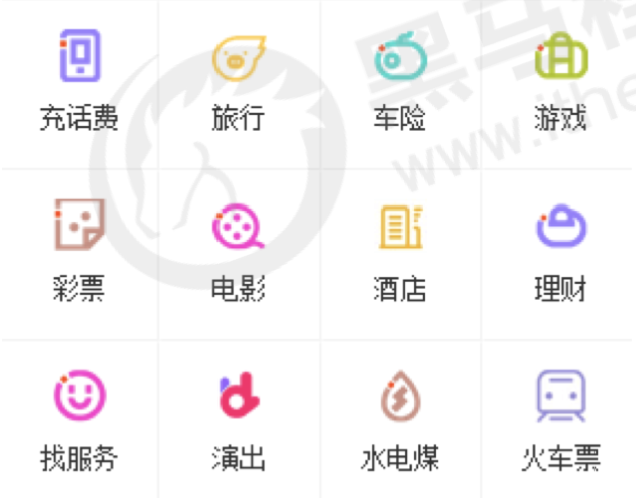

**target**

1. 能够说出什么是Web API
2. 能够说出什么是DOM
3. 能够获取页面元素
4. 能够写出H5新增获取页面元素的方式
5. 能够说出事件三要素是什么
6. 能够给元素注册事件
7. 能够说出innerText 和 innerHTML 区别
8. 能够修改元素的属性 和 样式
9. 能够写出密码框验证信息的案例

## 1. Web APIs 和 JS 基础关联性（了解）

### 1.1  JS 的组成（复习）

- JavaScript 
  - ECMAScript       JavaScript语法
  - DOM                   文档对象模型
  - BOM	               浏览器对象模型


### 1.2  JS 基础和 Web API阶段的关联性

Javascript是由ECMscript、Dom和Bom三部分组成的，我们在之前学习过了JS的基础语法ECMscript，其实我们现在所学习的webAPI其实就是Dom文档对象和Bom浏览器对象操作的学习。


> 简单理解：其实我们前面学习的ECMscript基础语法就是为后面的web API做铺垫的，我们可以使用JS基础语法实现网页的交互效果；


## 2. API 和 Web API 

### 2.1 API

`API（Application Programming Interface，应用程序编程接口）`是一些预先定义的函数，目的是提供应用程序与开发人员基于某软件或硬件得以访问一组例程的能力，而又无需访问源码，无需理解其内部工作机制细节，只需直接调用使用即可。

简单理解：  

**API:** `API 是给程序员提供的一种工具，以便能更轻松的实现想要完成的功能。我们不需要了解内部原理`

**Web API**：`是浏览器提供的一套操作 浏览器功能  和 页面元素 的  API ( BOM 和  DOM )。`

MDN 详细  API : https://developer.mozilla.org/zh-CN/docs/Web/API  这是所有的Web API接口，但是我们只需要了解一些常用的接口即可。

### 2.2 ApI 和 Web API 总结

1. `API 是为我们程序员提供的一个接口，帮助我们实现某种功能，我们会使用就可以了，不必纠结内部如何实现`
2. Web API 主要是针对于浏览器提供的接口，主要针对于浏览器做交互效果。
3. Web API 一般都有输入和输出（函数的传参和返回值），Web API 很多都是方法（函数）
4. 学习 Web API 可以结合前面学习内置对象方法的思路学习（学会查文档）


## 3. DOM

### 3.1 什么是DOM

文档对象模型（Document Object Model，简称DOM），是HTML和XML文档的编程接口](https://baike.baidu.com/item/%E7%BC%96%E7%A8%8B%E6%8E%A5%E5%8F%A3)。

简单理解：`DOM, 文档对象模型,是浏览器提供给我们的接口，可以做JS交互`

一个web页面是一个文档。这个文档可以在浏览器窗口或作为HTML源码显示出来。

DOM 将文档解析为一个由节点和对象（包含属性和方法的对象）组成的结构集合。简言之，它会将web页面和脚本或程序语言连接起来。

- [ MDN - DOM](https://developer.mozilla.org/zh-CN/docs/Web/API/Document_Object_Model)

### 3.2 DOM 树


- 文档：一个页面就是文档，DOM 中使用document表示
- 元素： 网页中所有标签都是元素，DOM中使用element 表示
- 节点：网页中所有内容都是节点（标签、属性、文本、注释等），DOM中使用node表示

DOM 把以上内容都看做是对象


## 4. 获取元素

- 为什么要获取页面元素？

例如：我们想要操作页面上的某部分（显示 / 隐藏，动画 ）， 需要先获取到该部分对应的元素，再对其进行操作。

DOM在我们实际开发中主要用来操作元素。 

- 我们如何来获取页面中的元素呢?

  获取页面中的元素可以使用以下几种方式:

  - 根据 ID 获取
  - 根据标签名获取
  - 通过 HTML5 新增的方法获取
  - 特殊元素获取


### 4.1 根据ID获取

查文档：[MDN](https://developer.mozilla.org/zh-CN/docs/Web/API/Document/getElementById)

1. 语法：`document.getElementById(id);`

2. 用途：使用 getElementById() 方法可以获取带有 ID 的元素对象

3. 传参： 特定的ID元素，大小写敏感的字符串，id唯一

4. 返回值：元素对象

- 注意：参数带引号，单双引号都OK。

```js
// 返回一个元素对象
// id是大小写敏感的字符串，代表了所要查找的元素的唯一ID.
var element = document.getElementById(id);
```

案例：

```js
<body>
    <div id="time">2019-9-9</div>
    <script>
        // 因为我们文档页面从上往下加载，所以先得有标签 所以我们script写到标签的下面
        var timer = document.getElementById('time');
        console.log(timer);
        console.log(typeof timer);
        // console.dir 打印我们返回的元素对象 更好的查看里面的属性和方法
        console.dir(timer);
    </script>
</body>
```


### 4.2 根据标签名获取元素

查文档：[MDN](https://developer.mozilla.org/zh-CN/docs/Web/API/Document/getElementsByName)

1. 语法：`element.getElementsByTagName('标签名') `
2. 作用：根据标签名获取元素对象
3. 参数：标签名
4. 返回值：元素对象集合（伪数组，数组元素是元素对象）


该API还可以获取某个父元素内部所有指定标签名的子元素

注意：父元素必须是单个对象(==必须指明是哪一个元素对象==). 获取的时候不包括父元素自己。

**Eg.1**

```html
<body>
    <ul>
        <li>知否知否，应是等你好久11</li>
        <li>知否知否，应是等你好久22</li>
        <li>知否知否，应是等你好久33</li>
        <li>知否知否，应是等你好久44</li>
        <li>知否知否，应是等你好久55</li>
    </ul>
    <ul id="nav">
        <li>生僻字</li>
        <li>生僻字</li>
        <li>生僻字</li>
        <li>生僻字</li>
        <li>生僻字</li>
    </ul>
    <script>
        // 1.返回的是 获取过来元素对象的集合 以伪数组的形式存储的
        var lis = document.getElementsByTagName('li');
        console.log(lis);
        console.log(lis[0]);
        // 2. 我们想要依次打印里面的元素对象我们可以采取遍历的方式
        for (var i = 0; i < lis.length; i++) {
            console.log(lis[i]);
        }
      	// 3. 如果页面中之后一个li， 返回的还是伪数组的形式
      	// 4. 如果页面中没有这个元素，返回空的伪数组
      
        // 5. element.getElementsByTagName()  可以得到这个元素里面的某些标签
        var nav = document.getElementById('nav'); // 这个获得nav 元素
        var navLis = nav.getElementsByTagName('li');
        console.log(navLis);
    </script>
</body>
```

**注意**

1. 因为得到的是一个对象的集合，所以我们想要操作里面的元素就需要遍历
2. 得到元素对象时动态的
3. getElementsByTagName()获取到是动态集合，即：当页面增加了标签，这个集合中也就增加了元素。不需要修改js


### 4.3 H5 新增获取元素方式

1. document.**getElementsByClassName(’类名‘)**
   - 根据类名返回元素对象集合,不是元素本身
   - [mdn](https://developer.mozilla.org/zh-CN/docs/Web/API/Document/getElementsByClassName)
2. document.**querySelector('选择器')**
   - 根据指定选择器返回**第一个元素对象**
3. document.**querySelectorAll('选择器')**
   - 根据指定选择器返回

> 注意:

querySelector 和 querySelectorAll 里面的选择器需要加**符号**，比如:document.querySelector("`#`nav")

**Eg.1**

```html
<body>
    <div class="box">盒子1</div>
    <div class="box">盒子2</div>
    <div id="nav">
        <ul>
            <li>首页</li>
            <li>产品</li>
        </ul>
    </div>
    <script>
        // 1. getElementsByClassName 根据类名获得某些元素集合
        var boxs = document.getElementsByClassName('box');
        console.log(boxs);
      
        // 2. querySelector 返回指定选择器的第一个元素对象  切记 里面的选择器需要加符号 .box  #nav
        var firstBox = document.querySelector('.box');
        console.log(firstBox);
        var nav = document.querySelector('#nav');
        console.log(nav);
        var li = document.querySelector('li');
        console.log(li);
      
        // 3. querySelectorAll()返回指定选择器的所有元素对象集合
        var allBox = document.querySelectorAll('.box');
        console.log(allBox);
        var lis = document.querySelectorAll('li');
        console.log(lis);
    </script>
</body>
```


### 4.4 获取特殊元素（body, html）

1. `document.body` 获取body元素

​		返回body元素对象

```js
var bodyElem = document.body
console.log(bodyElem)
console.log(bodyElem)
```

2. `document.documentElement`获取html元素

   返回html元素对象


## 5. 事件基础

### 5.1 事件概述

JavaScript 使我们有能力创建动态页面，而事件是可以被 JavaScript 侦测到的行为。

简单理解： **触发 -- 响应机制**。

网页中的每个元素都可以产生某些可以触发 JavaScript 的事件，例如，我们可以在用户点击某按钮时产生一个 事件，然后去执行某些操作。


### 5.2 事件三要素

1. 事件源（谁）：触发事件的元素
1. 事件类型（什么事件）： 例如 click 点击事件
1. 事件处理程序（做啥）：事件触发后要执行的代码(函数形式)，事件处理函数

比如开灯， 我们先要找到开关，然后按下去，最后灯亮了。

### 5.3 执行事件的步骤

1. 获取事件源 
2. 注册事件（绑定事件）
3. 编写事件处理程序（采取函数赋值形式）

**eg.1**

```html
<body>
    <button id="btn">开关</button>
    <script>
        // 点击一个按钮，弹出对话框
        // 1. 事件是有三部分组成  事件源  事件类型  事件处理程序   我们也称为事件三要素
        //(1) 获取事件源
        var btn = document.getElementById('btn');
        //(2) 注册事件 （绑定事件）
        btn.onclick = function() {
          //(3) 编写事件处理程序  通过一个函数赋值的方式
            alert('灯亮了');
        }
    </script>
</body>
```

### 5.3 常见鼠标事件

| 鼠标事件    | 触发条件         |
| ----------- | ---------------- |
| onclick     | 鼠标点击左键触发 |
| onmouseover | 鼠标进入时触发   |
| onmouseout  | 鼠标离开触发     |
| onfocus     | 获取鼠标焦点触发 |
| onblur      | 失去鼠标焦点触发 |
| onmousemove | 鼠标移动触发     |
| onmouseup   | 鼠标弹起触发     |
| onmousedown | 鼠标按下触发     |


## 6. 操作元素

JavaScript 的 DOM 操作可以改变网页内容、结构和样式，我们可以利用 DOM 操作元素来改变元素里面的内 
容 、属性等。注意以下都是属性

### 6.1 改变元素内容 （获取或设置）

```js
// 1.从起始位置到终止位置的内容, 但它去除 html 标签， 同时空格和换行也会去掉
element.innerText

// 2.起始位置到终止位置的全部内容，包括 html 标签，同时保留空格和换行
element.innerHTML
```

#### 6.1.1 innerText / innerHTML

```html
<body>
    <button>显示当前系统时间</button>
    <div>某个时间</div>
    <p>1123</p>
    <script>
        // 当我们点击了按钮，div里面的文字会发生变化
        // 1. 获取元素 
        var btn = document.querySelector('button');
        var div = document.querySelector('div');
        // 2.注册事件
        btn.onclick = function() {
            // div.innerText = '2019-6-6';
            div.innerHTML = getDate();
        }
        function getDate() {
            var date = new Date();
            // 我们写一个 2019年 5月 1日 星期三
            var year = date.getFullYear();
            var month = date.getMonth() + 1;
            var dates = date.getDate();
            var arr = ['星期日', '星期一', '星期二', '星期三', '星期四', '星期五', '星期六'];
            var day = date.getDay();
            return '今天是：' + year + '年' + month + '月' + dates + '日 ' + arr[day];
        }
      // 我们元素可以不用添加事件
      var p = document.querySelector('p')
      p.innerText = getDate()
    </script>
</body>
```

#### 6.1.2 innerText 和 innerHTML区别

1. 获取内容时的区别
   - innerText会去除空格和换行，而innerHTML会保留空格和换行

2. 设置内容时的区别
   - innerText不会识别html,直接显示。 而innerHTML会识别

```html
<body>
    <div></div>
    <p>
        我是文字
        <span>123</span>
    </p>
    <script>
        // innerText 和 innerHTML的区别 
        // 1. innerText 不识别html标签 非标准  去除空格和换行
        var div = document.querySelector('div');
        // div.innerText = '<strong>今天是：</strong> 2019';
        // 2. innerHTML 识别html标签 W3C标准 保留空格和换行的
        div.innerHTML = '<strong>今天是：</strong> 2019';
        // 这两个属性是可读写的  可以获取元素里面的内容
        var p = document.querySelector('p');
        console.log(p.innerText);
        console.log(p.innerHTML);
    </script>
</body>
```

1. innerText ：不识别html标签，非标准，去除空格和换行
2. innerHtml ：识别html标签，W3C标准，保留空格和换行

### 6.2 常用元素的属性操作

```bash
1. innerText、innerHTML 改变元素内容
2. src、href
3. id、alt、title
```

- 获取属性的值

```js
元素对象.属性名
```

- 设置属性的值

```js
元素对象.属性名 = 值
```

表单元素中有一些属性如：disabled、checked、selected，元素对象的这些属性的值是布尔型。

**eg.1**

```html
<body>
    <button id="ldh">刘德华</button>
    <button id="zxy">张学友</button> <br>
    
    <script>
        // 修改元素属性  src
        // 1. 获取元素
        var ldh = document.getElementById('ldh');
        var zxy = document.getElementById('zxy');
        var img = document.querySelector('img');
        // 2. 注册事件  处理程序
        zxy.onclick = function() {
            img.src = 'images/zxy.jpg';
            img.title = '张学友思密达';
        }
        ldh.onclick = function() {
            img.src = 'images/ldh.jpg';
            img.title = '刘德华';
        }
    </script>
</body>
```


#### 6.2.1 案例 分时问候

- 案例：  分时显示不同图片,显示不同问候语
  - 根据不同时间，页面显示不同图片，同时显示不同的问候语。 
  - 如果上午时间打开页面，显示上午好，显示上午的图片。 
  - 如果下午时间打开页面，显示下午好，显示下午的图片。 
  - 如果晚上时间打开页面，显示晚上好，显示晚上的图片

分析：

①  根据系统不同时间来判断，所以需要用到日期内置对象 

②  利用多分支语句来设置不同的图片

③ 需要一个图片，并且根据时间修改图片，就需要用到操作元素src属性

④ 需要一个div元素，显示不同问候语，修改元素内容即可

```js
// // 根据系统不同时间来判断，所以需要用到日期内置对象
// // 利用多分支语句来设置不同的图片
// // 需要一个图片，并且根据时间修改图片，就需要用到操作元素src属性
// // 需要一个div元素，显示不同问候语，修改元素内容即可
// 1.获取元素
var img = document.querySelector('img');
var div = document.querySelector('div');
// 2. 得到当前的小时数
var date = new Date();
var h = date.getHours();
// 3. 判断小时数改变图片和文字信息
if (h < 12) {
	  img.src = 'images/s.gif'; // good morning
  	div.innerHTML = '亲，上午好，好好写代码';
} else if (h < 18) {
  	img.src = 'images/x.gif'; // good afternoon
  	div.innerHTML = '亲，下午好，好好写代码';
} else {
  	img.src = 'images/w.gif'; //good evening
  	div.innerHTML = '亲，晚上好，好好写代码';
}
```

### 6.4 表单元素的属性操作

利用DOM可以操作如下表单元素的属性

```html
type、value、checked、selected、disabled
```

- 获取属性的值

```js
元素对象.属性名
```

- 设置属性的值

```js
元素对象.属性名 = 值
```

表单元素中有一些属性如：disabled、checked、selected，元素对象的这些属性的值是布尔型。

**eg.1**

```html
<body>
    <button>按钮</button>
    <input type="text" value="输入内容">
    <script>
        // 1. 获取元素
        var btn = document.querySelector('button');
        var input = document.querySelector('input');
        // 2. 注册事件 处理程序
        btn.onclick = function() {
            // 表单里面的值 文字内容是通过 value 来修改的
            input.value = '被点击了';
            // 如果想要某个表单被禁用 不能再点击 disabled  我们想要这个按钮 button禁用
            // btn.disabled = true;
            this.disabled = true;
            // this 指向的是事件函数的调用者 btn
        }
    </script>
</body>
```


### 6.5 仿京东显示密码

点击按钮将密码框切换为文本框，并可以查看密码明文。


**案例分析**

1. 核心思路： 点击眼睛按钮，把密码框类型改为文本框就可以看见里面的密码 
2. 一个按钮两个状态，点击一次，切换为文本框，继续点击一次切换为密码框
3. 算法：利用一个flag变量，来判断flag的值，如果是1 就切换为文本框，flag 设置为0，如 
   果是0 就切换为密码框，flag设置为1

```js
        // 1. 获取元素
        var eye = document.getElementById('eye')
        var pwd = document.getElementById('pwd')
        // 2. 绑定事件
        // 声明一个flag变量记录开关状态.
        var flag = 0 
        eye.onclick = function () {
            // 3. 事件处理查程序
            if (flag == 0) {
                pwd.type = 'text'
                eye.src = 'images/open.png'
                flag = 1
            } else {
                pwd.type = 'password'
                eye.src = 'images/close.png'
                flag = 0
            }
        }
```


### 6.6 样式属性操作

我们可以通过 JS 修改元素的大小、颜色、位置等样式。

```js
1. element.style     行内样式操作
2. element.className 类名样式操作
```

注意：

1.==JS 里面的样式采取驼峰命名法 比如 fontSize、 backgroundColor==

2.==JS 修改 style 样式操作，产生的是行内样式，CSS 权重比较高==


#### 6.6.1 通过操作style属性

元素对象的style属性也是一个对象！

```js
元素对象.style.样式属性 = 值
```

**eg.1**

```html
<body>
    <div></div>
    <script>
        // 1. 获取元素
        var div = document.querySelector('div');
        // 2. 注册事件 处理程序
        div.onclick = function() {
            // div.style里面的属性 采取驼峰命名法 
            this.style.backgroundColor = 'purple';
            this.style.width = '250px';
        }
    </script>
</body>
```

**eg.2** 淘宝点击关闭二维码


案例分析，核心思路：

1. 利用样式的显示和隐藏完成
   1. display:none 隐藏元素
   2.  display:block 显示元素 
2. 点击按钮，就让这个二维码盒子隐藏起来即可

```js
var btn = document.querySelector('.close-btn'); 
var box = document.querySelector('.box');
// 2.注册事件 程序处理 
btn.onclick = function() { 
box.style.display = 'none';
```


**eg.3** 循环精灵图背景

可以利用 for 循环设置一组元素的精灵图背景



案例分析

首先精灵图图片排列有规律的

核心思路： 

1. 利用for循环 修改精灵图片的 背景位置 background-position 
2. 剩下的就是考验你的数学功底了
3. 让循环里面的 i 索引号 * 44 就是每个图片的y坐标


```js
var lis = document.querySelectorAll('li'); 
for (var i = 0; i < lis.length; i++) {
  // 让索引号    乘以    44 就是每个li 的背景y坐标    index就是我们的y坐标 
  var index = i * 44;
  lis[i].style.backgroundPosition = '0 -' + index + 'px'; 
}
```


**eg.4** 显示隐藏文本框内容

当鼠标点击文本框时，里面的默认文字隐藏，当鼠标离开文本框时，里面的文字显示。


案例分析

1. 首先表单需要2个新事件，获得焦点 onfocus 失去焦点 onblur  
2. 如果获得焦点， 判断表单里面内容是否为默认文字，如果是默认文字，就清空表单内容 
3. 如果失去焦点， 判断表单内容是否为空，如果为空，则表单内容改为默认文字

```html
    <input type="text" value="手机">
    <!-- placeholder 属性是 HTML5 中的新属性。 -->
    <!-- <input type="text" placeholder="哟嚯嚯"> -->
    <script>
        // 1.获取元素
        var text = document.querySelector('input');
        // 2.注册事件 获得焦点事件 onfocus 
        text.onfocus = function() {
                // console.log('得到了焦点');
                if (this.value === '手机') {
                    this.value = '';
                }
                // 获得焦点需要把文本框里面的文字颜色变黑
                this.style.color = '#333';
            }
            // 3. 注册事件 失去焦点事件 onblur
        text.onblur = function() {
            // console.log('失去了焦点');
            if (this.value === '') {
                this.value = '手机';
            }
            // 失去焦点需要把文本框里面的文字颜色变浅色
            this.style.color = '#999';
        }
    </script>
```


#### 6.6.2 通过操作className属性

```js
元素对象.className = 值;
// 因为class是关键字，所有使用className。
```

**注意:**

1. **如果样式修改较多，可以采取操作类名方式更改元素样式。**
2. class因为是个保留字，因此使用className来操作元素类名属性
3. className 会直接更改元素的类名，会覆盖原先的类名。


**eg.1**

```html
<body>
    <div class="first">文本</div>
    <script>
        // 1. 使用 element.style 获得修改元素样式  如果样式比较少 或者 功能简单的情况下使用
        var test = document.querySelector('div');
        test.onclick = function() {
            // this.style.backgroundColor = 'purple';
            // this.style.color = '#fff';
            // this.style.fontSize = '25px';
            // this.style.marginTop = '100px';

            // 2. 我们可以通过 修改元素的className更改元素的样式 适合于样式较多或者功能复杂的情况
            // 3. 如果想要保留原先的类名，我们可以这么做 多类名选择器
            // this.className = 'change';
            this.className = 'first change';
        }
    </script>
</body>
```


**eg.2** 密码框格式提示错误信息

用户如果离开密码框，里面输入个数不是6~16，则提示错误信息，否则提示输入正确信息


分析：

1. 首先判断的事件是表单失去焦点 onblur
2. 如果输入正确则提示正确的信息颜色为绿色小图标变化
3. 如果输入不是6到16位，则提示错误信息颜色为红色 小图标变化 
4. 因为里面变化样式较多，我们采取className修改样式


### 6.7 操作元素总结


### 6.8 作业

1. 世纪佳缘 用户名 显示隐藏内容 
2. 京东关闭广告（直接隐藏即可） 
3. 新浪下拉菜单（微博即可） 
4. 开关灯案例（见素材）


## 7. 扩展：docsify

静态文档生成。

官网：[docsify](https://docsify.js.org/#/quickstart)

其他一些：hexo, hugo, VuePress等。

需要先安装Node， NPM
