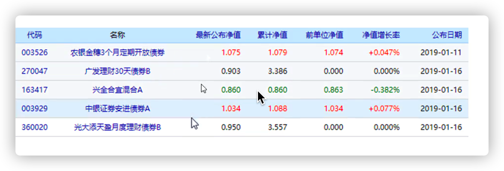
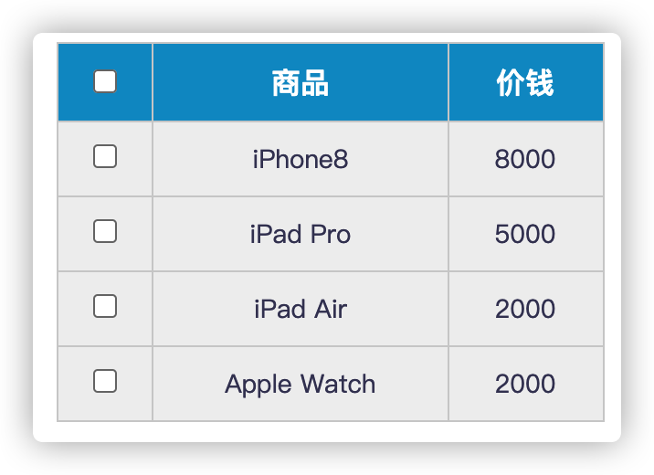
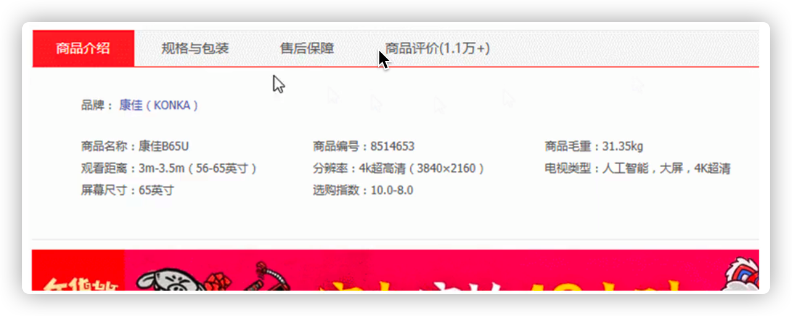
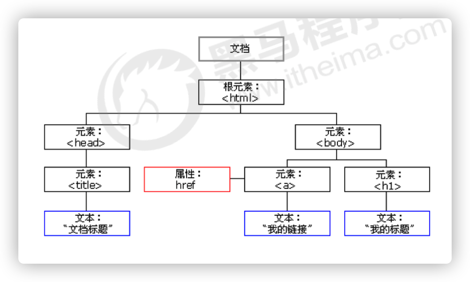

**target:**
1. 能够说出排他思想
2. 能够写出表单全选取消全选的案例
3. 能够设置获取自定义属性
4. 能够写出tab栏切换案例
5. 能够获取父子兄弟节点（不考虑兼容性）
6. 能够创建和添加节点
7. 能够写出简单发布留言案例.


## 1. 排他思想

如果有同一组元素，我们想要某一个元素实现某种样式， 需要用到循环的排他思想算法：

1. 所有元素全部清除样式（干掉其他人）
2. 给当前元素设置样式 （留下我自己）
3. 注意顺序不能颠倒，首先干掉其他人，再设置自己

```html
<button>按钮1</button>
<button>按钮2</button>
<button>按钮3</button>
<button>按钮4</button>
<button>按钮5</button>
<script>
  
  // 1. 获取所有按钮元素
  var btns = document.getElementsByTagName('button');
  // btns得到的是伪数组  里面的每一个元素 btns[i]
  for (var i = 0; i < btns.length; i++) {
    btns[i].onclick = function() {
      // (1) 我们先把所有的按钮背景颜色去掉  干掉所有人
      for (var i = 0; i < btns.length; i++) {
        btns[i].style.backgroundColor = '';
      }
      // (2) 然后才让当前的元素背景颜色为skyblue 留下我自己
      this.style.backgroundColor = 'skyblue';

      // 首先先排除其他人，然后才设置自己的样式，这种排除其他人的思想我们称为排他思想
    }
  }
</script>
```

### 1.1 eg.百度换肤


>  练习一下给多个元素注册绑定事件

分析：

1. 这个案例练习的是给一组元素注册事件
1. 点击每张图片给图片加个带颜色的border边框，实现排他思想
2. 给4个小图片利用循环注册点击事件
3. 当我们点击了这个图片，让我们页面背景改为当前的图片
4. 核心算法： 把当前图片的src 路径取过来，给 body 做为背景即可

```html
<body>
    <ul class="baidu">
        <li></li>
        <li></li>
        <li></li>
        <li></li>
    </ul>
    <script>
        // 1. 获取元素 
        var imgs = document.querySelector('.baidu').querySelectorAll('img');
        // console.log(imgs);
        // 2. 循环注册事件 
        for (var i = 0; i < imgs.length; i++) {
            imgs[i].onclick = function() {
                // 2. 先干掉其他人
                for (var j = 0; j < imgs.length;j ++) {
                    imgs[j].style.border = ''
                }
                // 3. 留下我自己
                this.style.border = '2px solid pink'
                // this.src 就是我们点击图片的路径   images/2.jpg
                // console.log(this.src);
                // 把这个路径 this.src 给body 就可以了
                document.body.style.backgroundImage = 'url(' + this.src + ')';
            }
        }
    </script>
</body>
```

### 1.2 eg.表格变色案例



分析：

1. 用到新的鼠标事件 鼠标经过 onmouseover  鼠标离开 onmouseout
2. 核心思路：鼠标经过 tr 行，当前的行变背景颜色， 鼠标离开去掉当前的背景颜色
3. 注意： 第一行（thead里面的行）不需要变换颜色，因此我们获取的是 tbody 里面的行

```js
// 1.获取元素 获取的是 tbody 里面所有的行
var trs = document.querySelector('tbody').querySelectorAll('tr');
// 2. 利用循环绑定注册事件
for (var i = 0; i < trs.length; i++) {
  // 3. 鼠标经过事件 onmouseover
  trs[i].onmouseover = function() {
    // console.log(11);
    this.className = 'bg';
  }
  // 4. 鼠标离开事件 onmouseout
  trs[i].onmouseout = function() {
    this.className = '';
  }
}
```


### 1.3 eg.表单全选、取消全选



**业务需求**

1. 点击上面全选复选框，下面所有的复选框都选中（全选）
2. 再次点击全选复选框，下面所有的复选框都不中选（取消全选）
3. 如果下面复选框全部选中，上面全选按钮就自动选中
4. 如果下面复选框有一个没有选中，上面全选按钮就不选中
5. 所有复选框一开始默认都没选中状态

**分析：**

1. `全选和取消全选做法：` 让下面所有复选框的checked属性（选中状态） 跟随 全选按钮即可
2. `下面复选框需要全部选中， 上面全选才能选中做法`： 给下面所有复选框绑定点击事件，每次点击，都 
   要循环查看下面所有的复选框是否有没选中的，如果有一个没选中的， 上面全选就不选中。
3.  可以设置一个变量，来控制全选是否选中

```js

// 1. 全选和取消全选做法：  让下面所有复选框的checked属性（选中状态） 跟随 全选按钮即可

// 获取元素        
var j_cbAll = document.getElementById('j_cbAll'); 
var j_tbs = document.getElementById('j_tb').getElementsByTagName('input'); 
// 全选按钮注册事件
j_cbAll.onclick = function() {
  // this.checked 当前复选框的选中状态
  console.log(this.checked);
  for (var i = 0; i < j_tbs.length; i++) {
    j_tbs[i].checked = this.checked;
  }
}
// 给所有的子复选框注册单击事件
for (var i = 0; i < j_tbs.length; i++) {
  j_tbs[i].onclick = function() {
    // flag 控制全选按钮是否选中
    var flag = true;
    // 每次点击下面的复选框都要循环检查者4个小按钮是否全被选中
    for (var i = 0; i < j_tbs.length; i++) {
      if (!j_tbs[i].checked) {
        flag = false;
        break; 
      }
    }
    // 设置全选按钮的状态
    j_cbAll.checked = flag;
  }
}
```


## 2. 自定义属性操作

### 2.1 获取属性的值

- `element.属性`   获取属性值，获取内置属性值，元素本身自带的属性。
- element.getAttribute('属性') ， 主要获得自定义的属性 （标准） 我们程序员自定义的属性

**区别：**

- element.属性   获取内置属性值（元素本身自带的属性）
- element.getAttribute(‘属性’), 主要获得自定义的属性 （标准） 我们程序员自定义的属性

```html
    <div id="demo" index="1" class="nav"></div>
    <script>
        var div = document.querySelector('div');
        // 1. 获取元素的属性值
        // (1) element.属性
        console.log(div.id);
        //(2) element.getAttribute('属性')  get得到获取 attribute 属性的意思 我们程序员自己添加的属性我们称为自定义属性 index
        console.log(div.getAttribute('id'));
        console.log(div.getAttribute('index'));
	</script>
```

### 2.2 设置属性的值

- `element.属性 = ‘值’`   设置内置属性值。
- element.setAttribute('属性', '值');

**区别：**

- element.属性 设置内置属性值
- element.setAttribute(‘属性’); 主要设置自定义的属性 （标准）

```js
// 2. 设置元素属性值
// (1) element.属性= '值'
div.id = 'test';
div.className = 'navs';
// (2) element.setAttribute('属性', '值');  主要针对于自定义属性
div.setAttribute('index', 2);
div.setAttribute('class', 'footer'); // class 特殊  这里面写的就是class 不是className
```

**思考练习：**一个ul中有6个li，如何通过js给每一个li添加自定义的属性index，设置index的取值为从0开始到5；

### 2.3 移除属性

- element.removeAttribute('属性')

```js
//  移除属性 removeAttribute(属性)    
div.removeAttribute('index');
```


### 2.4 eg. tab栏切换🔥

- [emoji](https://emojipedia.org/people/)
- 当鼠标点击上面相应的选项卡（tab），下面内容跟随变化



 **分析**:

1. Tab栏切换有2个大的模块
2. 上的模块选项卡，点击某一个，当前这一个底色会是红色，其余不变（排他思想） 修改类 
   名的方式
3. 下面的模块内容，会跟随上面的选项卡变化。所以下面模块变化写到点击事件里面。
4. 规律：下面的模块显示内容和上面的选项卡一一对应，相匹配。
5. 核心思路： 给上面的tab_list 里面的所有小li 添加自定义属性，属性值从0开始编号。
6. 当我们点击tab_list 里面的某个小li，让tab_con 里面对应序号的 内容显示，其余隐藏（排他
   思想）

```js
        // 获取元素
        var tab_list = document.querySelector('.tab_list');
        var lis = tab_list.querySelectorAll('li');
        var items = document.querySelectorAll('.item');
        // for循环，给选项卡绑定点击事件
        for (var i = 0; i < lis.length; i++) {
            // 开始给5个小li 设置索引号 
            lis[i].setAttribute('index', i);
            lis[i].onclick = function() {
                // 1. 上的模块选项卡，当前这一个底色会是红色，其余不变（排他思想）
                // 干掉所有人 其余的li清除 class 这个类
                for (var i = 0; i < lis.length; i++) {
                    lis[i].className = '';
                }
                // 留下我自己 
                this.className = 'current';
                // 2. 下面的显示内容模块
                var index = this.getAttribute('index');
                console.log(index);
                // 干掉所有人 让其余的item 这些div 隐藏
                for (var i = 0; i < items.length; i++) {
                    items[i].style.display = 'none';
                }
                // 留下我自己 让对应的item 显示出来
                items[index].style.display = 'block';
            }
        }
```

### 2.5 H5自定义属性

==自定义属性目的：是为了保存并使用数据。有些数据可以保存到页面中而不用保存到数据库中。==

- 自定义属性获取是通过getAttribute(‘属性’) 获取
- 但是有些自定义属性很容易引起歧义，不容易判断是元素的内置属性还是自定义属性。
- H5给我们新增了自定义属性：

#### 2.5.1 设置H5自定义属性

1. element.setAttribute(‘data-xxx’, xxx)
1. `H5规定自定义属性data-开头做为属性名并且赋值。`

```html
<!-- data-开头 -->
<div data-index=“1”></div> 
<script>
  // 或者使用 JS 设置
element.setAttribute(‘data-index’, 2)
</script>
```

#### 2.5.2 获取H5自定义属性

1. 兼容性获取  element.getAttribute(‘data-index’);
2. H5新增 element.dataset.`index`  或者 element.dataset`[‘index’]`  ie 11才开始支持

```html
<div getTime="20" data-index="2" data-list-name="andy"></div>
<script>
  var div = document.querySelector('div');
  // console.log(div.getTime);
  console.log(div.getAttribute('getTime'));
  div.setAttribute('data-time', 20);
  console.log(div.getAttribute('data-index'));
  console.log(div.getAttribute('data-list-name'));
  // h5新增的获取自定义属性的方法 它只能获取data-开头的
  // dataset 是一个集合里面存放了所有以data开头的自定义属性
  console.log(div.dataset);
  console.log(div.dataset.index);
  console.log(div.dataset['index']);
  // 如果自定义属性里面有多个-链接的单词，我们获取的时候采取 驼峰命名法
  console.log(div.dataset.listName);
  console.log(div.dataset['listName']);
</script>
```


## 3.节点操作

### 3.1 为什么学节点操作

获取元素通常使用两种方式：

1. 利用DOM 提供的方法获取元素
   - document.getElementById()
   - document.getElementsByTagName()
   - document.getElementsByClassName()
   - document.querySelector()
   - 逻辑性不强，繁琐
2. 利用节点层级关系获取元素
   - 利用父子兄弟节点关系获取元素
   - 逻辑性强，但是兼容性稍差

这两种方式都可以获取元素节点，我们后面都会使用，但是节点操作更简单。


### 3.2 节点概述

网页中的所有内容都是节点（标签、属性、文本、注释等），在DOM 中，节点使用 node 来表示。 

HTML DOM 树中的所有节点均可通过 JavaScript 进行访问，所有 HTML 元素（节点）均可被修改，也可以
创建或删除。



一般地，节点至少拥有nodeType（节点类型）、nodeName（节点名称）和nodeValue（节点值）这三个 
基本属性。

- 元素节点  nodeType 为 1
- 属性节点 nodeType 为  2
- 文本节点  nodeType 为  3   (文本节点包含文字、空格、换行等)

> **我们在实际开发中，节点操作主要操作的是元素节点**


### 3.3 节点层级

利用 DOM 树可以把节点划分为不同的层级关系，常见的有**父子兄弟层级关系**。

### 3.4 父级节点

```js
node.parentNode
```

- parentNode 属性可返回某节点的父节点，注意是最近的一个父节点
- 如果指定的节点没有父节点则返回 null

```html
<div class="demo">
  <div class="box">
    <span class="erweima">×</span>
  </div>
</div>
<script>
  // 1. 父节点 parentNode
  var erweima = document.querySelector('.erweima');
  // var box = document.querySelector('.box');
  // 得到的是离元素最近的父级节点(亲爸爸) 如果找不到父节点就返回为 null
  console.log(erweima.parentNode);
</script>
```

```basic
课堂练习： 淘宝点击关闭二维码案例，用parentNode试一试
```


### 3.5 子节点

#### 3.5.1 所有子节点

```js
parentNode.childNodes  （标准）
```

parentNode.childNodes 返回包含指定节点的子节点的集合，该集合为即时更新的集合。

**注意**:

**返回值里面包含了所有的子节点，包括元素节点，文本节点等**

**如果只想要获得里面的元素节点，则需要专门处理。 所以我们一般不提倡使用childNodes**

```js
var ul = document. querySelector(‘ul’); 
for(var i = 0; i < ul.childNodes.length;i++) {
    if (ul.childNodes[i].nodeType == 1) { 
        // ul.childNodes[i] 是元素节点 
        console.log(ul.childNodes[i]);
    } 
}
```

#### 3.5.2 子元素节点

```js
parentNode.children（非标准）
```

**parentNode.children** 是一个只读属性，返回所有的子**元素节点**。它只返回子元素节点，其余节点不返 
回 （**这个是我们重点掌握的**）。

虽然children 是一个非标准，但是得到了各个浏览器的支持，因此我们可以放心使用

```html
    <ul>
        <li>我是li</li>
        <li>我是li</li>
        <li>我是li</li>
        <li>我是li</li>
    </ul>
    <script>
        // DOM 提供的方法（API）获取
        var ul = document.querySelector('ul');
        var lis = ul.querySelectorAll('li');
        // 1. 子节点  childNodes 所有的子节点 包含 元素节点 文本节点等等
        console.log(ul.childNodes);
        console.log(ul.childNodes[0].nodeType);
        console.log(ul.childNodes[1].nodeType);
        // 2. children 获取所有的子元素节点 也是我们实际开发常用的
        console.log(ul.children);
    </script>
```

#### 3.5.3 第1个子节点

```js
parentNode.firstChild
```

firstChild 返回第一个子节点，找不到则返回null。同样，也是包含所有的节点。

#### 3.5.4 最后1个子节点

```js
parentNode.lastChild
```

lastChild 返回最后一个子节点，找不到则返回null。同样，也是包含所有的节点。

#### 3.3.2.5 第1个子元素节点

```js
parentNode.firstElementChild 
```

firstElementChild 返回第一个子元素节点，找不到则返回null。

#### 3.5.6 最后1个子元素节点

```js
parentNode.lastElementChild
```

lastElementChild 返回最后一个子元素节点，找不到则返回null。

**注意：firstElementChild 和 lastElementChild 两个方法有兼容性问题，IE9 以上才支持。**

#### 3.5.7 实际开发中

实际开发中，firstChild 和 lastChild 包含其他节点，操作不方便，而 firstElementChild 和 
lastElementChild 又有兼容性问题，那么我们如何获取第一个子元素节点或最后一个子元素节点呢？

**解决方案：**

1.  **如果想要第一个子元素节点，可以使用 parentNode.chilren[0]** 
2.  **如果想要最后一个子元素节点，可以使用 parentNode.chilren[parentNode.chilren.length - 1]**


### 3.6 eg. 新浪下拉菜单


**分析：**

1. 导航栏里面的li 都要有鼠标经过效果，所以需要循环注册鼠标事件
2.  核心原理： 当鼠标经过li 里面的 第二个孩子 ul 显示， 当鼠标离开，则ul 隐藏

```js
// 1. 获取元素
var nav = document.querySelector('.nav');
var lis = nav.children; // 得到4个小li
// 2.循环注册事件
for (var i = 0; i < lis.length; i++) {
    lis[i].onmouseover = function() {
        this.children[1].style.display = 'block';
    }
    lis[i].onmouseout = function() {
        this.children[1].style.display = 'none';
    }
}
```

### 3.7 兄弟节点

#### 3.7.1 下一个兄弟节点

- [菜鸟runoob](https://www.runoob.com/jsref/prop-node-nextsibling.html)

```js
node.nextSibling
```

nextSibling 属性可返回某个元素之后紧跟的节点（处于同一树层级中），找不到则返回null。同样，也是包含所有的节点。

#### 3.7.2 上一个兄弟节点

```js
node.previousSibling
```

previousSibling 属性可返回某节点之前紧跟的节点（处于同一树层级），找不到则返回null。同样，也是包含所有的节点。

#### 3.7.3 下一个兄弟元素节点

```js
node.nextElementSibling
```

nextElementSibling 返回当前元素下一个兄弟元素节点，找不到则返回null。


nextSibling 属性与 nextElementSibling 属性的差别：

- nextSibling 属性返回元素节点之后的兄弟节点（包括文本节点、注释节点）；
- nextElementSibling 属性只返回元素节点之后的兄弟元素节点（不包括文本节点、注释节点）；

```html
    <div>我是div</div>
    <span>我是span</span>
    <script>
        var div = document.querySelector('div');
        // 1.nextSibling 下一个兄弟节点 包含元素节点或者 文本节点等等
        console.log(div.nextSibling);
        console.log(div.previousSibling);
        // 2. nextElementSibling 得到下一个兄弟元素节点
        console.log(div.nextElementSibling);
        console.log(div.previousElementSibling);
    </script>
```

#### 3.7.4 上一个兄弟元素节点

```js
node.previousElementSibling
```

previousElementSibling 返回当前元素上一个兄弟节点，找不到则返回null。

注意：`nextElementSibling 和 previousElementSibling 两个方法有兼容性问题， IE9 以上才支持。`


#### 3.7.5 解决IE9以下兼容性

自己封装一个兼容性函数

```js
   function getNextElementSibling(element) {
      var el = element;
     // 赋值下一个兄弟节点给el，如果赋值后while(true)，表示el.nextSibling存在
      while (el = el.nextSibling) {
        // 判断el.nodeType，如果为1，表示元素节点，返回节点
        if (el.nodeType === 1) {
            return el;
        }
      }
      return null;
    }  
```

### 3.8 创建节点

```js
document.createElement('tagName')
```

document.createElement() 方法创建由 tagName 指定的 HTML 元素。因为这些元素原先不存在， 
是根据我们的需求动态生成的，所以我们也称为`动态创建元素节点`。


### 3.9 添加节点

```js
node.appendChild(child)
```

node.appendChild() 方法将一个节点添加到指定父节点的子节点列表末尾。类似于 CSS 里面的 
after 伪元素。

```js
node.insertBefore(child, 指定元素)
```

node.insertBefore() 方法将一个节点添加到父节点的指定子节点前面。类似于 CSS 里面的 before 
伪元素

```html
    <ul>
        <li>123</li>
    </ul>
    <script>
        // 1. 创建节点元素节点
        var li = document.createElement('li');
        // 2. 添加节点 node.appendChild(child)  node 父级  child 是子级 后面追加元素
        var ul = document.querySelector('ul');
        ul.appendChild(li);
        // 3. 添加节点 node.insertBefore(child, 指定元素);
        var lili = document.createElement('li');
        ul.insertBefore(lili, ul.children[0]);
        // 4. 我们想要页面添加一个新的元素 ： 1. 创建元素 2. 添加元素
    </script>
```

```basic
1. 案例引入知识点 
```


### 3.10 eg.简单版发布留言案例

**分析**：

1. 核心思路： 点击按钮之后，就动态创建一个li，添加到ul 里面。
2. 创建li 的同时，把文本域里面的值通过li.innerHTML 赋值给 li
3. 如果想要新的留言后面显示就用 appendChild 如果想要前面显示就用insertBefore


```html
<body>
    <textarea name="" id=""></textarea>
    <button>发布</button>
    <ul>

    </ul>
    <script>
        // 1. 获取元素
        var btn = document.querySelector('button');
        var text = document.querySelector('textarea');
        var ul = document.querySelector('ul');
        // 2. 注册事件
        btn.onclick = function() {
            if (text.value == '') {
                alert('您没有输入内容');
                return false;
            } else {
                // console.log(text.value);
                // (1) 创建元素
                var li = document.createElement('li');
                // 先有li 才能赋值
                li.innerHTML = text.value;
                // (2) 添加元素
                // ul.appendChild(li);
                ul.insertBefore(li, ul.children[0]);
            }
        }
    </script>
</body>
```


