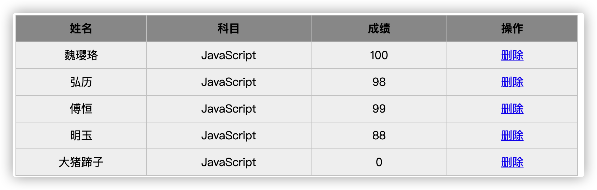
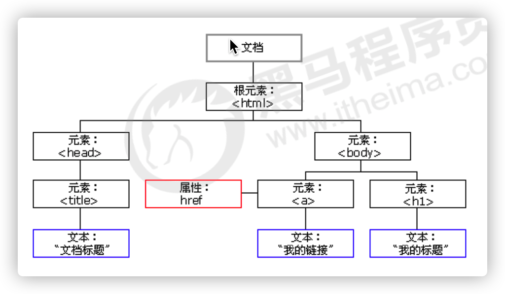
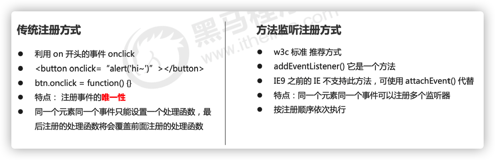
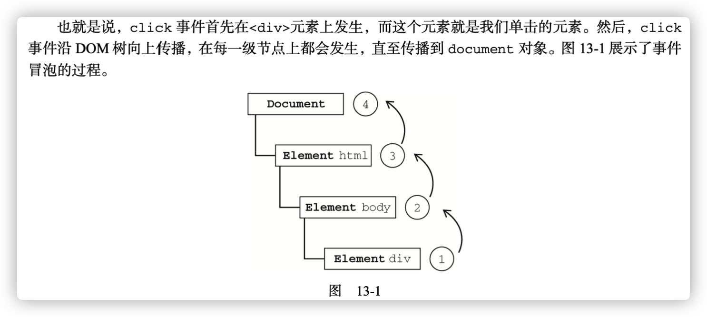
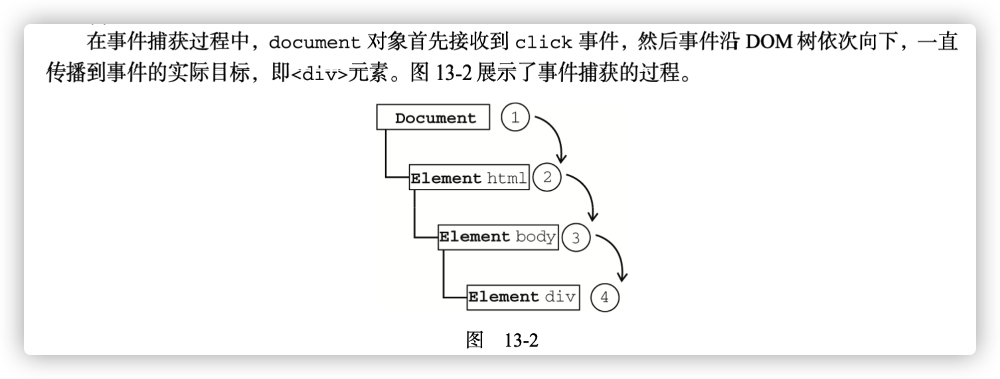
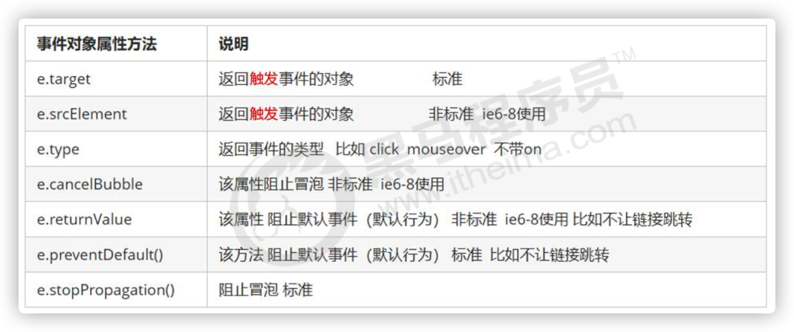
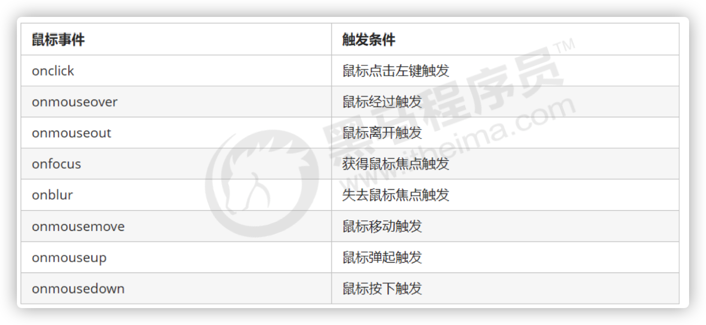
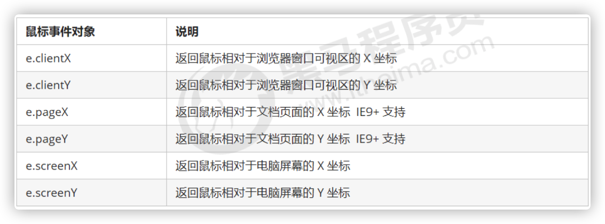
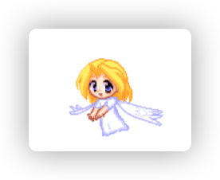

**target**:

1. 能够删除和复制节点
1. 能够说出动态创建表格的思路
1. 能够使用传统方式和监听方式给元素注册事件
1. 能够说出DOM事件流执行的三个阶段
1. 能够说出什么是事件对象
1. 能够写出阻止默认行为和阻止事件冒泡的代码
1. 能够说出事件委托的原理和好处
1. 能够完成跟随鼠标的天使案例

## 1. 节点操作

### 1.1 删除节点

```js
// 1.删除节点
node.removeChild(child);

// 2.可以用一个变量oldChild 接收删除的节点
var oldChild = node.removeChild(child)
```

1. 语法：`node.removeChild(child) `
2. 作用：从DOM中删除一个子节点。返回删除的节点。
3. 参数：`child` 是要移除的那个子节点.
4. 返回值：返回删除的节点。

- 注意 `node` 是`child`的父节点.


#### 1.1.1 案例练习

```html
    <button>删除</button>
    <ul class="list">
        <li>熊大</li>
        <li>熊二</li>
        <li>光头强</li>
    </ul>
```

```js
// 1. 获取元素
var btn = document.querySelector('button')
var ul = document.querySelector('ul')
// 2. 删除熊大
btn.onclick = function () {
    console.log(ul.children[0])
    // 如果节点删除完了,禁用按钮
    if (ul.children.length == 0) {
        this.disabled = true
    } else {
        ul.removeChild(ul.children[0])
    }
}
```

课堂练习：如何实现从后往前删 

```js
    btn.onclick = function () {
        console.log(ul.children[0])
        // 如果节点删除完了,禁用按钮
        var length = ul.children.length 
        if (length == 0) {
            this.disabled = true
        } else {
            // ul.removeChild(ul.children[0])
            ul.removeChild(ul.children[length - 1])
        }
    }
```

#### 1.1.2 发布消息删除留言

```css
    .box{
        width: 400px;
        height: 200px;
        margin: 20px auto;
        display: flex;
        align-items: flex-end;
    }
    .btn {
        background: skyblue;
        color: #fff;
        width: 80px;
        height: 30px;
        border-radius: 10px;
        border: none;
        cursor: pointer;
        margin-left: 20px;
    }
    .ul-box{
        width: 400px;
        margin: 0 auto;
    }
    ul {
        padding: 0;
    }
    .ul-box li{
        list-style: none;
        padding: 10px;
        background: #ccc;
        height: 30px;
        line-height: 30px;
        border-radius: 4px;
        margin: 5px auto;
        /* li 在右边 */
        display: flex;
        justify-content: space-between;
    }
```

```html
    <div class="box">
        <textarea name="" id="" cols="30" rows="10"></textarea>
        <button class="btn">发布</button>
    </div>
    <div class="ul-box">
        <ul></ul>
    </div>
```

```js
// 1. 获取元素
var btn = document.querySelector('.btn')
var textarea = document.querySelector('textarea')
var ul = document.querySelector('ul')
// 2. 给按钮绑定事件
btn.onclick = function () {
    liNum = ul.children.length
    maxLength = 5
    // 如果没有内容
    if (!textarea.value) {
        alert('您没有输入内容')
        return false
    } if(liNum >= maxLength){
        alert('不能再添加了哦')
        return
    } else {
        // (1) 创建元素
        var li = document.createElement('li')
        li.innerHTML = textarea.value + "<a href='javascript:;' class='delete'>删除</a>"
        // (2) 添加节点
        // ul.appendChild(li)
        ul.insertBefore(li, ul.children[0])

        // (3) 删除节点
        var deleteBtns = document.querySelectorAll('.delete')
        console.log(deleteBtns)
        for(var i = 0; i < deleteBtns.length; i++) {
            deleteBtns[i].onclick = function() {
                console.log(this)
                ul.removeChild(this.parentNode)
            }
        }

    }
}
```

### 1.2 复制节点

- [MDN-cloneNode](https://developer.mozilla.org/zh-CN/docs/Web/API/Node/cloneNode)

```js
var dupNode = node.cloneNode()
```

1. 语法：`var dupNode = node.cloneNode(deep)`

   - node : 将要被克隆的节点
   - dupNode 克隆生成的副本节点
   - deep可选，是个boolean值, 默认为空或者false
     - `默认为false,表示浅拷贝 只克隆该节点本身，不克隆节点里面的子节点`，
     - `如果设为true，表示深拷贝，将节点本身以及节点内部的子节点全部克隆`

   

2. 作用： 复制节点
3. 参数： deep， 可选。决定是深拷贝，还是浅拷贝。
4. 返回值：dupNode 克隆生成的副本节点

#### 1.2.1 练习

```html
    <ul>
        <li>111</li>
        <li>222</li>
        <li>333</li>
    </ul>
```

```js
// var dupNode = node.cloneNode()
var ul = document.querySelector('ul')
var li = ul.children[0]
var dupLi = li.cloneNode(true)
// 2. 将复制的节点添加到ul中
// console.log(dupLi)
// ul.appendChild(dupLi)
ul.insertBefore(dupLi,ul.children[0])
```

#### 1.2.2 动态生成表格



**案例分析：**

1. 因为里面的学生数据是动态的，我们需要JS动态生成。这里我们模拟数据，自己定义好数据。数据我们采取对象形式存储。
2. 所有的数据都是放到tbody里面的行里面
3. 因为行很多，我们需要循环创建多个行（对应多少人）
4. 每个行里面又有很多单元格（对应里面的数据），我们还继续使用循环创建多个单元格，并且把数据存入里面 （双重for循环）
5. 最后一列单元格是删除， 需要单独创建单元格
6. 最后添加删除操作，单击删除，可以删除当前行。

```js
// 动态生成表格思路:
// 1. 我们先遍历datas, 根据我们数据的length长度, 即有多少人,创建多少行.可以结合console.table看
// 2. 在创建好的每个tr中, 创建列(td), 也就是单元格, 单元格的数量 取决于每个对象的属性有多少
// 3. 创建最后的删除单元格
// 4. 实现删除功能
// 在tbody里面删除tr, 因为我们点击的是a标签, 它的父级是td, 我们要删除tr,
// 所以要往上取  this.parentNode.parentNode
```
**html**

```html
    <table>
        <thead>
            <tr>
                <th>姓名</th>
                <th>科目</th>
                <th>成绩</th>
                <th>操作</th>
            </tr>
        </thead>
        <tbody>
        </tbody>
    </table>
```

**CSS**

```css
    <style>
        table,
        th,
        td {
            width: 800px;
            border: 1px solid #ccc;
            border-collapse: collapse;
            line-height: 35px;
        }

        table {
            margin: 20px auto;
        }

        th {
            background: #999;
        }

        tr {
            background: #f1f1f1;
            text-align: center;
        }
    </style>
```

**JS**

1. 往tbody 里面创建行，我们怎么去判断创建多少行呢？

```js
// 1. 我们先准备好学生的数据，用一个数组存储，数组内部元素是一个一个的对象。
var datas = [{
    name: '魏璎珞',
    subject: 'JavaScript',
    score: 100
}, {
    name: '弘历',
    subject: 'JavaScript',
    score: 98
}, {
    name: '傅恒',
    subject: 'JavaScript',
    score: 99
}, {
    name: '明玉',
    subject: 'JavaScript',
    score: 88
}, {
    name: '大猪蹄子',
    subject: 'JavaScript',
    score: 0
}];
// 有多少人就创建多少行
var tbody = document.querySelector('tbody')
for (var i = 0; i < datas.length; i++) {
    // 创建tr 
    var tr = document.createElement('tr')
    // console.log(tr)
    tbody.appendChild(tr)
}
```

2. 创建好了之后我们看下结构, 还需要往tr中添加单元格td

```js
// 这里复习一下for in 遍历对象
var obj = {
  name:'张三',
  age:'18'
}
for (var k in obj) {
  	console.log(k) // k得到的是属性名
  	console.log(obj[k]) // obj[k]得到的是属性值
}
// 代码---
// 2. 在新建的tr中添加td, td的数量取决于每个对象的属性的个数


var tbody = document.querySelector('tbody')
for (var i = 0; i < datas.length; i++) {
  // 创建 
  var tr = document.createElement('tr')
  // console.log(tr)
  tbody.appendChild(tr)
 
  // 2. 在新建的tr中添加td, td的数量取决于每个对象的属性的个数
    // 使用for in遍历学生对象
  // 行里面创建单元格 （跟数据有关系的3个单元格）
    for (var k in datas[i]) {
      var td = document.createElement('td')
      td.innerHTML = datas[i][k]
      // console.log(td)
      tr.appendChild(td)
      // console.log(k)
      // console.log(obj[k])
    }
  // // 3. 创建删除单元格
    var deleteTd = document.createElement('td')
    deleteTd.innerHTML = '<a href="javascript:;">删除</a>'
    tr.appendChild(deleteTd)
}
```

3. 实现删除效果
   1. 获取所有的a，循环遍历绑定点击事件
   1. 删除a的父级td的父级tr

```js
//! 5. 实现删除功能  注意了,删除是删除所在的行tr
var deleteBtns = document.querySelectorAll('a')
for (var i = 0; i < deleteBtns.length; i++) {
    deleteBtns[i].onclick = function () {
        // this.parentNode.parentNode;  a的父级td的父级tr
        console.log(this)
        tbody.removeChild(this.parentNode.parentNode)
    }
}
```

### 1.3 创建元素的三种方式

1. document.write()
2. element.innerHTML
3. document.createElement()

**区别：**

1. document.write()  直接将内容写入到页面的内容流，但是`文档流执行完毕，会导致页面全部重绘`；
2. element.innerHTML  是将内容写入某个DOM节点，不会导致页面重绘
3. element.innerHTML 创建多个元素效率更高（使用数组形式时，不要直接拼接字符串）
4. document.createElement() 创建多个元素效率稍微低一点，但是结构更清晰

```js
        // 三种创建元素方式区别 
        // 1. document.write() 创建元素  如果页面文档流加载完毕，再调用这句话会导致页面重绘
         var btn = document.querySelector('button');
         btn.onclick = function() {
             document.write('<div>123</div>');
         }

        // 2. innerHTML 创建元素
        var inner = document.querySelector('.inner');
         for (var i = 0; i <= 100; i++) {
             inner.innerHTML += '<a href="#">百度</a>'
         }
        var arr = [];
        for (var i = 0; i <= 100; i++) {
            arr.push('<a href="#">百度</a>');
        }
        inner.innerHTML = arr.join('');
        // 3. document.createElement() 创建元素
        var create = document.querySelector('.create');
        for (var i = 0; i <= 100; i++) {
            var a = document.createElement('a');
            create.appendChild(a);
        }
```


### 1.4 innerHTML 和 createElement效率对比

**innerHTML字符串拼接方式（效率低）**

```js
    function fn() {
        var d1 = +new Date();
        var str = '';
        for (var i = 0; i < 1000; i++) {
            document.body.innerHTML += '<div style="width:100px; height:2px; border:1px solid blue;"></div>';
        }
        var d2 = +new Date();
        console.log(d2 - d1);
    }
    fn();
```

**createElement方式（效率一般）**

```js
    function fn() {
        var d1 = +new Date();

        for (var i = 0; i < 1000; i++) {
            var div = document.createElement('div');
            div.style.width = '100px';
            div.style.height = '2px';
            div.style.border = '1px solid red';
            document.body.appendChild(div);
        }
        var d2 = +new Date();
        console.log(d2 - d1);
    }
    fn();
```

**innerHTML数组方式（效率高）**

```js
function fn() {
    // var d1 = +new Date();
    console.time()
    var array = [];
    for (var i = 0; i < 100; i++) {
        array.push('<div style="width:100px; height:2px; border:1px solid blue;"></div>');
    }
    // array.join('')将数组拼接为字符串
    document.body.innerHTML = array.join('');
    console.timeEnd()
    // var d2 = +new Date();
    // console.log(d2 - d1);
}
fn();
```

## 2. DOM重点核心知识🔥

DOM : Document Object Model ， 文档对象模型。是W3C组织推荐的处理可扩展标记语言（HTMl或者XML)的标准编程接口。

W3C定义了一系列的DOM接口，通过这些DOM接口可以改变网页的内容、结构和样式；

1. 对于JavaScript， 为了能够使JavaScript操作HTML, JavaScript 就有了一套自己的DOM编程接口。

2. 对于HTML，浏览器将HTML解析为一颗DOM树，包含文档，元素，节点。

   

我们获取过来的DOM元素是一个对象（object），所以称为文档对象模型。

> 关于dom操作，我们主要针对于元素的操作。主要有创建、增、删、改、查、属性操作、事件操作

### 2.1 创建

1. document.write
2. innerHTML
3. createElement


### 2.2 增加

1. appendChild
2. insertBefore


### 2.3 删除

1. removeChild


### 2.4 改

> 主要修改DOM的元素属性，DOM元素的内容，属性，表单的值等

1. 修改元素属性：src, href, title等
2. 修改普通元素的内容 ：innerHTML，innerText
3. 修改表单元素：value, type, disable等
4. 修改元素样式：style, className

### 2.5 查

> 主要获取查询DOM元素

1. DOM提供的API方法：getElementById, getElementsByTagName, getElementsByClassName

2. H5提供的新方法：querySelector, querySelectorAll 推荐大家使用。
3. 利用节点操作获取元素：
   1. 父节点：parentNode
   2. 子节点：children
   3. 兄弟：previousElementSibling， nextElementSibling

### 2.6 属性操作

> 针对于自定义属性

1. 获取DOM的属性值：getAttribute
2. 设置DOM的属性值：setAttribute
3. 移除属性：removeAttribute


## 3. 事件高级

### 3.1 注册事件（2种方式）

1. 给元素添加事件，称为`注册事件`或者`绑定事件`；
2. 注册事件的方法有两种方式：`传统方式`和`监听注册方式`；



#### 3.1.1 传统注册方式

1. 利用on开头的事件 onclick 等， on表示当什么的时候

```js
btn.onclick = function() {
  console.log('hello world')
}
```

2. 传统注册方式的特点：

注册的事件是唯一的，同一个元素同一个事件只能设置一个处理函数，如果一个按钮同时注册了多个事件，最后注册的会将前面注册的覆盖了；

```js
btn.onclick = function () {
  console.log('hi JavaScript')
}
```

#### 3.1.2 监听注册addEventListener🔥

- [MDN - addEventListener()](https://developer.mozilla.org/zh-CN/docs/Web/API/EventTarget/addEventListener)

```js
eventTarget.addEventListener(type, listener[, useCapture])
// [, xxx] 表示参数可选
```

1. W3C标准方法，`addEventListener()` 推荐方法

2. IE9之前不支持此方法，可以使用attachEvent()代替；(基本被淘汰了)

   

eventTarget.addEventListener()方法将指定的监听器注册到 eventTarget（目标对象）上，当该对象触发指定的事件时，就会执行事件处理函数。

1. 该方法接受三个参数
   - **type**: 事件类型字符串，比如click、mouseover，`前面不需要加on`；
   - **listener:** 事件处理函数，事件发生时，会调用该监听函数；
   - **useCaptuer:** 可选参数，是布尔值，**默认是false，表示事件冒泡**。（学习完DOM事件流在进一步学习）；
   - 要处理的事件名、作为事件处理程序的函数和一个布尔值。最后这个布尔值参数如果是 true，表示在捕获阶段调用事件处理程序；如果是 false，表示在冒泡阶段调用事件处理程序。
2. 特点：
   - `同一个元素同一个事件可以注册多个监听器，执行的时候按照注册顺序依次执行；`

```html
<button>点击我</button>
<script>
		var btn = document.querySelector('button')
    btn.addEventListener('click', function () {
      console.log('我是大娃！')
    })
  	btn.addEventListener('click', function () {
      console.log('我是二娃！')
    })
</script>
```

```html
    <button class="btn">传统注册事件</button>
    <button class="watch">监听注册事件</button>
    <script>
        // 1. 传统方式注册事件
        var btn = document.querySelector('.btn')
        btn.onclick = function() {
            console.log('娃哈哈')
        }
        btn.onclick = function() {
            console.log('冰红茶')
        }
        // 2.事件监听注册事件
        //! 1) 里面的事件类型是字符串,要加引号,并且不带on
        //! 2) 同一个元素同一个事件可以多次添加
				//! 3) 执行时按注册顺序依次执行      
        var watch = document.querySelector('.watch')
        watch.addEventListener('click', function(){
            console.log('我是大娃')
        })
        watch.addEventListener('click', function(){
            console.log('我是二娃')
        })

    </script>
```


#### 3.1.3 attachEvent（了解）

```js
eventTarget.attachEvent(eventNameWithOn, callback)
```

- IE6/ IE7 / IE8， 不建议使用, 只有IE9以前的浏览器支持
- eventNameWithOn: 事件类型，字符串，比如 onclick， onmouseover, 这里要带on
- callback: 事件处理函数，当目标触发事件时回调函数被调用

```html
<button>传统注册事件</button>
<button>方法监听注册事件</button>
<button>ie9 attachEvent</button>
<script>
    var btns = document.querySelectorAll('button');
    // 1. 传统方式注册事件
    btns[0].onclick = function() {
        alert('hi');
    }
    btns[0].onclick = function() {
            alert('hao a u');
        }
   // 2. 事件侦听注册事件 addEventListener 
   // (1) 里面的事件类型是字符串 必定加引号 而且不带on
   // (2) 同一个元素 同一个事件可以添加多个侦听器（事件处理程序）
    btns[1].addEventListener('click', function() {
        alert(22);
    })
    btns[1].addEventListener('click', function() {
        alert(33);
    })
    // 3. attachEvent ie9以前的版本支持
    btns[2].attachEvent('onclick', function() {
        alert(11);
    })
</script>
```

#### 3.1.4 兼容性解决方案（了解）

兼容处理原则：首先照顾大多数浏览器，再处理特殊浏览器

封装一个函数，函数中判断浏览器的类型：

```js
function addEventListener(element,eventName,fn) {
    // 判断当前浏览器是否支持addEventListener方法
    if (element.addEventListener) {
        element.addEventListener(eventName,fn);
    } else if (element.attachEvent) {
        element.attachEvent('on' + eventName,fn);
    } else {
        // 相当于 element.onclick = fn;
        element['on' + eventName] = fn;
    }
}

var doFn = function() {
    console.log('我IE自己都不支持, 就问你怕不怕')
}
// addEventListener(btn, 'click', doFn)
```

### 3.2 删除事件（解绑事件）

#### 3.2.1 传统注册方式 

```js
eventTarget.onclick = null
```

直接将当前的事件操作设置为null即可

```js
var btn = document.querySelector('button');
// 普通方法解绑  先给元素添加事件，执行完代码后再去解绑；
btn.onclick = function() {
    alert('我是小王');
    // 进行解绑事件
    btn.onclick = null;
}
// 进行解绑事件 
// btn.onclick = null;
```

#### 3.2.2 removeEventListener 解绑 

```js
eventTarget.removeEventListener(type, listener)
```

先用addEventListener绑定事件，然后再同时解绑

```js
var btn = document.querySelector('button');
// 监听注册事件解绑  
// 要解绑的处理程序，用表达式语法写，就必须在addEventListener前面定义
// 如果用声明语法写，可以写在后面。
// 在处理程序中解绑自己
var fn = function(){
    console.log(123123)	
    btn.removeEventListener('click',fn)
}

btn.addEventListener('click',fn )
function fn(){
  console.log('222')
  btn.removeEventListener('click', fn)
}
```

#### 3.2.3 **IE的detachEvent （了解）**

detachEvent() 兼容IE9以下的浏览器，不推荐使用

```js
// var oBtn = document.querySelector('button');
// 如果想要兼容低版本浏览器获取元素就不能使用H5提供的新方法，就要使用getElementById获取
var oBtn = document.getElementById('a');
oBtn.attachEvent('onclick', fn);
function fn() {
    alert(1);
    oBtn.detachEvent('onclick',fn)
}
```

#### 3.2.4 解绑事件兼容写法（了解）

```js
// 封装兼容事件解绑
function removeEventListener(element,eventName,fn) {
    // 判断当前浏览器是否支持 removeEventListener方法
    if (element.removeEventListener) {
        element.removeEventListener(eventName,fn);
    } else if (element.detachEvent) {
        element.detachEvent('on' + eventName,fn);
    } else {
        element['on'+eventName] = null;
    }
}
```

调用:要先绑定, 再解绑；

```js
function fn() {
    alert('哟嚯嚯')
    removeEventListener(btn, 'click', fn)
}
btn.addEventListener('click', fn)
```


## 4. DOM事件流🔥

DOM(文档对象模型)结构是一个树型结构，当一个[HTML元素](https://baike.baidu.com/item/HTML元素/5983313)产生一个事件时，该事件会在元素节点与根结点之间的路径传播，路径所经过的结点都会收到该事件，这个传播过程可称为DOM事件流。

**事件**发生时会在元素节点之间按照特定的顺序传播，这个**传播过程**即**DOM事件流**。

**事件流**描述的是从页面中接收事件的顺序。

比如我们给一个div注册了点击事件


IE 和 Netscape 开发团队提出了差不多完全相反的事件流概念。

IE的事件流是**事件冒泡**，而Netscape  的事件流是**事件捕获**。


### 4.1 事件冒泡

事件由内往外，像水中冒泡泡一样。从底部，往上冒。

IE 的事件流叫做**事件冒泡（event bubbling）**，即事件开始时由最具体的元素接收，然后逐级向上传播到DOM最顶层节点（document）的过程。 

**eg.1**

事件冒泡：

```css
        .father {
            overflow: hidden;
            width: 300px;
            height: 300px;
            margin: 100px auto;
            background-color: pink;
            text-align: center;
        }
        
        .son {
            width: 200px;
            height: 200px;
            margin: 50px;
            background-color: purple;
            line-height: 200px;
            color: #fff;
        }
```

```js
// son ->  father -> body -> html -> document
```

```html
<div class="father">
    <div class="son">目标盒子</div>
</div>
<script>
    var son = document.querySelector('.son')
    var father = document.querySelector('.father')
    var body = document.body
    var html = document.documentElement

// 事件冒泡：addEventListener第三个参数省略，或者为false
    son.addEventListener('click', function(){
        console.log('我是子盒子,我被点击了')
    })

    father.addEventListener('click', function(){
        console.log('我是父盒子, 我被点击了')
    })
  
    body.addEventListener('click', function(){
        console.log('我是body, 我被点击了')
    })
  
    html.addEventListener('click', function(){
        console.log('我是html, 我被点击了')
    })
  
    document.addEventListener('click', function(){
        console.log('我是document, 我被点击了')
    })
  
</script>
```



### 4.2 事件捕获

事件由外到内，从外层节点，一层一层传递，最终捕获到目标节点。

事件捕获的思想是不太具体的节点应该更早接收到事件，而最具体的节点应该最后接收到事件。

eg.2

```js
// 事件捕获：document  ->  html -> body -> father -> son
```

```js
<div class="father">
    <div class="son">目标盒子</div>
</div>
<script>
    var son = document.querySelector('.son')
    var father = document.querySelector('.father')
    var body = document.body
    var html = document.documentElement

    // 事件捕获：addEventListener第三参数为 true
    son.addEventListener('click', function(){
        console.log('我是子盒子,我被点击了')
    }, true)

    father.addEventListener('click', function(){
        console.log('我是父盒子, 我被点击了')
    }, true)
  
    body.addEventListener('click', function(){
        console.log('我是body, 我被点击了')
    }, true)
  
    html.addEventListener('click', function(){
        console.log('我是html, 我被点击了')
    }, true)
  
    document.addEventListener('click', function(){
        console.log('我是document, 我被点击了')
    }, true)
  
</script>
```




```js
当时的2大浏览器霸主谁也不服谁！
IE 提出从目标元素开始，然后一层一层向外接收事件并响应，也就是冒泡型事件流。
Netscape（网景公司）提出从最外层开始，然后一层一层向内接收事件并响应，也就是捕获型事件流。

江湖纷争，武林盟主也脑壳疼！！！

最终，w3c 采用折中的方式，平息了战火，制定了统一的标准 —--— 先捕获再冒泡。
现代浏览器都遵循了此标准，所以当事件发生时，会经历3个阶段。
```

### 4.3 DOM事件流

”DOM2级事件“规范

规定**事件流包含三个阶段**：

1. `事件捕获阶段`  (由外到内，下水捕鱼)
2. `处于目标阶段`  (抓到鱼了）
3. `事件冒泡阶段` （由内到外，把鱼抓上来，鱼冒泡泡）

首先发生的是事件捕获，为截获事件提供了机会。然后是实际的目标接收到事件。最后一个阶段是冒泡阶     8 
段，可以在这个阶段对事件做出响应。


**注意：**

1. JS代码中只能执行捕获或者冒泡其中一个阶段。
2. addEventListener第三个参数如果是true, 表示在事件捕获阶段调用事件处理程序；如果是false(不写默认就是false)，表示事件冒泡阶段调用事件处理程序。
3. `实际开发中我们很少使用事件捕获，我们更关注事件冒泡`
4. 有些事件是没有冒泡的，比如 onblur, onfocus，onmouseenter、onmouseleave
5. 事件冒泡有时候会带来麻烦，有时候又会帮助很巧妙的做某些事件，我们后面讲解。


## 5. 事件对象

### 5.1 什么是事件对象

在触发 DOM 上的某个事件时，会产生一个`事件对象 event`，这个对象中包含着所有与事件有关的信息。

简单理解：事件发生后，跟事件相关的一些列信息数据的集合都放在这个`事件对象event`中，里面有很多属性和方法。

比如：  

1. 给谁绑定了这个事件。
2. 鼠标触发事件的话，会得到鼠标的相关信息，如鼠标位置。
3. 键盘触发事件的话，会得到键盘的相关信息，如按了哪个键。


### 5.2 事件对象的使用

我们可以在事件处理函数中，声明一个形参用来接受事件对象。

当事件触发时，就会产生事件对象，并且系统会以实参的形式传给事件处理函数。

```html
<style>
    button {
        width: 200px;
        height: 40px;
        background: skyblue;
        border-radius: 10px;
    }
</style>
<body>
    <button>Click Me</button>
    <script>
            // 1. event 就是一个事件对象, 写在我们的监听函数的小括号里, 当做形参来看
            // 2. 事件对象只有有了事件才会存在,它是系统给我们自动创建的
            // 3. 事件对象 是我们事件的一系列相关数据的集合 跟事件相关, 比如鼠标点击里面就包含了鼠标的相关信息
            // 4. 这个事件对象我们可以自己命名,可以简写为e
            // 5. 兼容写法 e = e || window
        var btn = document.querySelector('button')
        btn.onclick = function(event){
            console.log(event)
            console.log(event.type) // click
        }
        btn.addEventListener('click',function(event){
            console.log(event)
        })
      // 1. 这个event就是事件对象，我们还喜欢简写成 e ,  注意不是el哈，el经常代表element；
        btn.onclick = function(){
            console.log(event)
						console.log(e)
        }
    </script>
</body>
```

注意事项**

1. 事件对象的名称我们可以自己命名， 比如`event`、evt, `e`；

### 5.3 事件对象的兼容性处理

事件对象本身的获取存在兼容问题：

1. 标准浏览器中是浏览器给方法传递的参数，只需要定义形参 e 就可以获取到。
2. 在 IE6~8 中，浏览器不会给方法传递参数，如果需要的话，需要到 window.event 中获取查找。

```js
// 解决
// e = e || window.event

btn.onclick = function(e){
  e = e || window.event
  console.log(e)
}
```

```js
// 只要“||”前面为false, 不管“||”后面是true 还是 false，都返回 “||” 后面的值。
// 只要“||”前面为true, 不管“||”后面是true 还是 false，都返回 “||” 前面的值。
```

### 5.4 事件对象的属性和方法



- e.target
- e.type
- e.preventDefault()   // 阻止默认事件
- e.stopPropagation()  // 阻止冒泡

```js
// 常见事件对象的属性和方法
// 1. 返回事件类型
var div = document.querySelector('div');
div.addEventListener('click', fn);
div.addEventListener('mouseover', fn);
div.addEventListener('mouseout', fn);

function fn(e) {
  console.log(e.type);
}
```


### 5.5 e.target 和 this 区别

-  e.target 
   -  返回事件触发的对象（元素）
-  this 
   -  是事件绑定的对象（元素）
-  e.currentTarget
   -  指向的对象和this完全一样

通常情况下terget 和 this是一致的。

但有一种情况不同，那就是在事件冒泡时（父子元素有相同事件，单击子元素，父元素的事件处理函数也会被触发执行），这时候this指向的是父元素，因为它是绑定事件的元素对象，而target指向的是子元素，因为他是触发事件的那个具体元素对象。

```html
    <div class="box">box</div>
    <ul>
        <li>abc1</li>
        <li>abc2</li>
        <li>abc3</li>
    </ul>
    <script>
        var div = document.querySelector('.box')
        // 1. e.target 返回的是触发事件的对象(元素)
        // 2. this 指代的是绑定事件的对象(元素)
        // 3. 区别: 
            // e.target: 点击了哪个元素,就返回那个元素
            // this: 哪个元素绑定了点击事件,就返回谁
        div.addEventListener('click', function(e){
            console.log(e.target)
            console.log(this)
        })

        var ul = document.querySelector('ul')
        ul.addEventListener('click', function(e){
            // console.log(e.target)
            console.log(this)
            // console.log(e.currentTarget)
            // console.log(e.currentTarget === this)
        })
    </script>
```

事件冒泡下的e.target 和 this

```html
<ul>
    <li>abc</li>
    <li>abc</li>
    <li>abc</li>
</ul>
<script>
    var ul = document.querySelector('ul');
    ul.addEventListener('click', function(e) {
            // 我们给ul 绑定了事件  那么this 就指向ul  
            console.log(this); // ul
            // e.target 触发了事件的对象 我们点击的是li e.target 指向的就是li
            console.log(e.target); // li
    });
</script>
```

```html
<style>
  div {
    width: 100px;
    height: 100px;
    background-color: pink;
  }
</style>
<div>123</div>
<ul>
    <li>abc</li>
    <li>abc</li>
    <li>abc</li>
</ul>
<script>
    // 常见事件对象的属性和方法
    // 1. e.target 返回的是触发事件的对象（元素）  this 返回的是绑定事件的对象（元素）
    // 区别 ： e.target 点击了那个元素，就返回那个元素 this 那个元素绑定了这个点击事件，那么就返回谁
    var div = document.querySelector('div');
    div.addEventListener('click', function(e) {
        console.log(e.target);
        console.log(this);

    })
    var ul = document.querySelector('ul');
    ul.addEventListener('click', function(e) {
            // 我们给ul 绑定了事件  那么this 就指向ul  
            console.log(this);
            console.log(e.currentTarget);

            // e.target 指向我们点击的那个对象 谁触发了这个事件 我们点击的是li e.target 指向的就是li
            console.log(e.target);

        })
        // 了解兼容性
        // div.onclick = function(e) {
        //     e = e || window.event;
        //     var target = e.target || e.srcElement;
        //     console.log(target);

    // }
    // 2. 了解 跟 this 有个非常相似的属性 currentTarget  ie678不认识
</script>
```


### 5.6 阻止默认行为

- html中一些标签有默认行为，例如a标签被单击后，默认会进行页面跳转。
- `e.preventDefault`

**实际中常用的方法**

```js
var oA = document.querySelector('a');
oA.addEventListener('click', function (e) {
  	e.preventDefault();
})
```

兼容IE678版本（了解）

```js
// 获取元素也要兼容
var oA = document.getElementById('btn');
oA.onclick = function (e) {
    e = e || window.event;
    if (e.preventDefault) {
        e.preventDefault();
    } else {
        e.returnValue = false;
    }
    // 以下是三元运算符格式
    // e.preventDefault ? e.preventDefault() : e.returnValue = false;
}
```

注意：return false 也能阻止默认行为，没有兼容性问题，但是return后面的代码就不执行了，而且只限于传统的注册方式；

```html
    <a href="http://www.baidu.com">百度</a>
    <script>
        // 2. 阻止默认行为 让链接不跳转 
        var a = document.querySelector('a');
        a.addEventListener('click', function(e) {
             e.preventDefault(); //  dom 标准写法
        });
        // 3. 传统的注册方式
        a.onclick = function(e) {
            // 普通浏览器 e.preventDefault();  方法
            e.preventDefault();
            // 低版本浏览器 ie678  returnValue  属性
            e.returnValue = false;
            // 我们可以利用return false 也能阻止默认行为 没有兼容性问题
          	// 但是return后面就不执行了
            return false; 
        }
    </script>
```


### 5.7 阻止事件冒泡🔥

- 标准写法：利用事件对象里面的 `stopPropagation()` 方法

```js
e.stopPropagation()
```

- 非标准写法：IE 6-8 利用事件对象 `cancelBubble`属性

```js
e.cancelBubble = true
```

DOM推荐使用e.stopPropagation() 方法，但是如果要兼容低版本的ie678就要使用cancelBubble属性设置，但是实际开发中我们基本都不去兼容低版本，我们使用DOM推荐的就可以；

```html
<div class="father">
  <div class="son"></div>
</div>
<script>
// 获取元素
var father = document.querySelector('.father');
var son = document.querySelector('.son');
// addEventListener的第三个参数是false或者不写，程序处在事件冒泡阶段，从里往外一层一层的找目标
// 先找son  ---- father ---- body ---- html --- document文档
// 也就是我们点击了son自己元素就先执行子级的代码，然后冒泡去执行father的代码
son.addEventListener('click', function (e) {
    alert('son');
    // 当执行完当前子级的代码后马上阻止冒泡  
    e.stopPropagation();
});

  // 给father注册点击事件
father.addEventListener('click', function () {
    alert('father');
});
  // 给document注册点击事件
document.addEventListener('click', function() {
   alert('document')
})
</script>
```

以上代码只弹出一个son的代码：

**兼容低版本浏览器的方法**：（了解）

event.cancelBubble 属性设置值为true

```html
<script>
    function stop_Propagation(e) {
       if (e && e.stopPropagation) {
                e.stopPropagation();
        } else {
                // 兼容低版本浏览器
                window.event.cancelBubble = true;
            }
        }
</script>
```

调用

```js
// 获取元素也要注意兼容低版本浏览器，我们一般给盒子起id名称，用id方法获取
var oFather = document.getElementById('father');
var oSon = document.getElementById('son');
oSon.onclick = function (e) {
    alert('son');
    // 当执行完当前子级的代码后马上阻止冒泡  直接执行兼容函数
    stop_Propagation(e);
}
oFather.onclick = function (e) {
    alert('father');
};
```

### 5.7 事件委托

什么是事件委托 ： 把事件委托给别人，代为处理。

**事件委托也称为事件代理**，在 jQuery 里面称为事件委派。

>  说白了就是，不给子元素注册事件，给父元素注册事件，把处理代码在父元素的事件中执行。


---


**eg.1**

**生活中的代理：**

咱们班有100个学生， 快递员有100个快递， 如果一个个的送花费时间较长。同时每个学生领取的时候，也需 
要排队领取，也花费时间较长，何如？

**解决方案：**   快递员把100个快递，委托给班主任，班主任把这些快递放到办公室，同学们下课自行领取即可。 

**优势：**   快递员省事，委托给班主任就可以走了。 同学们领取也方便，因为相信班主任。


**js 事件中代理：**

```html
<ul>
    <li>知否知否，应该有弹框在手</li> 
    <li>知否知否，应该有弹框在手</li> 
    <li>知否知否，应该有弹框在手</li> 
    <li>知否知否，应该有弹框在手</li> 
    <li>知否知否，应该有弹框在手</li>
</ul>
```

点击每个 li 都会弹出对话框，以前需要给每个 li 注册事件，是非常辛苦的，而且访问 DOM 的次数越多，这就 
会延长整个页面的交互就绪时间。


**事件委托原理：**不需要给每一个子节点单独设置事件监听器，而是利用事件冒泡，将事件监听设置在父节点上，通过父节点来监听子节点的事件.

**事件委托的作用：**
 	1. 我们只操作一次DOM，提高程序性能；
 	2. 动态新创建的子元素，也拥有事件。

```html
<ul>
    <li>知否知否，点我应有弹框在手！</li>
    <li>知否知否，点我应有弹框在手！</li>
    <li>知否知否，点我应有弹框在手！</li>
    <li>知否知否，点我应有弹框在手！</li>
    <li>知否知否，点我应有弹框在手！</li>
</ul>
<script>
    // 事件委托的核心原理：给父节点添加监听器， 利用事件冒泡影响每一个子节点
    var ul = document.querySelector('ul');
    ul.addEventListener('click', function(e) {
        // e.target 这个可以得到我们点击的对象
        e.target.style.backgroundColor = 'pink';
    })
</script>
```


## 6. 常用鼠标事件



### 6.1 禁止选中文字和禁止右键菜单

1.禁止鼠标右键菜单

contextmenu主要控制应该何时显示上下文菜单，主要用于程序员取消默认的上下文菜单

```js
document.addEventListener('contextmenu', function(e) { 
    e.preventDefault();
})
```

2.禁止鼠标选中（selectstart 开始选中）

```js
document.addEventListener('selectstart', function(e) { 
		e.preventDefault();
})
```

```js
<body>
    我是一段不愿意分享的文字
    <script>
        // 1. contextmenu 我们可以禁用右键菜单
        document.addEventListener('contextmenu', function(e) {
                e.preventDefault();
        })
        // 2. 禁止选中文字 selectstart
        document.addEventListener('selectstart', function(e) {
            e.preventDefault();
        })
    </script>
</body>
```

### 6.2 鼠标键盘事件对象

`event对象`代表事件的状态，跟事件相关的一系列信息的集合。

现阶段我们主要是用鼠标事件对象`mouseEvent`和键盘事件对象` KeyboardEvent`。



### 6.3 获取鼠标在页面的坐标

- e.clientX 和 e.clientY  鼠标在可是区域的X和Y坐标
- e.pageX 和 e.pageY   鼠标在页面文档的X和Y坐标
- e.screenX 和 e.screenY 鼠标在电脑屏幕的X和Y坐标

```js
// 鼠标事件对象 mouseEvent
document.addEventListener('click', function(e) {
    // 1. client 鼠标在可视区的x和y坐标
    console.log(e.clientX);
    console.log(e.clientY);
    console.log('---------------------');

    // 2. page 鼠标在页面文档的x和y坐标
    console.log(e.pageX);
    console.log(e.pageY);
    console.log('---------------------');

    // 3. screen 鼠标在电脑屏幕的x和y坐标
    console.log(e.screenX);
    console.log(e.screenY);

})
```

```js
// 获取元素
var oBox = document.querySelector('.box');
// 在页面中绑定鼠标移动事件
document.addEventListener('mousemove', function (e) {
    // console.log(e.clientX);
    // console.log(e.clientY);
    oBox.style.left = e.clientX - 50 + 'px';
    oBox.style.top = e.clientY - 50 + 'px';
})
```

### 6.4 鼠标跟随案例

跟随鼠标的天使，这个天使图片一直跟随鼠标移动



**分析：**

1. 鼠标不断的移动，使用鼠标移动事件： mousemove
2. 在页面中移动，给document注册事件
3. 图片要移动距离，而且不占位置，我们使用绝对定位即可
4. 核心原理： 每次鼠标移动，我们都会获得最新的鼠标坐标， 把这个x和y坐标做为图片的 
   top和left 值就可以移动图片


```js

<script>
    var pic = document.querySelector('img');
    document.addEventListener('mousemove', function(e) {
        // 1. mousemove只要我们鼠标移动1px 就会触发这个事件
        // 2.核心原理： 每次鼠标移动，我们都会获得最新的鼠标坐标， 
        // 把这个x和y坐标做为图片的top和left 值就可以移动图片
        var x = e.pageX;
        var y = e.pageY;
        console.log('x坐标是' + x, 'y坐标是' + y);
        //3 . 千万不要忘记给left 和top 添加px 单位
        pic.style.left = x - 50 + 'px';
        pic.style.top = y - 40 + 'px';
    });
</script>
```

