## target：

1. 能够获取鼠标在页面内的坐标
1. 能够利用keyCode判断用户的按键
1. 能够说出BOM是什么
1. 能够写出页面加载事件
1. 能够写出2种定时器的使用语法
1. 能够说出什么是回调函数。
1. 能够写出5s后跳转页面的案例
1. 能够说出现阶段this的指向问题

## 1. 常用鼠标事件

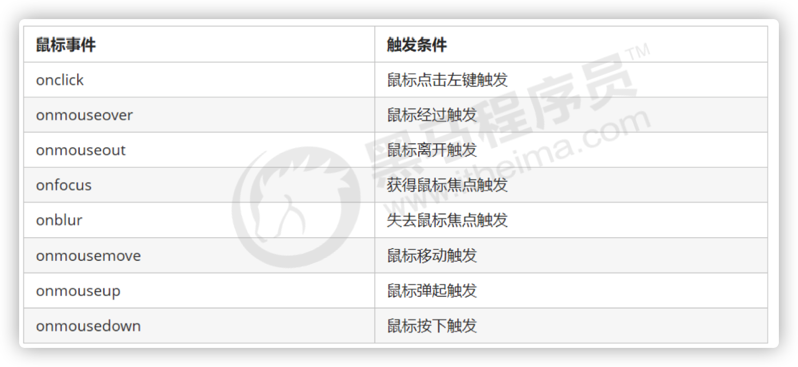

### 1.1 禁止选中文字和禁止右键菜单

1.禁止鼠标右键菜单

contextmenu主要控制应该何时显示上下文菜单，主要用于程序员取消默认的上下文菜单

```js
document.addEventListener('contextmenu', function(e) { 
    e.preventDefault();
})
```

2.禁止鼠标选中（selectstart 开始选中）

```js
document.addEventListener('selectstart', function(e) { 
		e.preventDefault();
})
```

```js
<body>
    我是一段不愿意分享的文字
    <script>
        // 1. contextmenu 我们可以禁用右键菜单
        document.addEventListener('contextmenu', function(e) {
                e.preventDefault();
        })
        // 2. 禁止选中文字 selectstart
        document.addEventListener('selectstart', function(e) {
            e.preventDefault();
        })
    </script>
</body>
```

### 1.2 鼠标键盘事件对象

`event对象`代表事件的状态，跟事件相关的一系列信息的集合。

现阶段我们主要是用鼠标事件对象`mouseEvent`和键盘事件对象` KeyboardEvent`。

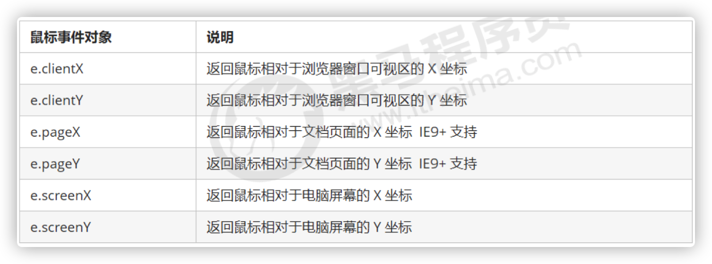

### 1.3 获取鼠标在页面的坐标

- e.clientX 和 e.clientY  鼠标在可是区域的X和Y坐标
- e.pageX 和 e.pageY   鼠标在页面文档的X和Y坐标
- e.screenX 和 e.screenY 鼠标在电脑屏幕的X和Y坐标

```js
// 鼠标事件对象 mouseEvent
document.addEventListener('click', function(e) {
    // 1. client 鼠标在可视区的x和y坐标
    console.log(e.clientX);
    console.log(e.clientY);
    console.log('---------------------');

    // 2. page 鼠标在页面文档的x和y坐标
    console.log(e.pageX);
    console.log(e.pageY);
    console.log('---------------------');

    // 3. screen 鼠标在电脑屏幕的x和y坐标
    console.log(e.screenX);
    console.log(e.screenY);

})
```

```js
// 获取元素
var oBox = document.querySelector('.box');
// 在页面中绑定鼠标移动事件
document.addEventListener('mousemove', function (e) {
    // console.log(e.clientX);
    // console.log(e.clientY);
    oBox.style.left = e.clientX - 50 + 'px';
    oBox.style.top = e.clientY - 50 + 'px';
})
```

### 1.4 鼠标跟随案例

跟随鼠标的天使，这个天使图片一直跟随鼠标移动

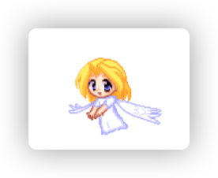

**分析：**

1. 鼠标不断的移动，使用鼠标移动事件： mousemove
2. 在页面中移动，给document注册事件
3. 图片要移动距离，而且不占位置，我们使用绝对定位即可
4. 核心原理： 每次鼠标移动，我们都会获得最新的鼠标坐标， 把这个x和y坐标做为图片的 
   top和left 值就可以移动图片


```js

<script>
    var pic = document.querySelector('img');
    document.addEventListener('mousemove', function(e) {
        // 1. mousemove只要我们鼠标移动1px 就会触发这个事件
        // 2.核心原理： 每次鼠标移动，我们都会获得最新的鼠标坐标， 
        // 把这个x和y坐标做为图片的top和left 值就可以移动图片
        var x = e.pageX;
        var y = e.pageY;
        console.log('x坐标是' + x, 'y坐标是' + y);
        //3 . 千万不要忘记给left 和top 添加px 单位
        pic.style.left = x - 50 + 'px';
        pic.style.top = y - 40 + 'px';
    });
</script>
```

## 2. 常用键盘事件

### 2.1 键盘事件

| 键盘事件   | 触发条件                                                     |
| ---------- | ------------------------------------------------------------ |
| onkeyup    | 松开按键时触发                                               |
| onkeydown  | 按下键盘时触发                                               |
| onkeypress | 按下按键时触发，对功能键不起作用，比如ctrl、shift，左右箭头等。 |

注意：

1. 如果使用`addEventListener`,不需要加on
2. onkeypress 和 其他两个的区别是：onkeypress不认识功能键；
3. 三个事件的执行顺序是：keydown -- keypress -- keyup

```js
// 常用的键盘事件
//1. keyup 按键弹起的时候触发 
document.addEventListener('keyup', function() {
    console.log('我弹起了');
})

//3. keypress 按键按下的时候触发  不能识别功能键 比如 ctrl shift 左右箭头啊
document.addEventListener('keypress', function() {
        console.log('我按下了press');
})
//2. keydown 按键按下的时候触发  能识别功能键 比如 ctrl shift 左右箭头啊
document.addEventListener('keydown', function() {
        console.log('我按下了down');
})
// 4. 三个事件的执行顺序  keydown -- keypress -- keyup
```

### 2.2 键盘事件对象

| 键盘事件对象的属性 | 说明                |
| ------------------ | ------------------- |
| keyCode            | 返回该键的 ASCII 值 |

1. `onkeydown  和 onkeyup 不区分字母大小写，如果用onkeypress就需要区分字母大小写`；
2. 实际开发中，我们更多的使用keydown和keyup，他们能识别所有的键（包括功能键）；
3. keypress不识别功能键，但是keyCode属性能区分大小写，返回不同的ASCII值；

**ASCII码表**

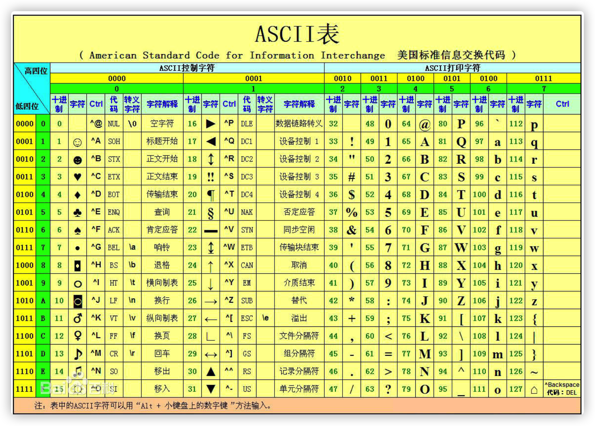

使用keyCode属性判断用户按下哪个键

```js
// 键盘事件对象中的keyCode属性可以得到相应键的ASCII码值
// 1. 我们的keyup 和keydown事件不区分字母大小写  a 和 A 得到的都是65
// 2. 我们的keypress 事件 区分字母大小写  a  97 和 A 得到的是65
document.addEventListener('keyup', function(e) {
    console.log('up:' + e.keyCode);
    // 我们可以利用keycode返回的ASCII码值来判断用户按下了那个键
    if (e.keyCode === 65) {
        alert('您按下的a键');
    } else {
        alert('您没有按下a键')
    }
})
document.addEventListener('keypress', function(e) {
    // console.log(e);
    console.log('press:' + e.keyCode);
})
```

### 2.3 eg. 模拟京东按键输入内容

当我们按下 s 键， 光标就定位到搜索框（文本框获得焦点）

分析：

1. 核心思路：检测用户是否按下了s 键，如果按下s 键，就把光标定位到搜索框里面
2. 使用键盘事件对象里面的keyCode 判断用户按下的是否是s键
3. 搜索框获得焦点： 使用 js 里面的 focus() 方法

```html
<input type="text">
<script>
    // 思路：判断按键按下弹起以后当前按键的ASCLL值 
    // 用keyCode属性获取
    // 1. 获取输入框
    var search = document.querySelector('input');
  	// 2. 给document注册keyup事件
    document.addEventListener('keyup', function (e) {
        // 如果不止大keyCode值可以先log输出再去判断
        // console.log(e.keyCode);  
        if (e.keyCode === 83) {
          	// 触发输入框的获取焦点事件
            search.focus();
        }
    })
</script>
```

### 2.4 eg. 模拟京东快递单号查询

要求：当我们在文本框中输入内容时，文本框上面自动显示大字号的内容。

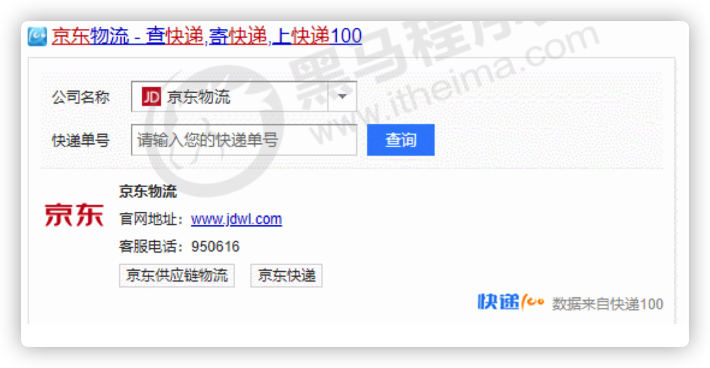

**案例分析**：

1. 快递单号输入内容时， 上面的大号字体盒子（con）显示(这里面的文字
2. 同时把快递单号里面的值（value）获取过来赋值给 con盒子（innerText）做为内容 
3. 如果快递单号里面内容为空，则隐藏大号字体盒子(con)盒子
4. `注意： keydown 和 keypress 在文本框里面的特点： 他们两个事件触发的时候，文字还 
   没有落入文本框中`。
5. `keyup事件触发的时候， 文字已经落入文本框里面了`
6. 当我们失去焦点，就隐藏这个con盒子
7. 当我们获得焦点，并且文本框内容不为空，就显示这个con盒子

```html
    <div class="search">
        <div class="con">123</div>
        <input type="text" placeholder="请输入您的快递单号" class="jd">
    </div>
    <script>
        // 1. 获取元素
        var con = document.querySelector('.con');
        var jd_input = document.querySelector('.jd');
		// 给输入框注册keyup事件
        jd_input.addEventListener('keyup', function() {
				// 判断输入框内容是否为空
                if (this.value == '') {
                    // 为空，隐藏放大提示盒子
                    con.style.display = 'none';
                } else {
                    // 不为空，显示放大提示盒子，设置盒子的内容
                    con.style.display = 'block';
                    con.innerText = this.value;
                }
            })
        // 给输入框注册失去焦点事件，隐藏放大提示盒子
        // 当我们时区input的焦点时隐藏span，input失去焦点用blur()方法
        jd_input.addEventListener('blur', function() {
                con.style.display = 'none';
            })
        // 给输入框注册获得焦点事件
      	// 当我们获取input的焦点的时候，就显示span盒子，获取input的焦点用focus()方法
        jd_input.addEventListener('focus', function() {
            // 判断输入框内容是否为空
            if (this.value !== '') {
                // 不为空则显示提示盒子
                con.style.display = 'block';
            }
        })
    </script>
```

## 3. BOM

### 3.1 什么是BOM

`BOM (Browser Object Model)，即浏览器对象模型，它提供了独立于内容而与浏览器窗口进行交互的对象，其核心对象是 window`。

BOM 由一系列相关的对象构成，并且每个对象都提供了很多方法和属性。

BOM 缺乏标准，JavaScript 语法的标准化组织是 ECMA， DOM 的标准化组织 是 W3C， BOM 最初是Netscape 浏览器标准的一部分。


### 3.2 DOM 和 BOM 的区别

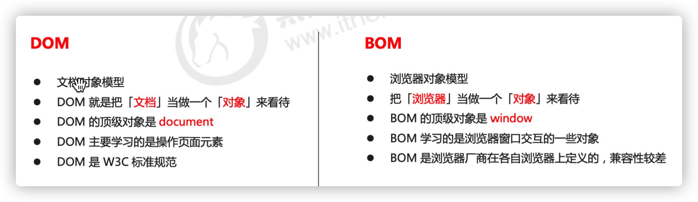

`DOM是文档对象模型，把文档当作一个对象来看待，它的顶级对象是document，我们主要学习的是操作页面元素。DOM是W3C标准规范。`

`BOM是浏览器对象模型，是把浏览器当做一个对象来看待，它的顶级对象是window，我们主要学习的是浏览器窗口交互的一些对象。BOM是浏览器厂商在各自浏览器上定义的，兼容性较差。`

**注意：window下的一个特殊属性window.name，所以我们在定义变量名称时尽量避免用name；**

### 3.3 BOM的构成

BOM 比 DOM 更大，它包含DOM

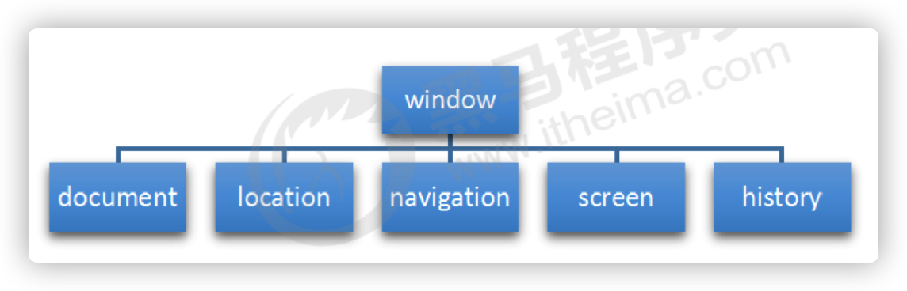

### 3.4 顶级对象 window

`window 对象 是浏览器的顶级对象`，它具有双重角色

1. 它是JS访问浏览器窗口的一个接口
2. 它是一个全局对象。定义在全局作用域中的变量、函数都会变成window对象的属性和方法。

在调用的时候可以省略window, 前面学习的对话框都属于 window 对象方法， 如 alert()、prompt() 等。

`注意：window 下的 一个特殊属性 window.name`

```js
// 全局作用域中的变量是window对象的属性
var num = 10;
console.log(num);     // 结果为：10
console.log(window.num); // 结果为：10

console.log(window.name)

// 全局作用域中的函数是window对象的方法
function fn() {
    console.log(11);
}

fn();           // 结果为：11
window.fn();       // 结果为：11
```

#### 3.4.1 window对象的常见事件

##### .4.1.1 **页面(窗口)加载事件**(2种)

**方式一**：

```js
window.onload = function(){} 

window.addEventListener("load",function(){})
```

window.onload 是窗口  (页面）加载事件, **当文档内容完全加载完成**会触发该事件(包括图像、脚本文件、CSS 
文件等), 就调用的处理函数。

注意：

1. 有了  window.onload 就可以把  JS 代码写到页面元素的上方，因为 onload 是等页面内容全部加载完毕， 再去执行处理函数。
2. window.onload 传统注册事件方式  只能写一次，如果有多个，会以最后一个  window.onload 为准。
3. 如果使用  addEventListener 则没有限制

**方式二：**

```js
document.addEventListener('DOMContentLoaded',function(){})
```

DOMContentLoaded 事件触发时，仅当DOM加载完成，不包括样式表，图片，flash等等。

Ie9以上才支持

如果页面的图片很多的话, 从用户访问到onload触发可能需要较长的时间, 交互效果就不能实现，必然影响用 
户的体验，此时用  DOMContentLoaded 事件比较合适。

```js
window.addEventListener('load', function() {
    var btn = document.querySelector('button');
    btn.addEventListener('click', function() {
        alert('点击我');
    })
})
window.addEventListener('load', function() {
    alert(22);
})
document.addEventListener('DOMContentLoaded', function() {
    alert(33);
})
```

**扩展**：

[W3.ORG](https://www.w3.org/TR/navigation-timing-2/#processing-model)

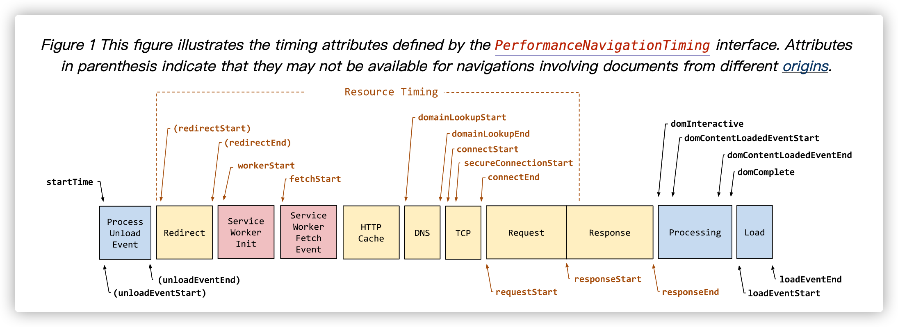

##### .4.1.2 调整窗口大小事件

```js
window.onresize = function(){}

window.addEventListener("resize",function(){})
```

window.onresize 是调整窗口大小加载事件, 当触发时就调用的处理函数。

注意：
1. 只要窗口大小发生像素变化，就会触发这个事件。
2. 我们经常利用这个事件完成响应式布局。 window.innerWidth 当前屏幕的宽度

```js
// 注册页面加载事件
window.addEventListener('load', function() {
    var div = document.querySelector('div');
    // 注册调整窗口大小事件
    window.addEventListener('resize', function() {
        // window.innerWidth 获取窗口大小
        console.log('变化了');
        if (window.innerWidth <= 800) {
            div.style.display = 'none';
        } else {
            div.style.display = 'block';
        }
    })
})
```


### 3.5 定时器

window 对象给我们提供了 2 个非常好用的方法-定时器。

- setTimeout()
- setInterval() 

#### 3.5.1 setTimeout()

##### 3.5.1.1 开启定时器

```js
window.setTimeout(function[, delay])
```

- function
  - 到期时间(`delay`毫秒)之后执行的函数, 这个函数我们也称为`回调函数callback`, （回头再调用）
- delay:
  - 延迟的毫秒数 (一秒等于1000毫秒)，函数的调用会在该延迟之后发生。如果省略该参数，delay取默认值0，意味着“马上”执行，或者尽快执行。

注意：

1. window可省略，我们一般省略它
2. 这个调用的function，可以`直接写函数`，或者`写函数名` , 或者传入可执行字符串（不要这么写，有安全风险）
3. 延迟的毫秒数省略默认是0， 如果写，必须是毫秒。
4. 因为定时器可能会有很多，所以我们经常给定时器赋值一个标识符, 也就是起一个名字。
5. setTimeout 只执行一次

```js
function tim() {
    alert('我是老王');
}
// 直接调用函数名
setTimeout(tim, 2000);
// 调用执行函数，需要加引号不推荐使用
setTimeout('tim()', 500);
// 直接调用函数
setTimeout(function () {
    alert('我是老王222');
}, 1000);
// 取名字区分不同的定时器效果
var timer1 = setTimeout(tim, 6000);
var timer2 = setTimeout(tim, 3000);
```


##### 3.5.1.2 回调函数

settimeout()这个调用函数我们也称为回调函数 callback；

普通函数按照代码顺序直接调用的，而这个函数，需要等待时间，时间到了再去调用这个函数，因此称为回调函数；

简单理解：`回调，就是回头调用的意思，上一件事干完了，再回头调用这个函数`；

例如：定时器中的调用函数，事件处理函数，也是回调函数。

以前我们讲的   element.onclick = function(){}   或者  element.addEventListener(“click”, fn);   里面的 函数也是回调函数。

```js
// 回调函数是一个匿名函数的情况
setTimeout(function() {
    console.log('时间到了');

}, 2000);
function callback() {
    console.log('爆炸了');
}
// 回调函数是一个有名函数
var timer1 = setTimeout(callback, 3000);
var timer2 = setTimeout(callback, 5000);
```


##### 3.5.1.3 eg. 5秒后关闭广告

核心思路

1. 5s之后，就把这个广告隐藏起来
2. 用定时器setTimeout

```html

<script>
    // 获取要操作的元素
    var ad = document.querySelector('.ad');
    // 开启定时器
    setTimeout(function() {
        ad.style.display = 'none';
    }, 5000);
</script>
```

##### 3.5.1.4 关闭定时器

```js
window.clearTimeout(timeoutId)
```

clearTimeout() 方法可以取消了（关闭了）setTimeout()建立（开启）的定时器；

注意：

1. window 可以省略
2. 小括号里面的参数就是定时器的标识符（也就是我们给定时器起的名字），所以我们在开启定时器的时候需要给定时器起一个名字；

```html
<button>点击我阻止爆炸</button>
<script>
    // 获取按钮
    var oBtn = document.querySelector('button');
    // 开启一个定时器
    function alt() {
        alert('爆炸了！！！')
    }
    var timer = setTimeout(alt, 3000);
    // 在回调函数执行之前就将该定时器关闭 clearTimeout()
    oBtn.addEventListener('click', function () {
        clearTimeout(timer);
    })
</script>
```

#### 3.5.2 setInterval()

##### .5.2.1 开启定时器

```js
window.setInterval(func, delay)
```

- [setInterval - MDN](https://developer.mozilla.org/zh-CN/docs/Web/API/setInterval)
- func
  - 要重复调用的函数。 每经过指定 `延迟` 毫秒后执行的`函数` 。
- delay
  - 是每次延迟的毫秒数 (一秒等于1000毫秒)，函数的每次调用会在该延迟之后发生。

setInterval()方法重复调用一个函数，每隔固定的时间就去调用一次回调函数；

> 注意：

1. window在调用的时候可以省略；
2. 调用函数可以**直接写函数**或者**写函数名**或者采取字符串‘函数名()’三种形式，第三种不推荐使用；
3. delay延迟的毫秒数如果小于10，则默认使用值为10。
4. 它返回一个时间间隔ID，该ID唯一地标识时间间隔。也可以理解为我们给它起一个名字标记。
5. setInterval() 定时执行代码

```js
// 直接写函数
setInterval(function () {
    console.log('我是老王');
}, 1000)
// 书写函数名
function lw() {
    console.log('老王最棒');
}
setInterval(lw, 1000)
// 第三种 不建议采用
setInterval('lw()', 2000)
```

##### 3.5.2.2 eg. 倒计时

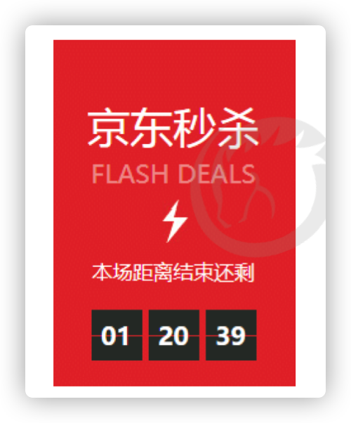

1. 这个倒计时是不断变化的，因此需要定时器来自动变化（setInterval）
2. 三个黑色盒子里面分别存放时分秒
3. 三个黑色盒子利用innerHTML 放入计算的小时分钟秒数
4. 第一次执行也是间隔毫秒数，因此刚刷新页面会有空白
5. 最好采取封装函数的方式，  这样可以先调用一次这个函数，防止刚开始刷新页面有空白问 
   题

案例分析:

01、获取两个时间戳，一个是当前时间戳nowTime，一个是未来时间戳inputTime，求出剩余时间times；

02、定义一个空的定时器timer = null，后期进行赋值定时器；

03、判断如果剩余时间times大于0说明还没有有设置好的未来时间，需要执行倒计时函数，否则就关闭定时器timer；

```html
    <div>
        <span class="day">1</span> 天
        <span class="hour">2</span> 小时
        <span class="minute">2</span> 分
        <span class="second">3</span> 秒
    </div>
    <script>
        // 1. 获取元素（时分秒盒子） 
        var hour = document.querySelector('.hour'); // 小时的黑色盒子
        var minute = document.querySelector('.minute'); // 分钟的黑色盒子
        var second = document.querySelector('.second'); // 秒数的黑色盒子
        var inputTime = +new Date('2019-5-1 18:00:00'); // 返回的是用户输入时间总的毫秒数

        countDown(); // 我们先调用一次这个函数，防止第一次刷新页面有空白 

        // 2. 开启定时器
        setInterval(countDown, 1000);
		
        function countDown() {
            var nowTime = +new Date(); // 返回的是当前时间总的毫秒数
            var times = (inputTime - nowTime) / 1000; // times是剩余时间总的秒数 
            var h = parseInt(times / 60 / 60 % 24); //时
            h = h < 10 ? '0' + h : h;
            hour.innerHTML = h; // 把剩余的小时给 小时黑色盒子
            var m = parseInt(times / 60 % 60); // 分
            m = m < 10 ? '0' + m : m;
            minute.innerHTML = m;
            var s = parseInt(times % 60); // 当前的秒
            s = s < 10 ? '0' + s : s;
            second.innerHTML = s;
        }
    </script>
```

##### 3.5.2.3 停止定时器

```js
window.clearInterval(intervalId)
```

clearInterval()方法取消了先前通过调用 setInterval()建立的定时器

注意：

1. window可以省略
2. 小括号里面的参数就是定时器的标识符（也就是我们给定时器起的名字），所以我们在开启定时器的时候需要给定时器起一个名字；

```html
    <button class="begin">开启定时器</button>
    <button class="stop">停止定时器</button>
    <script>
        var begin = document.querySelector('.begin');
        var stop = document.querySelector('.stop');
        var timer = null; // 全局变量  null是一个空对象
        begin.addEventListener('click', function() {
            timer = setInterval(function() {
                console.log('ni hao ma');

            }, 1000);
        })
        stop.addEventListener('click', function() {
            clearInterval(timer);
        })
    </script>
```


##### 3.5.2.4 eg. 发送短信

点击按钮后，该按钮60秒之内不能再次点击，防止重复发送短信

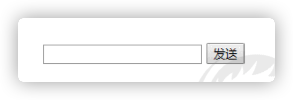

**分析：**

1. 按钮点击之后，会禁用  disabled 为true
2. 同时按钮里面的内容会变化，  注意  button 里面的内容通过  innerHTML修改
3. 里面秒数是有变化的，因此需要用到定时器
4. 定义一个变量，在定时器里面，不断递减
5. 如果变量为0 说明到了时间，我们需要停止定时器，并且复原按钮初始状态。

```html
    手机号码： <input type="number"> <button>发送</button>
    <script>
        // 按钮点击之后，会禁用 disabled 为true 
        // 同时按钮里面的内容会变化， 注意 button 里面的内容通过 innerHTML修改
        // 里面秒数是有变化的，因此需要用到定时器
        // 定义一个变量，在定时器里面，不断递减
        // 如果变量为0 说明到了时间，我们需要停止定时器，并且复原按钮初始状态
        var btn = document.querySelector('button');
        // 设置全局变量定义剩下的秒数
        var time = 3; 
        btn.addEventListener('click', function() {
          // 禁用按钮
            btn.disabled = true;
            var timer = setInterval(function() {
                if (time == 0) {
                    // 清除定时器和复原按钮
                    clearInterval(timer);
                    btn.disabled = false;
                    btn.innerHTML = '发送';
                    time = 3 // 这个3需要重新开始计算
                } else {
                    btn.innerHTML = '还剩下' + time + '秒';
                    time--;
                }
            }, 1000);

        })
    </script>
```

**代码优化一下**

```js
var btn = document.querySelector('button')
var time = 5
btn.addEventListener('click', function(){
    // 点击之后禁用按钮
    btn.disabled = true
    var fn = function(){
        if (time == 0 ){
            //清除定时器 复原按钮
            clearInterval(timer)
            btn.disabled = false
            btn.innerHTML = '发送'
            // 将时间恢复为5秒
            time = 5
        } else {
            // 模板字符串
            btn.innerHTML = `还剩下${time}秒`
            // 定时器每执行一次,time减1
            time--
        }

    }
    fn()
    var timer = setInterval(fn,1000)
})
```


### 3.6 this指向🔥

this的指向在函数定义的时候是确定不了的，`只有函数执行的时候才能确定this指向谁`。

一般情况下this的最终指向的是那个调用它的对象。

现阶段，我们先了解一下几个this指向

1. 全局作用域或者普通函数中this指向全局对象window（注意定时器里面的this指向window）

```js
console.log(this);
function fn() {
    console.log(this);
}
fn()
window.fn();
window.setTimeout(function() {
    console.log(this);
}, 1000);
```

2. 方法调用中谁调用this指向谁

```js
var o = {
    sayHi: function() {
        console.log(this); // this指向的是 o 这个对象
    }
}
o.sayHi();
var btn = document.querySelector('button');
btn.onclick = function() {
  console.log(this)
}
btn.addEventListener('click', function() {
    console.log(this); // 事件处理函数中的this指向的是btn这个按钮对象
})
```

3. 构造函数中this指向构造函数的实例

```js
function Fun() {
    console.log(this); // this 指向的是fun 实例对象
}
var fun = new Fun();
```

### 3 .7 location对象

#### 3 .7.1 什么是location对象

window对象给我们提供了一个`location属性`用于`获取或者设置窗体的URL`，并且可以用于`解析URL`，因为这个属性返回的是一个对象，所以我们将这个属性称为`location对象`；

#### 3.7.2 URL

统一资源定位符（Uniform Resource Locator, URL）是互联网上标准资源的地址。互联网上的每个文件都有一个唯一的URL，它包含的信息指出文件的位置以及浏览器应该怎么处理它。

URL 的一般语法格式为：

```js
protocol://host[:port]/path/[?query]#fragment
http://www.itcast.cn/index.html?name=andy&age=18#link
```

| 组成     | 说明                                                         |
| -------- | ------------------------------------------------------------ |
| protocol | 通信协议，常用http，ftp，maito等                             |
| host     | 主机（域名）www.itcast.cn                                    |
| port     | 端口号可选，省略时使用方案的默认端口，如http的默认端口为80   |
| path     | 路径由零个或者多个'/'符号隔开的字符串，一般用来表示主机上的一个目录或者文件地址 |
| query    | 参数，以键值对的形式通过&符号分隔开来                        |
| fragment | 片段，#后面内容常见于链接锚点                                |

#### 3.7.3 location 对象的属性

| location对象属性    | 返回值                              |
| :------------------ | ----------------------------------- |
| **location.href**   | **获取或者设置整个URL**             |
| location.host       | 返回主机（域名） www.itheima.cn     |
| location.port       | 返回端口号，如果未写 返回空字符串   |
| location.pathname   | 返回路径                            |
| **location.search** | **返回参数**                        |
| location.hash       | 返回片段 #后面内容  常见于链接 锚点 |

> 重点记住：`href` 和 `search`

eg.点击按钮打开连接

```html
    <button>点击</button>
```

```js
var btn = document.querySelector('button');
btn.addEventListener('click', function () {
  // console.log(location.href);
  location.href = 'http://www.itcast.cn';
  // 下面的方法可以在新窗口打开链接
  // window.open('http://www.itcast.cn')
})
```

#### 3.7.4 eg. 5秒自动跳转页面

案例分析：

1. 利用定时器做倒计时效果
2. 时间到了，就跳转页面，使用`location.href`

```html
<button>点击</button>
<div></div>
<script>
    var btn = document.querySelector('button');
    var div = document.querySelector('div');
    btn.addEventListener('click', function() {
        // console.log(location.href);
        location.href = 'http://www.itcast.cn';
    })
    var timer = 5;
    setInterval(function() {
        if (timer == 0) {
            location.href = 'http://www.itcast.cn';
        } else {
            div.innerHTML = '您将在' + timer + '秒钟之后跳转到首页';
            timer--;
        }
    }, 1000);
</script>
```

```js
    // 获取div
    var div = document.querySelector('div');
    // 定义一个跳转时间
    var timer = 5;
    // 开启一个定时器，每隔1秒执行一次
    setInterval(function () {
        // 如果timer等于0  就跳转页面
        if (timer == 0) {
            location.href = 'http://www.itcast.cn';
        } else {
            // 否则就进行倒计时计算
            iv.innerHTML = '您将在' + timer + '秒钟以后跳转到官网';
            timer--;
        }
    }, 1000)
```

#### 3.7.5 eg. 获取URL参数

01、第一个登录页面，提交表单，action提交到index.html页面；

02、第二个页面，可以使用第一个页面的参数，这样实现了一个数据不同页面之间的传递效果；

03、第二个页面之所以可以使用第一个页面的参数，是利用了URL里面的location.search参数；

04、在第二个页面中，需要把这个参数提取，直接用location.search即可；

05、获取的参数是以`？`开头的，我们可以使用substr(起始位置,截取的字符个数)去掉`？`

06、利用 = 号分割 键值对， split(’=‘) 返回一个数组，arr[1]

```html
    <div></div>
	<script>
        console.log(location.search); // ?uname=andy
        // 1.先去掉？  substr('起始的位置'，截取几个字符);
        var params = location.search.substr(1); // uname=andy
        console.log(params);
        // 2. 利用=把字符串分割为数组 split('=');
        var arr = params.split('=');
        console.log(arr); // ["uname", "ANDY"]
        var div = document.querySelector('div');
        // 3.把数据写入div中
        div.innerHTML = arr[1] + '欢迎您';
    </script>
```

#### 3.7.6 location常用方法（了解）

| location对象方法      | 返回值                                                       |
| --------------------- | ------------------------------------------------------------ |
| location.assign()     | 跟href一样，可以跳转页面（也称为重定向页面）,记录历史，可后退 |
| location.replace()    | 替换当前页面，因为不记录历史，所以不能后退页面               |
| **location.reload()** | 重新加载页面，相当于刷新按钮或者F5，如果参数为true是强制刷新Ctrl+F5 |

```html
    <button>点击</button>
    <script>
        var btn = document.querySelector('button');
        btn.addEventListener('click', function() {
            // 记录浏览历史，所以可以实现后退功能
            // location.assign('http://www.itcast.cn');
            // 不记录浏览历史，所以不可以实现后退功能
            // location.replace('http://www.itcast.cn');
            location.reload(true);
        })
    </script>
```

### 3.8 navigator对象

navigator 对象包含有关浏览器的信息，它有很多属性，我们最常用的是 userAgent，该属性可以返回由客户机发送服务器的 user-agent 头部的值。

下面前端代码可以判断用户那个终端打开页面，实现跳转

```js
if((navigator.userAgent.match(/(phone|pad|pod|iPhone|iPod|ios|iPad|Android|Mobile|BlackBerry|IEMobile|MQQBrowser|JUC|Fennec|wOSBrowser|BrowserNG|WebOS|Symbian|Windows Phone)/i))) {
    window.location.href = "";     //手机
 } else {
    window.location.href = "";     //电脑
 }
```

### 3.9 history对象

window对象给我们提供了一个history对象，与浏览器历史记录进行交互，该对象包含用户（在浏览器窗口中）访问过的URL。

| history对象方法 | 作用                                              |
| --------------- | ------------------------------------------------- |
| back()          | 可以后退功能                                      |
| forward()       | 前进功能                                          |
| go(参数)        | 前进后退功能，参数如果是1前进1个页面，后退1个页面 |

```js
    // 获取按钮
    var btn1 = document.querySelector('.btn1');
    btn1.addEventListener('click', function () {
        // history.back();
        history.go(-1);
    })
    var btn2 = document.querySelector('.btn2');
    btn2.addEventListener('click', function () {
        // history.forward();
        history.go(1);
    })
```


---

该知识点后延

## 3. JS执行机制🔥

### 3.1 JS是单线程的

 JavaScript语言的一大特点就是单线程，也就是说，`同一个时间段只能做一件事`。

**为什么JS是单线程的？**

这是因为javascript语言诞生的时候，为了处理页面中的用户的交互，以及操作DOM而设置的，比如我们对某个DOM元素进行添加和删除操作，不能同时进行。应该先进行添加，之后再删除；

**单线程的问题：**

单线程就意味着所有的任务需要排队（和我们排队买火车票一样）前一任务结束，才会执行另一个任务，如果前一个任务耗时很长，后一个任务就不得不一直等着。

导致的问题是：如果JS执行时间过长，这样就会造成页面渲染的不连贯，导致页面渲染加载阻塞卡顿的感觉；


### 3.2 同步任务和异步任务

单线程导致的问题就是后面的任务等待前面任务完成，如果前面任务很耗时（比如读取网络数据），后面任务不得不一直等待！！

为了解决这个问题，利用多核 CPU 的计算能力，HTML5 提出 Web Worker 标准，允许 JavaScript 脚本创建多个线程，但是子线程完全受主线程控制，且不得操作DOM。所以，这个新标准并没有改变JavaScript单线程的本质。

于是，JS 中出现了**同步任务**和**异步任务**。

https://www.cnblogs.com/jianjie/p/12181409.html

JS中所有任务可以分成两种，一种是同步任务（synchronous），另一种是异步任务（asynchronous）。

同步任务指的是：

​		 在主线程上排队执行的任务，只有前一个任务执行完毕，才能执行后一个任务；

异步任务指的是：

​	    不进入主线程、而进入”任务队列”的任务，当主线程中的任务运行完了，才会从”任务队列”取出异步任务放入主线程执行。

#### 3.2.1 同步任务

前一个任务结束后再执行后一个任务，程序的执行顺序与任务的排列顺序是一致的、同步的。

比如做饭的同步做法：我们要烧水煮饭，等水开了（10分钟之后），再去切菜，炒菜。

同步任务都在主线程上执行，形成一个**执行栈**


#### 3.2.2 异步任务

在做一件事情时，由于需要花一定的时间，在做这件事的同时，我们还可以去处理其他事情。

比如做饭的异步做法：我们在烧水的同时，利用这10分钟，去切菜，炒菜。

JS的异步是通过回调函数实现的

一般而言，异步任务有以下三种类型：

1. 普通事件，如click，resize等
2. 资源加载，如load，error等
3. 定时器，包括setTimeout，setInterval等

异步任务相关`回调函数`添加到`任务队列`中 (任务队列也称为消息队列)

> 同步和异步 https://www.runoob.com/js/js-async.html
### 3.3 JS执行机制 （事件循环）

1. 先执行`执行栈中的同步任务`

2. 异步任务（回调函数）放到任务队列中。
3. 一旦执行栈中的所有同步任务执行完毕，系统就会按次序读取`任务队列`中的异步任务，于是被读取的异步任务结束等待状态，进入执行栈，开始执行；

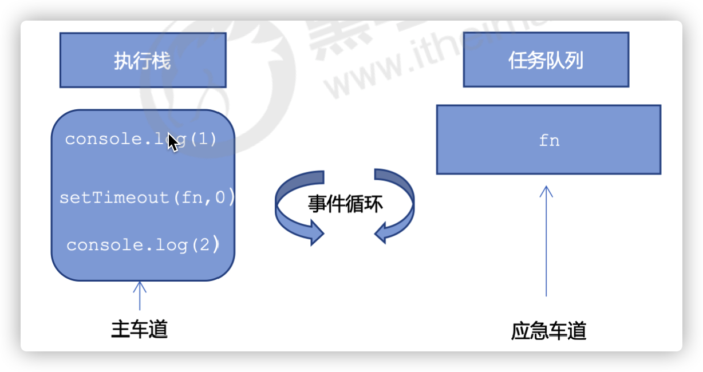

#### 3.3.1 事件循环 event loop

由于主线程不断的重复获得任务、执行任务、在获取任务、再执行任务。所以这种机制被称为`事件循环(event loop)`；

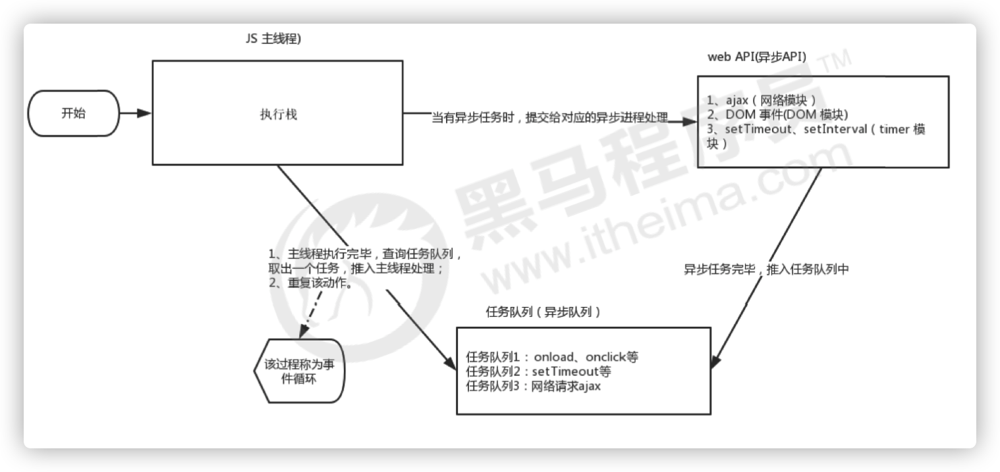

```js
 console.log(1);
 document.onclick = function() {
   console.log('click');
 }

 setTimeout(function() {
   console.log(3)
 }, 3000)
 console.log(2);
```
演示JS执行机制: http://latentflip.com/loupe
