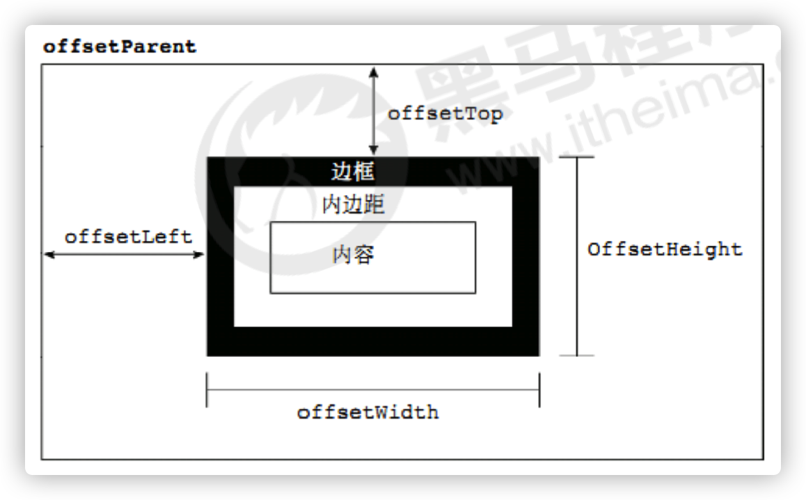
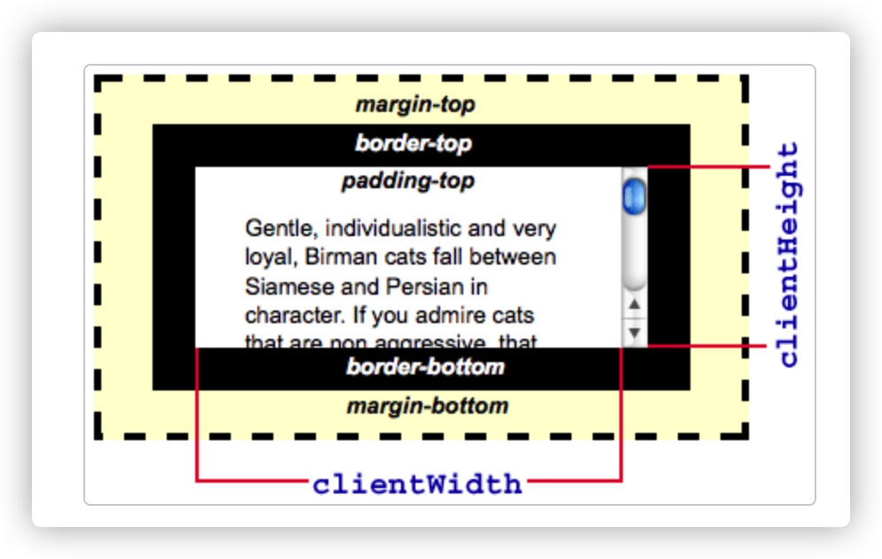
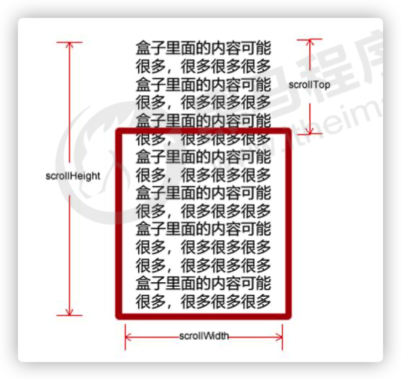

## target

1. 能够知晓JS的执行机制
2. 能够利用offset系列获取元素的坐标和大小
3. 能够说出offset和style的区别
4. 能够计算鼠标在盒子内的坐标
5. 能够说出立即执行函数的语法以及主要作用
6. 能够知晓flexible.js 每个模块的作用
7. 能够写出页面滚动事件
8. 能够写出页面被卷去头部的代码
## 1. 元素偏移量offset

### 1.1 offset简介

offset 翻译过来就是偏移量， 我们使用 offset系列相关属性可以动态的得到该元素的位置（偏移）、大小等。

1. 获得元素距离带有定位父元素的位置
2. 获得元素自身的大小（宽度高度）
3. 注意：返回的数值都不带单位



offset系列常用属性：

| offset系列属性       | 作用                                                         |
| -------------------- | ------------------------------------------------------------ |
| element.offsetParent | 返回作为该元素带有定位的父级元素，如果父级元素都没有定位则返回body |
| element.offsetTop    | 返回元素相对带有定位父元素上方的偏移                         |
| element.offsetLeft   | 返回元素相对带有定位父元素左边的偏移                         |
| element.offsetWidth  | 返回自身包括padding、border、内容区的宽度，返回数值不带单位  |
| element.offsetHeight | 返回自身包括padding、border、内容区的高度，返回数值不带单位； |

```html
    <div class="box">
        <div class="son"></div>
    </div>
    <style>
        .box {
            position: relative;
            width: 300px;
            height: 300px;
            background: pink;
            margin: 300px auto;
        }

        .son {
            width: 100px;
            height: 100px;
            background-color: palegreen;
        }
    </style>
```

```js
    // 获取元素box
    var box = document.querySelector('.box');
    var son = document.querySelector('.son');

    // 1. 可以得到元素的便宜，位置 返回的数值不带单位
    console.log(box.offsetLeft);
    console.log(box.offsetTop);
    // 如果元素没有父级盒子或者父级盒子没有定位，获取的值是元素距离了body的距离
    // 如果元素有父级而且父级元素有定位属性，获取的是元素距离父级盒子的距离；
    console.log(son.offsetLeft);
    console.log(son.offsetTop);
    //2. 可以得到元素的大小，宽度和高度 包含 padding + border + width
    console.log(son.offsetWidth);
    console.log(son.offsetHeight);
		//3. 返回带有定位的父级元素 否则返回的是body
	  console.log(son.offsetParent);
    console.log(son.parentNode);  //返回父亲，是最近一级的父级，不管有没有定位
```

### 1.2 offset 与 style 区别

| offset                                           | style                                       |
| ------------------------------------------------ | ------------------------------------------- |
| offset可以得到任意样式表中的样式值               | style只能得到行内样式表中的样式值           |
| 获得的数值没有单位                               | style.width获得的是**带有单位的字符串**     |
| offsetWidth 包含padding+border+width             | style.width获得不包含padding和border的值    |
| offsetWidth等属性是只读属性，只能获取不能赋值    | style.width是可读写属性，可以获得也可以赋值 |
| 我们**想要获取元素的大小和位置，用offset更合适** | 我们想**给元素更改值，用style**             |

```css
.box {
  width: 200px;
  height: 200px;
  background-color: pink;
  padding: 10px;
}
```

```html
<div class="box" style="width: 200px;"></div>
<script>
  // offset与style的区别
  var box = document.querySelector('.box');
  console.log(box.offsetWidth);
  // style只能获取到行内样式的width
  console.log(box.style.width);
  // box.offsetWidth = '300px';
  box.style.width = '300px';
</script>
```

### 1.3 eg. 获取鼠标在盒子内的坐标

1. 我们在盒子内点击，想要得到鼠标距离盒子左右的距离。
2. 首先得到鼠标在页面中的坐标（e.pageX, e.pageY）
3. 其次得到盒子在页面中的距离 ( box.offsetLeft, box.offsetTop)
4. 用鼠标距离页面的坐标减去盒子在页面中的距离，得到 鼠标在盒子内的坐标
5. 如果想要移动一下鼠标，就要获取最新的坐标，使用鼠标移动事件mousemove

```js
var box = document.querySelector('.box');
box.addEventListener('mousemove', function(e) {
    var x = e.pageX - this.offsetLeft;
    var y = e.pageY - this.offsetTop;
    this.innerHTML = 'x坐标是' + x + ' y坐标是' + y;
})
```


### 1.4 eg. 模态框拖拽

弹出框，我们也称为模态框。

1. 点击弹出层， 模态框和遮挡层就会显示出来 display:block; 
2. 点击关闭按钮，模态框和遮挡层就会隐藏起来 display:none; 
3. 在页面中拖拽的原理： 鼠标按下并且移动， 之后松开鼠标
4. 触发事件是鼠标按下 mousedown， 鼠标移动mousemove 鼠标松开 mouseup
5. 拖拽过程: 鼠标移动过程中，获得最新的值赋值给模态框的left和top值， 这样模态框可以跟着鼠标走了 
6. 鼠标按下触发的事件源是 最上面一行，就是   id 为 title 
7. 鼠标的坐标 减去 鼠标在盒子内的坐标， 才是模态框真正的位置
8. 鼠标按下，我们要得到鼠标在盒子的坐标。
9. 鼠标移动，就让模态框的坐标   设置为   ：
   - 鼠标坐标 减去盒子坐标即可，注意移动事件写到按下事件里面。
10. 鼠标松开，就停止拖拽，就是可以让鼠标移动事件解除

```js
// 1. 获取元素
var login = document.querySelector('.login');
var mask = document.querySelector('.login-bg');
var link = document.querySelector('#link');
var closeBtn = document.querySelector('#closeBtn');
var title = document.querySelector('#title');
// 2. 点击弹出层这个链接 link  让mask 和login 显示出来
link.addEventListener('click', function() {
        mask.style.display = 'block';
        login.style.display = 'block';
    })
    // 3. 点击 closeBtn 就隐藏 mask 和 login 
closeBtn.addEventListener('click', function() {
        mask.style.display = 'none';
        login.style.display = 'none';
    })
    // 4. 开始拖拽
    // (1) 当我们鼠标按下， 就获得鼠标在盒子内的坐标
title.addEventListener('mousedown', function(e) {
    var x = e.pageX - login.offsetLeft;
    var y = e.pageY - login.offsetTop;
    // (2) 鼠标移动的时候，把鼠标在页面中的坐标，减去 鼠标在盒子内的坐标就是模态框的left和top值
    document.addEventListener('mousemove', move)

    function move(e) {
        login.style.left = e.pageX - x + 'px';
        login.style.top = e.pageY - y + 'px';
    }
    // (3) 鼠标弹起，就让鼠标移动事件移除
    document.addEventListener('mouseup', function() {
        document.removeEventListener('mousemove', move);
    })
})
```

### 1.5 eg. 京东放大镜效果

> detail.css

```css
.mask {
    display: none;
    position: absolute;
    top: 0;
    left: 0;
    width: 300px;
    height: 300px;
    background: #FEDE4F;
    opacity: .5;
    border: 1px solid #ccc;
    cursor: move;
}

.big {
    display: none;
    position: absolute;
    left: 410px;
    top: 0;
    width: 500px;
    height: 500px;
    background-color: pink;
    z-index: 999;
    border: 1px solid #ccc;
    overflow: hidden;
}

.big img {
    position: absolute;
    top: 0;
    left: 0;
}
```

整个案例可以分为三个功能模块

1. `鼠标经过小图片盒子， 黄色的遮挡层 和 大图片盒子显示，离开隐藏2个盒子功能`
2. 黄色的遮挡层跟随鼠标功能。 
3. 移动黄色遮挡层，大图片跟随移动功能。

**案例分析**：

1. 黄色的遮挡层跟随鼠标功能。
2. `把鼠标坐标给遮挡层不合适。因为遮挡层坐标以父盒子为准`。
3. 首先是获得鼠标在盒子的坐标。 
4. 之后把数值给遮挡层做为left 和top值。
5. 此时用到鼠标移动事件，但是还是在小图片盒子内移动。
6. 发现，遮挡层位置不对，需要再减去盒子自身高度和宽度的一半。
7. 遮挡层不能超出小图片盒子范围。
8. 如果小于零，就把坐标设置为0
9. 如果大于遮挡层最大的移动距离，就把坐标设置为最大的移动距离
10. 遮挡层的最大移动距离：小图片盒子宽度 减去 遮挡层盒子宽度

```js
window.addEventListener('load', function() {
    var preview_img = document.querySelector('.preview_img');
    var mask = document.querySelector('.mask');
    var big = document.querySelector('.big');
    // 1. 当我们鼠标经过 preview_img 就显示和隐藏 mask 遮挡层 和 big 大盒子
    preview_img.addEventListener('mouseover', function() {
        mask.style.display = 'block';
        big.style.display = 'block';
    })
    preview_img.addEventListener('mouseout', function() {
            mask.style.display = 'none';
            big.style.display = 'none';
        })
        // 2. 鼠标移动的时候，让黄色的盒子跟着鼠标来走
    preview_img.addEventListener('mousemove', function(e) {
        // (1). 先计算出鼠标在盒子内的坐标（preview_img内的坐标）
        var x = e.pageX - this.offsetLeft;  // this.offsetLeft是固定不变
        var y = e.pageY - this.offsetTop;
        // console.log(x, y);
        // (2) 减去盒子高度 300的一半 是 150 就是我们mask 的最终 left 和top值了
        // (3) 我们mask 移动的距离
        var maskX = x - mask.offsetWidth / 2;  // 保证鼠标在盒子中间
        var maskY = y - mask.offsetHeight / 2; // 盒子高度的一半
        // (4) 如果x 坐标小于了0 就让他停在0 的位置
        // 遮挡层的最大移动距离
        var maskMax = preview_img.offsetWidth - mask.offsetWidth;
        if (maskX <= 0) {
            maskX = 0;
        } else if (maskX >= maskMax) {
            maskX = maskMax;
        }
        if (maskY <= 0) {
            maskY = 0;
        } else if (maskY >= maskMax) {
            maskY = maskMax;
        }
        mask.style.left = maskX + 'px';
        mask.style.top = maskY + 'px';
        // 3. 大图片的移动距离 = 遮挡层移动距离 * 大图片最大移动距离 / 遮挡层的最大移动距离
        // 大图
        var bigImg = document.querySelector('.bigImg');
        // 大图片最大移动距离
        var bigMax = bigImg.offsetWidth - big.offsetWidth;
        // 大图片的移动距离 X Y
        var bigX = maskX * bigMax / maskMax;
        var bigY = maskY * bigMax / maskMax;
      	// 定位
        bigImg.style.left = -bigX + 'px';
        bigImg.style.top = -bigY + 'px';

    })

})
```

### 1.6 mouseover和mouseenter区别

```js
var father = document.querySelector('.father');
var son = document.querySelector('.son');
father.addEventListener('mouseenter', function() {
    console.log(11);

})
```

- 当鼠标移动到元素上时就会触发mouseenter 事件

类似 mouseover，它们两者之间的差别是

- mouseover 鼠标经过自身盒子会触发，经过子盒子还会触发。
- mouseenter  只会经过自身盒子触发 ，之所以这样，就是因为mouseenter不会冒泡
- 跟mouseenter搭配鼠标离开 mouseleave  同样不会冒泡

## 2. 元素可视区 client 系列

### 2.1 client简介

client 翻译过来就是客户端，我们使用 client 系列的相关属性来获取元素可视区的相关信息。通过 client
系列的相关属性可以动态的得到该元素的边框大小、元素大小等。

clientWidth 和 offsetWidth 最大的区别就是 不包含边框

| client属性               | 作用                                                         |
| ------------------------ | ------------------------------------------------------------ |
| element.clientTop        | 返回元素上边框的大小                                         |
| element.clientLeft       | 返回元素左边边框的大小                                       |
| **element.clientWidth**  | 返回自身包括padding。内容的宽度，不含边框，返回数值不带单位  |
| **element.clientHeight** | 返回自身包括padding、内容区的高度，不含边框，返回数值不带单位 |

- 常用clientWidth 和 clientHeight - [MDN](https://developer.mozilla.org/zh-CN/docs/Web/API/Element/clientWidth)



### 2.2 立即执行函数

**立即执行函数**：不需要调用，立马能够自己执行的函数

**写法：**

```js
// 第二个小括号可以看作是调用函数，传入的参数可以看作实参
(function(){})() 
// 或者
(function(){}())
```

**主要作用：创建一个独立的作用域，避免了命名冲突问题。

```js
// 1.立即执行函数: 不需要调用，立马能够自己执行的函数
function fn() {
    console.log(1);
}
fn();
// 2. 写法 也可以传递参数进来
// 1.(function() {})()    或者  2. (function(){}());
(function(a, b) {
    console.log(a + b);
    var num = 10;
})(1, 2); // 第二个小括号可以看做是调用函数
(function sum(a, b) {
    console.log(a + b);
    var num = 10; // 局部变量
}(2, 3));
```


### 2.3 淘宝flexible.js源码

- **物理像素**：物理像素又被称为设备像素，他是显示设备中一个最微小的物理部件。每个像素可以根据操作系统设置自己的颜色和亮度。正是这些设备像素的微小距离欺骗了我们肉眼看到的图像效果。
- **设备独立像素**：也称为密度无关像素，可以认为是计算机坐标系统中的一个点，这个点代表一个可以由程序使用的虚拟像素(比如说CSS像素)，然后由相关系统转换为物理像素。

- **设备像素比**：简称为**dpr**，其定义了物理像素和设备独立像素的对应关系。它的值可以按此公式计算得到：设备像素比 ＝ 物理像素 / 设备独立像素 （安卓一般为：1；iPhone为2或者3）

下面三种情况都会刷新页面都会触发 load 事件。

1. a标签的超链接
2. F5或者刷新按钮（强制刷新）
3. 前进后退按钮

但是 火狐中，有个特点，有个“往返缓存”，这个缓存中不仅保存着页面数据，还保存了DOM和JavaScript的状态；实际上是将整个页面都保存在了内存里。

所以此时后退按钮不能刷新页面。

此时可以使用 pageshow事件来触发。这个事件在页面显示时触发，无论页面是否来自缓存。在重新加载页面中，pageshow会在load事件触发后触发；根据事件对象中的persisted来判断是否是缓存中的页面触发的pageshow事件.

注意pageshow这个事件给window添加。

```js
(function flexible(window, document) {
    // 获取的html 的根元素
    var docEl = document.documentElement
        // dpr 物理像素比
    var dpr = window.devicePixelRatio || 1

    // adjust body font size  设置我们body 的字体大小
    function setBodyFontSize() {
        // 如果页面中有body 这个元素 就设置body的字体大小
        if (document.body) {
            document.body.style.fontSize = (12 * dpr) + 'px'
        } else {
            // 如果页面中没有body 这个元素，则等着 我们页面主要的DOM元素加载完毕再去设置body
            // 的字体大小
            document.addEventListener('DOMContentLoaded', setBodyFontSize)
        }
    }
    setBodyFontSize();

    // set 1rem = viewWidth / 10    设置我们html 元素的文字大小
    function setRemUnit() {
        var rem = docEl.clientWidth / 10
        docEl.style.fontSize = rem + 'px'
    }

    setRemUnit()

    // reset rem unit on page resize  当我们页面尺寸大小发生变化的时候，要重新设置下rem 的大小
    window.addEventListener('resize', setRemUnit)
        // pageshow 是我们重新加载页面触发的事件
    window.addEventListener('pageshow', function(e) {
        // e.persisted 返回的是true 就是说如果这个页面是从缓存取过来的页面，也需要从新计算一下rem 的大小
        console.log(e.persisted)
        if (e.persisted) {
            setRemUnit()
        }
    })

    // detect 0.5px supports  有些移动端的浏览器不支持0.5像素的写法
    if (dpr >= 2) {
        var fakeBody = document.createElement('body')
        var testElement = document.createElement('div')
        testElement.style.border = '.5px solid transparent'
        fakeBody.appendChild(testElement)
        docEl.appendChild(fakeBody)
        if (testElement.offsetHeight === 1) {
            docEl.classList.add('hairlines')
        }
        docEl.removeChild(fakeBody)
    }
}(window, document))

```


## 3. 元素滚动 scroll 系列

### 3.1 scroll简介

scroll 翻译过来就是滚动，我们使用 scroll 系列的相关属性可以动态的得到该元素的大小、滚动距离等。

| scroll属性           | 作用                                           |
| -------------------- | ---------------------------------------------- |
| element.scrollTop    | 返回被卷上去的上侧距离，返回数值不带单位       |
| element.scrollLeft   | 返回被卷去的左侧距离，返回数值不带单位         |
| element.scrollWidth  | 返回自身实际的宽度，不含边框，返回数值不带单位 |
| element.scrollHeight | 返回自身实际的高度，不含边框，返回数值不带单位 |




### 3.2 获取页面滚动距离

**页面被卷去的头部**

如果浏览器的高（或宽）度不足以显示整个页面时，会自动出现滚动条。当滚动条向下滚动时，页面上面被隐藏掉的高度，我们就称为页面被卷去的头部。滚动条在滚动时会触发 onscroll事件。

`window.pageYOffset 可以获得页面document被卷去的头部`；

`window.pageXOffset  可以获取页面document被卷去的左侧`；

```js
    document.addEventListener('scroll', function () {
        console.log(window.pageYOffset);
    })
```

**兼容性处理**

需要注意的是，获取页面被卷去的头部高度，有兼容性问题，因此通常有如下几种写法：

1. 声明了 DTD，使用 document.documentElement.scrollTop
2. 未声明 DTD，使用  document.body.scrollTop
3. `新方法 window.pageYOffset和 window.pageXOffset`，IE9 开始支持


**DTD (Document Type Definition)** 

所有 HTML 文档必须以 `<!DOCTYPE>` 声明开头。

该声明并非一个 HTML 标签。它是一条“信息”，告知浏览器期望的文档类型。

DOCTYPE是document type(文档类型)的简写，用来说明你用的XHTML或者HTML是什么版本。DOCTYPE声明必须放在每一个XHTML文档最顶部，在所有代码和标识之上。

```js
// 兼容IE 6 7 8； 
function getScroll() {
    return {
        left: window.pageXOffset || document.documentElement.scrollLeft || document.body.scrollLeft || 0,
        top: window.pageYOffset || document.documentElement.scrollTop || document.body.scrollTop || 0
    };
}
//  使用getScroll().left 
// var pageScrollTop = getScroll().top
```

> `一般情况下， 我们直接使用window.pageYOffset就能获取页面滚动被卷去的头部高度`

当需要支持低版本IE：**调用兼容函数：getScroll().left  getScroll().top**


### 3.3 eg. 仿淘宝固定侧边栏

1. 原先侧边栏是绝对定位
2. 当页面滚动到一定位置，侧边栏改为固定定位
3. 页面继续滚动，会让 返回顶部显示出来

**案例分析**:

1. 需要用到页面滚动事件 scroll  因为是页面滚动，所以事件源是document
2. 滚动到某个位置，就是判断页面被卷去的上部值。
3. `页面被卷去的头部：可以通过window.pageYOffset 获得`  如果是被卷去的左侧window.pageXOffset
4. 注意，元素被卷去的头部是`element.scrollTop`  , 如果是页面被卷去的头部 则是 window.pageYOffset
5. 其实这个值 可以通过盒子的 offsetTop可以得到，如果大于等于这个值，就可以让盒子固定定位了

#### 3.2.1 part one

```js
// 1. 获取元素
var sliderbar = document.querySelector('.slider-bar');
// 2. 页面滚动事件 scroll
document.addEventListener('scroll', function() {
    // console.log(11);
    // window.pageYOffset 页面被卷去的头部
    // console.log(window.pageYOffset);
    // 3 .当我们页面被卷去的头部大于等于了 170 此时 侧边栏就要改为固定定位
    if (window.pageYOffset >= 170) {
        sliderbar.style.position = 'fixed';
    } else {
        sliderbar.style.position = 'absolute';
    }
}
```

#### 3.2.2 part two

```js
//1. 获取元素
var sliderbar = document.querySelector('.slider-bar');
var banner = document.querySelector('.banner');
// banner.offestTop 就是被卷去头部的大小 一定要写到滚动的外面
var bannerTop = banner.offsetTop
    // 当我们侧边栏固定定位之后应该变化的数值
var sliderbarTop = sliderbar.offsetTop - bannerTop;
// 获取main 主体元素
var main = document.querySelector('.main');
var goBack = document.querySelector('.goBack');
var mainTop = main.offsetTop;
// 2. 页面滚动事件 scroll
document.addEventListener('scroll', function() {
    // console.log(11);
    // window.pageYOffset 页面被卷去的头部
    // console.log(window.pageYOffset);
    // 3 .当我们页面被卷去的头部大于等于了 172 此时 侧边栏就要改为固定定位
    if (window.pageYOffset >= bannerTop) {
        sliderbar.style.position = 'fixed';
        sliderbar.style.top = sliderbarTop + 'px';
    } else {
        sliderbar.style.position = 'absolute';
        sliderbar.style.top = '300px';
    }
    // 4. 当我们页面滚动到main盒子，就显示 goback模块
    if (window.pageYOffset >= mainTop) {
        goBack.style.display = 'block';
    } else {
        goBack.style.display = 'none';
    }

})
```

## 4. 三大系列总结

| 三大系列对比   | 作用                                                         |
| -------------- | ------------------------------------------------------------ |
| el.offsetWidth | 返回自身包括padding、**边框**、内容区的宽度、返回值不带单位  |
| el.clientWidth | 返回自身包括padding、内容区的宽度、**不含边框**，返回值不带单位 |
| el.scrollWidth | 返回自身实际的宽度、**不含边框**、返回值不带单位, **包含了内容超出的部分** |

他们主要用法：

1.offset系列 经常用于获得元素位置   ` offsetLeft  offsetTop`

2.client经常用于获取元素大小 ` clientWidth clientHeight`

3.scroll 经常用于获取滚动距离 `scrollTop  scrollLeft  `

4.`注意页面滚动的距离通过 window.pageXOffset`  获得


## 5. 动画原理

### 5.1 基本原理

> 核心原理：通过定时器 setInterval() 不断移动盒子位置。

实现步骤：

1. 获得盒子当前位置
2. 让盒子在当前位置加上1个移动距离
3. 利用定时器不断重复这个操作
4. 加一个结束定时器的条件
5. 注意此元素需要添加定位，才能使用element.style.left


```js
var div = document.querySelector('div');
var timer = setInterval(function() {
    if (div.offsetLeft >= 400) {
        // 停止动画 本质是停止定时器
        clearInterval(timer);
    }
    div.style.left = div.offsetLeft + 1 + 'px';
}, 30);
```

### 5.2 动画函数简单封装

注意需要传递2个参数， `动画对象` 和 `移动到的距离`

注意：要定位 `position：absolute`

```js
// 简单动画函数封装obj目标对象 target 目标位置
function animate(obj, target) {
    var timer = setInterval(function() {
        if (obj.offsetLeft >= target) {
            // 停止动画 本质是停止定时器
            clearInterval(timer);
        }
        obj.style.left = obj.offsetLeft + 1 + 'px';

    }, 30);
}

var div = document.querySelector('div');
var span = document.querySelector('span');
// 调用函数
animate(div, 300);
animate(span, 200);
```

### 5.3 动画封装优化

- 给不同元素记录不同定时器

如果多个元素都调用动画函数，每次都要var声明定时器，这样非常浪费内存空间，我们可以给不同元素使用不用的定时器，让自己专门有自己的定时器；

原理：利用JS是一门动态语言，可以很方便的给当前对象添加属性；

```js
//    <button>点击我就走</button>
//    <div class="box"></div>
// var obj = {};
// obj.name = 'andy';
// 简单动画函数封装obj目标对象 target 目标位置
// 给不同的元素指定了不同的定时器
function animate(obj, target) {
    // 当我们不断的点击按钮，这个元素的速度会越来越快，因为开启了太多的定时器
    // 解决方案就是 让我们元素只有一个定时器执行
    // 先清除以前的定时器，只保留当前的一个定时器执行
    clearInterval(obj.timer);
    obj.timer = setInterval(function() {
        if (obj.offsetLeft >= target) {
            // 停止动画 本质是停止定时器
            clearInterval(obj.timer);
        }
        obj.style.left = obj.offsetLeft + 1 + 'px';
    }, 30);
}

var div = document.querySelector('div');
var span = document.querySelector('span');
var btn = document.querySelector('button');
// 调用函数
animate(div, 300);
btn.addEventListener('click', function() {
    animate(span, 200);
})
```

