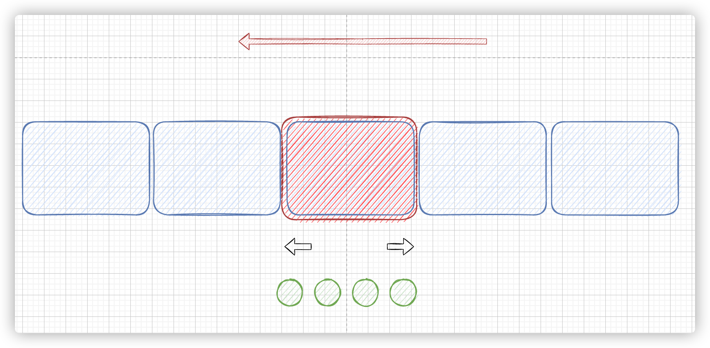
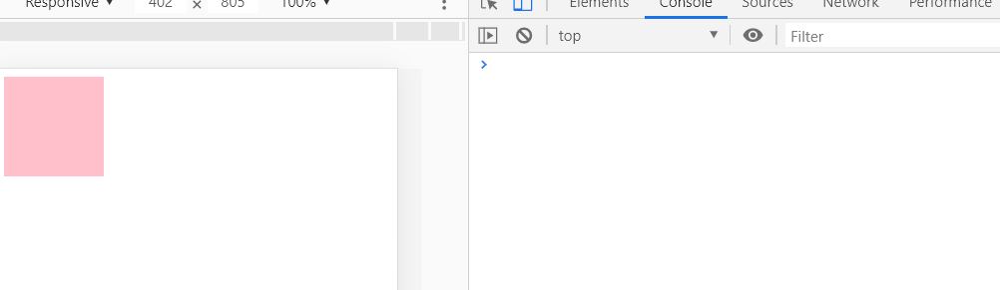

## 学习目标

1. 能够说出动画的原理
2. 能够封装简单的动画函数
3. 能够说出缓动动画的实现原理
4. 能够封装缓动动画函数
5. 能够给缓动动画添加回调函数

## 1. 动画原理

### 1.1 基本原理

> 核心原理：通过定时器 setInterval() 不断移动盒子位置。

实现步骤：

1. 获得盒子当前位置
2. 让盒子在当前位置加上1个移动距离
3. 利用定时器不断重复这个操作
4. 加一个结束定时器的条件
5. 注意此元素需要添加定位，才能使用element.style.left


```js
var div = document.querySelector('div');
var timer = setInterval(function() {
    if (div.offsetLeft >= 400) {
        // 停止动画 本质是停止定时器
        clearInterval(timer);
    }
    div.style.left = div.offsetLeft + 1 + 'px';
}, 30);
```

### 1.2 动画函数简单封装

注意需要传递2个参数， `动画对象` 和 `移动到的距离`

注意：要定位 `position：absolute`

```js
/* var timer = setInterval(function() {
    if (div.offsetLeft >= 400) {
        // 停止动画 本质是停止定时器
        clearInterval(timer);
    }
    div.style.left = div.offsetLeft + 1 + 'px';
}, 30);
*/
// 简单动画函数封装obj目标对象 target 目标位置
// 为了解决定时器叠加，我们必须要先清除定时器，只保留当前的一个定时器
function animate(obj, target) {
    var timer = setInterval(function() {
        if (obj.offsetLeft >= target) {
            // 停止动画 本质是停止定时器
            clearInterval(timer);
        }
        obj.style.left = obj.offsetLeft + 1 + 'px';

    }, 30);
}

var div = document.querySelector('div');
var span = document.querySelector('span');
// 调用函数
animate(div, 300);
animate(span, 200);
```

### 1.3 动画优化

如果多个元素都调用动画函数，每次都要var声明定时器，这样非常浪费内存空间，我们可以给不同元素使用不用的定时器，让自己专门有自己的定时器；

原理：利用JS是一门动态语言，可以很方便的给当前对象添加属性；

- 给不同元素记录不同定时器

```js
//    <button>点击我就走</button>
//    <div class="box"></div>
// var obj = {};
// obj.name = 'andy';
// 简单动画函数封装obj目标对象 target 目标位置
// 给不同的元素指定了不同的定时器
function animate(obj, target) {
    // 当我们不断的点击按钮，这个元素的速度会越来越快，因为开启了太多的定时器
    // 解决方案就是 让我们元素只有一个定时器执行
    // 先清除以前的定时器，只保留当前的一个定时器执行
    clearInterval(obj.timer);
    obj.timer = setInterval(function() {
        if (obj.offsetLeft >= target) {
            // 停止动画 本质是停止定时器
            clearInterval(obj.timer);
        }
        obj.style.left = obj.offsetLeft + 1 + 'px';
    }, 30);
}

var div = document.querySelector('div');
var span = document.querySelector('span');
var btn = document.querySelector('button');
// 调用函数
animate(div, 300);
btn.addEventListener('click', function() {
    animate(span, 200);
})
```

### 1.4 缓动效果原理

**原理：缓动动画就是让元素运动速度有所变化，最常见的是让速度慢慢停下来**

思路：

1. 让盒子每次移动的距离慢慢变小，速度就会慢慢落下来。
2. 核心算法： (目标值 - 现在的位置)   /  10    作为每次移动的距离步长
3. 停止的条件是： 让当前盒子位置等于目标位置就停止定时器  
4. 注意步长值需要取整  

```html
<style>
    .box{
        width: 100px;
        height: 100px;
        background: skyblue;
        position: absolute;
        left: 0;
    }
</style>
<body>
    <button>点我它就走</button>
    <div class="box"></div>
    <script>
        var btn = document.querySelector('button')
        var box = document.querySelector('.box')
        //  缓动动画
        /* 
        1. 让盒子每次移动的距离慢慢变小，速度就会慢慢落下来。
        2. 核心算法： (目标值 - 现在的位置)   /  10    作为每次移动的距离步长
        3. 停止的条件是： 让当前盒子位置等于目标位置就停止定时器  
        4. 注意步长值需要取整  
        */
        function animate(obj, target) {
          // 为了解决定时器叠加，我们必须要先清除定时器，只保留当前的一个定时器
            clearInterval(obj.timer)
            obj.timer = setInterval(function () {
                // 步长值写在定时器里面
                var step = (target - obj.offsetLeft) / 10
                if (obj.offsetLeft == target) {
                    clearInterval(obj.timer)
                } else {
                    // 这里要写在else里面
                    // 把每次加1的步长值改为慢慢变小的值
                    // 步长公式  (目标值 - 现在位置) / 10
                    obj.style.left = obj.offsetLeft + step + 'px'
                }
            },30)
        }
        // animate(box, 300)
        btn.addEventListener('click', function() {
            animate(box, 500)
        })
        // 匀速动画 就是盒子当前的位置 + 固定的值
        // 缓动动画就是 盒子当前的位置 + 变化的值 (目标值 - 现在的位置) / 10
    </script>
</body>
```

### 1.5 缓动动画多个目标值移动

1. 先处理数据不为整数的问题
2. 可以让动画函数从 800 移动到 500。

当我们点击按钮时候，判断步长是正值还是负值

1.    如果是正值，则步长 往大了取整
2.    如果是负值，则步长 向小了取整

```html
<style>
    .box{
        width: 100px;
        height: 100px;
        background: skyblue;
        position: absolute;
        left: 0;
    }
</style>
<body>
    <button>点我回到0</button>
    <button>点我移动500</button>
    <button>点我移动800</button>
    <div class="box"></div>
    <script>
        // var btn = document.querySelector('button')
        var box = document.querySelector('.box')
        //  缓动动画
        /* 
        1. 让盒子每次移动的距离慢慢变小，速度就会慢慢落下来。
        2. 核心算法： (目标值 - 现在的位置)   /  10    作为每次移动的距离步长
        3. 停止的条件是： 让当前盒子位置等于目标位置就停止定时器  
        4. 注意步长值需要取整  
        */
        function animate(obj, target) {
            clearInterval(obj.timer)
            obj.timer = setInterval(function () {
                // 步长值写在定时器里面
                // 把我们的步长改为整数,不要出现小数的问题(查看elements,496.4)
                var step = (target - obj.offsetLeft) / 10
                // 如果是正值就用Math.ceil(step)向上取整,如果是负值就用Math.floor(step)向下取整
                step = step > 0 ? Math.ceil(step) : Math.floor(step)
                if (obj.offsetLeft == target) {
                    clearInterval(obj.timer)
                } else {
                    // 这里要写在else里面
                    // 把每次加1的步长值改为慢慢变小的值
                    // 步长公式  (目标值 - 现在位置) / 10
                    obj.style.left = obj.offsetLeft + step + 'px'
                }
            },30)
        }
        // 获取元素
        var btns = document.querySelectorAll('button')
        // animate(box, 300)
        btns[0].addEventListener('click', function() {
            animate(box, 0)
        })
        btns[1].addEventListener('click', function() {
            animate(box, 500)
        })
        btns[2].addEventListener('click', function() {
            animate(box, 800)
        })
        // 匀速动画 就是盒子当前的位置 + 固定的值
        // 缓动动画就是 盒子当前的位置 + 变化的值 (目标值 - 现在的位置) / 10
    </script>
</body>
```

### 1.6 动画的回调函数

回调函数原理：**函数可以作为一个参数。将这个函数作为参数传到另一个函数里面，当那个函数执行完之后，再执行传进去的这个函数，这个过程就叫做回调。**

回调函数写的位置：定时器结束的位置。

```html
    <style>
        div {
            position: absolute;
            left: 0;
            width: 100px;
            height: 100px;
            background-color: pink;
        }
        
        span {
            position: absolute;
            left: 0;
            top: 200px;
            display: block;
            width: 150px;
            height: 150px;
            background-color: purple;
        }
    </style>
</head>

<body>
    <button class="btn500">点击夏雨荷到500</button>
    <button class="btn800">点击夏雨荷到800</button>
    <span>夏雨荷</span>
    <script>
        // 缓动动画函数封装obj目标对象 target 目标位置
        // 思路：
        // 1. 让盒子每次移动的距离慢慢变小， 速度就会慢慢落下来。
        // 2. 核心算法：(目标值 - 现在的位置) / 10 做为每次移动的距离 步长
        // 3. 停止的条件是： 让当前盒子位置等于目标位置就停止定时器
        function animate(obj, target, callback) {
            // console.log(callback);  callback = function() {}  调用的时候 callback()

            // 先清除以前的定时器，只保留当前的一个定时器执行
            clearInterval(obj.timer);
            obj.timer = setInterval(function() {
                // 步长值写到定时器的里面
                // 把我们步长值改为整数 不要出现小数的问题
                // var step = Math.ceil((target - obj.offsetLeft) / 10);
                var step = (target - obj.offsetLeft) / 10;
                step = step > 0 ? Math.ceil(step) : Math.floor(step);
                if (obj.offsetLeft == target) {
                    // 停止动画 本质是停止定时器
                    clearInterval(obj.timer);
                    // 回调函数写到定时器结束里面
                    if (callback) {
                        // 调用函数
                        callback();
                    }
                }
                // 把每次加1 这个步长值改为一个慢慢变小的值  步长公式：(目标值 - 现在的位置) / 10
                obj.style.left = obj.offsetLeft + step + 'px';

            }, 15);
        }
        var span = document.querySelector('span');
        var btn500 = document.querySelector('.btn500');
        var btn800 = document.querySelector('.btn800');

        btn500.addEventListener('click', function() {
            // 调用函数
            animate(span, 500);
        })
        var cb = function() {
            alert('你好吗');
            span.style.backgroundColor = 'red';
        }
        btn800.addEventListener('click', function() {
                // 调用函数
                animate(span, 800, function() {
                    // alert('你好吗');
                    span.style.backgroundColor = 'red';
                });
//          			animate(span, 800, cb)
            })
            // 匀速动画 就是 盒子是当前的位置 +  固定的值 10 
            // 缓动动画就是  盒子当前的位置 + 变化的值(目标值 - 现在的位置) / 10）
    </script>
</body>
```

### 1.7 京东动画效果

1. animate.js 单独提取出来供以后使用

```js
function animate(obj, target, callback) {
    // console.log(callback);  callback = function() {}  调用的时候 callback()

    // 先清除以前的定时器，只保留当前的一个定时器执行
    clearInterval(obj.timer);
    obj.timer = setInterval(function() {
        // 步长值写到定时器的里面
        // 把我们步长值改为整数 不要出现小数的问题
        // var step = Math.ceil((target - obj.offsetLeft) / 10);
        var step = (target - obj.offsetLeft) / 10;
        step = step > 0 ? Math.ceil(step) : Math.floor(step);
        if (obj.offsetLeft == target) {
            // 停止动画 本质是停止定时器
            clearInterval(obj.timer);
            // 回调函数写到定时器结束里面
            if (callback) {
                // 调用函数
                callback();
            }
        }
        // 把每次加1 这个步长值改为一个慢慢变小的值  步长公式：(目标值 - 现在的位置) / 10
        obj.style.left = obj.offsetLeft + step + 'px';

    }, 15);
}
```

```css
        .sliderbar {
            position: fixed;
            right: 0;
            bottom: 100px;
            width: 40px;
            height: 40px;
            text-align: center;
            line-height: 40px;
            cursor: pointer;
            color: #fff;
        }
        
        .con {
            position: absolute;
            left: 0;
            top: 0;
            width: 200px;
            height: 40px;
            background-color: purple;
            z-index: -1;
        }
```

```html
    <div class="sliderbar">
        <span>←</span>
        <div class="con">问题反馈</div>
    </div>
```

```js
// 1. 获取元素
var sliderbar = document.querySelector('.sliderbar');
var con = document.querySelector('.con');
// 当我们鼠标经过 sliderbar 就会让 con这个盒子滑动到左侧
// 当我们鼠标离开 sliderbar 就会让 con这个盒子滑动到右侧
sliderbar.addEventListener('mouseenter', function() {
    // animate(obj, target, callback);
    animate(con, -160, function() {
        // 当我们动画执行完毕，就把 ← 改为 →
        sliderbar.children[0].innerHTML = '→';
    });

})
sliderbar.addEventListener('mouseleave', function() {
    // animate(obj, target, callback);
    animate(con, 0, function() {
        sliderbar.children[0].innerHTML = '←';
    });

})
```


## 2. 常见网页特效

### 2.1 eg. 网页轮播图

1. 轮播图的结构 四个部分
   1. 首先一个大盒子 box
   2. 左右两个点击的按钮
   3. 下面的li标签小圆点
   4. 轮播的图片若干张




功能需求：

​	1.鼠标经过轮播图模块，左右按钮显示，离开隐藏左右按钮。

​	2.点击右侧按钮一次，图片往左播放一张，以此类推，左侧按钮同理。

​	3.图片播放的同时，下面小圆圈模块跟随一起变化。

​	4.点击小圆圈，可以播放相应图片。

​	5.鼠标不经过轮播图，轮播图也会自动播放图片。

​	6.鼠标经过，轮播图模块， 自动播放停止。

---

**案例分析：**

1. 因为js较多，我们单独新建js文件夹，再新建js文件，引入页面中
2. 此时需要添加load事件
3. **鼠标经过轮播图模块，左右按钮显示，离开隐藏左右按钮。**
4. 显示隐藏display按钮

#### **Step 1: 按钮显隐**

**鼠标经过离开，显示隐藏按钮**: 鼠标经过离开 显示隐藏箭头

```js
document.addEventListener('DOMContentLoaded', () => {
    // 1. 获取元素
    const arrow_previous = document.querySelector('.arrow-l')
    const arrow_next = document.querySelector('.arrow-r')
    const focus = document.querySelector('.focus')
    // 2. 鼠标经过focus 就显示左右按钮
    focus.addEventListener('mouseover', () => {
        // console.log(123)
        arrow_previous.style.display = 'block'
        arrow_next.style.display = 'block'
    })
    // 3. 鼠标离开, 隐藏左右按钮
    focus.addEventListener('mouseout', () => {
        // console.log(456)
        arrow_previous.style.display = 'none'
        arrow_next.style.display = 'none'
    })
})
```

#### **Step 2:  动态生成小圆圈**

1. 动态生成小圆圈
2. 核心思路，小圆圈的个数要跟图片张数一致
3. 所以首先得到ul里面图片的张数（图片放入li里面， 所以就是li的个数）
4. 利用循环动态生成小圆圈（这个小圆圈要放入ol里面）
5. 动态创建小li createElement('li')
6. 插入节点ol.appendChild(li)
7. 第一个小圆圈需要添加current类

```js
    // ! 3. 动态生成小圆圈 有几张图片, 就生成几个小圆圈
    const ul = focus.querySelector('ul')
    const ol = focus.querySelector('.circle')
    console.log(ul.children.length)
    for(let i = 0 ; i < ul.children.length; i++) {
        // 创建一个小li
        const li = document.createElement('li')
        // 把小li插入到 ol 里面
        ol.appendChild(li)

    }
    // 把ol里面第一个小li的圆圈设置类名 : current
    ol.children[0].className = 'current'
```

#### Step 3: 小圆圈排他思想

1. <font color="red">小圆圈的排他思想</font>
2. 点击当前小圆圈，就添加current类 
3. 其余的小圆圈就移除这个current类
4. 注意： 不要在生成小圆圈的时候绑定事件，在外层给ol单独绑定事件

```js
    //! 4. 小圆圈的排他思想 事件委托, 给父级绑定
    ol.addEventListener('click', function(e){
        // 干掉所有人 把所有的小li 清楚 current 类名
        for (var i = 0; i < ol.children.length; i++) {
            ol.children[i].className = ''
        }
        // 留下我自己 当前的小li 设置current 类名
        e.target.className = 'current'
    })
```

#### Step 4: 点击小圆圈滚动图片

1. 点击小圆圈滚动图片
2. 此时用到animate动画函数，将js文件引入（注意，因为index.js 依赖 animate.js 所以，animate.js 要写到 index.js 上面） 
3. 使用动画函数的前提，该元素必须有定位
4. 注意是ul 移动 而不是小li 
5. 滚动图片的核心算法： 点击某个小圆圈 ， 就让图片滚动   小圆圈的`索引号乘以图片的宽度`做为ul移动距离
6. 此时需要知道小圆圈的索引号， 我们可以在生成小圆圈的时候，给它设置一个自定义属性，点击的时候获取这个自定义属性即可。

```js
    //! 4. 小圆圈的排他思想 事件委托, 给父级绑定
    ol.addEventListener('click', function(e){
      	// 先判断是点击的li标签
        if (e.target.tagName =='LI') {
            console.dir(e.target)
        // bug e.target 指向ul时
        // 干掉所有人 把所有的小li 清楚 current 类名
        for (var i = 0; i < ol.children.length; i++) {
            ol.children[i].className = ''
        }
        // 留下我自己 当前的小li 设置current 类名
        e.target.className = 'current'
        //! 5. 点击小圆圈, 移动图片 当然移动的是ul
        // ul的移动距离  小圆圈的索引号 乘以 图片的宽度 注意是负值
        // 当我们点击了某个小li, 就拿到当前小li索引号
        const focusWidth = focus.offsetWidth
        console.log(e.target)
        
        const index = e.target.getAttribute('index')
        console.log(focusWidth)
        console.log(index)
        animate(ul, - index * focusWidth)
        }
    })
```

#### Step 5:  右侧按钮无缝滚动

放视频~ fireworks

1. 点击右侧按钮一次，就让图片滚动一张。
2. 声明一个变量num， 点击一次，自增1， 让这个变量乘以图片宽度，就是 ul 的滚动距离。 
3. 图片无缝滚动原理
4. 把ul 第一个li 复制一份，放到ul 的最后面
5. 当图片滚动到克隆的最后一张图片时， 让ul 快速的、不做动画的跳到最左侧： left 为0 
6. 同时num 赋值为0，可以从新开始滚动图片了

```js
	// 6.1 提到上面去const focusWidth = focus.offsetWidth
	//! 6. 点击右侧按钮, 图片滚动一张
    let num = 0;
    arrow_next.addEventListener('click', function(){
        // 如果走到了最后复制的一张图片, 此时, 我们的ul要快速复原
        // left 改为 0
        console.log(num)
        if (num === ul.children.length - 1) {
            ul.style.left = 0
            num = 0
        }
         num++
        animate(ul, -num * focusWidth)
    })
```

#### Step 6: 克隆第一张图片

1. 克隆第一张图片
2. 克隆ul 第一个li  cloneNode()   加true 深克隆 复制里面的子节点      false 浅克隆 
3. 添加到 ul 最后面   appendChild
   1. 小圆圈不会多
   2. 自动生成最后一个li

```js
    //! 7. 克隆第一张图片(li) 放到 ul 最后面
    // 克隆写在生成小圆圈后面,所以小圆圈不会多一个
    const first = ul.children[0].cloneNode(true)
    ul.appendChild(first)
    //! 6. 点击右侧按钮, 图片滚动一张
    let num = 0;
    arrow_next.addEventListener('click', function(){
        // 如果走到了最后复制的一张图片, 此时, 我们的ul要快速复原
        // left 改为 0
        console.log(num)
        if (num === ul.children.length - 1) {
            ul.style.left = 0
            num = 0
        }
         num++
        animate(ul, -num * focusWidth)
    })
```

#### Step 7：小圆圈和右侧按钮一起动

1. 点击右侧按钮， 小圆圈跟随变化
2. 最简单的做法是再声明一个变量circle，每次点击自增1，注意，左侧按钮也需要这个变量，因此要声明全局变量。 
3. 但是图片有5张，我们小圆圈只有4个少一个，必须加一个判断条件
4. 如果circle  ==  4 就 从新复原为 0

```js
    //! 6. 点击右侧按钮, 图片滚动一张
    let num = 0
    // 控制小圆圈的播放
    let circle = 0
    arrow_next.addEventListener('click', function(){
        // 如果走到了最后复制的一张图片, 此时, 我们的ul要快速复原
        // left 改为 0
        console.log(num)
        if (num === ul.children.length - 1) {
            ul.style.left = 0
            num = 0
        }
         num++
        animate(ul, -num * focusWidth)
        //! 8.1 点击右侧按钮, 小圆圈跟随一起变化, 可以再声明一个变量控制小圆圈的播放
        circle++
        //! 8.2 如果circle == 4 说明走到最后我们克隆的这涨图片了 我们复原
        // if (circle == 4) {
        //     circle = 0
        // }
        if (circle == ol.children.length) {
            circle = 0
        }
         // 先清除其余小圆圈的current类名
        for(let i = 0; i < ol.children.length; i++) {
            ol.children[i].className = ''
        }
        // 留下当前的小圆圈的current类名
        ol.children[circle].className = 'current'
    })
```

#### Step 8: 两个小bug解决

1. 小圆圈和右侧按钮点击不同步的问题
2. 样式的问题，图片宽度721

```js
    //! 9.1 移动两个变量再上方
    let num = 0
    // 控制小圆圈的播放
    let circle = 0
    //! 4. 小圆圈的排他思想 事件委托, 给父级绑定
    ol.addEventListener('click', function(e){
        if (e.target.tagName =='LI') {
            console.dir(e.target)
        // bug e.target 指向ul时
        // 干掉所有人 把所有的小li 清楚 current 类名
        for (var i = 0; i < ol.children.length; i++) {
            ol.children[i].className = ''
        }
        // 留下我自己 当前的小li 设置current 类名
        e.target.className = 'current'
        //! 5.2 点击小圆圈, 移动图片 当然移动的是ul
        // ul的移动距离  小圆圈的索引号 乘以 图片的宽度 注意是负值
        // 当我们点击了某个小li, 就拿到当前小li索引号
        // 6.1 提到上面去const focusWidth = focus.offsetWidth
        console.log(e.target)
        
        const index = e.target.getAttribute('index')
        //! 9.2 当我们点击了某个小li 就要把这个li的索引号给num
        num = index
        //! 9.3 当我们点击了某个小li 就要把这个li的索引号给circle
        circle = index
        console.log(focusWidth)
        console.log(index)
        animate(ul, - index * focusWidth)
        }
    })
```

#### Step 9: 左侧按钮功能

1. 左侧点击youbug

```js
    const circleChange = () => {
         // 先清除其余小圆圈的current类名
         for(let i = 0; i < ol.children.length; i++) {
            ol.children[i].className = ''
        }
        // 留下当前的小圆圈的current类名
        ol.children[circle].className = 'current'
    }
		//! 10 左侧按钮
    arrow_left.addEventListener('click', function(){
        // 如果走到了最后复制的一张图片, 此时, 我们的ul要快速复原
        // left 改为 0
        console.log(num)
        //* 10.1 修改
        if (num === 0) {
            num = ul.children.length - 1
            ul.style.left = -num * focusWidth +'px'
            // num = ul.children.length - 1
        }
        num--
        animate(ul, -num * focusWidth)
        //* 10.2 点击右侧按钮, 小圆圈跟随一起变化, 可以再声明一个变量控制小圆圈的播放
        circle--
        //* 10.3 如果circle < 0 说明第一张图片,则小圆圈要改为第4个小圆圈 (3)
        // if (circle == 0) {
        //     // circle = 3
        //     circle = ol.children.length - 1
        // }
        circle = circle < 0 ? ol.children.length - 1 : circle
        //  // 先清除其余小圆圈的current类名
        // for(let i = 0; i < ol.children.length; i++) {
        //     ol.children[i].className = ''
        // }
        // // 留下当前的小圆圈的current类名
        // ol.children[circle].className = 'current'
        circleChange()
    })
```


---


```js
window.addEventListener('load', function() {
    // 1. 获取元素
    var arrow_l = document.querySelector('.arrow-l');
    var arrow_r = document.querySelector('.arrow-r');
    var focus = document.querySelector('.focus');
    var focusWidth = focus.offsetWidth;
    // 2. 鼠标经过focus 就显示隐藏左右按钮
    focus.addEventListener('mouseenter', function() {
        arrow_l.style.display = 'block';
        arrow_r.style.display = 'block';
        clearInterval(timer);
        timer = null; // 清除定时器变量
    });
    focus.addEventListener('mouseleave', function() {
        arrow_l.style.display = 'none';
        arrow_r.style.display = 'none';
        timer = setInterval(function() {
            //手动调用点击事件
            arrow_r.click();
        }, 2000);
    });
    // 3. 动态生成小圆圈  有几张图片，我就生成几个小圆圈
    var ul = focus.querySelector('ul');
    var ol = focus.querySelector('.circle');
    // console.log(ul.children.length);
    for (var i = 0; i < ul.children.length; i++) {
        // 创建一个小li 
        var li = document.createElement('li');
        // 记录当前小圆圈的索引号 通过自定义属性来做 
        li.setAttribute('index', i);
        // 把小li插入到ol 里面
        ol.appendChild(li);
        // 4. 小圆圈的排他思想 我们可以直接在生成小圆圈的同时直接绑定点击事件
        li.addEventListener('click', function() {
            // 干掉所有人 把所有的小li 清除 current 类名
            for (var i = 0; i < ol.children.length; i++) {
                ol.children[i].className = '';
            }
            // 留下我自己  当前的小li 设置current 类名
            this.className = 'current';
            // 5. 点击小圆圈，移动图片 当然移动的是 ul 
            // ul 的移动距离 小圆圈的索引号 乘以 图片的宽度 注意是负值
            // 当我们点击了某个小li 就拿到当前小li 的索引号
            var index = this.getAttribute('index');
            // 当我们点击了某个小li 就要把这个li 的索引号给 num  
            num = index;
            // 当我们点击了某个小li 就要把这个li 的索引号给 circle  
            circle = index;
            // num = circle = index;
            console.log(focusWidth);
            console.log(index);

            animate(ul, -index * focusWidth);
        })
    }
    // 把ol里面的第一个小li设置类名为 current
    ol.children[0].className = 'current';
    // 6. 克隆第一张图片(li)放到ul 最后面
    var first = ul.children[0].cloneNode(true);
    ul.appendChild(first);
    // 7. 点击右侧按钮， 图片滚动一张
    var num = 0;
    // circle 控制小圆圈的播放
    var circle = 0;
    // flag 节流阀
    var flag = true;
    arrow_r.addEventListener('click', function() {
        if (flag) {
            flag = false; // 关闭节流阀
            // 如果走到了最后复制的一张图片，此时 我们的ul 要快速复原 left 改为 0
            if (num == ul.children.length - 1) {
                ul.style.left = 0;
                num = 0;
            }
            num++;
            animate(ul, -num * focusWidth, function() {
                flag = true; // 打开节流阀
            });
            // 8. 点击右侧按钮，小圆圈跟随一起变化 可以再声明一个变量控制小圆圈的播放
            circle++;
            // 如果circle == 4 说明走到最后我们克隆的这张图片了 我们就复原
            if (circle == ol.children.length) {
                circle = 0;
            }
            // 调用函数
            circleChange();
        }
    });

    // 9. 左侧按钮做法
    arrow_l.addEventListener('click', function() {
        if (flag) {
            flag = false;
            if (num == 0) {
                num = ul.children.length - 1;
                ul.style.left = -num * focusWidth + 'px';

            }
            num--;
            animate(ul, -num * focusWidth, function() {
                flag = true;
            });
            // 点击左侧按钮，小圆圈跟随一起变化 可以再声明一个变量控制小圆圈的播放
            circle--;
            // 如果circle < 0  说明第一张图片，则小圆圈要改为第4个小圆圈（3）
            // if (circle < 0) {
            //     circle = ol.children.length - 1;
            // }
            circle = circle < 0 ? ol.children.length - 1 : circle;
            // 调用函数
            circleChange();
        }
    });

    function circleChange() {
        // 先清除其余小圆圈的current类名
        for (var i = 0; i < ol.children.length; i++) {
            ol.children[i].className = '';
        }
        // 留下当前的小圆圈的current类名
        ol.children[circle].className = 'current';
    }
    // 10. 自动播放轮播图
    var timer = setInterval(function() {
        //手动调用点击事件
        arrow_r.click();
    }, 2000);

})
```

#### Step: 轮播图自动播放功能


### 2.2 节流阀

作用：防止轮播图按钮连续点击造成播放过快。

节流阀就是当上一个函数动画内容执行完毕，再去执行下一个函数动画，让事件无法连续触发。

核心实现思路：利用回调函数，添加一个变量来控制，锁住函数和解锁函数。

```js
开始设置一个变量var flag= true;

If(flag){flag = false; do something}       关闭水龙头

利用回调函数动画执行完毕， flag = true     打开水龙头
```

### 2.3 eg. 仿淘宝返回顶部

1. 带有动画的返回顶部
2. 此时可以继续使用我们封装的动画函数
3. 只需要把所有的left 相关的值改为 跟 页面垂直滚动距离相关就可以了
4. `页面滚动了多少，可以通过 window.pageYOffset 得到`
5. 最后是页面滚动，使用 window.scroll(x,y) 

```bash
window.scroll(X,Y)     滚动窗口至文档中的特定位置

window.scrollTo(X,Y)  方法可把内容滚动到指定的坐标。

注意：其实window.scroll已经废弃我们可以直接用window.scrollTo来代替
```

```html
    <div class="slider-bar">
        <span class="goBack">返回顶部</span>
    </div>
    <div class="header w">头部区域</div>
    <div class="banner w">banner区域</div>
    <div class="main w">主体部分</div>
```

```js
        //1. 获取元素
        var sliderbar = document.querySelector('.slider-bar');
        var banner = document.querySelector('.banner');
        // banner.offestTop 就是被卷去头部的大小 一定要写到滚动的外面
        var bannerTop = banner.offsetTop
            // 当我们侧边栏固定定位之后应该变化的数值
        var sliderbarTop = sliderbar.offsetTop - bannerTop;
        // 获取main 主体元素
        var main = document.querySelector('.main');
        var goBack = document.querySelector('.goBack');
        var mainTop = main.offsetTop;
        // 2. 页面滚动事件 scroll
        document.addEventListener('scroll', function() {
                // console.log(11);
                // window.pageYOffset 页面被卷去的头部
                // console.log(window.pageYOffset);
                // 3 .当我们页面被卷去的头部大于等于了 172 此时 侧边栏就要改为固定定位
                if (window.pageYOffset >= bannerTop) {
                    sliderbar.style.position = 'fixed';
                    sliderbar.style.top = sliderbarTop + 'px';
                } else {
                    sliderbar.style.position = 'absolute';
                    sliderbar.style.top = '300px';
                }
                // 4. 当我们页面滚动到main盒子，就显示 goback模块
                if (window.pageYOffset >= mainTop) {
                    goBack.style.display = 'block';
                } else {
                    goBack.style.display = 'none';
                }

            })
            // 3. 当我们点击了返回顶部模块，就让窗口滚动的页面的最上方
        goBack.addEventListener('click', function() {
            // 里面的x和y 不跟单位的 直接写数字即可
            // window.scroll(0, 0);
            // 因为是窗口滚动 所以对象是window
            animate(window, 0);
        });
        // 动画函数 把所有跟左右相关的值改为上下相关的值
        function animate(obj, target, callback) {
            // console.log(callback);  callback = function() {}  调用的时候 callback()

            // 先清除以前的定时器，只保留当前的一个定时器执行
            clearInterval(obj.timer);
            obj.timer = setInterval(function() {
                // 步长值写到定时器的里面
                // 把我们步长值改为整数 不要出现小数的问题
                // var step = Math.ceil((target - obj.offsetLeft) / 10);
                var step = (target - window.pageYOffset) / 10;
                step = step > 0 ? Math.ceil(step) : Math.floor(step);
                if (window.pageYOffset == target) {
                    // 停止动画 本质是停止定时器
                    clearInterval(obj.timer);
                    // 回调函数写到定时器结束里面
                    // if (callback) {
                    //     // 调用函数
                    //     callback();
                    // }
                    callback && callback();
                }
                // 把每次加1 这个步长值改为一个慢慢变小的值  步长公式：(目标值 - 现在的位置) / 10
                // obj.style.left = window.pageYOffset + step + 'px';
                window.scroll(0, window.pageYOffset + step);
            }, 15);
        }
```

### 2.4 eg. 筋斗云

**需求：**

1. 鼠标经过某个小li，  筋斗云跟这到当前小li位置
2. 鼠标离开这个小li，  筋斗云复原为原来的位置
3. 鼠标点击了某个小li， 筋斗云就会留在点击这个小li 的位置

**案例分析：**

1. 利用动画函数做动画效果
2. 原先筋斗云的起始位置是0
3. 鼠标经过某个小li，把当前小li的offsetLeft 位置做为目标值即可
4. 鼠标离开某个小li，就把目标值设为 0
5. 如果点击了某个小li， 就把li当前的位置存储起来，做为筋斗云的起始位置

```html
    <div id="c_nav" class="c-nav">
        <span class="cloud"></span>
        <ul>
            <li class="current"><a href="#">首页新闻</a></li>
            <li><a href="#">师资力量</a></li>
            <li><a href="#">活动策划</a></li>
            <li><a href="#">企业文化</a></li>
            <li><a href="#">招聘信息</a></li>
            <li><a href="#">公司简介</a></li>
            <li><a href="#">我是佩奇</a></li>
            <li><a href="#">啥是佩奇</a></li>
        </ul>
    </div>
```

```js
window.addEventListener('load', function() {
    // 1. 获取元素
    var cloud = document.querySelector('.cloud');
    var c_nav = document.querySelector('.c-nav');
    var lis = c_nav.querySelectorAll('li');
    // 2. 给所有的小li绑定事件 
    // 这个current 做为筋斗云的起始位置
    var current = 0;
    for (var i = 0; i < lis.length; i++) {
        // (1) 鼠标经过把当前小li 的位置做为目标值
        lis[i].addEventListener('mouseenter', function() {
            animate(cloud, this.offsetLeft);
        });
        // (2) 鼠标离开就回到起始的位置 
        lis[i].addEventListener('mouseleave', function() {
            animate(cloud, current);
        });
        // (3) 当我们鼠标点击，就把当前位置做为目标值
        lis[i].addEventListener('click', function() {
            current = this.offsetLeft;
        });
    }
})
```

```js
// 优化，不需要循环
var cloud = document.querySelector('.cloud');
var current = 0;
const ul = document.querySelector('ul')
ul.addEventListener('mouseover', function(e){
    // console.log(e.target)
    animate(cloud, e.target.offsetLeft)
})
ul.addEventListener('mouseout', function(e){
    // console.log(e.target)
    animate(cloud, current)
})
ul.addEventListener('click', function(e){
    // console.log(e.target)
    current = e.target.offsetLeft
})
```


## 3. 触屏事件

### 3.1 简介

移动端浏览器兼容性较好，我们不需要考虑以前 JS 的兼容性问题，可以放心的使用原生 JS 书写效果，但是移动端也有自己独特的地方。比如`触屏事件 touch`（也称触摸事件），Android和 IOS 都有。

touch 对象代表一个触摸点。触摸点可能是一根手指，也可能是一根触摸笔。触屏事件可响应用户手指（或触控笔）对屏幕或者触控板操作。

常见的触屏事件如下：

| 触屏touch事件 | 说明                          |
| ------------- | ----------------------------- |
| touchstart    | 手指触摸到一个DOM元素时触发   |
| touchmove     | 手指在一个DOM元素上滑动时触发 |
| touchend      | 手指从一个DOM元素上移开时触发 |

```html
<style>
    .box{
        width: 100px;
        height: 100px;
        background-color: skyblue;
        border: 10px;
        margin: 0 auto;
    }
</style>
<body>
    <div class="box"></div>
    <script>
        var box = document.querySelector('.box')
        box.addEventListener('touchstart', function (e) {
            console.log('我触摸了')
        })
        box.addEventListener('touchmove', function (e) {
            console.log('我移动了')
        })
        box.addEventListener('touchend', function (e) {
            console.log('我离开了')
        })
    </script>
</body>
```

### 3.2  触摸事件对象 (TouchEvent)

TouchEvent 是一类描述手指在触摸平面（触摸屏、触摸板等）的状态变化的事件。这类事件用于描述一个或多个触点，使开发者可以检测触点的移动，触点的增加和减少，等等

touchstart、touchmove、touchend 三个事件都会产生各自事件对象。

触摸事件对象重点我们看三个常见对象列表：

| 触摸列表         | 说明                                             |
| ---------------- | ------------------------------------------------ |
| e.touches        | 正在触摸屏幕的所有手指的一个列表                 |
| e.targetTouches  | 正在触摸当前DOM元素上的手指的一个列表            |
| e.changedTouches | 手指状态发生了改变的列表，从无到有，从有到无变化 |

实际开发中：

01、touches谷歌模拟器只能只有一个触摸点，但是在真机中有几个手指头触摸了列表中就会有几个；

02、targetTouches 是触摸DOM元素；

03、如果touches和targetTouches 侦听的是一个DOM元素，他们两显示的结果是一样的；

04、当手指离开屏幕的时候，就没有了 touches 和 targetTouches,但是会有changedTouches;




**常用的触摸事件对象**（重点）

> 因为我们都是给元素注册触摸事件， 所以重点记住targetTouches

我们可以通过targetTouches的索引值获取在触摸DOM元素的时候，对应的手指相关信息；

比如：targetTouches[0] 表示得到正在触摸DOM元素的第一个手指的相关信息，比如手指的坐标等等；

```js
    box.addEventListener('touchstart', function (e) {
        console.log(e.targetTouches[0]);
    })
```

```html
    <style>
        div {
            width: 100px;
            height: 100px;
            background-color: pink;
        }
    </style>
</head>

<body>
    <div></div>
    <script>
        // 触摸事件对象
        // 1. 获取元素
        // 2. 手指触摸DOM元素事件
        var div = document.querySelector('div');
        div.addEventListener('touchstart', function(e) {
            console.log(e);
            // touches 正在触摸屏幕的所有手指的列表 
            // targetTouches 正在触摸当前DOM元素的手指列表 如果侦听的是一个DOM元素，他们两个是一样的
            // changedTouches 手指状态发生了改变的列表 从无到有 或者 从有到无
            // 因为我们一般都是触摸元素 所以最经常使用的是 targetTouches
            // console.log(e.targetTouches[0]);
            // targetTouches[0] 就可以得到正在触摸dom元素的第一个手指的相关信息比如 手指的坐标等等
        });
        // 3. 手指在DOM元素身上移动事件
        div.addEventListener('touchmove', function() {


        });
        // 4. 手指离开DOM元素事件
        div.addEventListener('touchend', function(e) {
            // console.log(e);
            // 当我们手指离开屏幕的时候，就没有了 touches 和 targetTouches 列表
            // 但是会有 changedTouches
        });
    </script>
</body>
```

### 1.3 eg. 移动端拖动元素

1. touchstart、touchmove、touchend可以实现拖动元素
2. 拖动元素需要当前手指的坐标值， 我们可以使用  targetTouches[0] 里面的pageX 和 pageY 
3. 移动端拖动的原理：    手指移动中，计算出手指移动的距离。然后用盒子原来的位置 + 手指移动的距离
4. 手指移动的距离：  手指滑动中的位置 减去  手指刚开始触摸的位置

拖动元素三步曲：

（1） 触摸元素 touchstart： 获取手指初始坐标，同时获得盒子原来的位置

（2） 移动手指 touchmove： 计算手指的滑动距离，并且移动盒子

（3） 离开手指 touchend:

`注意： 手指移动也会触发滚动屏幕所以这里要阻止默认的屏幕滚动 e.preventDefault();`

```basic
元素运动的位置 = 元素原来的位置 + 手指移动的距离；

元素原来的位置      ------   是在手指触摸屏幕touches的时候通过this.offsetLeft/Top获取；

手指移动的距离 =   手指移动的坐标（目标位置）- 手指初始的坐标位置；

手指初始的坐标位置     ------  是在手指触摸屏幕touches的时候通过e.targetThouches[0].pageX/Y 获取；

手指移动的坐标位置  ----  是在手指移动touchmove的时候通过e.targetThouches[0].pageX/Y 获取；
```

```css
    body{
        margin: 0;
        padding: 0;
    }
    .box{
        width: 100px;
        height: 100px;
        background: pink;
        position: absolute;
        left: 0;
        top: 0;
    }
```


```js
// <div class="box"></div>
var box = document.querySelector('.box')
// 获取手指初始的坐标
var startX = 0
var startY = 0
// 获取盒子原来的位置
var x = 0
var y = 0
// 手指触摸DOM元素的时候 touchstart
box.addEventListener('touchstart', function(e){
    // 获取手指初始坐标
    startX = e.targetTouches[0].pageX
    startY = e.targetTouches[0].pageY
    console.log(startX, startY)
    // 获取DOM元素原来的位置
    x = this.offsetLeft
    y = this.offsetTop
    console.log(x,y)
})
box.addEventListener('touchmove', function (e) {
// 手指移动的时候我们要获取手指移动的坐标
// 计算手指移动的距离 = 手指移动的坐标（目标位置）- 手指初始的坐标位置
var moveX = e.targetTouches[0].pageX - startX;
var moveY = e.targetTouches[0].pageY - startY;
// console.log(moveX, moveY);
// 盒子移动 = 盒子原来的位置 + 手指移动的距离
this.style.left = x + moveX + 'px';
this.style.top = y + moveY + 'px';
//组织屏幕滚动的默认行为
e.preventDefault();
});
```


