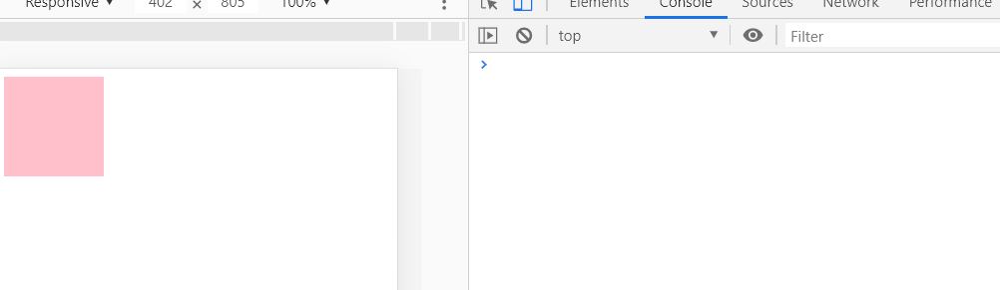

## 学习目标：
1. 能过说出移动端touch三个事件
2. 能够写出移动端拖拽元素的案例
3. 能够利用classList 操作类名
4. 能够说出2种解决移动端click延时300ms的方案
5. 能够使用swiper插件完成移动端轮播图的制作
6. 能过写出设置，获取，删除本地存储的语法
7. 能够说出sessionStorage 和 localStorage的区别

---

## 1. 触屏事件

### 1.1 简介

移动端浏览器兼容性较好，我们不需要考虑以前 JS 的兼容性问题，可以放心的使用原生 JS 书写效果，但是移动端也有自己独特的地方。比如`触屏事件 touch`（也称触摸事件），Android和 IOS 都有。

touch 对象代表一个触摸点。触摸点可能是一根手指，也可能是一根触摸笔。触屏事件可响应用户手指（或触控笔）对屏幕或者触控板操作。

常见的触屏事件如下：

| 触屏touch事件 | 说明                          |
| ------------- | ----------------------------- |
| touchstart    | 手指触摸到一个DOM元素时触发   |
| touchmove     | 手指在一个DOM元素上滑动时触发 |
| touchend      | 手指从一个DOM元素上移开时触发 |

```html
<style>
    .box{
        width: 100px;
        height: 100px;
        background-color: skyblue;
        border: 10px;
        margin: 0 auto;
    }
</style>
<body>
    <div class="box"></div>
    <script>
        var box = document.querySelector('.box')
        box.addEventListener('touchstart', function (e) {
            console.log('我触摸了')
        })
        box.addEventListener('touchmove', function (e) {
            console.log('我移动了')
        })
        box.addEventListener('touchend', function (e) {
            console.log('我离开了')
        })
    </script>
</body>
```

### 1.2  触摸事件对象 (TouchEvent)

TouchEvent 是一类描述手指在触摸平面（触摸屏、触摸板等）的状态变化的事件。这类事件用于描述一个或多个触点，使开发者可以检测触点的移动，触点的增加和减少，等等

touchstart、touchmove、touchend 三个事件都会产生各自事件对象。

触摸事件对象重点我们看三个常见对象列表：

| 触摸列表         | 说明                                             |
| ---------------- | ------------------------------------------------ |
| e.touches        | 正在触摸屏幕的所有手指的一个列表                 |
| e.targetTouches  | 正在触摸当前DOM元素上的手指的一个列表            |
| e.changedTouches | 手指状态发生了改变的列表，从无到有，从有到无变化 |

实际开发中：

01、touches谷歌模拟器只能只有一个触摸点，但是在真机中有几个手指头触摸了列表中就会有几个；

02、targetTouches 是触摸DOM元素；

03、如果touches和targetTouches 侦听的是一个DOM元素，他们两显示的结果是一样的；

04、当手指离开屏幕的时候，就没有了 touches 和 targetTouches,但是会有changedTouches;




**常用的触摸事件对象**（重点）

> 因为我们都是给元素注册触摸事件， 所以重点记住targetTouches

我们可以通过targetTouches的索引值获取在触摸DOM元素的时候，对应的手指相关信息；

比如：targetTouches[0] 表示得到正在触摸DOM元素的第一个手指的相关信息，比如手指的坐标等等；

```js
    box.addEventListener('touchstart', function (e) {
        console.log(e.targetTouches[0]);
    })
```

```html
    <style>
        div {
            width: 100px;
            height: 100px;
            background-color: pink;
        }
    </style>
</head>

<body>
    <div></div>
    <script>
        // 触摸事件对象
        // 1. 获取元素
        // 2. 手指触摸DOM元素事件
        var div = document.querySelector('div');
        div.addEventListener('touchstart', function(e) {
            console.log(e);
            // touches 正在触摸屏幕的所有手指的列表 
            // targetTouches 正在触摸当前DOM元素的手指列表 如果侦听的是一个DOM元素，他们两个是一样的
            // changedTouches 手指状态发生了改变的列表 从无到有 或者 从有到无
            // 因为我们一般都是触摸元素 所以最经常使用的是 targetTouches
            // console.log(e.targetTouches[0]);
            // targetTouches[0] 就可以得到正在触摸dom元素的第一个手指的相关信息比如 手指的坐标等等
        });
        // 3. 手指在DOM元素身上移动事件
        div.addEventListener('touchmove', function() {


        });
        // 4. 手指离开DOM元素事件
        div.addEventListener('touchend', function(e) {
            // console.log(e);
            // 当我们手指离开屏幕的时候，就没有了 touches 和 targetTouches 列表
            // 但是会有 changedTouches
        });
    </script>
</body>
```

### 1.3 eg. 移动端拖动元素

1. touchstart、touchmove、touchend可以实现拖动元素
2. 拖动元素需要当前手指的坐标值， 我们可以使用  targetTouches[0] 里面的pageX 和 pageY 
3. 移动端拖动的原理：    手指移动中，计算出手指移动的距离。然后用盒子原来的位置 + 手指移动的距离
4. 手指移动的距离：  手指滑动中的位置 减去  手指刚开始触摸的位置

拖动元素三步曲：

（1） 触摸元素 touchstart： 获取手指初始坐标，同时获得盒子原来的位置

（2） 移动手指 touchmove： 计算手指的滑动距离，并且移动盒子

（3） 离开手指 touchend:

`注意： 手指移动也会触发滚动屏幕所以这里要阻止默认的屏幕滚动 e.preventDefault();`

```basic
元素运动的位置 = 元素原来的位置 + 手指移动的距离；

元素原来的位置      ------   是在手指触摸屏幕touches的时候通过this.offsetLeft/Top获取；

手指移动的距离 =   手指移动的坐标（目标位置）- 手指初始的坐标位置；

手指初始的坐标位置     ------  是在手指触摸屏幕touches的时候通过e.targetThouches[0].pageX/Y 获取；

手指移动的坐标位置  ----  是在手指移动touchmove的时候通过e.targetThouches[0].pageX/Y 获取；
```

```css
    body{
        margin: 0;
        padding: 0;
    }
    .box{
        width: 100px;
        height: 100px;
        background: pink;
        position: absolute;
        left: 0;
        top: 0;
    }
```


```js
// <div class="box"></div>
var box = document.querySelector('.box')
// 获取手指初始的坐标
var startX = 0
var startY = 0
// 获取盒子原来的位置
var x = 0
var y = 0
// 手指触摸DOM元素的时候 touchstart
box.addEventListener('touchstart', function(e){
    // 获取手指初始坐标
    startX = e.targetTouches[0].pageX
    startY = e.targetTouches[0].pageY
    console.log(startX, startY)
    // 获取DOM元素原来的位置
    x = this.offsetLeft
    y = this.offsetTop
    console.log(x,y)
})
box.addEventListener('touchmove', function (e) {
// 手指移动的时候我们要获取手指移动的坐标
// 计算手指移动的距离 = 手指移动的坐标（目标位置）- 手指初始的坐标位置
var moveX = e.targetTouches[0].pageX - startX;
var moveY = e.targetTouches[0].pageY - startY;
// console.log(moveX, moveY);
// 盒子移动 = 盒子原来的位置 + 手指移动的距离
this.style.left = x + moveX + 'px';
this.style.top = y + moveY + 'px';
//组织屏幕滚动的默认行为
e.preventDefault();
});
```

## 2. 移动端常见特效

### 2.1 eg. 移动轮播图

`移动端轮播图功能和基本PC端一致。`

1. 可以自动播放图片
2. 手指可以拖动播放轮播图

```js
1. 定位，布局。。结构搭建
```

html布局滚动的ul前后要多复制两张图片，作为开始和结束的衔接滚动

```html
    <style>
        * {
            margin: 0;
            padding: 0;
        }

        li {
            list-style: none;
        }

        body {
            max-width: 540px;
            min-width: 320px;
            margin: 0 auto;
            font: normal 14px/1.5 Tahoma, "Lucida Grande", Verdana, "Microsoft Yahei", STXihei, hei;
            color: #000;
            background: #f2f2f2;
            overflow-x: hidden;
            -webkit-tap-highlight-color: transparent;
        }

        .focus {
            position: relative;
            padding-top: 44px;
            overflow: hidden;
        }

        .focus img {
            width: 100%;
        }

        .focus ul {
            overflow: hidden;
            width: 500%;
            margin-left: -100%;
        }

        .focus ul li {
            float: left;
            width: 20%;
        }

        .focus ol {
            position: absolute;
            bottom: 5px;
            right: 5px;
            margin: 0;
        }

        .focus ol li {
            display: inline-block;
            width: 5px;
            height: 5px;
            background-color: #fff;  
            border-radius: 2px;
            transition: all .6s;
        }

        .focus ol li.current {
            width: 15px;
        }
    </style>
<div class="focus">
        <ul>
            <li></li>
            <li></li>
            <li></li>
            <li></li>
            <li></li>
        </ul>
        <!-- 小圆点 -->
        <ol>
            <li class="current"></li>
            <li></li>
            <li></li>
        </ol>
    </div>
```

```js
//! 1. 获取元素
var box = document.querySelector('.focus')
var ul = box.children[0]
var ol = document.querySelector('.focus ol')

var boxWidth = box.offsetWidth

//! 2.利用定时器自动轮播图片
var index = 0
var cb = function() {
    index++
    var goX = - index * boxWidth
    // ul.style.transform = 'translateX('+goX+'px)'
    ul.style.transform = `translateX(${goX}px)`
    ul.style.transition = 'all .3s'
}
var timer = setInterval(cb, 2000)

//! 3. 无缝滚动
// 注意: 要等到图片滚动完毕后再去判断,就是过渡完成后再判断
// 监听过渡完成事件 : transitionend
// 31231    画图
// 1的图片 索引号为0
ul.addEventListener('transitionend', function(){
    // 无缝滚动  当index = 3 也就是到最后一个1时, 快速切回来
    // 此时,图片要去掉过渡效果, 然后移动 (快速切)
    //  ===3 有bug 长时间不动 ?
    if (index >= 3) {
        index = 0
        // 去掉过渡效果,让ul快速跳到目标位置
        ul.style.transition = 'none'

        // 利用最新的索引 乘以宽度 去 滚动图片
        var goX = - index * boxWidth
        ul.style.transform = `translateX(${goX}px)`
        //! 4. 如果索引号小于0 倒着走  让索引值等于2 
        // 左往右啦  第一张没有索引号,不看, 从第二张计数 0 1 2 , 跳到第三张
    } else if ( index < 0 ) {
        index = 2

        var goX = - index * boxWidth
        ul.style.transform = `translateX(${goX}px)`
    }

    //! 5. 小圆点跟随变化 
    // 得等到过渡结束之后,写到transitionend事件里面
    // 把ol里面li带有current类名的选出来去掉 remove
    // 排他不需要了
    ol.querySelector('.current').classList.remove('current')
     // 让当前索引号的小li加上current  add
    ol.children[index].classList.add('current')

})

//! 6. 手指滑动轮播图
var startX = 0
var moveX = 0  // 后面会使用这个移动距离
// 7 
var flag = false
// 触摸元素, touchstart  获取手指初始坐标
ul.addEventListener('touchstart', function(e){
    startX = e.targetTouches[0].pageX
    // 当手指按下的时候要停止定时器
    clearInterval(timer)
})

// 移动手指 touchmove  计算手指滑动距离, 并且移动盒子
ul.addEventListener('touchmove', function(e){
    // 计算移动距离
    moveX = e.targetTouches[0].pageX - startX
    // 移动盒子 : 盒子原来的位置 + 手指移动的距离
    var goX = - index * boxWidth + moveX
    // 手指拖动的时候, 不需要动画效果, 所以要取消过渡效果
    // ul.style.transition = 'none'
    ul.style.transform = `translateX(${goX}px)`

    // 移动了才flag = true
    // 如果用户手指移动了,我们才去做判断, 否则不做判断效果
    flag = true
    e.preventDefault() // 阻止滚动屏幕行为
})

//! 7 当手指离开的时候 touchend 根据滑动距离分不同情况
// showrules
// 如果移动距离小于某个值, 就回弹原来位置

ul.addEventListener('touchend', function(e){
    // 手指移动了, 才计算相应内容
    if(!flag) return
    // (1) 如果移动距离大于某个像素 就上一张 下一张滑动
    // moveX 可以为正  200 -100 坐标  按住(100, 移动到200)往右边拖动
    // moveX 可以为负  200 - 300 (按住300, 移动到200 左拖动)
    // 取绝对值 不管哪边
    if (Math.abs(moveX) > 50) {
        // 如果是右滑  播放上一张
        if (moveX > 0) {
            index --
             // 如果是左滑  播放下一张
        } else {
            index++
        }
       var goX = - index * boxWidth
       ul.style.transition = `all .3s`
       ul.style.transform = `translateX(${goX}px)`
    } else {
        // (2)  如果移动距离小于50像素,回弹 回到原来的位置
        // 这就是原来的位置,拿过来
        var goX = - index * boxWidth
        ul.style.transition = `all .1s`
        ul.style.transform = `translateX(${goX}px)`
    }
    // 手指离开的时候开启定时器
    clearInterval(timer)
    timer = setInterval(cb, 2000)
})

 
```

## 3. classList 属性

### 3.1 简介

classList属性是HTML5新增的一个属性，返回元素的类名。但是ie10以上版本支持。

该属性用于在元素中添加，移除及切换 CSS 类。有以下方法

| classList属性                    | 说明                                                   |
| -------------------------------- | ------------------------------------------------------ |
| element.classList.add('类名')    | 添加类：给元素添加一个类名，不会影响其他的类名         |
| element.classList.remove('类名') | 移除类：删除元素的某一个类名，不会影响其他的类名       |
| element.classList.toggle('类名') | 切换类：判断有无类名进行切换效果；没有，添加，有，移除 |

```js
`注意:以上方法里面，所有类名都不带点`
el.classList.add('current');
el.classList.remove('current');
el.classList.toggle('current');
```

```html
    <style>
        .bg {
            background-color: black;
        }
    </style>

<div class="one two"></div>
    <button> 开关灯</button>
    <script>
        // className : 
        // classList 返回元素的类名
        var div = document.querySelector('div');
        // console.log(div.classList[1]);
        // 1. 添加类名  是在后面追加类名不会覆盖以前的类名 注意前面不需要加.
        div.classList.add('three');
        // 2. 删除类名
        div.classList.remove('one');
        // 3. 切换类
        var btn = document.querySelector('button');
        btn.addEventListener('click', function() {
            document.body.classList.toggle('bg');
        })
    </script>
```


```html
    <style>
        .box {
            width: 300px;
            height: 200px;
            background: pink;
        }

        .box-change {
            background: palegreen;
            width: 200px;
        }

        .big-box {
            display: none;
            width: 300px;
            height: 300px;
            background: skyblue;
        }

        .show {
            display: block;
        }
    </style>
<body>
    <button>点击</button>
    <div class="big-box"></div>
    <div class="box"></div>
</body>

<script>
    var box = document.querySelector('.box');
    box.addEventListener('click', function () {
      	// console.log(this.classList)
       // console.log(this.classList[0])
      	// 1. 添加类名 是在后面追加类名 不会覆盖以前的类名， 注意前面不需要加.
        this.classList.add('box-change');
        // 2. 移除类名
        // this.classList.remove('box');
    })
    // toggle
    var btn = document.querySelector('button');
    var bigBox = document.querySelector('.big-box');
    btn.addEventListener('click', function () {
        bigBox.classList.toggle('show');
    })
</script>
```

## 4. eg.移动端返回顶部

1. 当页面滚动某个地方，就显示，否则隐藏

2. 点击可以返回顶部

**分析：**

1. 滚动某个地方显示
2. 事件：scroll页面滚动事件  
3. 如果被卷去的头部（window.pageYOffset ）大于某个数值
4. 点击，window.scroll(0,0) 返回顶部

```css
    body {
        max-width: 540px;
        min-width: 320px;
        height: 1200px;
        margin: 0 auto;
        background: #f2f2f2;
    }
    .top {
        height: 50px;
        background: pink;
    }
    .block{
        height: 100px;
        background: #fff;
    }
    .box {
        height: 400px;
        background: skyblue;
    }
    /* 返回顶部 */
    .back-to-top {
        display: none;
        position: fixed;
        right: 30px;
        bottom: 100px;
        width: 60px;
        text-align: center;
        line-height: 60px;
        height: 60px;
        background-color: purple;
        border-radius: 30px;
    }
```

```html
    <div class="top"></div>
    <div class="back-to-top">back</div>
    <div class="block"></div>
    <div class="box"></div>
```

```js
// 获取元素
var goBack = document.querySelector('.back-to-top');
var box = document.querySelector('.box');
// 页面滚动的时候获取滚动条的距离 window.pageYOffset
// 如果页面滚动的距离大于等于box盒子距离页面顶端的距离就让goBack显示否则隐藏
window.addEventListener('scroll', function () {
    if (window.pageYOffset >= box.offsetTop) {
        goBack.style.display = 'block';
    } else {
        goBack.style.display = 'none';
    }
});
// 点击goBack的时候让window调用scroll(x,y)为0
goBack.addEventListener('click', function () {
    window.scroll(0, 0);
    window.scroll({
        top:0;
        behavior:'smooth'
    })
})
```

## 5. 移动端click事件300ms延时

移动端页面有可能会需要缩放，即移动端屏幕双击会缩放(double tap to zoom) 页面，所以移动端click事件会有300ms等待时间，如果没有等到第二次点击，会执行一次点击事件。

解决方案：

	1. 禁用缩放。 浏览器禁用默认的双击缩放行为并且去掉300ms 的点击延迟。

```html
 <meta name="viewport" content="user-scalable=no">
```

2. 利用touch事件自己封装这个事件解决300ms 延迟。 

​	原理就是：

1.  当我们手指触摸屏幕，记录当前触摸时间
2.  当我们手指离开屏幕， 用离开的时间减去触摸的时间
3.  如果时间小于150ms，并且没有滑动过屏幕， 那么我们就定义为点击
4.  如果一百次点击事件，要调用100次，很麻烦~

```js
//封装tap，解决click 300ms 延时
function tap (obj, callback) {
        var isMove = false;
        var startTime = 0; // 记录触摸时候的时间变量
        obj.addEventListener('touchstart', function (e) {
            startTime = Date.now(); // 记录触摸时间
        });
        obj.addEventListener('touchmove', function (e) {
            isMove = true;  // 看看是否有滑动，有滑动算拖拽，不算点击
        });
        obj.addEventListener('touchend', function (e) {
            if (!isMove && (Date.now() - startTime) < 150) {  // 如果手指触摸和离开时间小于150ms 算点击
                callback && callback(); // 执行回调函数
            }
            isMove = false;  //  取反 重置
            startTime = 0;
        });
}
//调用  
  tap(div, function(){   // 执行代码  });
```

3. 使用插件  fastclick.js插件解决300ms 延迟

```js
// 多次点击的警告的解决 fastclick. css中
// * { touch-action: pan-y } 
if ('addEventListener' in document) {
    document.addEventListener('DOMContentLoaded', function() {
        FastClick.attach(document.body);
    }, false);
}
```

- https://juejin.cn/post/6844903633528553485 
> 移动端 click 事件会有 300ms 的延时，原因是移动端屏幕双击会缩放(double tap to zoom) 页面。

## 6. 常用插件

### 6.1  什么是插件

移动端要求的是快速开发，所以我们经常会借助于一些插件来帮我完成操作，那么什么是插件呢？

`JS 插件是 js 文件`，它遵循一定规范编写，方便程序展示效果，拥有特定功能且方便调用。如轮播图和瀑布流插件。


特点：它一般是为了解决某个问题而专门存在，其功能单一，并且比较小。

我们以前写的animate.js 也算一个最简单的插件

fastclick 插件解决 300ms 延迟。 使用延时

GitHub官网地址：[https://](https://github.com/ftlabs/fastclick)[github.com/ftlabs/fastclick](https://github.com/ftlabs/fastclick)

### 6.2 插件的使用

1.  引入 js 插件文件。
2.  按照规定语法使用。
3.  fastclick 插件解决 300ms 延迟。 使用延时
4.  GitHub官网地址： https://github.com/ftlabs/fastclick

```js
if ('addEventListener' in document) {
	document.addEventListener('DOMContentLoaded', function() {
		FastClick.attach(document.body);
	}, false);
}
```

### 6.3 Swiper 插件的使用

中文官网地址： https://www.swiper.com.cn/ 

- [使用](https://www.swiper.com.cn/usage/index.html)

```js
        <div class="swiper-wrapper">
          <div class="swiper-slide">
            
          </div>
          <div class="swiper-slide">
            
          </div>
          <div class="swiper-slide">
            
          </div>
          <div class="swiper-slide">
            
          </div>
        </div>
```


1. 引入css，js

```html
<!DOCTYPE html>
<html>
<head>
    ...
    <link rel="stylesheet" href="dist/css/swiper-bundle.min.css">
</head>
<body>
    ...
    <script src="dist/js/swiper-bundle.min.js"></script>
    ...
</body>
</html>
```

2. 添加html结构内容，Swiper7的默认容器是'.swiper'，Swiper6之前是'.swiper-container'。

```html
<div class="swiper">
    <div class="swiper-wrapper">
        <div class="swiper-slide">Slide 1</div>
        <div class="swiper-slide">Slide 2</div>
        <div class="swiper-slide">Slide 3</div>
    </div>
    <!-- 如果需要分页器 -->
    <div class="swiper-pagination"></div>
    
    <!-- 如果需要导航按钮 -->
    <div class="swiper-button-prev"></div>
    <div class="swiper-button-next"></div>
    
    <!-- 如果需要滚动条 -->
    <div class="swiper-scrollbar"></div>
</div>
```

3. 初始化swiper  ,  注意初始化的容器

```js
  var mySwiper = new Swiper ('.swiper', {
    direction: 'vertical', // 垂直切换选项
    loop: true, // 循环模式选项
    
    // 如果需要分页器
    pagination: {
      el: '.swiper-pagination',
    },
    
    // 如果需要前进后退按钮
    navigation: {
      nextEl: '.swiper-button-next',
      prevEl: '.swiper-button-prev',
    },
    
    // 如果需要滚动条
    scrollbar: {
      el: '.swiper-scrollbar',
    },
  })     
```

### 6.4 其他移动端常见插件

- superslide： http://www.superslide2.com/
- iscroll： https://github.com/cubiq/iscroll

（老师没用过啊，实际开发不用这些了）

一般使用方式：

1.确认插件实现的功能

2.去官网查看使用说明

3.下载插件

4.打开demo实例文件，查看需要引入的相关文件，并且引入

5.复制demo实例文件中的结构html，样式css以及js代码


### 6.5 移动端视频插件 zy.media.js

H5 给我们提供了 video 标签，但是浏览器的支持情况不同。

不同的视频格式文件，我们可以通过source解决。

但是外观样式，还有暂停，播放，全屏等功能我们只能自己写代码解决。

这个时候我们可以使用插件方式来制作。

我们可以通过 JS 修改元素的大小、颜色、位置等样式。

## 7. 常用框架

框架，顾名思义就是一套架构，它会基于自身的特点向用户提供一套较为完整的解决方案。框架的控制权在框架本身，使用者要按照框架所规定的某种规范进行开发。

插件一般是为了解决某个问题而专门存在，其功能单一，并且比较小。

前端常用的框架有 Bootstrap、Vue、Angular、React 等。既能开发PC端，也能开发移动端

前端常用的移动端插件有 swiper、superslide、iscroll等。

框架： 大而全，一整套解决方案

插件： 小而专一，某个功能的解决方案

### eg. Bootstrap

1. 粘贴CSS ， JS
2. 粘贴html
3. 写上调用执行代码 （粘贴）

### eg. 阿里百秀轮播图


## 8. 本地存储

随着互联网的快速发展，基于网页的应用越来越普遍，同时也变的越来越复杂，为了满足各种各样的需求，会经常性在本地存储大量的数据，HTML5规范提出了相关解决方案。

**本地存储特性**

1、数据存储在用户浏览器中

2、设置、读取方便、甚至页面刷新不丢失数据

3、容量较大，sessionStorage约5M、localStorage约5M

4、只能存储字符串，可以将对象JSON.stringify() 编码后存储

```js
(function() {
    if(!window.localStorage) {
        console.log('当前浏览器不支持localStorage!')
    }    
    var test = '0123456789';
    var add = function(num) {
        num += num;
        if(num.length == 10240) {
            test = num;
            return;
        }
        add(num);
    }
    add(test);
    var sum = test;
    var show = setInterval(function(){
        sum += test;
        try {
            // window.localStorage.removeItem('test');
            window.localStorage.setItem('test', sum);
            console.log(sum.length / 1024 + 'KB');
        } catch(e) {
            alert(sum.length / 1024 + 'KB超出最大限制');
            clearInterval(show);
        }
    }, 0.1)
})()
```

### 8.1 sessionStorage

1、生命周期（数据存在的周期）为关闭浏览器窗口 

2、在同一个窗口(页面，Tab页面)下数据可以共享

3、以键值对的形式存储使用

存储数据：

```javascript
sessionStorage.setItem(key, value)
```

获取数据：

```javascript
sessionStorage.getItem(key)
```

删除数据：

```javascript
sessionStorage.removeItem(key)
```

清空数据：(所有都清除掉)

```javascript
sessionStorage.clear()
```

```html
    <input type="text" placeholder="请输入内容哟">
    <button class="set">存储数据</button>
    <button class="get">获取数据</button>
    <button class="remove">移除数据</button>
    <button class="clear">清空所有数据</button>
    <script>
        // sessionStorage 练习
        var input = document.querySelector('input')
        var set = document.querySelector('.set')
        var get = document.querySelector('.get')
        var remove = document.querySelector('.remove')
        var clear = document.querySelector('.clear')
    
        set.addEventListener('click', function() {
            // 当我们点击了之后,就可以把表单里面的值存起来
            sessionStorage.setItem('user_name',inputValue)
        })
        get.addEventListener('click', (e) => {
            console.log(sessionStorage.getItem('user_name'))
        })
        remove.addEventListener('click', () => {
            sessionStorage.removeItem('user_name')
        })
        // 删除所有的
        clear.addEventListener('click', () => {
            sessionStorage.clear()
        })
        // 用 const 还是用 let？ https://www.cnblogs.com/ziyunfei/p/6038213.html
        // https://juejin.cn/post/6844903760133619720
        // https://juejin.cn/post/6925641096152399880
        // https://juejin.cn/post/6844903752139276301
        // https://es6.ruanyifeng.com/#docs/let
        // 模板字符串
    </script>
```


### 8.2 localStorage

1、声明周期永久生效，除非手动删除 否则关闭页面也会存在

2、可以多窗口（页面）共享（同一浏览器可以共享）

3、以键值对的形式存储使用

存储数据：

```javascript
localStorage.setItem(key, value)
```

获取数据：

```javascript
localStorage.getItem(key)
```

删除数据：

```javascript
localStorage.removeItem(key)
```

清空数据：(所有都清除掉)

```javascript
localStorage.clear()
```

```html
    <input type="text" placeholder="请输入内容哟">
    <button class="set">存储数据</button>
    <button class="get">获取数据</button>
    <button class="remove">移除数据</button>
    <button class="clear">清空所有数据</button>
```

```js
// localStorage 练习
var input = document.querySelector('input')
var set = document.querySelector('.set')
var get = document.querySelector('.get')
var remove = document.querySelector('.remove')
var clear = document.querySelector('.clear')

set.addEventListener('click', function() {
    // 当我们点击了之后,就可以把表单里面的值存起来
    localStorage.setItem('user_name',inputValue)
})
get.addEventListener('click', (e) => {
    console.log(localStorage.getItem('user_name'))
})
remove.addEventListener('click', () => {
    localStorage.removeItem('user_name')
})
// 删除所有的
clear.addEventListener('click', () => {
    localStorage.clear()
})
```

### 8.3 记住用户名

如果勾选记住用户名， 下次用户打开浏览器，就在文本框里面自动显示上次登录的用户名

#### 案例分析

1. 把数据存起来，用到本地存储
2. 关闭页面，也可以显示用户名，所以用到localStorage
3. 打开页面，先判断是否有这个用户名，如果有，就在表单里面显示用户名，并且勾选复选框
4. 当复选框发生改变的时候change事件
5. 如果勾选，就存储，否则就移除

```html
    <input type="text" id="user_name"> <input type="checkbox" id="remember"> 记住用户名
    <script>
        var username = document.querySelector('#username')
        var remember = document.querySelector('#remember')
        
        if (localStorage.getItem('user_name')) {
            username.value = localStorage.getItem('user_name');
            remember.checked = true;
        }
        remember.addEventListener('change', function() {
            if (this.checked) {
                localStorage.setItem('user_name', username.value)
            } else {
                localStorage.removeItem('user_name');
            }
        })
    </script>
```


```js
(100 - 0) / 10  = 10  第一步
（100 - 10）/ 10 = 9  第二步步长
（100 - 19） / 10 = 8.1  第三步
（100 - 27.1  ）/ 10 = 6.29  第四部 
```

